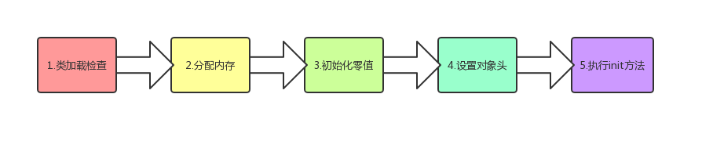
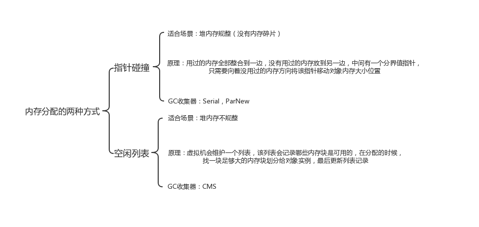
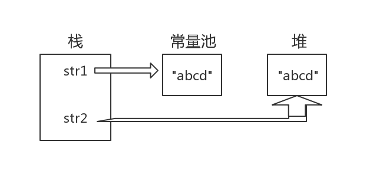

# HotSpot 虚拟机对象探秘
深入探讨 HotSpot 虚拟机在 Java 堆中对象分配、布局和访问的全过程。
## 对象的创建
下面是Java对象创建的全过程。



1. 类加载检查
   
   虚拟机遇到一条 new 指令时，首先将去检查这个指令的参数是否能在常量池中定位到这个类的符号引用，并且检查这个符号引用代表的类是否已被加载过、解析和初始化过。如果没有，那必须先执行相应的类加载过程。

2. 分配内存

   在类加载检查通过后，接下来虚拟机将为新生对象分配内存。对象所需的内存大小在类加载完成后便可确定，为对象分配空间的任务等同于把一块确定大小的内存从 Java 堆中划分出来。分配方式有 “指针碰撞” 和 “空闲列表” 两种，选择那种分配方式由 Java 堆是否规整决定，
   而Java堆是否规整，取决于 GC 收集器的算法是"标记-清除"，还是"标记-整理"（也称作"标记-压缩"），值得注意的是，复制算法内存也是规整的。
   
   在创建对象的时候有一个很重要的问题，就是线程安全，因为在实际开发过程中，创建对象是很频繁的事情，作为虚拟机来说，必须要保证线程是安全的，通常来讲，虚拟机采用两种方式来保证线程安全：
   1. CAS+失败重试：CAS 是乐观锁的一种实现方式。所谓乐观锁就是，每次不加锁而是假设没有冲突而去完成某项操作，如果因为冲突失败就重试，直到成功为止。虚拟机采用 CAS 配上失败重试的方式保证更新操作的原子性。
   2. TLAB：为每一个线程预先在Eden区分配一块儿内存，JVM在给线程中的对象分配内存时，首先在TLAB分配，当对象大于TLAB中的剩余内存或TLAB的内存已用尽时，再采用上述的CAS进行内存分配
   
3. 初始化零值

   内存分配完成后，虚拟机需要将分配到的内存空间都初始化为零值（不包括对象头），这一步操作保证了对象的实例字段在 Java 代码中可以不赋初始值就直接使用，程序能访问到这些字段的数据类型所对应的零值。
   
4. 设置对象头
   
   初始化零值完成之后，虚拟机要对对象进行必要的设置，例如这个对象是那个类的实例、如何才能找到类的元数据信息、对象的哈希吗、对象的 GC 分代年龄等信息。 这些信息存放在对象头中。 另外，根据虚拟机当前运行状态的不同，如是否启用偏向锁等，对象头会有不同的设置方式。

5. 执行 init 方法
   
   在上面工作都完成之后，从虚拟机的视角来看，一个新的对象已经产生了，但从 Java 程序的视角来看，对象创建才刚开始，<init> 方法还没有执行，所有的字段都还为零。所以一般来说，执行 new 指令之后会接着执行 <init> 方法，把对象按照程序员的意愿进行初始化，这样一个真正可用的对象才算完全产生出来。
   
## 对象的内存布局
在 Hotspot 虚拟机中，对象在内存中的布局可以分为3块区域：对象头、实例数据和对齐填充。
1. 对象头
   
   Hotspot虚拟机的对象头包括两部分信息，第一部分用于存储对象自身的自身运行时数据（哈希码、GC分代年龄、锁状态标志等等），另一部分是类型指针，即对象指向它的类元数据的指针，虚拟机通过这个指针来确定这个对象是那个类的实例。
   
2. 实例数据

   实例数据部分是对象真正存储的有效信息，也是在程序中所定义的各种类型的字段内容。
   
3. 对齐填充

   对齐填充部分不是必然存在的，也没有什么特别的含义，仅仅起占位作用。 因为Hotspot虚拟机的自动内存管理系统要求对象起始地址必须是8字节的整数倍，换句话说就是对象的大小必须是8字节的整数倍。而对象头部分正好是8字节的倍数（1倍或2倍），因此，当对象实例数据部分没有对齐时，就需要通过对齐填充来补全。
   
## 对象的访问定位
建立对象就是为了使用对象，我们的Java程序通过栈上的 reference 数据来操作堆上的具体对象。
对象的访问方式有虚拟机实现而定，目前主流的访问方式有**使用句柄**和**直接指针**两种：
1. 句柄：如果使用句柄的话，那么Java堆中将会划分出一块内存来作为句柄池，reference 中存储的就是对象的句柄地址，而句柄中包含了对象实例数据与类型数据各自的具体地址信息；
    
   
2. 直接指针：如果使用直接指针访问，那么 Java 堆对象的布局中就必须考虑如何放置访问类型数据的相关信息，而reference 中存储的直接就是对象的地址。
   
   

这两种对象访问方式各有优势。使用句柄来访问的最大好处是 reference 中存储的是稳定的句柄地址，在对象被移动时只会改变句柄中的实例数据指针，而 reference 本身不需要修改。使用直接指针访问方式最大的好处就是速度快，它节省了一次指针定位的时间开销。

## 补充内容
### String 类和常量池
1. String 对象的两种创建方式：

   ```
   String str1 = "abcd";
   String str2 = new String("abcd");
   System.out.println(str1 == str2); // false
   ```
   这两种不同的创建方法是有差别的，第一种方式是在常量池中拿对象，第二种方式是直接在堆内存空间创建一个新的对象。
   
   
   记住：只要使用new方法，便需要创建新的对象。
2. String 类型的常量池比较特殊。
   
   * 直接使用双引号声明出来的 String 对象会直接存储在常量池中。
   * 如果不是用双引号声明的 String 对象，可以使用 String 提供的 intern 方法。String.intern() 是一个 Native 方法，
   它的作用是：如果运行时常量池中已经包含一个等于此 String 对象内容的字符串，则返回常量池中该字符串的引用；如果没有，则在常量池中创建与此 String 内容相同的字符串，并返回常量池中创建的字符串的引用。
   ```
   String s1 = new String("计算机");
   String s2 = s1.intern();
   String s3 = "计算机";
   System.out.println(s2);//计算机
   System.out.println(s1 == s2);//false，因为一个是堆内存中的String对象一个是常量池中的String对象，
   System.out.println(s3 == s2);//true，因为两个都是常量池中的String对象
   ```
3. String 字符串拼接。
   
   ```
   String str1 = "str";
   String str2 = "ing";

   String str3 = "str" + "ing";//常量池中的对象
   String str4 = str1 + str2; //在堆上创建的新的对象
   String str5 = "string";//常量池中的对象
   System.out.println(str3 == str4);//false
   System.out.println(str3 == str5);//true
   System.out.println(str4 == str5);//false
   ```
   
   尽量避免多个字符串拼接，因为这样会重新创建对象。如果需要改变字符串的话，可以使用 StringBuilder 或者 StringBuffer。
   
### String s1 = new String("abc");这句话创建了几个对象？
   
   创建了两个对象。
   ```
   String s1 = new String("abc");// 堆内存的地址值
   String s2 = "abc";
   System.out.println(s1 == s2);// 输出false,因为一个是堆内存，一个是常量池的内存，故两者是不同的。
   System.out.println(s1.equals(s2));// 输出true
   ```
   先有字符串"abc"放入常量池，然后 new 了一份字符串"abc"放入Java堆(字符串常量"abc"在编译期就已经确定放入常量池，而 Java 堆上的"abc"是在运行期初始化阶段才确定)，然后 Java 栈的 str1 指向Java堆上的"abc"。
   
### 8种基本类型的包装类和常量池
* Java 基本类型的包装类的大部分都实现了常量池技术，即Byte,Short,Integer,Long,Character,Boolean；
这5种包装类默认创建了数值[-128，127]的相应类型的缓存数据，但是超出此范围仍然会去创建新的对象。
* 两种浮点数类型的包装类 Float,Double 并没有实现常量池技术。
```
Integer i1 = 127;
Integer i2 = 127;
System.out.println(i1 == i2);// 输出true
Integer i11 = 128;
Integer i22 = 128;
System.out.println(i11 == i22);// 输出false
Double i3 = 1.2;
Double i4 = 1.2;
System.out.println(i3 == i4);// 输出false
```
Integer缓存相关代码：
```
/**
 * This method will always cache values in the range -128 to 127,
 * inclusive, and may cache other values outside of this range.
 */
public static Integer valueOf(int i) {
    if (i >= IntegerCache.low && i <= IntegerCache.high)
        return IntegerCache.cache[i + (-IntegerCache.low)];
    return new Integer(i);
}
```
Integer i1=40；Java 在编译的时候会直接将代码封装成Integer i1=Integer.valueOf(40);，从而使用常量池中的对象。

Integer i1 = new Integer(40);这种情况下会创建新的对象。
```
Integer i1 = 40;
Integer i2 = new Integer(40);
System.out.println(i1 == i2);//输出false
```
复杂一点的情形：
```
Integer i1 = 40;
Integer i2 = 40;
Integer i3 = 0;
Integer i4 = new Integer(40);
Integer i5 = new Integer(40);
Integer i6 = new Integer(0);

System.out.println("i1 = i2   " + (i1 == i2)); // true
System.out.println("i1 = i2 + i3   " + (i1 == i2 + i3)); // true
System.out.println("i1 = i4   " + (i1 == i4)); // false
System.out.println("i4 = i5   " + (i4 == i5)); // false
System.out.println("i4 = i5 + i6   " + (i4 == i5 + i6)); // true
System.out.println("40 = i5 + i6   " + (40 == i5 + i6)); // true
```
语句i4 == i5 + i6，因为+这个操作符不适用于Integer对象，首先i5和i6进行自动拆箱操作，进行数值相加，即i4 == 40。
然后Integer对象无法与数值进行直接比较，所以i4自动拆箱转为int值40，最终这条语句转为40 == 40进行数值比较。