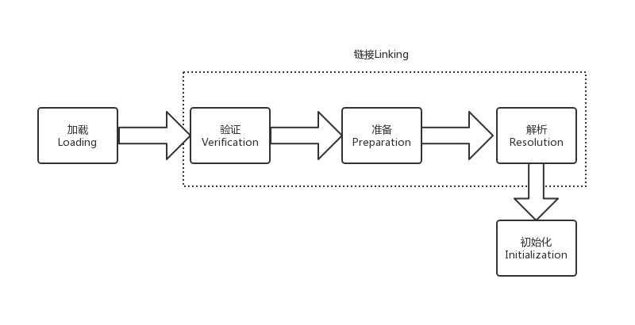
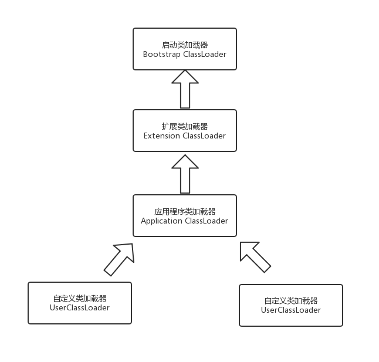
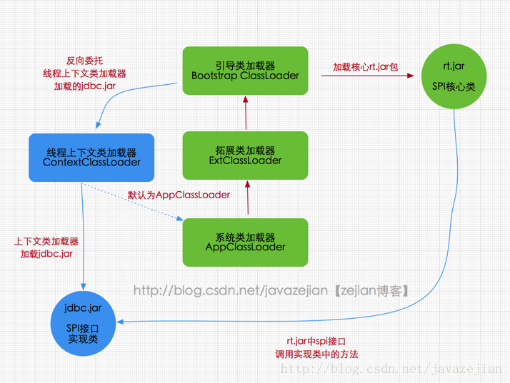

# JVM类加载
## 类加载的过程
每个编写的”.java”拓展名类文件都存储着需要执行的程序逻辑，这些”.java”文件经过Java编译器编译成拓展名为”.class”的文件，”.class”文件中保存着Java代码经转换后的虚拟机指令，当需要使用某个类时，虚拟机将会加载它的”.class”文件，
并创建对应的class对象，将class文件加载到虚拟机的内存，这个过程称为类加载，这里我们需要了解一下类加载的过程，如下：


1. 加载：通过一个类的完全限定查找此类字节码文件，并利用字节码文件创建一个Class对象。
2. 验证：目的在于确保Class文件的字节流中包含信息符合当前虚拟机要求，不会危害虚拟机自身安全。主要包括四种验证，文件格式验证，元数据验证，字节码验证，符号引用验证。
3. 准备：为类变量(即static修饰的字段变量)分配内存并且设置该类变量的初始值即0(如static int i=5;这里只将i初始化为0，至于5的值将在初始化时赋值)，
这里不包含用final修饰的static，因为final在编译的时候就会分配了，注意这里不会为实例变量分配初始化，类变量会分配在方法区中，而实例变量是会随着对象一起分配到Java堆中。
4. 解析：主要将常量池中的符号引用替换为直接引用的过程。符号引用就是一组符号来描述目标，可以是任何字面量，而直接引用就是直接指向目标的指针、相对偏移量或一个间接定位到目标的句柄。有类或接口的解析，字段解析，类方法解析，接口方法解析。
5. 初始化：类加载最后阶段，若该类具有超类，则对其进行初始化，执行静态初始化器和静态初始化成员变量(如前面只初始化了默认值的static变量将会在这个阶段赋值，成员变量也将被初始化)。

这便是类加载的5个过程，而类加载器的任务是根据一个类的全限定名来读取此类的二进制字节流到JVM中，然后转换为一个与目标类对应的java.lang.Class对象实例，在虚拟机提供了3种类加载器，
引导（Bootstrap）类加载器、扩展（Extension）类加载器、系统（System）类加载器（也称应用类加载器），

## 启动（Bootstrap）类加载器
启动类加载器主要加载的是JVM自身需要的类，这个类加载使用C++语言实现的，是虚拟机自身的一部分，它负责将 <JAVA_HOME>/lib路径下的核心类库或-Xbootclasspath参数指定的路径下的jar包加载到内存中，
注意必由于虚拟机是按照文件名识别加载jar包的，如rt.jar，如果文件名不被虚拟机识别，即使把jar包丢到lib目录下也是没有作用的(出于安全考虑，Bootstrap启动类加载器只加载包名为java、javax、sun等开头的类)。

启动类加载器无法被Java程序直接引用，用户在编写自定义加载器时，如果需要把加载请求委托给启动类加载器，那直接使用null代替即可。
下面是java.lang.ClassLoader的代码片段：
```
/**
 * Returns the class loader for the class.  Some implementations may use
 * null to represent the bootstrap class loader. This method will return
 * null in such implementations if this class was loaded by the bootstrap
 * class loader.
 */
public ClassLoader getClassLoader() {
    ClassLoader cl = getClassLoader0();
    if (cl == null)
        return null;
    SecurityManager sm = System.getSecurityManager();
    if (sm != null) {
        ClassLoader.checkClassLoaderPermission(cl, Reflection.getCallerClass());
    }
    return cl;
}
```
## 扩展（Extension）类加载器
扩展类加载器由sun.misc.Launcher$ExtClassLoader类实现，是Launcher的静态内部类，
它负责加载<JAVA_HOME>/lib/ext目录下或者由系统变量-Djava.ext.dir指定位路径中的类库，开发者可以直接使用扩展类加载器。
```
private static File[] getExtDirs() {
     //加载<JAVA_HOME>/lib/ext目录中的类库
     String s = System.getProperty("java.ext.dirs");
     File[] dirs;
     if (s != null) {
         StringTokenizer st =
             new StringTokenizer(s, File.pathSeparator);
         int count = st.countTokens();
         dirs = new File[count];
         for (int i = 0; i < count; i++) {
             dirs[i] = new File(st.nextToken());
         }
     } else {
         dirs = new File[0];
     }
     return dirs;
 }
```
## 系统（System）类加载器
也称应用程序加载器是指 Sun公司实现的sun.misc.Launcher$AppClassLoader。它负责加载系统类路径java -classpath或-D java.class.path 指定路径下的类库，
也就是我们经常用到的classpath路径，开发者可以直接使用系统类加载器，一般情况下该类加载是程序中默认的类加载器，通过ClassLoader#getSystemClassLoader()方法可以获取到该类加载器。

## 双亲委派模型
双亲委派模式要求除了顶层的启动类加载器外，其余的类加载器都应当有自己的父类加载器，请注意双亲委派模式中的父子关系并非通常所说的类继承关系，
而是采用组合关系来复用父类加载器的相关代码，类加载器间的关系如下：

工作过程的是，如果一个类加载器收到了类加载请求，它并不会自己先去加载，而是把这个请求委托给父类的加载器去执行，如果父类加载器还存在其父类加载器，
则进一步向上委托，依次递归，请求最终将到达顶层的启动类加载器，如果父类加载器可以完成类加载任务，就成功返回，倘若父类加载器无法完成此加载任务，子加载器才会尝试自己去加载。

### 双亲委派模型优势
采用双亲委派模式的是好处是Java类随着它的类加载器一起具备了一种带有优先级的层次关系，通过这种层级关可以避免类的重复加载，当父亲已经加载了该类时，就没有必要子ClassLoader再加载一次。
其次是考虑到安全因素，java核心api中定义类型不会被随意替换，假设通过网络传递一个名为java.lang.Integer的类，通过双亲委托模式传递到启动类加载器，
而启动类加载器在核心Java API发现这个名字的类，发现该类已被加载，并不会重新加载网络传递的过来的java.lang.Integer，而直接返回已加载过的Integer.class，这样便可以防止核心API库被随意篡改。

### 双亲委派模型原理
双亲委派模型的实现在ClassLoader类的loadClass(String name, boolean resolve)方法中
```
protected Class<?> loadClass(String name, boolean resolve)
        throws ClassNotFoundException
{
    synchronized (getClassLoadingLock(name)) {
        // First, check if the class has already been loaded
        Class<?> c = findLoadedClass(name);
        if (c == null) {
            long t0 = System.nanoTime();
            try {
                if (parent != null) {
                    //如果有父类加载器，则委托给父类加载器去加载
                    c = parent.loadClass(name, false);
                } else {
                    //如果没有父类加载器，则委托给启动加载器去加载
                    c = findBootstrapClassOrNull(name);
                }
            } catch (ClassNotFoundException e) {
                // ClassNotFoundException thrown if class not found
                // from the non-null parent class loader
            }

            if (c == null) {
                // If still not found, then invoke findClass in order
                // to find the class.
                long t1 = System.nanoTime();
                c = findClass(name);

                // this is the defining class loader; record the stats
                sun.misc.PerfCounter.getParentDelegationTime().addTime(t1 - t0);
                sun.misc.PerfCounter.getFindClassTime().addElapsedTimeFrom(t1);
                sun.misc.PerfCounter.getFindClasses().increment();
            }
        }
        if (resolve) {
            resolveClass(c);
        }
        return c;
    }
}
```

## 破坏双亲委派模型
在Java应用中存在着很多服务提供者接口（Service Provider Interface，SPI），这些接口允许第三方为它们提供实现，
如常见的 SPI 有 JDBC、JNDI等，这些 SPI 的接口属于 Java 核心库，一般存在rt.jar包中，由Bootstrap类加载器加载，而 SPI 的第三方实现代码则是作为Java应用所依赖的 jar 包被存放在classpath路径下，
由于SPI接口中的代码经常需要加载具体的第三方实现类并调用其相关方法，但SPI的核心接口类是由引导类加载器来加载的，而Bootstrap类加载器无法直接加载SPI的实现类，
同时由于双亲委派模式的存在，Bootstrap类加载器也无法反向委托AppClassLoader加载器SPI的实现类。在这种情况下，我们就需要一种特殊的类加载器来加载第三方的类库，而线程上下文类加载器就是很好的选择。

线程上下文类加载器（contextClassLoader）是从 JDK 1.2 开始引入的，我们可以通过java.lang.Thread类中的getContextClassLoader()和 setContextClassLoader(ClassLoader cl)方法来获取和设置线程的上下文类加载器。
如果没有手动设置上下文类加载器，线程将继承其父线程的上下文类加载器，初始线程的上下文类加载器是系统类加载器（AppClassLoader）,在线程中运行的代码可以通过此类加载器来加载类和资源，如下图所示，以jdbc.jar加载为例

[图片来自https://www.jianshu.com/p/8cb409327f01](https://blog.csdn.net/javazejian/article/details/73413292)

从图可知rt.jar核心包是有Bootstrap类加载器加载的，其内包含SPI核心接口类，由于SPI中的类经常需要调用外部实现类的方法，而jdbc.jar包含外部实现类(jdbc.jar存在于classpath路径)无法通过Bootstrap类加载器加载，
因此只能委派线程上下文类加载器把jdbc.jar中的实现类加载到内存以便SPI相关类使用。显然这种线程上下文类加载器的加载方式破坏了“双亲委派模型”，它在执行过程中抛弃双亲委派加载链模式，使程序可以逆向使用类加载器，当然这也使得Java类加载器变得更加灵活。

不妨看看DriverManager类的源码，DriverManager是Java核心rt.jar包中的类，该类用来管理不同数据库的实现驱动即Driver，它们都实现了Java核心包中的java.sql.Driver接口，
如mysql驱动包中的com.mysql.jdbc.Driver，这里主要看看如何加载外部实现类，在DriverManager初始化时会执行如下代码
```
private static void loadInitialDrivers() {
    ...
    AccessController.doPrivileged(new PrivilegedAction<Void>() {
        public Void run() {

            ServiceLoader<Driver> loadedDrivers = ServiceLoader.load(Driver.class);
            Iterator<Driver> driversIterator = loadedDrivers.iterator();

    ...
}
public static <S> ServiceLoader<S> load(Class<S> service) {
    ClassLoader cl = Thread.currentThread().getContextClassLoader();
    return ServiceLoader.load(service, cl);
}
```
很明显了确实通过线程上下文类加载器加载的，实际上核心包的SPI类对外部实现类的加载都是基于线程上下文类加载器执行的，通过这种方式实现了Java核心代码内部去调用外部实现类。
