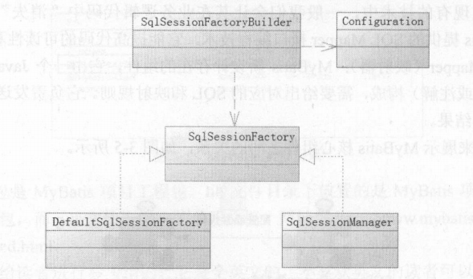

# MyBatis 核心组件
MyBatis 的核心组件分为 4 个部分。
* SqlSessionFactoryBuilder: 它会根据配置或者代码来生成 SqISessionFactory，采用的是分步构建的 Builder 模式
* SqlSessionFactory: 使用工厂模式生成 SqlSession
* SqlSession: 主要接口，可以执行命令，返回Mapper以及管理事务
* Mapper: 映射器，由一个 Java 接口和 XML 文件（或注解〉构成，需要给出对应的 SQL 和映射规则。它负责发送 SQL 去执行，并返回结果。

用一张图来展示 MyBatis 核心组件之间的关系：


注意，无论是映射器还是 SqlSession 都可以发送 SQL 到数据库执行。

## SqlSessionFactory(工厂接口)
使用 MyBatis 首先是使用配置或者代码去生产SqlSessionFactory，而 MyBatis 提供了构造器 SqlSessionFactoryBuilder 。
它提供了一个类 org.apache.ibatis.session.Configuration 作为引导，采用的是 Builder 模式。具体的分步则是在 Configuration 类里面完成的。

当配置了 XML 或者提供代码后， MyBatis 会读取配置文件，通过 Configuration 类对象构建整个 MyBatis 的上下文。
SqlSessionFactory 是一个接口，在 MyBatis 中它存在两个实现类： SqlSessionManager 和 DefaultSqlSessionFactory 。
一般而言，具体是由 DefaultSqlSessionFactory 去实现的，而 SqlSessionManager 使用在多线程的环境中，它的具体实现依靠 DefaultSqlSessionFactory



每个基于 MyBatis 的应用都是以一个 SqlSessionFactory 的实例为中心的，而 SqlSessionFactory 唯一的作用就是生产 MyBatis 的核心接口对象 SqlSession，所以它的责任
是唯一的。 我们往往会采用单例模式处理它，下面讨论使用配置文件和 Java 代码两种形式去生成 SqlSessionFactory 的方法。
### 使用 XML 构建 SqlSessionFactory
首先，在 MyBatis 中的 XML 分为两类，一类是基础配置文件，通常只有一个，主要是配置一些最基本的上下文参数和运行环境；
另一类是映射文件，它可以配置映射关系、SQL、参数等信息。来看一个例子mybatis-config.xml：
```
<?xml version="1.0" encoding="UTF-8" ?>
<!DOCTYPE configuration
        PUBLIC "-//mybatis.org//DTD Config 3.0//EN"
        "http://mybatis.org/dtd/mybatis-3-config.dtd">
<configuration>
    <typeAliases> <!--别名-->
        <typeAlias alias="role" type="com.learn.ssm.pojo.Role"/>
    </typeAliases>
    <!--数据库环境-->
    <environments default="development">
        <environment id="development ">
            <transactionManager type="JDBC"/>
            <dataSource type="POOLED">
                <property name="driver" value="com.mysql.jdbc.Driver"/>
                <property name="url" value="jdbc:mysql://localhost:3306/ssm"/>
                <property name="user" value="root"/>
                <property name="password" value="123456"/>
            </dataSource>
        </environment>
    </environments>
    <!--映射文件-->
    <mappers>
        <mapper resource="mapper/RoleMapper.xml"/>
    </mappers>
</configuration>
```
我们描述一下 MyBatis 的基础配置文件：
* <typeAliases>元素定义了 一个别名 role， 它代表着 com.learn.ssm.pojo.Role 这个类。这样定义后，在 MyBatis 上下文中就可以使用别名去代替全限定名了
* <environments>描述的是数据库，面的<transactionManager>元素是配置事务管理器，这里采用的是 MyBatis 的 JDBC 管理器方式。
然后采用<dataSource>元素配置数据库，其中属性 type＝"POOLED"代表采用 MyBatis 内部提供的连接池方式，最后定义一些关于 JDBC 的属性信息
* <mapper>元素代表引入的那些映射器

有了基础配置文件，就可以用一段很简短的代码来生成 SqlSessionFactory 了
```
public class App {
    public static void main(String[] args) {
        SqlSessionFactory sqlSessionFactory = null;
        String resource = "mybatis-config.xml";
        InputStream inputStream;
        inputStream = App.class.getClassLoader().getResourceAsStream(resource);
        sqlSessionFactory = new SqlSessionFactoryBuilder().build(inputStream);
    }
}
```

### 使用代码创建 SqlSessionFactory
```
//数据库连接池信息
PooledDataSource dataSource = new PooledDataSource();
dataSource.setDriver("com.mysql.jdbc.Driver");
dataSource.setUsername("root");
dataSource.setPassword("123456");
dataSource.setUrl("jdbc:mysql://localhost:3306/ssm");
dataSource.setDefaultAutoCommit(false);
//采用 MyBatis 的 JDBC 事务方式
TransactionFactory transactionFactory = new JdbcTransactionFactory();
Environment environment = new Environment("development", transactionFactory, dataSource);
//创建 Configuration对象
Configuration configuraton = new Configuration(environment);
//注册一个 MyBatis 上下文别名
configuraton.getTypeAliasRegistry().registerAlias("role ", Role.class);
//加入一个映射器
//        configuraton.addMapper(RoleMapper.class);
//使用 SqlSession FactoryBuilder 构建 SqlSessionFactory
SqlSessionFactory sqlSessionFactory = new SqlSessionFactoryBuilder().build(configuraton);
```
注意代码中的注释， 它和XML 方式实现的功能是一致的， 只是方式不太一样而己。

## SqlSession
在 MyBatis 中， SqlSession 是其核心接口。在 MyBatis 中有两个实现类， DefaultSqlSession 和 SqlSessionManager。 DefaultSqlSession 是单线程使用的，而 SqlSessionManager 在多线程
环境下使用。 SqlSession 的作用类似于一个 JDBC 中的 Connection 对象，代表着一个连接资源的启用。
具体而言， 它的作用有 3 个：
* 获取Mapper接口
* 发送SQL给数据库
* 控制数据库事务

先来掌握它的创建方法，有了 SqlSessionFactory 创建的 SqlSession 就十分简单了
```
SqlSession sqlSession = sqlSessionFactory.openSession();
```
注意，SqISession 只是一个门面接口，它有很多方法，可以直接发送 SQL。它就好像一家软件公司的商务人员，是一个门面，而实际干活的是软件工程师。在 MyBatis 中，真正干活的是 Executor，我们会在底层看到它。

Sq!Session 控制数据库事务的方法
```
try {
    // 你的应用逻辑代码

    sqlSession.commit();//提交事务
} catch (Exception ex) {
    sqlSession.rollback();//回滚事务
} finally {
    if (sqlSession != null) {
        sqlSession.close();
    }
}
```
这里使用 commit 方法提交事务，或者使用 rollback 方法回滚事务。因为它代表着一个数据库的连接资源，使用后要及时关闭它。

由于 SqlSession 的获取 Mapper 接口和发送 SQL 的功能需要先实现映射器的功能，而映射器接口也可以实现发送 SQL 的功能，那么我们应该采取何种方式会更好一些呢？

## 映射器
映射器是 MyBatis 中最重要、最复杂的组件，它由一个接口和对应的 XML 文件（或注解）组成。它可以配置以下内容 ：
* 描述映射规则
* 提供 SQL 语旬， 并可以配置 SQL 参数类型、返回类型、缓存刷新等信息
* 配置缓存
* 提供动态 SQL

本节阐述两种实现映射器的方式， XML 文件形式和注解形式。不过在此之前，先定义一个 POJO
```
public class Role {
    private Long id;
    private String roleName;
    private String note;

    /**setter and getter**/
}
```
映射器的主要作用就是将 SQL 查询到的结果映射为一个 POJO，或者将 POJO 的数据插入到数据库中， 并定义一些关于缓存等的重要内容。

### 用 XML 实现映射器
用 XML 定义映射器分为两个部 ： 接口和 XML 。 先定义一个映射器接口
```
public interface RoleMapper {
    public Role getRole (Long id);
}
```
在用 XML 方式创建 SqISession 的配置文件中有这样一段代码 
```
<mapper resource="mapper/RoleMapper.xml"/>
```
它的作用就是引入一个 XML 文件。用 XML 方式创建映射器
```
<?xml version="1.0" encoding="UTF-8" ?>
<!DOCTYPE mapper
        PUBLIC "-//mybatis.org//DTD Mapper 3.0//EN"
        "http://mybatis.org/dtd/mybatis-3-mapper.dtd">
<mapper namespace="com.learn.ssm.pojo.RoleMapper">
    <select id="getRole" parameterType="long" resultType="Role">
        select id, rolename as roleName, note from t_role where id= #{id}
    </select>
</mapper>
```
有了这两个文件，就完成了 一个映射器的定义。 
* <mapper>元素中的属性 namespace 所对应的是一个接口的全限定名， 于是 MyBatis.上下文就可以通过它找到对应的接口
* <select>元素表明这是一条查询语旬， 而属性 id 标识了这条 SQL ，属性parameterType="long"说明传递给 SQL 的是一个 long 型的参数， 而 resultType＝"role" 表示返回的是一个 role 类型的返回值。而 role 是之前配置文件 mybatis-config.xml 配置的别名，指代的是com.learn.ssm.pojo.Role
* 这条 SQL 中的#{id}表示传递进去的参数

注意，我们并没有配置 SQL 执行后和 role 的对应关系，它是如何映射的呢？其实这里采用的是一种被称为自动映射的功能，MyBatis 在默认情况下提供自动映射，只要 SQL 返回的列名能和 POJO 对应起来即可。
### 注解实现映射器
```
public interface RoleMapper {
    @Select("select id, rolename as roleName, note from t_role where id= #{id}")
    public Role getRole (Long id);
}
```
这完全等同于 XML 方式创建映射器。 也许你会觉得使用注解的方式 比 XML 方式要简单得多。如果它和 XML 方式同时定义时， XML 方式将覆盖掉注解方式，所以 MyBatis 官方推荐使用的是 XML 方式
### SqlSession 发送 SQL
有了映射器就可以通过 SqlSession 发送 SQL 了。
```
Role role = sqlSession.selectOne("com.learn.ssm.pojo.RoleMapper.getRole", 1L);
```
selectOne 方法表示使用查询并且只返回一个对象，而参数则是一个 String 对象和 一个 Object 对象。这里是一个 long 参数， long 参数是它的主键。

String 对象是由一个命名空间加上 SQL id 组合而成的，它完全定位了一条SQL，这样 MyBatis 就会找到对应的 SQL。
如果在 MyBatis 中只有一个 id 为 getRole 的 SQL， 那么也可以简写为：
```
Role role = sqlSession.selectOne("getRole", 1L);
```
### Mapper接口发送 SQL
SqlSession 还可以获取 Mapper 接口，通过 Mapper 接口发送 SQL
```
RoleMapper roleMapper = sqlSession.getMapper(RoleMapper.class);
Role role = roleMapper.getRole(1L);
```
通过 SqlSession 的 getMapper 方法来获取一个 Mapper 接口，就可以调用它的方法了。
## 生命周期
所谓生命周期就是每一个对象应该存活的时间，比如一些对象一次用完后就要关闭，使它们被 Java 虚拟机（JVM） 销毁，以避免继续占用资源，所以我们会根据每一个组件的作用去确定其生命周期。
### SqlSessionFactoryBuilder
SqlSessionFactoryBuilder 的 作用在于创建 SqlSessionFactory ，创建成功后，SqlSessionFactoryBuilder 就失去了作用，所以它只能存在于创建 SqlSessionFactory 的方法中，而不要让其长期存在。
### SqlSessionFactory
SqlSessionFactory 可以被认为是一个数据库连接池，它的作用是创建 SqlSession 接口对象。因为因为 MyBatis 的本质就是 Java 对数据库的操作，所以 SqlSessionFactory 的生命周期存
在于整个 MyBatis 的应用之中，所以一旦创建了 SqlSessionFactory， 就要长期保存它，直至不再使用 MyBatis 应用，所以可以认为 SqlSessionFactory 的生命周期就等同于 MyBatis 的应用周期。
### SqlSession
如果说 SqlSessionFactory 相当于数据库连接池，那么 SqlSession 就相当于一个数据库连接（Connection 对象），你可以在一个事务里面执行多条 SQL，然后通过它的commit、rollback等方法，提交或者回滚事务。
所以它应该存活在一个业务请求中，处理完整个请求后，应该关闭这条连接，让它归还给 SqlSessionFactory， 否则数据库资源就很快被耗费精光，系统就会瘫痪，所以用 try...catch...finally...语句来保证其正确关闭。
### Mapper
Mapper 是一个接口，它由 SqlSession 所创建，所以它的最大生命周期至多和 SqlSession保持一致，尽管它很好用，但是由于 SqlSession 的关闭，它的数据库连接资源也会消失，所以它的生命周期应该小于等于 SqlSession 的生命周期。
Mapper 代表的是一个请求中的业务处理，所以它应该在一个请求中，一旦处理完了相关的业务，就应该废弃它。
 
