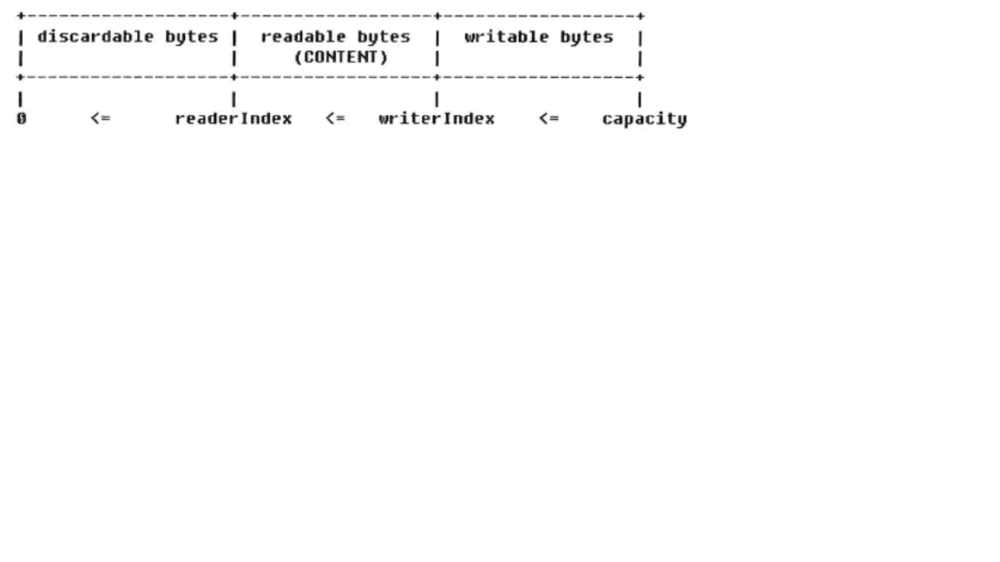

# ByteBuf及相关类学习
## ByteBuf的工作原理
ByteBuf是个Byte数组的缓冲区，它的基本功能应该与JDK的ByteBuffer一致，提供以下基本功能:
1. 支持7种基本数据类型，byte数组，ByteBuffer，ByteBuf等的读写
2. 缓冲区自身的copy与slice
3. 设置网络字节序
4. 构造缓冲区实例
5. 操作位置指针等方法

由于JDK的ByteBuffer已经提供了这些基本功能，因此，ByteBuf的实现有两种策略：
* 参考ByteBuffer的实现，增加额外的功能，解决原ByteBuffer的不足
* 聚合ByteBuffer，通过Facade模式对其进行包装，可以减少自身代码量，降低实现成本

ByteBuffer由于只有一个位置指针，因此每次读写的时候都需要额外调用flip和clear，否则就会出错。

ByteBuf有两个位置指针来协助缓冲区的读写，读操作用readerIndex，写操作用writerIndex。

下面来分析ByteBuf如何实现动态扩展。通常情况下，我们对ByteBuffer进行put操作时，如果缓冲区剩余可写空间不够，就会发生BufferOverflowException。
为了避免这个问题，通常在put时会对剩余空间进行校验，如果剩余空间不足，需要重新创建一个新的ByteBuffer，并将之前的ByteBuffer复制到新的ByteBuffer，最后释放之前的ByteBuffer。

而ByteBuf对write做了封装，负责进行剩余空间的校验，如果可用缓冲区不足，会进行动态扩展。
```
@Override
public ByteBuf writeByte(int value) {
    ensureWritable0(1);
    _setByte(writerIndex++, value);
    return this;
}

final void ensureWritable0(int minWritableBytes) {
    ensureAccessible();
    if (minWritableBytes <= writableBytes()) {
        return;
    }
    if (checkBounds) {
        if (minWritableBytes > maxCapacity - writerIndex) {
            throw new IndexOutOfBoundsException(String.format(
                    "writerIndex(%d) + minWritableBytes(%d) exceeds maxCapacity(%d): %s",
                    writerIndex, minWritableBytes, maxCapacity, this));
        }
    }

    // Normalize the current capacity to the power of 2.
    int newCapacity = alloc().calculateNewCapacity(writerIndex + minWritableBytes, maxCapacity);

    // Adjust to the new capacity.
    capacity(newCapacity);
}
```
当进行write操作时，会先校验。如果写入字节数大于可写字节数，并且小于最大可写字节数，就会对缓冲区扩展。

由于NIO的channel读写参数都是ByteBuffer，因此，Netty的ByteBuf必须提供API，将ByteBuf转换成ByteBuffer，或者将ByteBuffer包装成ByteBuf。
考虑到性能问题，应尽量避免缓冲区的复制，可用聚会一个ByteBuffer的指针。

## ByteBuf的功能介绍
1. 顺序读操作
   ByteBuf的read操作类似与ByteBuffer的get操作。
   
2. 顺序写操作
   
   ByteBuf的write操作类似与ByteBuffer的put操作。
   
3. readerIndex和writerIndex
   
   两个位置指针将ByteBuf缓冲区分割成三个区域。
   

4. Discardable bytes
   
   相比与其他的Java对象，缓冲区的分配与释放是个比较耗时的操作，因此，我们需要尽量重用它们。
   调用discardReadBytes会发生字节数组的内存复制，所以，频繁调用将会导致性能下降。
   调用discardReadBytes操作之后的writable bytes内容处理策略跟ByteBuf接口的具体实现有关。
   ```
   public ByteBuf discardReadBytes() {
       ensureAccessible();
       if (readerIndex == 0) {
           return this;
       }

       if (readerIndex != writerIndex) {
           // memory copy
           setBytes(0, this, readerIndex, writerIndex - readerIndex);
           writerIndex -= readerIndex;
           adjustMarkers(readerIndex);
           readerIndex = 0;
       } else {
           adjustMarkers(readerIndex);
           writerIndex = readerIndex = 0;
       }
       return this;
   }
   ```
   
5. Readable bytes 和 Writable bytes
   
   可读空间段时数据实际存储的区域，以read或skip开头的操作都会从readerIndex开始读取或跳过指定的数据，
   操作完成之后，readerIndex增加了读取或者跳过的字节数长度。如果读取的字节数大于实际可读的字节数，则抛出
   IndexOutOfBoundsException。当新分配、包装或复制一个新的ByteBuf对象时，readerIndex为0。
   
   可写空间段是尚未被使用可以填充的空闲空间，以write开头的操作都会从writerIndex开始向空闲空间写入字节，
   操作完成之后，writerIndex增加了写入的字节数长度。如果写入的字节数大于实际可写的字节数，则抛出
   IndexOutOfBoundsException。当新分配一个ByteBuf对象，writerIndex为0。
   当包装或复制一个新的ByteBuf对象时，writerIndex为ByteBuf的容量。
   
6. Clear操作

   正如JDK ByteBuffer的clear操作，它并不会清空缓冲区本身，例如填充为NULL(0x00),主要用来操作位置指针：position，limit和mark。
   对应ByteBuf，它也是用来操作readerIndex和writerIndex，将它们还原为初始分配值。

7. Mark 和 Reset
    
   当对缓冲区进行读操作时，可能因为某些原因需要对之前的操作进行回滚。读操作并不会改变缓冲区的内容，回滚操作主要就是重新设置指针信息。
   对于JDK的ByteBuffer，调用mark操作会将当前的位置信息备份到mark变量，当调用reset时，重新将指针恢复为备份在mark中的值。
   
   Netty ByteBuf中也有类似的接口。
   ```
   public ByteBuf markReaderIndex() {
           this.markedReaderIndex = this.readerIndex;
           return this;
   }

   public ByteBuf resetReaderIndex() {
       this.readerIndex(this.markedReaderIndex);
       return this;
   }

   public ByteBuf markWriterIndex() {
       this.markedWriterIndex = this.writerIndex;
       return this;
   }

   public ByteBuf resetWriterIndex() {
       this.writerIndex(this.markedWriterIndex);
       return this;
   }
   ```
   
8. 查找操作
   
   很多时候需要从ByteBuf中查找某个字符，例如通过”\r\n“作为文本字符串的换行符，利用NULL(0x00)作为分隔符。
   
9. Derived buffers

   类似于数据库中的视图，ByteBuf提供了多个接口用于创建某个ByteBuf的视图或者复制ByteBuf：
   ```
   public ByteBuf duplicate() {
       this.ensureAccessible();
       return new UnpooledDuplicatedByteBuf(this); // 共享缓冲区内容
   }
   
   public ByteBuf copy() {
       return copy(readerIndex, readableBytes()); // 复制一份新的缓冲区
   }
   
   public ByteBuf slice() {
       return slice(readerIndex, readableBytes());
   }

   public ByteBuf slice(int index, int length) {
       ensureAccessible();
       return new UnpooledSlicedByteBuf(this, index, length);
   }
   ```
10. 转换成标准的ByteBuffer
    
    将ByteBuf转换成java.nio.ByteBuffer的方法：
    ```
    public ByteBuffer nioBuffer() {
        return nioBuffer(readerIndex, readableBytes());
    }
    ```
    返回后的ByteBuffer与ByteBuf共享同一缓冲区内容引用，对ByteBuffer的读写操作并不会修改原ByteBuf的读写索引，
    返回后的ByteBuffer无法感知原ByteBuf的动态扩展操作。
    
11. 随机读写操作（set 和 get）
    
    ByteBuf还支持随机读写，可以随机指定读写的索引位置。无论时get还是set，ByteBuf都会对其索引和长度进行合法性校验，与顺序读写一致。
    但是，set和write不同的是set不支持动态扩展缓冲区。所以必须保证当前缓冲区可写字节数大于写入的字节长度，不然就会抛异常。
    

## ByteBuf源码分析
这里我们学习ByteBuf的主要接口实现类和主要方法。

1. ByteBuf的主要类继承关系
   
   从内存分配的角度看，ByteBuf可以分为两类：
   * 堆内存(HeapByteBuf) 字节缓冲区：特点是由于数据存储在JVM的堆中可以快速创建和快速释放，并且提供了数组的直接快速访问的方法。
   缺点是如果进行socket的I/O读写，需要额外做一次内存拷贝，将堆内存对应的缓冲区拷贝到内核channel中，性能会有一定程度的下降。
   * 直接内存(DirectByteBuf) 字节缓冲区：直接在内存中，所以分配内存空间和释放内存比堆缓冲区更复杂和慢。
   但是在使用Socket传递数据时性能很好，由于数据直接在内存中，不存在从JVM拷贝数据到直接缓冲区的过程，性能好。
   
   经验表明，ByteBuf的最佳实践实在I/O通信线程的读写缓冲区使用DirectByteBuf，后端业务逻辑的编解码模块使用HeapByteBuf。
   
   从内存回收的角度看，ByteBuf可以分为两类：基于对象池的ByteBuf和普通的ByteBuf。
   两者的主要区别就是基于对象池的ByteBuf可以重用ByteBuf对象，它自己维护一个内存池，可以重复利用已创建的ByteBuf，提高内存的使用效率，
   降低由于高负债导致的频繁GC，测试表明使用内存池的Netty在高负债、高并发的冲击下内存和GC更加平稳。
   
2. AbstractByteBuf源码分析
   AbstractByteBuf继承自ByteBuf
   1. 主要成员变量
   
      首先，像读索引、写索引、mark、最大容量等公共属性需要定义
      ```
      // 检测对象是否泄露
      static final ResourceLeakDetector<ByteBuf> leakDetector =
                  ResourceLeakDetectorFactory.instance().newResourceLeakDetector(ByteBuf.class);
                  
      int readerIndex;
      int writerIndex;
      private int markedReaderIndex;
      private int markedWriterIndex;
      private int maxCapacity;
      ```
      
   2. 读操作簇
   
      无论子类如何实现ByteBuf，例如UnpooledHeapByteBuf使用byte[]数组实现缓冲区，UnpooledDirectByteBuf直接使用ByteBuffer，它们的功能都是相同的，操作的结果都是等价的。
      看其中一个read方法
      ```
      public ByteBuf readBytes(int length) {
          checkReadableBytes(length);
          if (length == 0) {
              return Unpooled.EMPTY_BUFFER;
          }
  
          ByteBuf buf = alloc().buffer(length, maxCapacity);
          buf.writeBytes(this, readerIndex, length);
          readerIndex += length;
          return buf;
      }
      ```
      首先堆缓冲区的可用空间进行校验，
      ```
      protected final void checkReadableBytes(int minimumReadableBytes) {
          if (minimumReadableBytes < 0) {
              throw new IllegalArgumentException("minimumReadableBytes: " + minimumReadableBytes + " (expected: >= 0)");
          } else {
              this.checkReadableBytes0(minimumReadableBytes);
          }
      }
      
      private void checkReadableBytes0(int minimumReadableBytes) {
          ensureAccessible();
          if (checkBounds) {
              if (readerIndex > writerIndex - minimumReadableBytes) {
                  throw new IndexOutOfBoundsException(String.format(
                          "readerIndex(%d) + length(%d) exceeds writerIndex(%d): %s",
                          readerIndex, minimumReadableBytes, writerIndex, this));
              }
          }
      }
      ```
      校验通过之后，创建一个新的ByteBuf，将要读取的内容写到新的ByteBuf，然后将原ByteBuf的readerIndex + length，再返回新ByteBuf。
      
   3. 写操作簇
   
      与读操作类似，我们看writeBytes(byte[] src, int srcIndex, int length)
      ```
      public ByteBuf writeBytes(byte[] src, int srcIndex, int length) {
          ensureWritable(length);
          setBytes(writerIndex, src, srcIndex, length);
          writerIndex += length;
          return this;
      }
      ```
      首先是对写入数组的长度进行合法性校验，校验时会根据情况是否动态扩展，扩展的方式为先倍增后步进。
   
   4. 操作索引
      
      与索引有关的操作主要有读索引、写索引、mark和reset等。
      这些方法比较简单，看一个
      ```
      public ByteBuf readerIndex(int readerIndex) {
          if (checkBounds) {
              checkIndexBounds(readerIndex, writerIndex, capacity());
          }
          this.readerIndex = readerIndex;
          return this;
      }
      ```
      首先还是对索引进行合法性判断，通过后再设置。
     
   5. 重用缓冲区
      
      可用通过discardReadBytes和discardSomeReadBytes来重用缓冲区。
      ```
      public ByteBuf discardReadBytes() {
          ensureAccessible();
          if (readerIndex == 0) { //读索引为0直接返回
              return this;
          }
  
          if (readerIndex != writerIndex) {
              // 0 < readerIndex < writerIndex, 将尚未读取的字节数组复制到数组的起始位置，重新设置读写索引
              setBytes(0, this, readerIndex, writerIndex - readerIndex);
              writerIndex -= readerIndex;
              adjustMarkers(readerIndex);
              readerIndex = 0;
          } else {
              // readerIndex 等于 writerIndex
              adjustMarkers(readerIndex);
              writerIndex = readerIndex = 0;
          }
          return this;
      }
      ```
      再设置读写索引的同时，需要同时设置markedReaderIndex，markedWriterIndex
      ```
      protected final void adjustMarkers(int decrement) {
          int markedReaderIndex = this.markedReaderIndex;
          if (markedReaderIndex <= decrement) {
              this.markedReaderIndex = 0;
              int markedWriterIndex = this.markedWriterIndex;
              if (markedWriterIndex <= decrement) {
                  this.markedWriterIndex = 0;
              } else {
                  this.markedWriterIndex = markedWriterIndex - decrement;
              }
          } else {
              this.markedReaderIndex = markedReaderIndex - decrement;
              markedWriterIndex -= decrement;
          }
      }
      ```
      
   6. SkipBytes
   
      在解码的时候，有时候需要丢弃非法的数据报，或者跳跃过不需要读取的字节或字节数组。
      ```
      public ByteBuf skipBytes(int length) {
          checkReadableBytes(length);
          readerIndex += length;
          return this;
      }
      ```
      
3. AbstractReferenceCountedByteBuf源码分析
   
   该类主要是对引用进行计数，用于跟踪对象的分配和销毁，做自动内存回收。
   1. 成员变量
      ```
      private static final long REFCNT_FIELD_OFFSET;
      private static final AtomicIntegerFieldUpdater<AbstractReferenceCountedByteBuf> refCntUpdater =
              AtomicIntegerFieldUpdater.newUpdater(AbstractReferenceCountedByteBuf.class, "refCnt");
  
      // even => "real" refcount is (refCnt >>> 1); odd => "real" refcount is 0
      @SuppressWarnings("unused")
      private volatile int refCnt = 2;
  
      static {
          long refCntFieldOffset = -1;
          try {
              if (PlatformDependent.hasUnsafe()) {
                  refCntFieldOffset = PlatformDependent.objectFieldOffset(
                          AbstractReferenceCountedByteBuf.class.getDeclaredField("refCnt"));
              }
          } catch (Throwable ignore) {
              refCntFieldOffset = -1;
          }
  
          REFCNT_FIELD_OFFSET = refCntFieldOffset;
      }
      ```
      refCntUpdater是一个AtomicIntegerFieldUpdater类型的成员变量，它可以对成员变量进行原子性更新操作，达到线程安全。
      
      REFCNT_FIELD_OFFSET是标识refCnt字段在AbstractReferenceCountedByteBuf的内存地址，在UnpooledDirectByteBuf和PooledDirectByteBuf两个子类中都会使用到这个偏移量。
      
      refCnt用来跟踪对象的引用次数，volatile修饰保证变量的线程可见性。
   2. 对象引用计数器
   
      每调用一次retain方法，引用计数器就会+1，必须线程安全
      ```
      private ByteBuf retain0(final int increment) {
          // all changes to the raw count are 2x the "real" change
          int adjustedIncrement = increment << 1; // overflow OK here
          int oldRef = refCntUpdater.getAndAdd(this, adjustedIncrement);
          if ((oldRef & 1) != 0) {
              throw new IllegalReferenceCountException(0, increment);
          }
          // don't pass 0!
          if ((oldRef <= 0 && oldRef + adjustedIncrement >= 0)
                  || (oldRef >= 0 && oldRef + adjustedIncrement < oldRef)) {
              // overflow case
              refCntUpdater.getAndAdd(this, -adjustedIncrement);
              throw new IllegalReferenceCountException(realRefCnt(oldRef), increment);
          }
          return this;
      }  
      ```   
      getAndAdd方法通过**自旋+CAS**保证增加成功。
      ```
      public int getAndAdd(T obj, int delta) {
          int prev, next;
          do {
              prev = get(obj);
              next = prev + delta;
          } while (!compareAndSet(obj, prev, next));
          return prev;
      }
      ```
      下面看释放引用计数器的代码：
      ```
      private boolean retryRelease0(int decrement) {
          for (;;) {
              int rawCnt = refCntUpdater.get(this), realCnt = toLiveRealCnt(rawCnt, decrement);
              if (decrement == realCnt) {
                  if (refCntUpdater.compareAndSet(this, rawCnt, 1)) {
                      deallocate();
                      return true;
                  }
              } else if (decrement < realCnt) {
                  // all changes to the raw count are 2x the "real" change
                  if (refCntUpdater.compareAndSet(this, rawCnt, rawCnt - (decrement << 1))) {
                      return false;
                  }
              } else {
                  throw new IllegalReferenceCountException(realCnt, -decrement);
              }
              Thread.yield(); // this benefits throughput under high contention
          }
      }
      
      ```
      也是通过**自旋+CAS**来判断和更新的，值得注意的是，当realCnt==1时，意味着申请和释放相等，
      说明对象引用已经不可达，该对象需要被释放和垃圾回收掉，调用deallocate方法释放ByteBuf对象。
      
4. UnpooledHeapByteBuf源码分析
   
   UnpooledHeapByteBuf是基于堆内存分配的内存缓冲区，没有基于对象池技术创建，这就意味着每次I/O读写都会创建有关新的UnpooledHeapByteBuf。
   频繁进行大块内存的分配与回收对性能造成一定影响，但是相比堆外内存的申请与释放，它的成本还是低一些。
   
   1. 成员变量
      
      ```
      public class UnpooledHeapByteBuf extends AbstractReferenceCountedByteBuf {
      
      private final ByteBufAllocator alloc;
      byte[] array;
      private ByteBuffer tmpNioBuf;
      ```
      首先它聚合了一个ByteBufAllocator，用于UnpooledHeapByteBuf的内存分配，紧接着定义了一个byte数组作为内存缓冲区。
      最后定义了一个ByteBuffer类型的变量，用于实现Netty ByteBuf到java.nio.ByteBuffer的转换。
    
   2. 动态扩展缓冲区
      
      看一下UnpooledHeapByteBuf如何实现的动态扩展。
      ```
      @Override
      public ByteBuf capacity(int newCapacity) {
          checkNewCapacity(newCapacity);
  
          int oldCapacity = array.length;
          byte[] oldArray = array;
          if (newCapacity > oldCapacity) {
              byte[] newArray = allocateArray(newCapacity);
              System.arraycopy(oldArray, 0, newArray, 0, oldArray.length);
              setArray(newArray);
              freeArray(oldArray);
          } else if (newCapacity < oldCapacity) {
              byte[] newArray = allocateArray(newCapacity);
              int readerIndex = readerIndex();
              if (readerIndex < newCapacity) {
                  int writerIndex = writerIndex();
                  if (writerIndex > newCapacity) {
                      writerIndex(writerIndex = newCapacity);
                  }
                  System.arraycopy(oldArray, readerIndex, newArray, readerIndex, writerIndex - readerIndex);
              } else {
                  setIndex(newCapacity, newCapacity);
              }
              setArray(newArray);
              freeArray(oldArray);
          }
          return this;
      }
      
      private void setArray(byte[] initialArray) {
          array = initialArray;
          tmpNioBuf = null;
      }
      ```
      
      首先对newCapacity进行校验，如果大于maxCapacity或者小于0则抛出IllegalArgumentException。
      
      然后判断如果newCapacity大于oldCapacity，则创建一个新的容量为newCapacity的byte数组，使用System.arraycopy
      将旧的byte数组复制到新的byte数组，最后调用setArray设置新的byte数组，并将原来的视图tmpNioBuf清空。
      
      如果newCapacity小于oldCapacity，则不需要动态扩展，但是需要截取当前缓冲区获得一个小的缓冲区：
      当newCapacity < readerIndex，直接将读写索引设置为newCapacity。
      当readerIndex < newCapacity < writerIndex，将写索引设为newCapacity，再进行内存复制。
      当writerIndex < newCapacity，直接进行内存复制。
      
   3. 字节数组复制
      
      ```
      public ByteBuf setBytes(int index, byte[] src, int srcIndex, int length) {
          checkSrcIndex(index, length, srcIndex, src.length);
          System.arraycopy(src, srcIndex, array, index, length);
          return this;
      }
      ```
      首先仍然是合法性校验，然后进行内存复制。
      
      需要指出的是，ByteBuf以get和set开头的读写方法不会改变读写索引。
      
   4. 转换从java.nio.ByteBuffer
      
      ```
      @Override
      public ByteBuffer nioBuffer(int index, int length) {
          ensureAccessible();
          return ByteBuffer.wrap(array, index, length).slice();
      }
          
      public static ByteBuffer wrap(byte[] array,
                                          int offset, int length) {
          try {
              return new HeapByteBuffer(array, offset, length);
          } catch (IllegalArgumentException x) {
              throw new IndexOutOfBoundsException();
          }
      }
      ```
      
      这里使用ByteBuffer.wrap方法创建一个新的ByteBuffer，此处的slice保证读写索引的独立性。
      
5. PooledByteBuf内存池源码分析
   
   从设计原理的角度学习内存池的实现。
   1. PoolArena
   
      再内存管理中，Memory Arena是指内存中的一大块连续区域，PoolArena是Netty的内存池实现类。
      
      为了集中管理内存的创建和释放，同时提高分配与释放内存的性能，很多框架和应用都会通过预先申请一大块内存，
      然后通过相应的分配和释放接口来使用内存。这样一来，对内存的管理就被集中到几个类和方法里。由于不再频繁使用系统调用
      来申请和释放内存，应用和系统的性能也会大大提高。在这种设计思路下，预先申请的那一大块内存就叫做Memory Arena。
      
      Netty的PoolArena是由多个Chunk组成的大块区域，而每个Chunk则由一个或多个page组成。
      ```
      final PooledByteBufAllocator parent;
    
      private final int maxOrder;
      final int pageSize;
      final int pageShifts;
      final int chunkSize;
      final int subpageOverflowMask;
      final int numSmallSubpagePools;
      final int directMemoryCacheAlignment;
      final int directMemoryCacheAlignmentMask;
      private final PoolSubpage<T>[] tinySubpagePools;
      private final PoolSubpage<T>[] smallSubpagePools;
    
      private final PoolChunkList<T> q050;
      private final PoolChunkList<T> q025;
      private final PoolChunkList<T> q000;
      private final PoolChunkList<T> qInit;
      private final PoolChunkList<T> q075;
      private final PoolChunkList<T> q100;
      ```
      
   2. PoolChunk
   
      Chunk主要用来组织和管理多个page的内存分配和释放。在Netty中，Chunk中的page被构建成一颗二叉树。
      假如一个Chunk由16个page组成，那么这些page会如同组织起来：
      
      
      每个节点都记录了自己在整个PoolArena中的偏移地址。当一个节点代表的内存区域被分配出去之后，这个节点就会被标记已分配。
      自这个节点以下的所有节点的内存分配请求就会被忽略。
      
      对树的遍历采用深度优先的算法，但是选择哪个子节点完全是随机的。
      
   3. PoolSubPage
        
      对于小于一个page的内存，Netty在page中完成分配。每个page会被切分成大小相等的多个存储块。存储块的大小由第一次申请的内存块大小决定。
      
      一个page只能用于分配与第一次申请时大小相同的内存。page中存储区域的情况通过一个long数组来维护，数组中每个long的每一位表示
      一个块内存区域的占用情况：0表示未占用，1表示已占用。
      ```
      final class PoolSubpage<T> implements PoolSubpageMetric {
      
          final PoolChunk<T> chunk;
          private final int memoryMapIdx;
          private final int runOffset;
          private final int pageSize;
          private final long[] bitmap;
      
          PoolSubpage<T> prev;
          PoolSubpage<T> next;
      
          boolean doNotDestroy;
          int elemSize;
          private int maxNumElems;
          private int bitmapLength;
          private int nextAvail;
          private int numAvail;
      ```
      
   4. 内存回收策略
   
      无论时Chunk还是Page，都通过状态位来标识内存是否可用，不同之处时Chunk通过在二叉树上对节点进行标识，
      而Page是通过维护块的使用状态标识。
      
5. PooledDirectByteBuf内存池源码分析
   
   PooledDirectByteBuf与UnPooledDirectByteBuf的唯一区别是内存的分配策略不同。
   1. 创建字节缓冲区实例
      
      由于采用内存池实现，所以创建PooledDirectByteBuf对象不能直接new出来，而是从内存池中获取，然后设置引用计数器的值。
      ```
      static PooledDirectByteBuf newInstance(int maxCapacity) {
          PooledDirectByteBuf buf = RECYCLER.get();
          buf.reuse(maxCapacity);
          return buf;
      }
      
      final void reuse(int maxCapacity) {
          this.maxCapacity(maxCapacity);
          this.setRefCnt(1);
          this.setIndex0(0, 0);
          this.discardMarks();
      }
      ```
      直接从内存池Recycler<PooledDirectByteBuf>中获取PooledDirectByteBuf对象。
      
   2. 复制新的字节缓冲区实例
      
      如果使用者确实需要复制一个新的实例，与原来的PooledDirectByteBuf独立，则调用copy(int index, int length)方法
      ```
      public ByteBuf copy(int index, int length) {
          checkIndex(index, length);
          ByteBuf copy = alloc().directBuffer(length, maxCapacity());
          copy.writeBytes(this, index, length);
          return copy;
      }
      ```
      首先校验参数，之后通过PooledByteBufAllocator分配一个新的ByteBuf，
      ```
      public ByteBuf directBuffer(int initialCapacity, int maxCapacity) {
          if (initialCapacity == 0 && maxCapacity == 0) {
              return this.emptyBuf;
          } else {
              validate(initialCapacity, maxCapacity);
              return this.newDirectBuffer(initialCapacity, maxCapacity);
          }
      }
      
      protected ByteBuf newDirectBuffer(int initialCapacity, int maxCapacity) {
          PoolThreadCache cache = (PoolThreadCache)this.threadCache.get();
          PoolArena<ByteBuffer> directArena = cache.directArena;
          Object buf;
          if (directArena != null) {
              buf = directArena.allocate(cache, initialCapacity, maxCapacity);
          } else {
              buf = PlatformDependent.hasUnsafe() ? UnsafeByteBufUtil.newUnsafeDirectByteBuf(this, initialCapacity, maxCapacity) : new UnpooledDirectByteBuf(this, initialCapacity, maxCapacity);
          }
    
          return toLeakAwareBuffer((ByteBuf)buf);
      }
      ```
      最终调用newDirectBuffer()在内存池缓存中获取ByteBuf。
      
## ByteBuf的相关辅助类功能介绍
1. ByteBufHolder

   ByteBufHolder是ByteBuf的容器。例如Http协议的请求消息和响应消息都可用携带消息体。
   也就是个ByteBuf对象，由于不同的协议消息体可以包含不同的协议字段和功能，因此，需要对ByteBuf进行封装和抽象。

2. ByteBufAllocator
   
   ByteBufAllocator是字节缓冲区分配器，分为基于内存池的字节缓冲区分配器和普通的字节缓冲区分配器。
   
3. CompositeByteBuf
   
   CompositeByteBuf允许将多个ByteBuf实例组装在一起，形成一个统一的视图，类似于数据库将多个表的字段组装为一个视图。
   
   CompositeByteBuf在某些场景下很有用，例如某个协议POJO对象包含两部分：消息头和消息体，它们都是ByteBuf对象。当需要对消息进行编码的时候进行整合，
   如果使用原生JDK，有两种方式：
   1. 将某个ByteBuffer复制到另一个ByteBuffer中，或者创建一个新的ByteBuffer，将两者复制到新建的ByteBuffer中。
   2. 通过List或数组等容器，将消息头和消息体放到容器里统一维护和处理。
   
   Netty提供了CompositeByteBuf容器，
   ```
   public class CompositeByteBuf extends AbstractReferenceCountedByteBuf implements Iterable<ByteBuf> {
   
       private static final ByteBuffer EMPTY_NIO_BUFFER = Unpooled.EMPTY_BUFFER.nioBuffer();
       private static final Iterator<ByteBuf> EMPTY_ITERATOR = Collections.<ByteBuf>emptyList().iterator();
   
       private final ByteBufAllocator alloc;
       private final boolean direct;
       private final int maxNumComponents;
   
       private int componentCount;
       private Component[] components; // resized when needed
   
       private boolean freed;
   ```
   定义了一个Component类型的数组，Component是ByteBuf的封装类，它聚合了ByteBuf对象，维护了在数组中的位置信息等。
   ```
   private static final class Component {
       final ByteBuf buf;
       int adjustment;
       int offset;
       int endOffset;

       private ByteBuf slice; // cached slice, may be null
   ```
   CompositeByteBuf提供了增加、删除Component的方法。
   
4. ByteBufUtil
   
   ByteBufUtil是一个很有用的工具类，它提供了一系列的静态方法用于操作ByteBuf对象。
   
   
   ```
    /**
    * Encode the given CharBuffer using the given Charset into a new ByteBuf which
    * is allocated via the ByteBufAllocator.
    */
   public static ByteBuf encodeString(ByteBufAllocator alloc, CharBuffer src, Charset charset) {
       return encodeString0(alloc, false, src, charset, 0);
   }
   ```
   还有一个比较有用的方法是hexDump，它能够将参数ByteBuf的内容以十六进制字符串的方式打印出来，用于输出日志与打印码流，方便问题定位，提升系统可维护性。