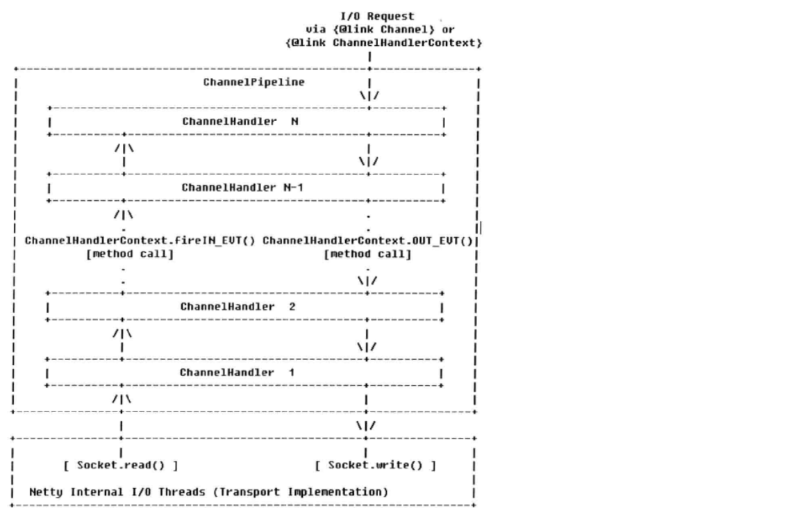
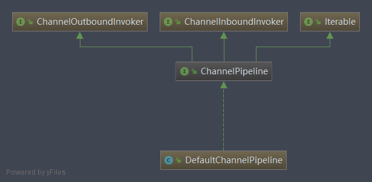

# ChannelPipeline及相关类学习
Netty的ChannelPipeline类似于Servlet和Filter过滤器，这类拦截器实际上是职责链模式的一种变形，
主要是为了方便事件的拦截和用户业务逻辑的定制。

## ChannelPipeline功能说明
   ChannelPipeline是ChannelHandler的容器，它负责ChannelHandler的管理和事件拦截与调度。
   
   1. ChannelPipeline的事件处理
   
      下图展示了一个消息被ChannelPipeline的ChannelHandler链拦截和处理的全过程。
      
      
      * 底层SocketChannel的read方法读取ByteBuf，触发ChannelRead事件，由NioEventLoop调用
      ChannelPipeline的fireChannelRead方法，将消息（ByteBuf）传输到ChannelPipeline中。
      * 消息被依次在HeadHandler、ChannelHandler1、ChannelHandler2...TailHandler拦截和处理，
      在这个过程中，任何ChannelHandler都可以中断当前流程，结束消息传递。
      * 调用ChannelHandlerContext的write方法发送消息，消息从TailHandler开始，途径ChannelHandlerN...
      ChannelHandler1、HeadHandler，最终被添加到消息发送缓冲区等待刷新和发送，在此过程中也可以中断消息的发送，
      例如当编码失败时，就需要中断流程，构造异常Future返回。
      
      Netty中的事件分为InBound事件和OutBound事件，InBound事件通常由I/O线程触发，比如TCP链路建立、链路关闭事件、
      读事件、异常通知事件等，它对应上图左半部分。
      
      触发InBound事件的方法如下：
      * ChannelHandlerContext.fireChannelRegistered(): Channel注册事件
      * ChannelHandlerContext.fireChannelActive(): TCP链路建立成功，Channel激活事件
      * ChannelHandlerContext.fireChannelRead(): 读事件 
      * ChannelHandlerContext.fireChannelReadComplete(): 读操作完成事件
      * ChannelHandlerContext.fireExceptionCaught(): 异常通知事件
      * ChannelHandlerContext.fireUserEventTriggered(): 用户自定义事件
      * ChannelHandlerContext.fireChannelWritabilityChanged(): Channel可写状态变化通知事件
      * ChannelHandlerContext.fireChannelInactive(): TCP连接关闭，链路不可用通知事件
      
      触发OutBound事件的方法如下：
      * ChannelHandlerContext.bind(): 绑定本地地址事件
      * ChannelHandlerContext.connect(): 连接服务端事件
      * ChannelHandlerContext.write(): 发送事件 
      * ChannelHandlerContext.flush(): 刷新事件
      * ChannelHandlerContext.read(): 读事件
      * ChannelHandlerContext.disconnect(): 断开连接事件
      * ChannelHandlerContext.close(): 关闭当前Channel事件

   2. 自定义拦截器
   
      ChannelPipeline通过ChannelHandler接口来实现事件的拦截和处理，由于ChannelHandler中的事件种类繁多，不同的ChannelHandler可能
      只需要关心其中的某一个或几个事件，所以通常ChannelHandler只需要继承ChannelHandlerAdapter类覆盖自己关心的方法即可。
      
   3. 构建pipeline
      
      使用ServerBootstrap和Bootstrap启动服务端和客户端的时候，Netty会为每个Channel连接创建一个独立的pipeline ，
      我们只需要将自定义拦截器加入pipeline，代码如下
      ```
      ChannelPipeline pipeline = socketChannel.pipeline();
      pipeline.addLast(new LineBasedFrameDecoder(1024))
              .addLast(new StringDecoder())
              .addLast(timeServerHandler);
      ```
      
      对于类似编解码这样的ChannelHandler，它存在先后顺序，例如MessageToMessageDecoder，在它之前往往需要有ByteToMessageDecoder将ByteBuf解码为对象，
      然后对对象做二次解码得到最终的POJO对象。pipeline支持指定位置添加或者删除拦截器：
      ```
      ChannelPipeline addFirst(String var1, ChannelHandler var2);
  
      ChannelPipeline addFirst(EventExecutorGroup var1, String var2, ChannelHandler var3);
  
      ChannelPipeline addLast(String var1, ChannelHandler var2);
  
      ChannelPipeline addLast(EventExecutorGroup var1, String var2, ChannelHandler var3);
  
      ChannelPipeline addBefore(String var1, String var2, ChannelHandler var3);
  
      ChannelPipeline addBefore(EventExecutorGroup var1, String var2, String var3, ChannelHandler var4);
  
      ChannelPipeline addAfter(String var1, String var2, ChannelHandler var3);
  
      ChannelPipeline addAfter(EventExecutorGroup var1, String var2, String var3, ChannelHandler var4);
  
      ChannelPipeline addFirst(ChannelHandler... var1);
  
      ChannelPipeline addFirst(EventExecutorGroup var1, ChannelHandler... var2);
  
      ChannelPipeline addLast(ChannelHandler... var1);
  
      ChannelPipeline addLast(EventExecutorGroup var1, ChannelHandler... var2);
  
      ChannelPipeline remove(ChannelHandler var1);
  
      ChannelHandler remove(String var1);
      ```
      
   4. ChannelPipeline的主要特性
   
      ChannelPipeline支持运行态动态的添加或者删除ChannelHandler，在某些场景下这个特性非常实用。
      例如当业务高峰期需要对系统做拥塞保护时，就可以根据当前的系统时间进行判断，如果处于业务高峰期，
      则动态地将系统拥塞保护ChannelHandler添加到当前的ChannelPipeline中，当高峰期过去之后，就可以动态删除拥塞保护ChannelHandler了。
      
      ChannelPipeline是线程安全的，这意味着N个业务线程可以并发地操作ChannelPipeline而不存在多线程并发问题。
      但是，ChannelHandler却不是线程安全的，这意味着尽管ChannelPipeline是线程安全的，但是用户仍然需要自己保证ChannelHandler的线程安全。
      

## ChannelPipeline源码分析
   ChannelPipeline的代码相对简单，它实际上是一个ChannelHandler的容器，内部维护了一个ChannelHandler的链表和迭代器，
   可以很方便地实现ChannelHandler查找、添加、替换和删除。
   
   1. ChannelPipeline类关系继承图
   
      
      
   2. ChannelPipeline对ChannelHandler的管理
      
      ChannelPipeline是ChannelHandler的容器，负责ChannelHandler的查询、添加、替换和删除。
      由于它和Map等容器的实现非常类似，我们只简单分析添加方法：
      ```
      public final ChannelPipeline addBefore(String baseName, String name, ChannelHandler handler) {
          return this.addBefore((EventExecutorGroup)null, baseName, name, handler);
      }
  
      public final ChannelPipeline addBefore(EventExecutorGroup group, String baseName, String name, ChannelHandler handler) {
          AbstractChannelHandlerContext newCtx;
          synchronized(this) {
              checkMultiplicity(handler);
              name = this.filterName(name, handler);
              AbstractChannelHandlerContext ctx = this.getContextOrDie(baseName);
              newCtx = this.newContext(group, name, handler);
              addBefore0(ctx, newCtx);
              if (!this.registered) {
                  newCtx.setAddPending();
                  this.callHandlerCallbackLater(newCtx, true);
                  return this;
              }
  
              EventExecutor executor = newCtx.executor();
              if (!executor.inEventLoop()) {
                  this.callHandlerAddedInEventLoop(newCtx, executor);
                  return this;
              }
          }
  
          this.callHandlerAdded0(newCtx);
          return this;
      }
      ```
      由于ChannelPipeline支持运行期动态修改，因此存在两种潜在的多线程并发访问场景。
      * I/O线程和用户业务线程的并发访问
      * 用户多个线程之间的并发访问
      
      此处Netty直接使用了synchronized关键字来保证ChannelPipeline的线程安全性。
      
      先根据baseName遍历链表来获取它对应的DefaultChannelHandlerContext，ChannelPipeline维护了ChannelHandler名和ChannelHandlerContext实例的映射关系。
      ```
      private AbstractChannelHandlerContext context0(String name) {
          for(AbstractChannelHandlerContext context = this.head.next; context != this.tail; context = context.next) {
              if (context.name().equals(name)) {
                  return context;
              }
          }
  
          return null;
      }
      ```
      然后对新增的ChannelHandler名进行重复性校验，如果已经有同名的ChannelHandler存在，
      则不允许覆盖，抛出IllegalArgumentException("Duplicate handler name: " + name)异常。
      验通过之后，使用新增的ChannelHandler等参数构造一个新的DefaultChannelHandlerContext实例。
      
      然后将新创建的DefaultChannelHandlerContext添加到当前的pipeline中(首先需要对添加的ChannelHandlerContext做重复性校验,
      如果ChannelHandler不是可以在多个ChannelPipeline中共享的，且已经被添加到ChannelPipeline中，则抛出ChannelPipelineException异常)。
      ```
      private static void addBefore0(AbstractChannelHandlerContext ctx, AbstractChannelHandlerContext newCtx) {
          newCtx.prev = ctx.prev;
          newCtx.next = ctx;
          ctx.prev.next = newCtx;
          ctx.prev = newCtx;
      }
      ```
      加入成功之后，缓存ChannelHandlerContext，发送新增ChannelHandlerContext通知消息。
      
   3. ChannelPipeline的inbound的管理
      
      当发生某个I/O事件的时候，例如链路建立、链路关闭、读取操作完成等，都会产生一个事件，
      事件在pipeline中得到传播和处理，它是事件处理的总入口。由于网络I/O相关的事件有限，因此Netty对这些事件进行了统一抽象，
      Netty自身和用户的ChannelHandler会对感兴趣的事件进行拦截和处理。
      
      pipeline中以fireXXX命名的方法都是从IO线程流向用户业务Handler的inbound事件，它们的实现因功能而异，
      但是处理步骤类似，总结如下。
      * 调用HeadHandler对应的fireXXX方法
      * 执行事件相关的逻辑操作

   4. ChannelPipeline的outbound的管理
   
      由用户线程或者代码发起的I/O操作被称为outbound事件,事实上inbound和outbound是Netty自身根据事件在pipeline中的流向抽象出来的术语，在其他NIO框架中并没有这个概念。
      
      Pipeline本身并不直接进行I/O操作，最终都是由Unsafe和Channel来实现真正的I/O操作的。
      Pipeline负责将I/O事件通过TailHandler进行调度和传播，最终调用Unsafe的I/O方法进行I/O操作。pipeline仅仅负责事件的调度。
      ```
      public final ChannelFuture connect(SocketAddress remoteAddress) {
          return this.tail.connect(remoteAddress);
      }
      ```
      它直接调用TailHandler的connect方法，最终会调用HeadHandler的connect方法（调用Unsafe的connect方法进行连接）。
      
