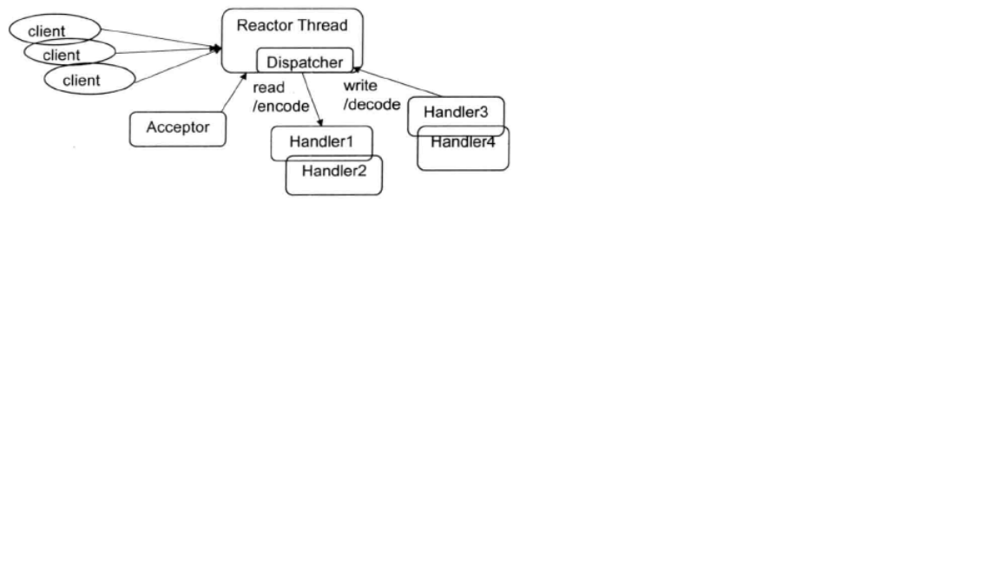
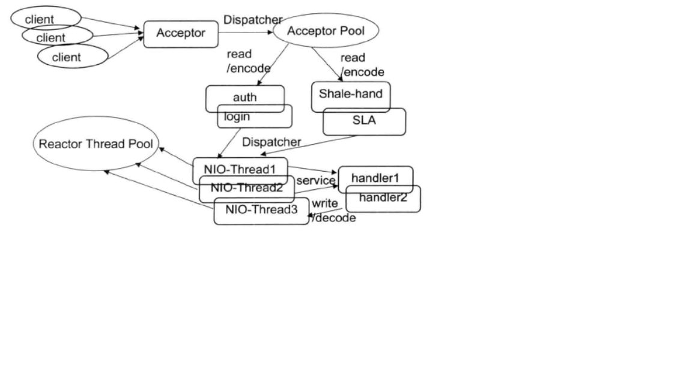
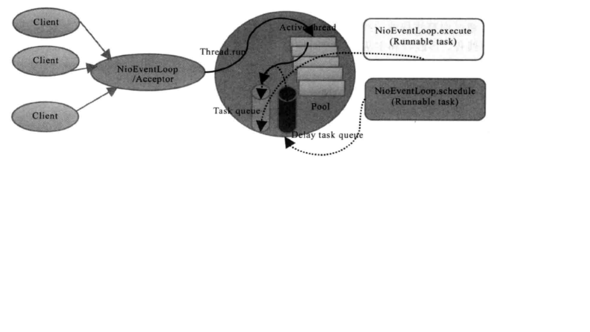
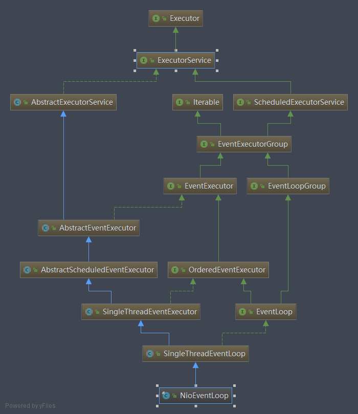

# EventLoop及EventLoopGroup学习
## Netty的线程模型
当我们讨论Netty线程模型的时候，一般首先会想到Reactor线程模型，尽管不同的NIO框架对于Reactor模式的实现存在差异，但本质上还是遵循了Reactor的基础线程模型
    
1. Reactor单线程模型
       
   Reactor单线程模型，是指所有I/O操作都在同一个NIO线程上面完成。NIO线程职责如下：
   * 作为NIO服务端，接收客户端的TCP连接
   * 作为NIO客户端，像服务端发起TCP连接
   * 读取通信对端的请求或者应答消息
   * 向通信对端发送请求或者应答消息
   
   Reactor单线程模型如下图所示
   
   
   由于Reactor模式使用的是异步非阻塞I/O，所有的I/O操作都不会被阻塞，理论上一个线程可以独立处理所有的I/O相关操作。
   从架构层面来看，一个NIO线程确实可以完成其承担的职责。
   
   在一些小容量应用场景下，可以使用单线程模型。但是对于高负载、大并发的应用场景却不合适，主要原因如下：
   * 一个NIO线程同时处理成百上千的链路，性能上无法支撑，即便NIO线程的CPU负荷达到100%，也无法满足海量消息的编码、解码、读取和发送。
   * 当NIO线程负载过重时，处理速度将变慢，这会导致大量客户端连接超时，超时之后往往会进行重发，这更加重了NIO线程的负载，最终会导致大量消息积压和处理超时，成为系统的性能瓶颈。
   * 可靠性问题：一旦NIO线程意味跑飞，或者进行死循环，会导致整个系统通信模块不可用，不能接收和处理外部消息，造成节点故障。
   
   为了解决这些问题，演进出了Reactor多线程模型
   
2. Reactor多线程模型
    
   Reactor多线程模型与单线程模型最大的区别就是有一组NIO线程来处理I/O事件
   
   
   Reactor多线程模型的特点如下：
   * 有一个专门的NIO线程——Accept线程用于监听服务端，接收客户端的TCP连接请求
   * 网络I/O操作——读、写等由一个NIO线程池负责，线程池采用标准的JDK线程池实现，它包含一个任务队列和N个可用的线程，由这些NIO线程负责消息的读取、解码、编码和发送。
   * 一个NIO线程可用同时处理多条链路，但是一个链路只对应一个NIO线程，防止发生并发问题
   
   在绝大多数场景下，Reactor多线程模型可以满足性能要求。但是，在个别特殊场景中，一个NIO线程负责监听和处理所有的客户端连接可能会存在性能问题。
   例如并发百万客户端连接，或者服务端需要对客户端握手进行安全认证，但是认证本身非常损耗性能。在这类场景下，单独一个Accept线程可能会存在性能不足的问题，
   为了解决这些问题，产生了第三者Reactor线程模型——主从Reactor多线程模型。
3. 主从Reactor多线程模型

   主从Reactor多线程模型的特点是：服务端用于接收客户端连接的不再是一个单独的Accept线程，而是一个独立的NIO线程池。
   Acceptor接收到客户端TCP连接请求并处理完成后（可能包含接入认证等），将新创建的SocketChannel注册到I/O线程池（sub reactor线程池），
   的某个I/O线程上，由它负责SocketChannel的读写和编解码工作。Acceptor线程池仅仅用于客户端的握手、连接和安全认证，一旦链路建立成功，
   就将链路注册到后端sub reactor线程池的I/O线程上，由I/O线程负责后续的I/O操作。
    
   
    
   利用主从Reactor多线程模型，可以解决一个服务端监听线程无法有效处理所有客户端连接的性能不足问题。
    
4. Netty线程模型

   Netty的线程模型并不是一成不变的，它实际取决于用户的启动参数配置，通过设置不同的启动参数，Netty同时支持Reactor单线程模型、Reactor多线程模型和主从Reactor多线程模型。
   
   下面我们通过一张原理图来快速了解Netty的线程模型
   
   
   可以通过Netty服务端启动代码来了解它的线程模型
   ```
   EventLoopGroup bossGroup = new NioEventLoopGroup(1);
   EventLoopGroup workGroup = new NioEventLoopGroup();
   final TimeServerHandler timeServerHandler = new TimeServerHandler();

   try {
       ServerBootstrap b = new ServerBootstrap();
       b.group(bossGroup, workGroup)
               .channel(NioServerSocketChannel.class)
               .option(ChannelOption.SO_BACKLOG, 100)
               .childHandler(new ChannelInitializer<SocketChannel>() {
                   protected void initChannel(SocketChannel socketChannel) throws Exception {
   ```
   服务端启动的时候，创建了两个NioEventLoopGroup，它们实际上是两个独立的Reactor线程池，一个用于接收客户端的TCP连接，另一个用于处理I/O相关的读写操作，或者执行系统Task、定时任务Task等。
   
   Netty用于接收客户端请求的线程池职责如下：
   * 接收客户端TCP连接，初始化Channel参数
   * 将链路状态变更事件通知给ChannelPipeline
   
   Netty用处理I/O操作的Reactor线程池职责如下：
   * 异步读取通信对端的数据报，发送读事件到ChannelPipeline
   * 异步发送消息到通信对端，调用ChannelPipeline的消息发送接口
   * 执行系统调用Task
   * 执行定时任务Task，例如链路空闲状态检测定时任务
   
   通过调整线程池的线程个数、是否共享线程池的方式，Netty可以支持Reactor单线程模型、Reactor多线程模型和主从Reactor多线程模型。
   这种灵活的配置方式可以最大程度上满足不同用户的个性化定制。
   
   为了尽可能提升性能，Netty在很多方面进行了无锁化的设计，例如在I/O线程内部进行串行操作，避免多线程竞争导致的性能下降问题。表面上看，
   串行化设计似乎CPU利用率不高，并发程度不够。但是，通过调整NIO线程池的线程参数，可以同时启动多个串行化的线程并行运行，这种局部无锁化
   的串行线程设计相比一个队列——多个线程的模型性能更优。
   
   Netty的NioEventLoop读取到消息之后，直接调用ChannelPipeline的fireChannelRead。主要用户不主动切换线程，
   一直都是由NioEventLoop调用用户的handler，期间不进行线程切换。这种串行化处理方式避免了多线程操作导致的锁的竞争，
   从性能角度看是最优的。
   
5. 最佳实践

   Netty的多线程编程最佳实践如下：
   * 创建两个NioEventLoopGroup，用于逻辑隔离NIO Acceptor和NIO I/O线程
   * 尽量不要在ChannelHandler中启动用户线程（解码后用于将POJO对象派发到后端业务线程的除外）
   * 解码要放在NIO线程调用的解码Handler中进行，不要切换到用户线程中完成消息的解码
   * 如果业务逻辑操作非常简单，没有复杂的业务逻辑计算，没有可能会导致线程被阻塞的磁盘操作、数据库操作和网络操作等，
   可以直接在NIO线程上完成业务逻辑编排，不需要切换到用户线程
   * 如果业务逻辑复杂，不要再NIO线程上完成，建议将解码后的消息封装成Task，派发到业务线程池中由业务线程执行，以保证NIO线程被尽快释放，处理其他的I/O操作
   
   推荐的线程数计算公式如下：
   * 线程数量= （线程总时间/瓶颈资源时间） * 瓶颈资源的线程并行数
   * QPS= 1000/线程总时间 * 线程数
   

## NioEventLoop源码分析
1. NioEventLoop设计原理
   
   Netty的NioEventLoop并不是一个纯粹的IO线程，它除了负责消息的读写以外， 还兼顾处理以下两类任务：
   * 系统Task：通过调用NioEventLoop的execute(Runnable task)方法实现，Netty有很多系统Task，创建它们最主要的原因是：当I/O线程
   和用户线程同时操作网络资源时，为了防止并发操作导致的锁竞争，将用户线程的操作封装成Task放入消息队列中，由I/O线程负责执行，这样就实现了局部无锁化。
   * 定时任务：通过调用NioEventLoop的schedule(Runnable command, long delay, TimeUnit unit)方法实现。
   
   正是NioEventLoop具备多种职责，所以它的实现比较特殊，它并不是一个简单的Runnable。
   

2. NioEventLoop继承关系类图

   NioEventLoop继承关系类图如下：
   
   
3. NioEventLoop

   作为NIO框架的Reactor线程，NioEventLoop需要处理网络I/O读写事件，因此它必须聚合一个多路复用器对象。下面看Selector的定义
   ```
   /**
    * The NIO {@link Selector}.
    */
   private Selector selector;
   private Selector unwrappedSelector;
   private SelectedSelectionKeySet selectedKeys;

   private final SelectorProvider provider;
   ```  
   Selector的初始化非常简单，直接调用Selector.open()方法就能创建并打开一个新的Selector。Netty对Selector的SelectedKeys进行了优化，用户可以通过配置决定是否启用优化。
   ```
   private static final boolean DISABLE_KEY_SET_OPTIMIZATION =
               SystemPropertyUtil.getBoolean("io.netty.noKeySetOptimization", false);
   ```
   Selector的初始化代码如下：
   ```
   private SelectorTuple openSelector() {
       final Selector unwrappedSelector;
       try {
           unwrappedSelector = provider.openSelector();
       } catch (IOException e) {
           throw new ChannelException("failed to open a new selector", e);
       }

       if (DISABLE_KEY_SET_OPTIMIZATION) {
           return new SelectorTuple(unwrappedSelector);
       }
   ```
   如果没有开启优化，通过provider.openSelector()创建并打开多路复用器之后就立即返回。
   
   如果开启了优化开关，需要通过反射的方式从Selector实例中获取selectedKeys和publicSelectedKeys，将这两个变量设置为可写，通过反射的方式
   使用Netty构造的selectedKeys包装类selectedKeySet将原JDK的selectedKeys替换掉。
   
   下面重点看run方法的实现：
   所有的逻辑都是再for循环中进行，只有当NioEventLoop接收到退出指令时才退出循环，否则一直执行下去，这也是通用NIO线程实现方式。
   
   首先
   ```
   @Override
   protected void run() {
       for (;;) {
           try {
               try {
                   // 根据当前NioEventLoop中是否有待完成的任务得出select策略，进行相应的select操作
                   switch (selectStrategy.calculateStrategy(selectNowSupplier, hasTasks())) {
                   case SelectStrategy.CONTINUE: // Indicates the IO loop should be retried, no blocking select to follow directly.
                       continue;

                   case SelectStrategy.BUSY_WAIT: // Indicates the IO loop to poll for new events without blocking.
                       // fall-through to SELECT since the busy-wait is not supported with NIO

                   case SelectStrategy.SELECT: // Indicates a blocking select should follow
                       select(wakenUp.getAndSet(false));

                       
                       if (wakenUp.get()) {
                           selector.wakeup();
                       }
                       // fall through
                   default:
               ...
               // 处理select操作得到的已经准备好处理的I/O事件，以及处理提交到当前EventLoop的任务(包括定时和周期任务)：

               cancelledKeys = 0;
               needsToSelectAgain = false;
               final int ioRatio = this.ioRatio; //在事件循环中期待用于处理I/O操作时间的百分比， 默认为50%
               if (ioRatio == 100) {
                   try {
                       processSelectedKeys(); // 处理Selector.select操作返回的待处理的I/O事件
                   } finally {
                       // Ensure we always run tasks.
                       runAllTasks();
                   }
               } else {
                   final long ioStartTime = System.nanoTime();
                   try {
                       processSelectedKeys();
                   } finally {
                       // Ensure we always run tasks. 处理任务队列中的任务以及定时/周期性任务
                       final long ioTime = System.nanoTime() - ioStartTime;
                       runAllTasks(ioTime * (100 - ioRatio) / ioRatio);
                   }
               }
           } catch (Throwable t) {
               handleLoopException(t);
           }
           // Always handle shutdown even if the loop processing threw an exception.
           try {
               if (isShuttingDown()) {
                   // 结束运行，释放资源
                   closeAll();
                   if (confirmShutdown()) {
                       return;
                   }
               }
           } catch (Throwable t) {
               handleLoopException(t);
           }
       }
   }
   
   
   private void select(boolean oldWakenUp) throws IOException {
       Selector selector = this.selector;
       try {
           int selectCnt = 0;
           long currentTimeNanos = System.nanoTime();
           long selectDeadLineNanos = currentTimeNanos + delayNanos(currentTimeNanos);

           for (;;) {
               // 计算下一个定时任务的剩余超时时间，转换成毫秒，增加0.5毫秒的调整值
               long timeoutMillis = (selectDeadLineNanos - currentTimeNanos + 500000L) / 1000000L;
               if (timeoutMillis <= 0) {
                   if (selectCnt == 0) {
                       selector.selectNow();
                       selectCnt = 1;
                   }
                   break;
               }

               // If a task was submitted when wakenUp value was true, the task didn't get a chance to call
               // Selector#wakeup. So we need to check task queue again before executing select operation.
               // If we don't, the task might be pended until select operation was timed out.
               // It might be pended until idle timeout if IdleStateHandler existed in pipeline.
               if (hasTasks() && wakenUp.compareAndSet(false, true)) {
                   selector.selectNow();
                   selectCnt = 1;
                   break;
               }

               int selectedKeys = selector.select(timeoutMillis);
               selectCnt ++;

               if (selectedKeys != 0 || oldWakenUp || wakenUp.get() || hasTasks() || hasScheduledTasks()) {
                   // - Selected something,
                   // - waken up by user, or
                   // - the task queue has a pending task.
                   // - a scheduled task is ready for processing
                   break;
               }
               if (Thread.interrupted()) {
                   // Thread was interrupted so reset selected keys and break so we not run into a busy loop.
                   // As this is most likely a bug in the handler of the user or it's client library we will
                   // also log it.
                   //
                   // See https://github.com/netty/netty/issues/2426
                   if (logger.isDebugEnabled()) {
                       logger.debug("Selector.select() returned prematurely because " +
                               "Thread.currentThread().interrupt() was called. Use " +
                               "NioEventLoop.shutdownGracefully() to shutdown the NioEventLoop.");
                   }
                   selectCnt = 1;
                   break;
               }

               // 检测是否发生“epoll-bug”
               long time = System.nanoTime();
               if (time - TimeUnit.MILLISECONDS.toNanos(timeoutMillis) >= currentTimeNanos) {
                   // timeoutMillis elapsed without anything selected.
                   selectCnt = 1;
               } else if (SELECTOR_AUTO_REBUILD_THRESHOLD > 0 &&
                       selectCnt >= SELECTOR_AUTO_REBUILD_THRESHOLD) { // SELECTOR_AUTO_REBUILD_THRESHOLD默认为512
                   // select()在时间到期前就返回，而且selectedKeys == 0，selector进行了一次空轮询
                   selector = selectRebuildSelector(selectCnt); // Selector的重建操作
                   selectCnt = 1;
                   break;
               }

               currentTimeNanos = time;
           }

           if (selectCnt > MIN_PREMATURE_SELECTOR_RETURNS) {
               if (logger.isDebugEnabled()) {
                   logger.debug("Selector.select() returned prematurely {} times in a row for Selector {}.",
                           selectCnt - 1, selector);
               }
           }
       } catch (CancelledKeyException e) {
           if (logger.isDebugEnabled()) {
               logger.debug(CancelledKeyException.class.getSimpleName() + " raised by a Selector {} - JDK bug?",
                       selector, e);
           }
           // Harmless exception - log anyway
       }
   }
   
   
   private void processSelectedKeys() {
       if (selectedKeys != null) {
           processSelectedKeysOptimized();
       } else {
           processSelectedKeysPlain(selector.selectedKeys());
       }
   }
   
   // 该方法会从selectedKeys中依次取出准备好被处理的SelectionKey，并对相应的待处理的I/O事件进行处理。
   private void processSelectedKeysOptimized() {
       for (int i = 0; i < selectedKeys.size; ++i) {
           final SelectionKey k = selectedKeys.keys[i];
           // null out entry in the array to allow to have it GC'ed once the Channel close
           // See https://github.com/netty/netty/issues/2363
           selectedKeys.keys[i] = null;

           final Object a = k.attachment(); // NioServerSocketChannel或者NioSocketChannel

           if (a instanceof AbstractNioChannel) {
               processSelectedKey(k, (AbstractNioChannel) a);
           } else {
               @SuppressWarnings("unchecked")
               NioTask<SelectableChannel> task = (NioTask<SelectableChannel>) a;
               processSelectedKey(k, task);
           }

           if (needsToSelectAgain) {
               // null out entries in the array to allow to have it GC'ed once the Channel close
               // See https://github.com/netty/netty/issues/2363
               selectedKeys.reset(i + 1);

               selectAgain();
               i = -1;
           }
       }
   }
   
   private void processSelectedKey(SelectionKey k, AbstractNioChannel ch) {
       final AbstractNioChannel.NioUnsafe unsafe = ch.unsafe();
       if (!k.isValid()) {
           final EventLoop eventLoop;
           try {
               eventLoop = ch.eventLoop();
           } catch (Throwable ignored) {
               // If the channel implementation throws an exception because there is no event loop, we ignore this
               // because we are only trying to determine if ch is registered to this event loop and thus has authority
               // to close ch.
               return;
           }
           // Only close ch if ch is still registered to this EventLoop. ch could have deregistered from the event loop
           // and thus the SelectionKey could be cancelled as part of the deregistration process, but the channel is
           // still healthy and should not be closed.
           // See https://github.com/netty/netty/issues/5125
           if (eventLoop != this || eventLoop == null) {
               return;
           }
           // close the channel if the key is not valid anymore
           unsafe.close(unsafe.voidPromise());
           return;
       }

       try {
           int readyOps = k.readyOps();
           // We first need to call finishConnect() before try to trigger a read(...) or write(...) as otherwise
           // the NIO JDK channel implementation may throw a NotYetConnectedException.
           if ((readyOps & SelectionKey.OP_CONNECT) != 0) {
               // remove OP_CONNECT as otherwise Selector.select(..) will always return without blocking
               // See https://github.com/netty/netty/issues/924
               int ops = k.interestOps();
               ops &= ~SelectionKey.OP_CONNECT;
               k.interestOps(ops);

               unsafe.finishConnect();
           }

           // Process OP_WRITE first as we may be able to write some queued buffers and so free memory.
           if ((readyOps & SelectionKey.OP_WRITE) != 0) {
               // Call forceFlush which will also take care of clear the OP_WRITE once there is nothing left to write
               ch.unsafe().forceFlush();
           }

           // Also check for readOps of 0 to workaround possible JDK bug which may otherwise lead
           // to a spin loop
           if ((readyOps & (SelectionKey.OP_READ | SelectionKey.OP_ACCEPT)) != 0 || readyOps == 0) {
               unsafe.read();
           }
       } catch (CancelledKeyException ignored) {
           unsafe.close(unsafe.voidPromise());
       }
   }
   ```
   
   