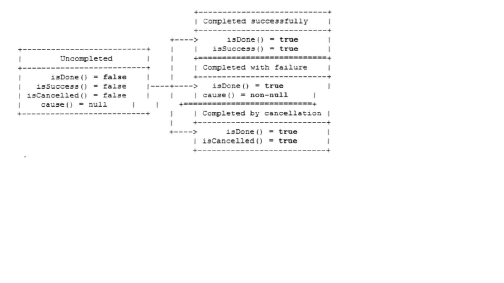

# Future及Promise学习
## Future功能
Future最早来源于java.util.concurrent.Future，它用于代表异步操作的结果。其API如下
```
boolean cancel(boolean mayInterruptIfRunning);
boolean isCancelled();
boolean isDone();
V get() throws InterruptedException, ExecutionException;
V get(long timeout, TimeUnit unit) throws InterruptedException, ExecutionException, TimeoutException;
```

1. ChannelFuture功能介绍
   
   由于Netty的Future都是与异步I/O操作相关的，因此命名为ChannelFuture，代表它与Channel操作相关。
   API如下：
   ```
   Channel channel();
   
   ChannelFuture addListener(GenericFutureListener<? extends Future<? super Void>> var1);

   ChannelFuture addListeners(GenericFutureListener... var1);

   ChannelFuture removeListener(GenericFutureListener<? extends Future<? super Void>> var1);

   ChannelFuture removeListeners(GenericFutureListener... var1);

   ChannelFuture sync() throws InterruptedException;

   ChannelFuture syncUninterruptibly();

   ChannelFuture await() throws InterruptedException;

   ChannelFuture awaitUninterruptibly();

   boolean isVoid();
   ```
   
   在Netty中，所有的I/O操作都是异步的，这意味着任何I/O调用都会立即返回，而不是像传统BIO那样同步等待操作完成。
   异步操作会带来一个问题：调用者如何获取异步操作的结果？ChannelFuture就是为了解决这个问题而专门设计的。
   
   ChannelFuture有两种状态：uncompleted和completed。当开始一个I/O操作时，一个新的ChannelFuture被创建，此时它处于uncompleted状态，
   ——非成功、非失败、非取消，因为I/O操作此时还没有完成。一旦I/O操作完成，ChannelFuture将会被设置成completed，它的结果有三种可能
   * 操作成功
   * 操作失败
   * 操作被取消
   
   ChannelFuture状态迁移如图
   
   
   ChannelFuture提供了一批新的API，用于获取操作结果、添加事件监听器、取消I/O操作、同步等等。
   我们重点关注添加监听器的接口。
   
   Netty强烈建议直接通过添加监听器的方式获取I/O操作结果，或者进行后续的相关操作。
   ChannelFuture可以同时增加一个或者多个GenericFutureListener，也可以用remove删除GenericFutureListener。
   
   GenericFutureListener接口定义如下
   ```
   public interface GenericFutureListener<F extends Future<?>> extends EventListener {
       void operationComplete(F var1) throws Exception;
   }
   ```
   
   当I/O操作完成后，I/O线程会回调ChannelFuture中GenericFutureListener的operationComplete方法，并将ChannelFuture对象当作方法的入参。
   如果用户需要做上下文相关的操作，也可以将上下文信息保存在ChannelFuture中。
   
   推荐通过GenericFutureListener代替ChannelFuture的get等方法的原因是：当我们进行异步I/O事件时，完成的时间是无法预测的，如果不设置超时时间，它会导致
   调用线程长时间被阻塞，甚至挂死。而设置超时时间，时间又无法精确预测。利用异步通知机制回调GenericFutureListener是最佳的解决方案，它的性能最佳。
   
   需要注意的是：不要在ChannelHandler里调用ChannelFuture的await方法，这会导致死锁。原因是发起I/O操作之后，由I/O线程负责异步通知发起I/O操作的用户线程，
   如果I/O线程和用户线程是同一个线程，就会导致I/O线程等待自己通知操作完成，这就导致了死锁，这跟经典的两个线程互等到死锁不同，属于自己挂死自己。
   
   异步I/O操作有两类超时：一个是TCP层面的I/O超时，另一个是业务逻辑层面的操作超时。两者没有必然的联系，但是通常情况下，业务逻辑超时时间应该大于I/O超时时间。
   两者是包含的关系。
   

## ChannelFuture源码分析
1. AbstractFuture

   AbstractFuture实现Future接口，它不允许I/O操作被取消。
   获取异步操作结果的代码如图：
   ```
   public V get() throws InterruptedException, ExecutionException {
       await(); // 调用await无限期阻塞，当I/O操作完成之后会被notify

       Throwable cause = cause(); // 检查I/O操作是否发生了异常，没有异常则通过getNow获取结果
       if (cause == null) {
           return getNow();
       }
       if (cause instanceof CancellationException) {
           throw (CancellationException) cause;
       }
       throw new ExecutionException(cause);
   }
   ```
   还有支持超时的获取操作结果的方法
   ```
   public V get(long timeout, TimeUnit unit) throws InterruptedException, ExecutionException, TimeoutException {
       if (await(timeout, unit)) {
           Throwable cause = cause();
           if (cause == null) {
               return getNow();
           }
           if (cause instanceof CancellationException) {
               throw (CancellationException) cause;
           }
           throw new ExecutionException(cause);
       }
       throw new TimeoutException();
   }
   ```
   
   其它实现子类也比较简单。
   
## Promise功能介绍
Promise是可写的Future，Future自身并没有写操作相关的接口，Netty通过Promise对Future进行了扩展，用于设置I/O操作的结果。

Promise写操作相关的接口定义如图
```
Promise<V> setSuccess(V var1);

boolean trySuccess(V var1);

Promise<V> setFailure(Throwable var1);

boolean tryFailure(Throwable var1);

boolean setUncancellable();

Promise<V> sync() throws InterruptedException;

Promise<V> syncUninterruptibly();
```

Netty发起I/O操作的时候，会创建一个新的Promise对象，例如调用ChannelHandlerContext的write(Object object)方法时，会创建一个新的ChannelPromise，
```
public ChannelFuture write(Object msg) {
    return this.write(msg, this.newPromise());
}
public ChannelPromise newPromise() {
    return new DefaultChannelPromise(this.channel(), this.executor());
}
```
当I/O操作完成或者发生异常时，设置promise的结果。


## Promise源码分析
Promise子类种类繁多，我们学习一个DefaultPromise。看一下重要的setSuccess方法的实现.
首先调用setSuccess0方法并对其结果进行判断，如果操作成功，则返回。
```
public Promise<V> setSuccess(V result) {
    if (setSuccess0(result)) {
        return this;
    }
    throw new IllegalStateException("complete already: " + this);
}
private boolean setSuccess0(V result) {
    return setValue0(result == null ? SUCCESS : result);
}
private boolean setValue0(Object objResult) {
    if (RESULT_UPDATER.compareAndSet(this, null, objResult) ||
        RESULT_UPDATER.compareAndSet(this, UNCANCELLABLE, objResult)) {
        if (checkNotifyWaiters()) {
            notifyListeners();
        }
        return true;
    }
    return false;
}
```
setSuccess0()方法对操作结果进行判断，如果为空，说明仅仅需要notify在等待的业务线程，不包含具体的 业务逻辑对象。
因此，将result设置为系统默认的SUCCESS，如果操作结果非空，将结果设置为result。

如果有正在等待异步I/O操作完成的用户线程或者其它系统线程，则唤醒在等待的线程。

继续看await()方法的实现
```
public Promise<V> await() throws InterruptedException {
    if (isDone()) {
        return this;
    }

    if (Thread.interrupted()) {
        throw new InterruptedException(toString());
    }

    checkDeadLock();

    synchronized (this) {
        while (!isDone()) {
            incWaiters();
            try {
                wait();
            } finally {
                decWaiters();
            }
        }
    }
    return this;
}
```
如果当前Promise已经被设置，则直接返回。如果线程已被中断，则抛出中断异常。检查死锁。
```
protected void checkDeadLock() {
    EventExecutor e = executor();
    if (e != null && e.inEventLoop()) {// 说明执行当前方法的线程就是EventLoop所关联的线程(即，I/O线程)
        throw new BlockingOperationException(toString());
    }
}
```
通过synchronized锁定当前Promise对象，使用循环对isDone结果进行判断，进行循环判断的原因是防止线程被意外唤醒导致的功能异常。
最后调用java.lang.Object.wait()方法进行无限期等待，直到I/O线程调用setSuccess()、trySuccess()、setFailure()、tryFailure()。


