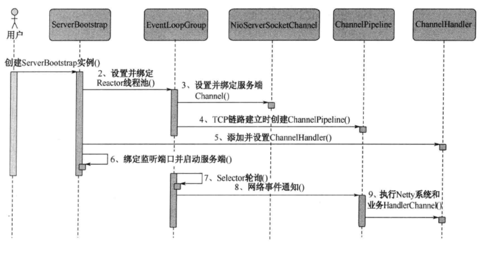
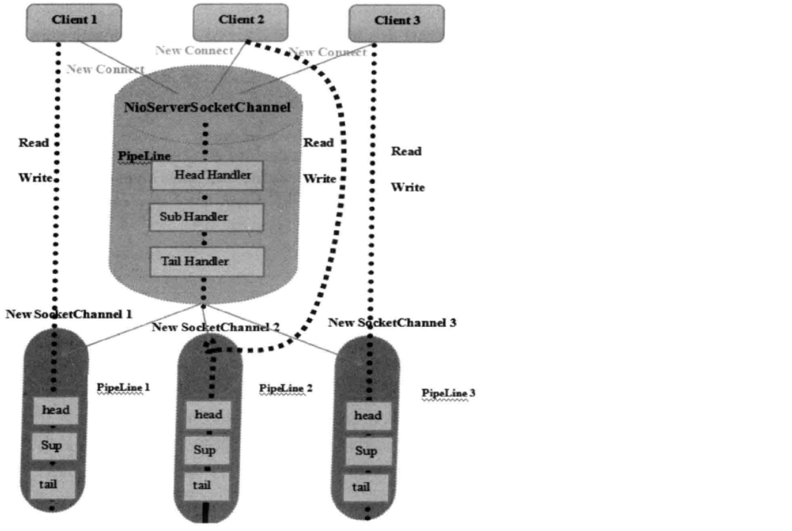

# Netty服务端学习

## Netty服务端创建步骤
ServerBootstrap是netty服务端的启动辅助类，时序图如下


下面学习netty服务端创建的关键步骤和原理
1. 创建ServerBootstrap实例。ServerBootstrap使用门面模式对其功能实现抽象和封装，并且引入Builder模式进行构造.
    ```
    ServerBootstrap b = new ServerBootstrap();
    ```
2. 设置并绑定Reactor线程池
    ```
    EventLoopGroup bossGruop=new NioEventLoopGroup(1);//用于服务器端接受客户端的连接
    EventLoopGroup workGroup=new NioEventLoopGroup();//用于网络事件的处理
    ```
    Netty的线程池是EventLoopGroup，它实际上是EventLoop的数组，EventLoop职责是处理所有注册到本线程多路复用器Selector上的Channel，Selector的轮询操作是由绑定的EventLoop线程run方法驱动。
    还有一点，EventLoopGroup不仅仅处理网络IO事件，还负责处理用户自定义的task和定时任务task。
3. 设置并绑定服务器端Channel
    ```
    b.group(bossGroup, workGroup)
                        .channel(NioServerSocketChannel.class)
    ```
    Netty对原生的NIO类库进行封装，作为NIO服务端，需要创建ServerSocketChannel，对应的实现是NioServerSocketChannel。
    Netty通过工厂类利用反射创建NioServerSocketChannel实例，由于服务监听端口往往只需要再系统启动时才调用，所以反射对性能影响不大。
    ```
    public B channel(Class<? extends C> channelClass) {
        if (channelClass == null) {
            throw new NullPointerException("channelClass");
        } else {
            return this.channelFactory((io.netty.channel.ChannelFactory)(new ReflectiveChannelFactory(channelClass)));
        }
    }
    ```
4. 链路建立的时候创建并初始化ChannelPipeline
    ```
    b.group(bossGroup, workGroup)
        .channel(NioServerSocketChannel.class)
        .option(ChannelOption.SO_BACKLOG, 100)
        .childHandler(new ChannelInitializer<SocketChannel>() {
            protected void initChannel(SocketChannel socketChannel) throws Exception {
                ChannelPipeline pipeline = socketChannel.pipeline();
                ...
            }
        });

    ```
    ChannelPipeline并不是NIO服务端必须的，它本质是一个负责处理网络事件的职责链，负责管理和执行ChannelHandler。
    网络事件以事件流的形式在ChannelPipeline中流转，由ChannelPipeline根据Channel|Handler的执行策略调度ChannelHandler的执行。典型的网络事件有：
    1. 链路注册
    2. 链路激活
    3. 链路断开
    4. 接收到请求信息
    5. 请求信息接收并处理完毕
    6. 发送应答消息
    7. 链路发生异常
    8. 用户自定义事件
5. 添加并设置ChannelHandler
    ```
    new ChannelInitializer<SocketChannel>() {
        protected void initChannel(SocketChannel socketChannel) throws Exception {
            ChannelPipeline pipeline = socketChannel.pipeline();
            pipeline.addLast(new LineBasedFrameDecoder(1024))
                    .addLast(new StringDecoder())
                    .addLast(timeServerHandler);
        }
    }
    ```
    ChannelHandler是Netty提供给用户定制和扩展的接口，例如消息编解码、心跳、安全认证、TSL/SSL认证。
6. 绑定并启动监听窗口
    ```
    ChannelFuture future = b.bind(8888).sync();
    ```
    经过一系列初始化和检测工作后，会启动监听端口，并将ServerSocketChannel注册到Selector上监听客户端连接。
7. Selector轮询
    
    由Reactor线程NioEventLoop负责调度和执行Selector轮询操作，选择准备就绪的channel集合
8. 当轮询到准备就绪的Channel之后，就由Reactor线程NioEventLoop执行ChannelPipeline的相应方法，最终调度并执行ChannelHandler

## Netty服务端创建源码分析
    
   通过ServerBootstrap的group方法将两个EventLoopGroup实例加入
   ```
   public ServerBootstrap group(EventLoopGroup parentGroup, EventLoopGroup childGroup) {
      super.group(parentGroup);
      if (childGroup == null) {
          throw new NullPointerException("childGroup");
      } else if (this.childGroup != null) {
          throw new IllegalStateException("childGroup set already");
      } else {
          this.childGroup = childGroup;
          return this;
      }
   }
   ```
   
   其中的parentGroup被传入父类构造器
   ```
   public B group(EventLoopGroup group) {
       if (group == null) {
           throw new NullPointerException("group");
       } else if (this.group != null) {
           throw new IllegalStateException("group set already");
       } else {
           this.group = group;
           return this.self();
       }
   }
   ```

   线程组和线程类型设置完之后，需要设置服务端channel用于端口监听和客户端链路接入。
   Netty通过工厂类创建不同的channel实例。
   ```
   public B channel(Class<? extends C> channelClass) {
       if (channelClass == null) {
           throw new NullPointerException("channelClass");
       } else {
           return this.channelFactory((io.netty.channel.ChannelFactory)(new ReflectiveChannelFactory(channelClass)));
       }
   }
   ```
   这里使用ReflectiveChannelFactory反射创建channel：
   ```
   public T newChannel() {
       try {
           return (Channel)this.constructor.newInstance();
       } catch (Throwable var2) {
           throw new ChannelException("Unable to create Channel from class " + this.constructor.getDeclaringClass(), var2);
       }
    }
   ```
   
   指定NioServerSocketChannel后，需要设置一些TCP参数，作为服务端，最主要的是backlog参数。
   backlog指定了内核为此套接字排队的最大连接数，对于给定的监听器端口，内核要维护两个队列：未链接队列和已连接队列，
   根据TCP三次握手中三个分节来分隔这两个队列。backlog被视为这两个队列总和最大值，如果两个队列的长度大于backlog时，新的连接就会呗TCP内核拒绝掉
   所以，如果backlog过小，就可能出现Accept的速度跟不上，两个队列满了，就会导致客户端无法建立连接
   需要注意的是，backlog对程序的连接数没影响，但是影响的是还没有被accept取出的连接。
   
   
   TCP参数设置完后，可以为ServerBootstrap及其父类分别指定handler。两类handler的用途不同，
   子类的handler是NioServerSocketChannel的ChannelPipeline的handler，
   父类的handler是客户端新连接SocketChanel的ChannelPipeline的handler。
   
   
   本质区别就是，ServerBootstrap的handler，所有连接该监听端口的客户端都会执行，
   而父类AbstractBootstrap的handler是个工厂类，为每个新接入的客户端都创建一个新的handler。
   
   服务端启动的最后一步就是绑定端口，启动服务。
   ```
   private ChannelFuture doBind(final SocketAddress localAddress) {
       final ChannelFuture regFuture = this.initAndRegister();
       final Channel channel = regFuture.channel();
       if (regFuture.cause() != null) {
           return regFuture;
       } else if (regFuture.isDone()) {
           ChannelPromise promise = channel.newPromise();
           doBind0(regFuture, channel, localAddress, promise);
           return promise;
       } else {
           final AbstractBootstrap.PendingRegistrationPromise promise = new AbstractBootstrap.PendingRegistrationPromise(channel);
           regFuture.addListener(new ChannelFutureListener() {
               public void operationComplete(ChannelFuture future) throws Exception {
                   Throwable cause = future.cause();
                   if (cause != null) {
                       promise.setFailure(cause);
                   } else {
                       promise.registered();
                       AbstractBootstrap.doBind0(regFuture, channel, localAddress, promise);
                   }

               }
           });
           return promise;
       }
   }
   ```
   initAndRegister()主要是使用channelFactory创建NioServerSocketChannel并初始化：
   ```
   final ChannelFuture initAndRegister() {
       Channel channel = null;

       try {
           channel = this.channelFactory.newChannel();
           this.init(channel);
       ...
   }
   
   void init(Channel channel) throws Exception {
       Map<ChannelOption<?>, Object> options = this.options0();
       synchronized(options) {
           setChannelOptions(channel, options, logger);
       }

       Map<AttributeKey<?>, Object> attrs = this.attrs0();
       synchronized(attrs) {
           Iterator var5 = attrs.entrySet().iterator();

           while(true) {
               if (!var5.hasNext()) {
                   break;
               }

               Entry<AttributeKey<?>, Object> e = (Entry)var5.next();
               AttributeKey<Object> key = (AttributeKey)e.getKey();
               channel.attr(key).set(e.getValue());
           }
       }

       ChannelPipeline p = channel.pipeline();
       final EventLoopGroup currentChildGroup = this.childGroup;
       final ChannelHandler currentChildHandler = this.childHandler;
       Map var9 = this.childOptions;
       final Entry[] currentChildOptions;
       synchronized(this.childOptions) {
           currentChildOptions = (Entry[])this.childOptions.entrySet().toArray(newOptionArray(0));
       }

       var9 = this.childAttrs;
       final Entry[] currentChildAttrs;
       synchronized(this.childAttrs) {
           currentChildAttrs = (Entry[])this.childAttrs.entrySet().toArray(newAttrArray(0));
       }

       p.addLast(new ChannelHandler[]{new ChannelInitializer<Channel>() {
           public void initChannel(final Channel ch) throws Exception {
               final ChannelPipeline pipeline = ch.pipeline();
               ChannelHandler handler = ServerBootstrap.this.config.handler();
               if (handler != null) {
                   pipeline.addLast(new ChannelHandler[]{handler});
               }

               ch.eventLoop().execute(new Runnable() {
                   public void run() {
                       pipeline.addLast(new ChannelHandler[]{new ServerBootstrap.ServerBootstrapAcceptor(ch, currentChildGroup, currentChildHandler, currentChildOptions, currentChildAttrs)});
                   }
               });
           }
       }});
   }
   ```
   初始化：
   1. 设置TCP参数和NioServerSocketChannel的附加属性。
   2. 将父类AbstractBootstrap的handler添加到NioServerSocketChannel的ChannelPipeline中去。
   3. 将ServerBootstrapAcceptor加入到ChannelPipeline中
   ```
   public void channelRead(ChannelHandlerContext ctx, Object msg) {
       final Channel child = (Channel)msg;
       child.pipeline().addLast(new ChannelHandler[]{this.childHandler});
       AbstractBootstrap.setChannelOptions(child, this.childOptions, ServerBootstrap.logger);
       Entry[] var4 = this.childAttrs;
       int var5 = var4.length;

       for(int var6 = 0; var6 < var5; ++var6) {
           Entry<AttributeKey<?>, Object> e = var4[var6];
           child.attr((AttributeKey)e.getKey()).set(e.getValue());
       }

       try {
           this.childGroup.register(child).addListener(new ChannelFutureListener() {
               public void operationComplete(ChannelFuture future) throws Exception {
                   if (!future.isSuccess()) {
                       ServerBootstrap.ServerBootstrapAcceptor.forceClose(child, future.cause());
                   }

               }
           });
       } catch (Throwable var8) {
           forceClose(child, var8);
       }

   }
   ```
   ServerBootstrapAcceptor在channelRead事件触发的时候（也就有客户端连接的时候），把childHandler加到childChannel Pipeline的末尾，设置childHandler的options和attrs，最后把childHandler注册进childGroup

现在，Netty服务端的相关资源已经初始化完毕，剩下最后一步，将NioServerSocketChannel注册到Reactor线程的多路复用器。
