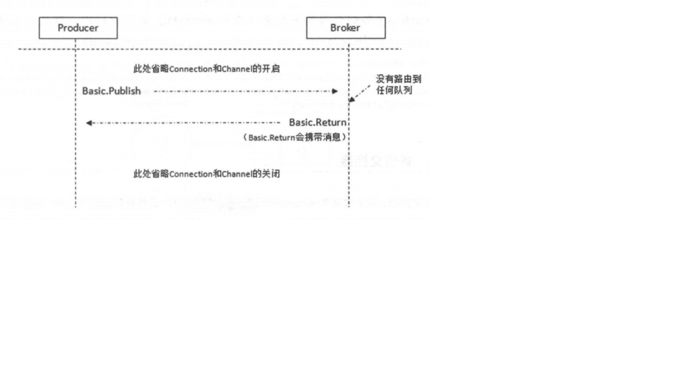
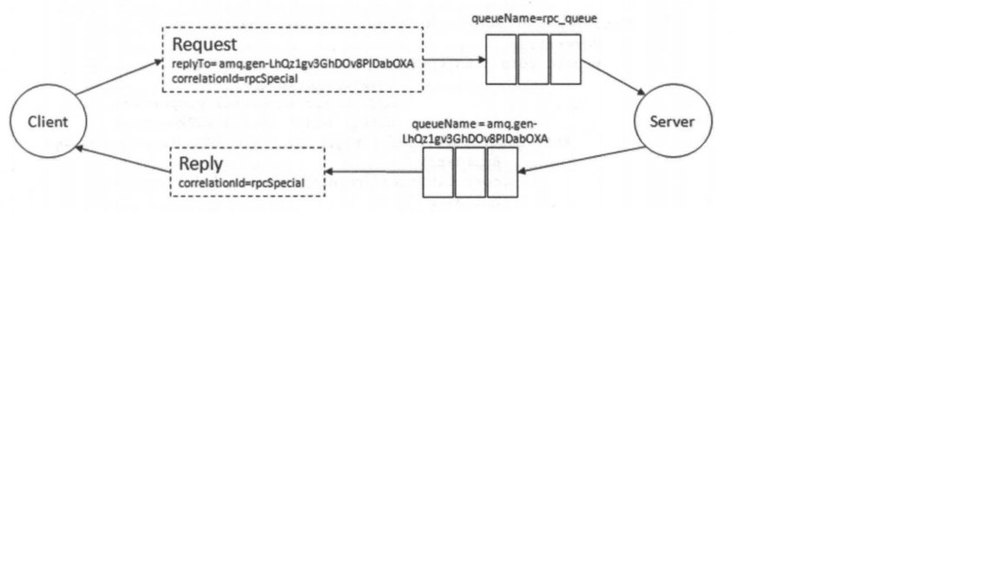
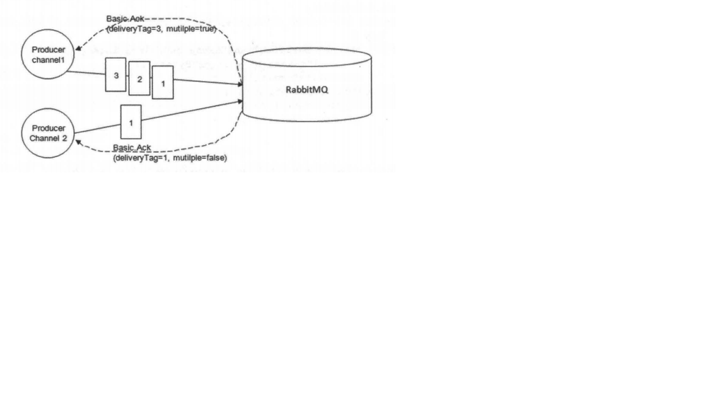
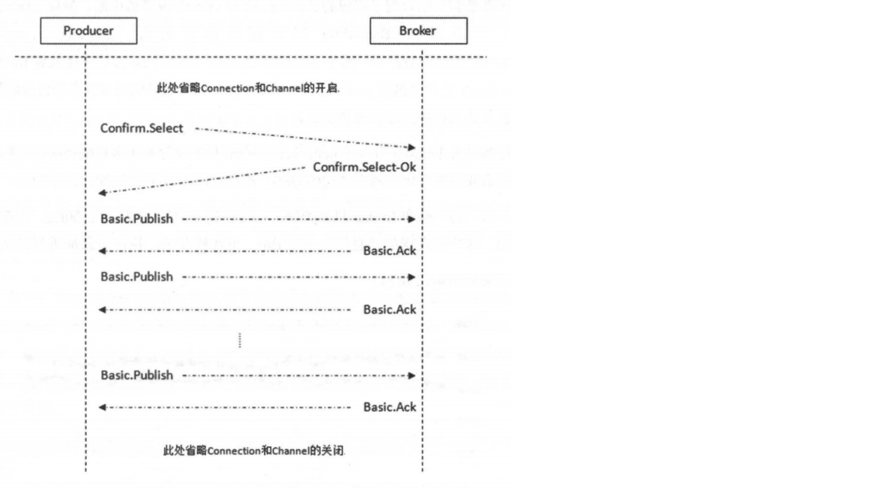

# RabbiMQ进阶
## 消息何去何从
mandatory和immediate是channel.basicPublish方法的两个参数，它们都有当消息传递过程中不可达目的地时将消息返回给生产者的功能。
RabbitMQ提供的备份交换器(Alternate Exchange)可以将未能被交换器路由的消息(没有绑定队列或者没有匹配的绑定)存储起来，而不用返回给客户端。
1. mandatory参数

   当mandatory参数设置为true时，交换器无法根据自身类型和路由键找到一个符合条件的队列，那么RabbitMQ会调用Basic.Return命令将消息返回给生产者。
   当mandatory参数设置为false时，出现上述情形，则消息直接被丢弃。
   
   那么生产者如何获取到没有被正确路由到合适队列的消息呢？这时候可以通过调用channel.addReturnListener来添加ReturnListener监听器实现。
   ```
   channel.basicPublish(EXCHANGE_NAME, ROUTING_KEY, true, MessageProperties.PERSISTENT_TEXT_PLAIN,
                   message.getBytes());
   channel.addReturnListener(new ReturnListener() {
       @Override
       public void handleReturn(int replyCode, String replyText, String exchange, String routingKey, AMQP.BasicProperties properties, byte[] body) throws IOException {
           String message = new String(body);
           System.out.println("Basic.Return 返回的结果是: " + message);
       }
   });
   ```
   从 AMQP 协议层面来说，其对应的流转过程如图
   
   
2. immediate参数

   当 immediate 参数设为 true 时，如果交换器在将消息路由到队列时发现队列上并不存在任何消费者，那么这条消息将不会存入队列中。当与路由键匹配的所有队列都没有消费者时，该消息会通过 Basic.Return 返回至生产者。
   
   概括来说，mandatory 参数告诉服务器至少将该消息路由到一个队列中，否则将消息返回给生产者。immediate 参数告诉服务器，如果该消息关联的队列上有消费者，则立刻投递:
   如果所有匹配的队列上都没有消费者，则直接将消息返还给生产者，不用将消息存入队列而等待消费者了。
   
   RabbitMQ 3.0 版本开始去掉了对 immediate 参数的支持，对此 RabbitMQ 官方解释是: immediate 参数会影响镜像队列的性能，增加了代码复杂性，建议采用 TTL 和 DLX 的方法替代。
   
3. 备份交换器

   备份交换器，英文名称为Alternate Exchange，简称AE，或者更直白地称之为“备胎交换器”。生产者在发送消息的时候如果不设置mandatory参数，那么消息在未被路由的情况下将会丢失。
   如果设置了mandatory参数，那么需要添加ReturnListener的逻辑，生产者的代码将变得复杂。如果既不想复杂化生产者，又不想消息丢失，那么可以使用备份交换器，这样可以将未被路由的消息存储在RabbitMQ中，在需要的时候再去处理。
   
   可以通过在声明交换器(channel.exchangeDeclare)的时候添加alternate-exchange参数来实现，也可以通过策略(Policy)的方式实现。如果两者同时使用，前者优先级更高，会覆盖Policy。
   ```
   Map<String, Object> arg = new HashMap<>();
   arg.put("alternate-exchange", "myAe");

   channel.exchangeDeclare("norma1Exchange", "direct", true, false, arg);
   channel.exchangeDeclare("myAe", "fanout", true, false, null);
   channel.queueDeclare("norma1Queue",true,false,false,null);
   channel.queueBind("norma1Queue","norma1Exchange","norma1Key");
   channel.queueDeclare("unroutedQueue",true,false,false,null);
   channel.queueBind("unroutedQueue","myAe","");
   ```
   上面的代码中声明了两个交换器 norma1Exchange 和 myAe，分别绑定了 norma1Queue 和 unroutedQueue 这两个队列，同时将 myAe 设置为 norma1Exchange 的备份交换器。注意 myAe的交换器类型为 fanout。
   
   如果此时发送一条消息到 norma1Exchange 上，当路由键等于"norma1Key" 的时候，消息能正确路由到 norma1Queue 这个队列中。如果路由键设为其他值，比如 "errorKey"
   即消息不能被正确地路由到与 norma1Exchange 绑定的任何队列上，此时就会发送给 myAe，进而发送到 unroutedQueue 这个队列 。
   
   
   备份交换器其实和普通的交换器没有太大的区别，为了方便使用，建议设置为 fanout 类型。
   
   对于备份交换器，总结了以下几种特殊情况:
   * 如果设置的备份交换器不存在，客户端和 RabbitMQ 服务端都不会有异常出现，此时消息会丢失。
   * 如果备份交换器没有绑定任何队列，客户端和 RabbitMQ 服务端都不会有异常出现，此时消息会丢失。
   * 如果备份交换器没有任何匹配的队列，客户端和 RabbitMQ 服务端都不会有异常出现，此时消息会丢失。
   * 如果备份交换器和 mandatory 参数一起使用，那么 mandatory 参数无效。
   
## 过期时间(TTL)
TTL, Time To Live的简称，即过期时间。RabbitMQ可以对消息和队列设置过期时间。
1. 设置消息的TTL

   目前有两种方法可以设置消息的TTL。第一种方法是通过队列属性设置，队列中所有消息都有相同的过期时间。第二张方法是对消息本身进行单独设置。每条消息的TTL可以不同。
   如果两种方法一起使用，则消息的TTL以两者之间较小的一个为准。消息在队列中的生存时间一旦超过设置的TTL时，就会变成“死信”(Dead Message)，消费者将无法再收到该消息(这点不是绝对的)。
   
   通过队列属性设置消息TTL的方法是在channel.queueDeclare方法中加入x-message-ttl参数实现的，这个参数的单位是毫秒。
   ```
   Map<String, Object> argss = new HashMap<String,Object>();
   argss.put("x-message-ttl", 6000);
   channel.queueDeclare(queueName, durable, exclusive, autoDelete, argss);
   ```
   如果不设置 TTL，则表示此消息不会过期，如果将 TTL 设置为 0，则表示除非此时可以直接将消息投递到消费者，否则该消息会被立即丢弃，
   
   针对每条消息设置 TTL 的方法是在channel.basicPublish方法中加入 expiration 的属性参数，单位为毫秒。
   ```
   AMQP.BasicProperties.Builder builder = new AMQP.BasicProperties.Builder();
   builder.deliveryMode(2); // 持久化消息
   builder.expiration("60000");// 设置 TTL=60000ms
   AMQP.BasicProperties properties = builder.build();
   channel.basicPublish(exchangeName, routingKey, mandatory, properties,
       "ttlTestMessage".getBytes());
   ```

2. 设置队列的TTL

   通过 channel.queueDeclare 方法中的 x-expires 参数可以控制队列被自动删除前处于未使用状态的时间。未使用的意思是队列上没有消费者，队列也没有被重新声明，并且再过期时间内也未调用过Basic.Get命令。
   
   RabbitMQ 会确保在过期时间到达后将队列删除，但是不保障删除的动作有多及时。在RabbitMQ重启后，持久化的队列的过期时间会被重新计算。

   用于表示过期时间的 x-expires 参数以毫秒为单位，井且服从和 x-message-ttl 一样的约束条件，不过不能设置为 0。比如该参数设置为 1000，则表示该队列如果在 1 秒钟之内未使用则会被删除
   
## 死信队列
DLX，全称为Dead-Letter-Exchange，可以称之为死信交换器，也有人称之为死信邮箱。当消息在一个队列中变成死信(Dead Message)之后，它能被重新发送到另一个交换器中，这个交换器就是DLX，绑定DLX的队列就是死信队列。

消息变成死信一般是由于以下几种情况：
* 消息被拒绝(Basic.Reject/Basic.Nack)，并且设置requeue为false
* 消息过期
* 队列达到最大长度

DLX 也是一个正常的交换器，和一般的交换器没有区别，它能在任何的队列上被指定，实际上就是设置某个队列的属性。当这个队列中存在死信时，RabbitMQ 就会自动地将这个消息重
新发布到设置的 DLX 上去，进而被路由到另一个队列，即死信队列。可以监听这个队列中的消息、以进行相应的处理，这个特性与将消息的 TTL 设置为 0 配合使用可以弥补 immediate 参数的功能。

通过在 channel.queueDeclare 方法中设置 x-dead-letter-exchange 参数来为这个队列添加 DLX
```
channel.exchangeDeclare("dlx_exchange" , "direct"); //创建 DLX: dlx_exchange
Map<String, Object> args = new HashMap<String, Object>();
args.put("x-dead-letter-exchange" , "dlx exchange");
//也可以为这个 DLX 指定路由键，如果没有特殊指定，则使用原队列的路由键:
args.put("x-dead-letter-routing-key" , "dlx-routing-key");
//为队列 myqueue 添加 DLX
channel.queueDeclare("myqueue", false, false, false, args);
``` 
对于 RabbitMQ 来说，DLX 是一个非常有用的特性。它可以处理异常情况下，消息不能够被消费者正确消费(消费者调用了 Basic.Nack 或者 Basic.Reject) 而被置入死信队列中
的情况，后续分析程序可以通过消费这个死信队列中的内容来分析当时所遇到的异常情况，进而可以改善和优化系统。DLX 配合 TTL 使用还可以实现延迟队列的功能，详细请看下一节。

## 延迟队列
延迟队列存储的对象是对应的延迟消息，所谓"延迟消息"是指当消息被发送以后，并不想让消费者立刻拿到消息，而是等待特定时间后，消费者才能拿到这个消息进行消费。

延迟队列的使用场景有很多，比如:
* 订单系统中，一个用户下单之后通常有30分钟的时间进行支付，如果30分钟之内没有支付成功，那么这个订单将进行异常处理，这时就可以使用延迟队列来处理这些订单了。
* 户希望通过手机远程遥控家里的智能设备在指定的时间进行工作。这时候就可以将用户指令发送到延迟队列，当指令设定的时间到了再将指令推送到智能设备。

在 AMQP 协议中，或者 RabbitMQ 本身没有直接支持延迟队列的功能，但是可以通过前面所介绍的 DLX 和 TTL 模拟出延迟队列的功能。

死信队列同样可以看作延迟队列。假设一个应用中需要将每条消息都设置为 10 秒的延迟，生产者通过 exchange.normal 这个交换器将发送的消息存储在 queue.normal 这个队列中。消费者
订阅的并非是 queue.normal 这个队列，而是 queue.dlx 这个队列。当消息从 queue.normal 这个队列中过期之后被存入 queue.dlx 这个队列中，消费者就恰巧消费到了延迟 10 秒的这条消息。

## 优先级队列
优先级队列，顾名思义，具有高优先级的队列具有高的优先权，优先级高的消息具备优先被消费的特权。可以通过设置队列的 x-max-priority 参数来实现。
```
Map<String, Object> args = new HashMap<String, Object>();
args.put("x-rnax-priority", 10);
channel.queueDeclare("queue.priority", true, fa1se, false, args);
```
上面的代码演示的是如何配置一个队列的最大优先级。在此之后，需要在发送时在消息中设置消息当前的优先级。
```
AMQP.BasicProperties.Bui1der builder = new AMQP.BasicProperties.Builder();
builder.priority(5);
AMQP.BasicProperties properties = builder.build();
channel.basicPub1ish("exchange_priority", "rk_priority", properties, ("messages").getBytes());
```
上面的代码中设置消息的优先级为5。默认最低为0，最高为队列设置的最大优先级。优先级高的消息可以被优先消费，这个也是有前提的:
如果在消费者的消费速度大于生产者的速度且 Broker 中没有消息堆积的情况下， 对发送的消息设置优先级也就没有什么实际意义。因为生
产者刚发送完一条消息就被消费者消费了，那么就相当于 Broker 中至多只有一条消息，对于单条消息来说优先级是没有什么意义的。

## RPC实现
RPC，是 Remote Procedure Call 的简称，即远程过程调用。它是一种通过网络从远程计算机上请求服务，而不需要了解底层网络的技术。RPC 的主要功用是让构建分布式计算更容易，
在提供强大的远程调用能力时不损失本地调用的语义简洁性。

通俗点来说，假设有两台服务器 A 和 B，一个应用部署在 A 服务器上，想要调用 B 服务器上应用提供的函数或者方法，由于不在同一个内存空间，不能直接调用，需要通过网络来表达
调用的语义和传达调用的数据。

一般在 RabbitMQ 中进行 RPC 是很简单。客户端发送请求消息，服务端回复响应的消息。为了接收响应的消息，我们需要在请求消息中发送一个回调队列(参考下面代码中的 replyTo)。
可以使用默认的队列，
```
String callbackQueueName = channel.queueDeclare().getQueue();
BasicProperties props = new BasicProperties.Builder().replyTo(callbackQueueName).build();
channel.basicPublish(""，"rpc queue", props, message.getBytes());
// then code to read a response message from the callback_queue...
```
这里用到了BasicProperties的两个属性：
* replyTo：通常用来设置一个回调队列
* correlationId：用来关联请求 (request) 和其调用 RPC 之后的回复 (response)

如果像上面的代码中一样，为每个 RPC 请求创建一个回调队列，则是非常低效的。但是幸运的是这里有一个通用的解决方案——可以为每个客户端创建一个单一的回调队列。

这样就产生了一个新的问题，对于回调队列而言，在其接收到一条回复的消息之后，它并不知道这条消息应该和哪一个请求匹配。这里就用到 correlationId 这个属性了，我们应该
为每一个请求设置一个唯一的 correlationId。之后在回调队列接收到回复的消息时，可以根据这个属性匹配到相应的请求。如果回调队列接收到一条未知 correlationId 的回复消息，可以简单地将其丢弃。

你有可能会问，为什么要将回调队列中的位置消息丢弃而不是仅仅将其看作失败?这样可以针对这个失败做一些弥补措施。参考下图，考虑这样一种情况，RPC 服务器可能在发送给
回调队列(amq.gen-LhQzlgv3GhDOv8PIDabOXA)并且在确认接收到请求的消息(rpc_queue中的消息)之后挂掉了，那么只需重启下 RPC 服务器即可，RPC 服务会重新消费 rpc_queue 队
列中的请求，这样就不会出现 RPC 服务端未处理请求的情况。这里的回调队列可能会收到重复消息的情况，这需要客户端能够优雅地处理这种情况，并且 RPC 请求也需要保证其本身是幂等
的(补充: 根据 3.5 节的介绍，消费者消费消息一般是先处理业务逻辑，再使用 Basic.Ack确认己接收到消息以防止消息不必要地丢失)。


RPC 的处理流程如下:
1. 当客户端启动时，创建一个匿名的回调队列(名称由 RabbitMQ 自动创建)
2. 客户端为 RPC 请求设置 2 个属性: replyTo 用来告知 RPC 服务端回复请求时的目的队列，即回调队列; correlationId 用来标记一个请求。
3. )请求被发送到 rpc_queue 队列中。
4. RPC 服务端监听 rpc_queue 队列中的请求，当请求到来时，服务端会处理并且把带有结果的消息发送给客户端。接收的队列就是 replyTo 设定的回调队列。
5. 客户端监昕回调队列，当有消息时，检查 correlationId 属性，如果与请求匹配，那就是结果了。

## 持久化
RabbitMQ的持久化分为三部分：交换器的持久化、队列的持久化和消息的持久化。

交换器的持久化是通过在声明交换器时将 durable 参数置为 true 实现的，如果交换器不设置持久化，那么在 RabbitMQ 服务重启之后，相关的交换器元数据会丢失，
不过消息不会丢失，只是不能将消息发送到这个交换器中了。对一个长期使用的交换器来说，建议将其置为持久化的。

队列的持久化是通过在声明队列时将 durable 参数置为 true 实现的，如果队列不设置持久化，那么在 RabbitMQ 服务重启之后，相关队列的元数据会丢失，
此时数据也会丢失。正所谓"皮之不存，毛将焉附"，队列都没有了，消息又能存在哪里呢?

队列的持久化能保证其本身的元数据不会因异常情况而丢失，但是并不能保证内部所存储的消息不会丢失。要确保消息不会丢失，需要将其设置为持久化。通过将消息的投递模式
(BasicProperties中的 deliveryMode 属性)设置为2即可实现消息的持久化。前面示例中多次提及的 MessageProperties.PERSISTENT_TEXT_PLAIN 实际上是封装了这个属性:
```
public static final BasicProperties PERSISTENT_TEXT_PLAIN =
    new BasicProperties("text/plain",
                        null,
                        null,
                        2,
                        0, null, null, null,
                        null, null, null, null,
                        null, null);
```
设置了队列和消息的持久化，当 RabbitMQ 服务重启之后，消息依旧存在。单单只设置队列持久化，重启之后消息会丢失；单单只设置消息的持久化，重启之后队列消失，继而消息也丢失。单单设置消息持久化而不设置队列的持久化显得毫无意义。

**注意：** 可以将所有的消息都设直为持久化，但是这样会严重影响 RabbitMQ 的性能(随机)。写入磁盘的速度比写入内存的速度慢得不只一点点。对于可靠性不是那么高的消息可以不采用持久
化处理以提高整体的吞吐量。在选择是否要将消息持久化时，需要在可靠性和吐吞量之间做一个权衡。

将交换器、队列、消息都设置了持久化之后就能百分之百保证数据不丢失了吗？答案是否定的。

首先从消费者来说，如果在订阅消费队列时将 autoAck 参数设置为 true，那么当消费者接收到相关消息之后，还没来得及处理就看机了，这样也算数据丢失。这种情况很好解决，将 autoAck 参数设置为 false，并进行手动确认。

其次，在持久化的消息正确存入 RabbitMQ 之后，还需要有一段时间(虽然很短，但是不可忽视)才能存入磁盘之中。RabbitMQ 并不会为每条消息都进行同步存盘(调用内核的 fsync方法)的处理，可能仅仅保存到操作系统缓存之中而不是物理磁盘之中。如果在这段时间内
RabbitMQ 服务节点发生了岩机、重启等异常情况，消息保存还没来得及落盘，那么这些消息将会丢失。

这个问题怎么解决呢？这里可以引入 RabbitMQ 的镜像队列机制，相当于配置了副本，如果主节点(master)在此特殊时间内挂掉，可以自动切换到从节点(slave),
这样有效地保证了高可用性，除非整个集群都挂掉。虽然这样也不能完全保证 RabbitMQ 消息不丢失，但是配置了镜像队列要比没有配置镜像队列的可靠性要高很多，在实际生产环境中的关键业务队列一般都会设置镜像队列。

还可以在发送端引入事务机制或者发送方确认机制来保证消息己经正确地发送并存储至 RabbitMQ 中，前提还要保证在调用 channel.basicPublish 方法的时候交换器能够将消息正确路由到相应的队列之中。详细见下文。

## 生产者确认
在使用 RabbitMQ 的时候，可以通过消息持久化操作来解决因为服务器的异常崩溃而导致的消息丢失，除此之外，我们还会遇到一个问题，当消息的生产者将消息发送出去之后，消息到底有没有正确地到达服务器呢?如果不进行特殊配置，默认情况下发送消息的操作是不会
返回任何信息给生产者的，也就是默认情况下生产者是不知道消息有没有正确地到达服务器。如果在消息到达服务器之前己经丢失，持久化操作也解决不了这个问题，因为消息根本没有到达服务器，何谈持久化?

RabbitMQ 针对这个问题，提供了两种解决方式:
* 通过事务机制实现
* 通过发送方确认(publisher confirm)机制实现

1. 事务机制
   
   RabbitMQ客户端跟事务机制相关的方法有三个：channel.txSelect、channel.txCommit和channel.txRollback。channel.txSelect用于将当前的信道设置成事务模式，channel.txCommit用于提交事务，channel.txRollback用于事务回滚。
   在通过 channel.txSelect 方法开启事务之后，我们便可以发布消息给 RabbitMQ了，如果事务提交成功，则消息一定到达了 RabbitMQ 中，如果在事务提交执行之前由于 RabbitMQ
   异常崩溃或者其他原因抛出异常，这个时候我们便可以将其捕获，进而通过执行channel.txRollback 方法来实现事务回夜。注意这里的 RabbitMQ 中的事务机制与大多数数据库中的事务概念井不相同，需要注意区分。
   ```
   channel.txSelect();
   channel.basicPublish(EXCHANGE_NAME, ROUTING_KEY, MessageProperties.PERSISTENT_TEXT_PLAIN, "transaction messages".getBytes());
   channel.txCommit();
   ```
   
   可以发现开启事务机制与不开启相比多了四个步骤:
   * 客户端发送 Tx.Select，将信道置为事务模式
   * Broker 回复 Tx.Select-Ok， 确认己将信道置为事务模式
   * 在发送完消息之后，客户端发送 Tx.Commit 提交事务
   * Broker 回复 Tx.Commit-Ok. 确认事务提交
   
   事务确实能够解决消息发送方和 RabbitMQ 之间消息确认的问题，只有消息成功被 RabbitMQ 接收，事务才能提交成功，否则便可在捕获异常之后进行事务回滚，与此同时可以进
   行消息重发。但是使用事务机制会"吸干" RabbitMQ 的性能，那么有没有更好的方法既能保证消息发送方确认消息已经正确送达，又能基本上不带来性能上的损失呢?从 AMQP 协议层面来
   看并没有更好的办法，但是 RabbitMQ 提供了一个改进方案，即发送方确认机制。
   
2. 发送方确认机制

   生产者将信道设置为confirm(确认)模式，一旦信道进入confirm模式，所有在该信道上面发布的消息都会被指派一个唯一ID(从1开始)，一旦消息被投递到所有匹配的队列之后，
   RabbitMQ会发送一个确认Basic.Ack给生产者(包含消息的唯一ID)，这就使得生产者知晓消息已经正确到达目的地。如果消息和队列是持久化的那么确认消息会在消息写入磁盘之后发出。
   RabbitMQ 回传给生产者的确认消息中的 deliveryTag 包含了确认消息的序号，此外 RabbitMQ 也可以设置 channel.basicAck 方法中的 multiple 参数，表示到这个序号之前的所有消息都己经得到了处理。
   
   
   事务机制在一条消息发送之后会使发送端阻塞，以等待 RabbitMQ 的回应，之后才能继续发送下一条消息。相比之下，发送方确认机制最大的好处在于它是异步的，一旦发布一条消息，
   生产者应用程序就可以在等信道返回确认的同时继续发送下一条消息，当消息最终得到确认之后，生产者应用程序便可以通过回调方法来处理该确认消息，如果 RabbitMQ 因为自身内部错
   误导致消息丢失，就会发送一条 nack (Basic.Nack)命令，生产者应用程序同样可以在回调方法中处理该 nack 命令。
   
   生产者通过调用 channel.confirmSelect 方法(即Confirm.Select命令)将信道设置为 confirm 模式，之后 RabbitMQ 会返回 Confirm.Select-Ok 命令表示同意生产者将当
   前信道设置为 confirm 模式。所有被发送的后续消息都被 ack 或者 nack 一次，不会出现一条消息既被 ack 又被 nack 的情况，并且 RabbitMQ 也并没有对消息被 confirm 的快慢做任何保证。
   ```
   try {
        channel.confirmSelect(); //将信道置为 publisher confirm 模式
        //之后正常发送消息
        channel.basicPublish("exchange", "routingKey", null, "publisher confirm test".getBytes());
        if (!channel.waitForConfirms()) {
            System.out.println("send message failed");
            // do something else...
        }
    } catch (InterruptedException e) (
        e.printStackTrace();
    }
   ```
   如果发送多条消息，只需要将 channel.basicPublish 和 channel.waitForConfirms 方法包裹在循环里面即可，可以参考事务机制，不过不需要把 channel.confirmSelect 方法包裹在循环内部。
   
   对于channel.waitForConfirms而言，RabbitMQ客户端中它有4个同类的方法。
   ```
   boolean waitForConfirms() throws InterruptedException;
   boolean waitForConfirms(long timeout) throws InterruptedException, TimeoutException;
   void waitForConfirmsOrDie() throws IOException, InterruptedException;
   void waitForConfirmsOrDie(long timeout) throws IOException, InterruptedException, TimeoutException;
   ```
   如果没有开启publisher confirm模式，则调用任何waitForConfirms方法都会报出java.lang.IllegalStateException。对于没有参数的 waitForConfirms 方法来说，其返回的条件是客户端收到了相应的 Basic.Ack/.Nack 或者被中断。
   参数 timeout 表示超时时间，一旦等待 RabbitMQ 回应超时就会抛出 java.util.concurrent.TimeoutException 的异常。两个 waitForConfirmsOrDie 方法在接收到 RabbitMQ 返回的 Basic.Nack 之后会抛出 java.io.IOException。
   业务代码可以根据自身的特性灵活地运用这四种方法来保障消息的可靠发送。
   
   **注意：** 事务机制和 publisher confirm 机制两者是互斥的，不能共存。事务机制和 publisher confirm 机制确保的是消息能够正确地发送至 RabbitMQ，这里的
   "发送至 RabbitMQ" 的含义是指消息被正确地发往至 RabbitMQ 的交换器，如果此交换器没有匹配的队列，那么消息也会丢失。所以在使用这两种机制的时候要确保所涉及的交换器能够有
   匹配的队列。 更进一步地讲，发送方要配合 mandatory 参数或者备份交换器一起使用来提高消息传输的可靠性。
   
   publisher confirm 的优势在于并不一定需要同步确认。 这里我们改进了一下使用方式，总结有如下两种:
   * 批量 confirm 方法：每发送一批消息后，调用 channel.waitForConfirms 方法，等待服务器的确认返回。
   * 异步 confirm 方法：提供一个回调方法，服务端确认了一条或者多条消息后客户端会回调这个方法进行处理。
   
   在批量 confirm 方法中，客户端程序需要定期或者定量(达到多少条)，亦或者两者结合起来调用 channel.waitForConfirms 来等待 RabbitMQ 的确认返回。相比于前面示例中的普通 confirm 方法，批量极大地提升了 confirm 的效率，
   但是问题在于出现返回 Basic.Nack 或者超时情况时，客户端需要将这一批次的消息全部重发，这会带来明显的重复消息数量，并且当消息经常丢失时，批量 confirm 的性能应该是不升反降的。
   ```
   try {
       channel.confirmSelect();
       int MsgCount = 0;
       while (true) {
           channel.basicPublish("exchange", "routingKey", null, "batch confirm test".getBytes());
           //将发送出去 的消息存入缓存中，缓存可以是一个 ArrayList 或者 BlockingQueue 之类的
           if (++MsgCount >= BATCH COUNT) {
               MsgCount = 0;
               try {
                   if (channel.waitForConfirms()) {
                   //将缓存中的消息清空
                   //将缓存中的消息重新发送
               } catch (InterruptedException e) {
                   e.printStackTrace();
                   //将缓存中 的消息重新发送
               }
           }
       }
   } catch (IOException e) {
       e.printStackTrace() ;
   }
   ```
   异步 confirm 方法的编程实现最为复杂。在客户端 Channel 接口中提供的 addConfirmListener 方法可以添加 ConfirmListener 这个回调接口，这个
   ConfirmListener 接口包含两个方法: handleAck 和 handleNack，分别用来处理 RabbitMQ 回传的 Basic.Ack 和 Basic.Nack。在这两个方法中都包含有一个参数deliveryTag (在 publisher confirm 模式下用来标记消息的唯一有序序号)。
   我们需要为每一个信道维护一个"unconfirm"的消息序号集合，每发送一条消息，集合的元素加一。每当调用ConfirmListener中的handleAck方法时，"unconfirm"集合中删掉相应的一条(multiple设置为false)或者多条(multiple设置为true)记录。
   从程序运行效率上来看，这个"unconfirm"集合最好采用有序集合SortedSet的存储结构。事实上，Java客户端SDK中的waitForConfirms方法也是通过SortedSet维护消息序号的。
   ```
   channel.confirmSelect();
   channel.addConfirmListener(new ConfirmListener() (
       public void handleAck(long deliveryTag, boolean multiple) throws IOException {
           System.out.println( "Nack, SeqNo : " + deliveryTag + ", multiple : " + multiple);
           if (multiple) (
               confirmSet . headSet(deliveryTag - 1 ) . c l ear( );
           } else (
               confirmSet . remove(deliveryTag) ;
           }
       }
       public void handleNack (long deliveryTag, boolean multiple) throws IOException {
           if (multiple) (
               confirmSet.headSet(deliveryTag - 1).clear();
           } e1se {
               confirmSet.remove(deliveryTag);
           }
           //注意这里需要添加处理消息重发的场景
       }
   });
   
   //下面是演示一直发送消息的场景
   while (true) {
       long nextSeqNo = channel.getNextPublishSeqNo();
       channel.basicPublish(ConfirmConfig.exchangeName, ConfirmConfig.routingKey, 
           MessageProperties.PERSISTENT_TEXT_PLAIN,
           ConfirmConfig.msg_10B . getBytes());
       confirmSet.add(nextSeqNo);
   }
   ```

## 消费端要点介绍
消费者客户端可以通过推模式或者拉模式的方式来获取井消费消息，当消费者处理完业务逻辑需要手动确认消息己被接收，这样 RabbitMQ
才能把当前消息从队列中标记清除。当然如果消费者由于某些原因无法处理当前接收到的消息，可以通过 channel.basicNack 或者 channel.basicReject 来拒绝掉。

这里对于 RabbitMQ 消费端来说，还有几点需要注意:
* 消息分发
* 消息顺序性
* 弃用 QueueingConsumer

1. 消息分发
   
   当RabbitMQ队列拥有多个消费者时，队列收到的消息将以轮询(round-robin)的分发方式发送给消费者。每条消息只会发送给订阅列表里的一个消费者。这种方式非常适合扩展，而且
   它是专门为并发程序设计的。如果现在负载加重，那么只需要创建更多的消费者来消费处理消息即可。
   
   很多时候轮询的分发机制也不是那么优雅。默认情况下，如果有n个消费者，那么RabbitMQ会将第m条消息分发给第m%n(取余的方式)个消费者，RabbitMQ不管消费者是否消费并己
   经确认(Basic.Ack)了消息。试想一下，如果某些消费者任务繁重，来不及消费那么多的消息，而某些其他消费者由于某些原因(比如业务逻辑简单、机器性能卓越等)很快地处理完了所分配到的消息，进而进程空闲，这样就会造成整体应用吞吐量的下降。
   
   那么该如何处理这种情况呢?这里就要用到channel.basicQos(int prefetchCount)这个方法，如前面章节所述，channel.basicQos方法允许限制信道上的消费者所能保持的最大未确认消息的数量。
   
   举例说明，在订阅消费队列之前，消费端程序调用了channel.basicQos(5)，之后订阅了某个队列进行消费。RabbitMQ会保存一个消费者的列表，每发送一条消息都会为对应的消
   费者计数，如果达到了所设定的上限，那么RabbitMQ就不会向这个消费者再发送任何消息。直到消费者确认了某条消息之后，RabbitMQ将相应的计数减1，之后消费者可以继续接收消息，
   直到再次到达计数上限。这种机制可以类比于TCP/IP中的"滑动窗口"。
   
   **注意：** Basic.Qos的使用对于拉模式的消费方式无效。
   ```
   /**
    * @param prefetchSize maximum amount of content (measured in
    * octets) that the server will deliver, 0 if unlimited
    * @param prefetchCount maximum number of messages that the server
    * will deliver, 0 if unlimited
    * @param global true if the settings should be applied to the
    * entire channel rather than each consumer
    */
   void basicQos(int prefetchSize, int prefetchCount, boolean global) throws IOException;
   void basicQos(int prefetchCount, boolean global) throws IOException;
   
   void basicQos(int prefetchCount) throws IOException;
   ```
   对于一个信道来说，它可以同时消费多个队列，当设置了prefetchCount大于0时，这个信道需要和各个队列协调以确保发送的消息都没有超过所限定的prefetchCount的值，这样会
   使RabbitMQ的性能降低，尤其是这些队列分散在集群中的多个Broker节点之中。RabbitMQ为了提升相关的性能，在AMQP O-9-1协议之上重新定义了global这个参数，
   
   | global 参数 |AMQP 0-9-1 |RabbitMQ |
   | :--------: | :--------: | :------: |
   | false | 信道上所有的消费者都需要遵从 prefetchCount 的限定值 | 信道上新的消费者需要遵从 prefetchCount 的限定值 |
   | true | 当前通信链路(Connection)所有的消费者都需要遵从 prefetchCount 的限定值 | 信道上所有的消费者都需要遵从 prefetchCount 的限定值 |
   
   前面章节中的channel.basicQos方法的示例都是针对单个消费者的，而对于同一个信道上的多个消费者而言，如果设置了prefetchCount的值，那么都会生效。
   
   如果在订阅消息之前，既设置了global为true的限制，又设置了global为false的限制，那么哪个会生效呢? RabbitMQ会确保两者都会生效。举例说明，当前有两个队列queue1
   和queue2: queue1有10条消息，分别为1到10; queue2也有10条消息，分别为11到20。有两个消费者分别消费这两个队列
   ```
   Channel channel = ...;
   Consumer consumerl = ...;
   Consumer consumer2 = ...;
   channel.basicQos(3, false); // Per consumer limit
   channel.basicQos(5, true); // Per channel limit
   channel.basicConsume("queuel", false, consumerl);
   channel.basicConsume("queue2 ", false, consumer2);
   ```
   那么这里每个消费者最多只能收到3个未确认的消息，两个消费者能收到的未确认的消息个数之和的上限为5。在未确认消息的情况下，如果consumer1接收到了消息1、2和3，那么
   consumer2至多只能收到11和12。如果像这样同时使用两种global的模式，则会增加RabbitMQ的负载，因为RabbitMQ需要更多的资源来协调完成这些限制。如无特殊需要，最好只使用
   global为false的设置，这也是默认的设置。
   
   
2. 消息顺序性

   消息的顺序性是指消费者消费到的消息和发送者发布的消息的顺序是一致的。举个例子，不考虑消息重复的情况，如果生产者发布的消息分别为msg1、msg2、msg3，那么消费者必然也是按照msg1、msg2、msg3的顺序进行消费的。
   
   但是有的情况RabbitMQ的消息顺序性会被打破：如果生产者发送的消息设置了不同的超时时间，井且也设置了死信队列，整体上来说相当于一个延迟队列，那么消费者在消费这个延迟队列的时候，消息的顺序必然不会和生产者发送消息的顺序一致。
   
   再考虑一种情形，如果消息设置了优先级，那么消费者消费到的消息也必然不是顺序性的。
   
   包括但不仅限于以上几种情形会使RabbitMQ消息错序。如果要保证消息的顺序性，需要业务方使用RabbitMQ之后做进一步的处理，比如在消息体内添加全局有序标识(类似Sequence ID)来实现。
   
3. 弃用 QueueingConsumer

   QueueingConsumer在RabbitMQ客户端3.x版本中用得如火如荼，但是在4.x版本开始就被标记为@Deprecated，想必这个类中有些无法弥补的缺陷。
   ```
   QueueingConsumer consumer = new QueueingConsumer(channel);
   //channel.basicQos(64);// 使用 QueueingConsumer 的时候一定要添加 !
   channel.basicConsume(QUEUE_NAME, false, "consumer_zzh", consumer);
   while (true) {
       QueueingConsumer.Delivery delivery = consumer.nextDelivery();
       String message = new String(delivery.getBody());
       System.out.println("[X] Received'" + message + "''');
       channel.basicAck(delivery.getEnvelope().getDeliveryTag(), false);
   }
   ```
   乍一看也没什么问题，而且实际生产环境中如果不是太"傲娇"地使用也不会造成什么大问题。QueueingConsumer本身有几个大缺陷，需要读者在使用时特别注意。首当其冲的就
   是内存溢出的问题，如果由于某些原因，队列之中堆积了比较多的消息，就可能导致消费者客户端内存溢出假死，于是发生恶性循环，队列消息不断堆积而得不到消化。
   
   这个内存溢出的问题可以使用Basic.Qos来得到有效的解决，Basic.Qos可以限制某个消费者所保持未确认消息的数量，也就是间接地限制了QueueingConsumer中的LinkedBlockingQueue的大小。注意一定要在调用Basic.Consume之前调用Basic.Qos才能生效。
   为了避免不必要的麻烦，建议在消费的时候尽量使用继承DefaultConsumer的方式。
   
   
## 消息传输保障
消息可靠传输一般是业务系统接入消息中间件时首要考虑的问题，一般消息中间件的消息传输保障分为三个层级。
* At most once: 最多一次。消息可能会丢失，但绝不会重复传输。
* At least once: 最少一次。消息绝不会丢失，但可能会重复传输。
* Exactly once: 恰好一次。每条消息肯定会被传输一次且仅传输一次。

RabbitMQ支持其中的"最多一次"和"最少一次"。其中"最少一次"投递实现需要考虑以下这个几个方面的内容:
* 消息生产者需要开启事务机制或者publisher confirm机制，以确保消息可以可靠地传输到RabbitMQ中。
* 消息生产者需要配合使用mandatory参数或者备份交换器来确保消息能够从交换器路由到队列中，进而能够保存下来而不会被丢弃。
* 消息和队列都需要进行持久化处理，以确保RabbitMQ服务器在遇到异常情况时不会造成信息丢失。
* 消费者在消费消息的同时需要将autoAck设置为false，然后通过手动确认的方式去确认己经正确消费的消息，以避免在消费端引起不必要的消息丢失。

"最多一次"的方式就无须考虑以上那些方面，生产者随意发送，消费者随意消费，不过这样很难确保消息不会丢失。

"恰好一次"是RabbitMQ目前无法保障的。考虑这样一种情况，消费者在消费完一条消息之后向RabbitMQ发送确认Basic.Ack命令，此时由于网络断开或者其他原因造成RabbitMQ
并没有收到这个确认命令，那么RabbitMQ不会将此条消息标记删除。在重新建立连接之后，消费者还是会消费到这一条消息，这就造成了重复消费。再考虑一种情况，生产者在使用
publisher confirm机制的时候，发送完一条消息等待RabbitMQ返回确认通知，此时网络断开，生产者捕获到异常情况，为了确保消息可靠性选择重新发送，这样RabbitMQ中就有两条同样的消息，在消费的时候，消费者就会重复消费。

那么RabbitMQ有没有去重的机制来保证"恰好一次"呢?答案是并没有，不仅是RabbitMQ，目前大多数主流的消息中间件都没有消息去重机制，也不保障"恰好一次"。去重处理一般是在
业务客户端实现，比如引入GUID(Globally Unique Identifier)的概念。针对GUID，如果从客户端的角度去重，那么需要引入集中式缓存，必然会增加依赖复杂度，另外缓存的大小也难以
界定。建议在实际生产环境中，业务方根据自身的业务特性进行去重，比如业务消息本身具备幂等性，或者借助Redis等其他产品进行去重处理。
