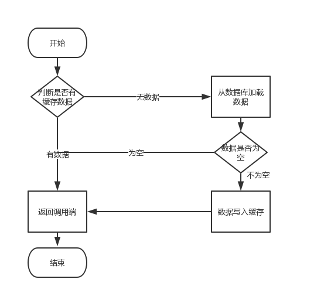

# 缓存双写一致性
项目引入缓存之后，读取缓存基本都是按照以下流程操作的，


但是在更新缓存时，我们是先淘汰缓存，再更新数据库。还是先更新数据库，再淘汰缓存。亦或是更新数据库，再更新缓存呢？

## 缓存更新策略
1. 先更新数据库，再更新缓存
2. 先删除缓存，再更新数据库
3. 先更新数据库，再删除缓存

接下来谈谈各自优缺点
## 先更新数据库，再更新缓存
这种策略应该没人使用的，原因有以下几点
1. 并发脏数据
   
   比如同时有两个请求A和B对数据进行了更新操作，由于网络原因，可能存在以下情况
   1. 请求A更新了数据库
   2. 请求B更新了数据库
   3. 请求B更新了缓存
   4. 请求A更新了缓存
   
   这就出现了A数据覆盖了B数据的情况，此时就产生了脏数据。
2. 资源浪费

   我们引入缓存主要是对热数据进行缓存，如果用户对冷数据进行更新，然后再更新缓存，这就导致了缓存资源的浪费。
3. 性能
   
   对于一些复杂的业务，写入数据库的值，不是直接写入缓存的，而是经过一系列计算才能得到缓存值，这样会使得请求时间加长，对系统性能有影响。
## 先删除缓存，再更新数据库
该策略会有一点问题
1. 并发脏数据
   
   比如同时有一个请求A进行更新操作，另一个请求B进行查询操作
   1. 请求A进行写操作，删除缓存
   2. 请求B查询发现缓存不存在
   3. 请求B去数据库查询得到旧值
   4. 请求B将旧值写入缓存
   5. 请求A将新值写入数据库
   
   上述情况就会导致不一致的情形出现。而且，如果不采用给缓存设置过期时间策略，该数据永远都是脏数据。
   
   这时可以采用**延时双删**策略：
   ```
   redis.delKey(key);
   db.updateData(data);
   // 具体的休眠时间根据项目读请求的耗时决定
   Thread.sleep(1000);
   redis.delKey(key);
   ```
   先删除缓存，再更新数据库，休眠一秒，再淘汰缓存。这样可以删除1s内的缓存脏数据。
   
   **如果你用了mysql的读写分离架构怎么办？**
   在这种情况下，造成数据不一致的原因如下，还是两个请求，一个请求A进行更新操作，另一个请求B进行查询操作
   1. 请求A进行写操作，删除缓存
   2. 请求A将数据写入数据库了，
   3. 请求B查询缓存发现，缓存没有值
   4. 请求B去从库查询，这时，还没有完成主从同步，因此查询到的是旧值
   5. 请求B将旧值写入缓存
   6. 数据库完成主从同步，从库变为新值
   
   还是使用双删延时策略。只是，睡眠时间修改为在主从同步的延时时间基础上，加几百ms。
   
   **这种方案降低吞吐量**
   起一个异步线程进行第二次删除操作。
   
   **第二次删除操作失败**
   这会再次引发缓存和数据库不一致的问题。继续往下看
## 先更新数据库，再删除缓存
最经典的缓存+数据库读写的模式，就是 Cache Aside Pattern。
* 失效：应用程序先从cache取数据，没有得到，则从数据库中取数据，成功后，放到缓存中
* 命中：应用程序从cache中取数据，取到后返回
* 更新：先把数据存到数据库中，成功后，再让缓存失效

这种方案也存在并发问题，比如一个请求A做查询操作，一个请求B做更新操作
1. 缓存刚好失效
2. 请求A查询数据库，得一个旧值
3. 请求B将新值写入数据库
4. 请求B删除缓存
5. 请求A将查到的旧值写入缓存

其实这种情况很难出现，就是第三步比第二步耗时短，写库比读库慢~

如果要解决的话，给缓存设置有效时间（缓存有效时间为随机值减少发生缓存雪崩的可能性）是一种方法，
或者上文提到的异步延时删除策略，保证读请求完成之后，再进行删除操作。

但是回到上个问题，删除缓存失败怎么办？

提供一个重试机制。

1. 消息队列
   
   如下图所示，
   
   
   
   流程如下，
   1. 更新数据库数据
   2. 缓存因为种种问题删除失败
   3. 将需要删除的key发送至消息队列
   4. 自己消费消息，获得需要删除的key
   5. 继续重试删除操作，直到成功
   
   然而，该方案有一个缺点，对业务线代码造成大量的侵入。
2. binlog
    
   启动一个订阅程序去订阅数据库的binlog，获得需要操作的数据。在应用程序中，另起一段程序，获得这个订阅程序传来的信息，进行删除缓存操作。
   
   
   
   流程如下，
   1. 更新数据库数据
   2. 数据库会将操作信息写入binlog日志当中
   3. 订阅程序提取出所需要的数据以及key
   4. 另起一段非业务代码，获得该信息
   5. 尝试删除缓存操作，发现删除失败
   6. 将这些信息发送至消息队列
   7. 重新从消息队列中获得该数据，重试操作
   
   在mysql中有现成的中间件叫canal，可以完成订阅binlog日志的功能
   
转载[http://www.cnblogs.com/yanglang/p/9098661.html](http://www.cnblogs.com/yanglang/p/9098661.html)