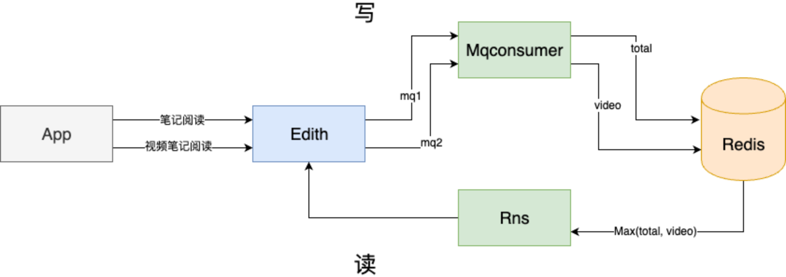
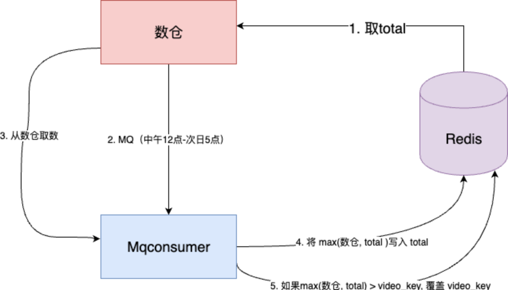
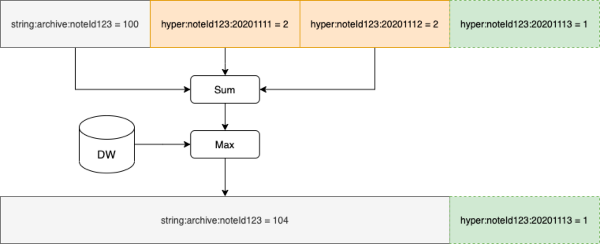
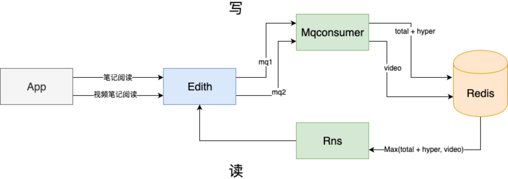
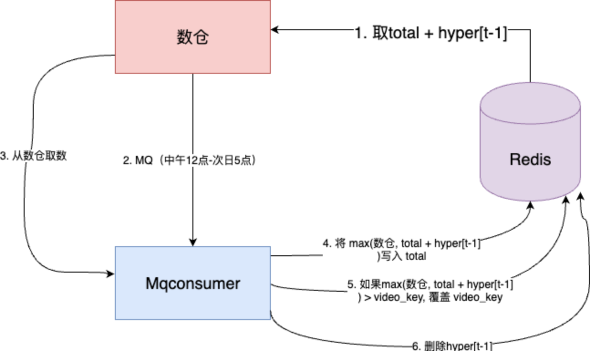
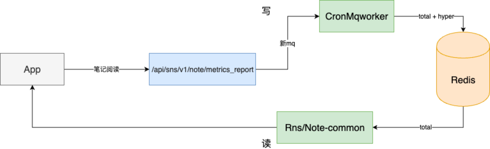
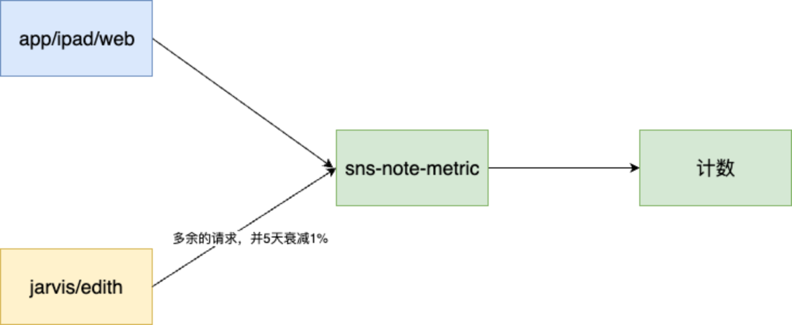
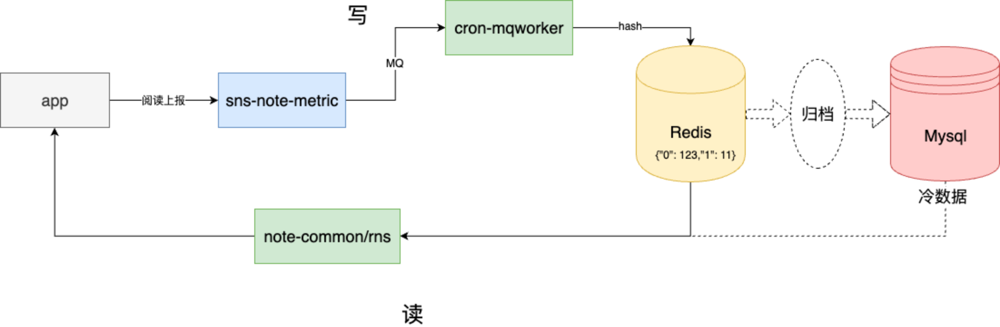

# 小眼睛的前世今生
本文旨在梳理小眼睛业务的发展历程。

## 1.0
笔记的阅读数（以下简称total）在1000以内采用PV方式，1000以上采用UV（每日）。
对于视频笔记会额外采用PV方式计算另一个数（以下简称video）。
个人页小眼睛的展示逻辑：取出max(total, video)，然后经过一个mock公式计算出美化阅读数。
除此之外，需要一个定时任务，每天扫描全量笔记，将数据和数仓（来自客户端打点）做对比，取最大值。

1.0版本，针对UV计数，使用了redis的有序集合。
在线链路

离线任务

风险
1. 使用集合提供去重能力，过于消耗redis资源
2. 定时任务扫描全量笔记，但是有很多笔记当天是没有被阅读。随着业务的发展，耗时将越来越大
3. total/video 都未设置过期时间，且是唯一的数据源。长远来看，redis存储也会慢慢耗尽
4. 离线链路中问题比较多，抛开技术层面。数仓取了total用于创服，但是个人页小眼睛是基于max(total, video)，并且两边各自维护了mock逻辑，
最终导致c端和b端数据长期无法对齐

## 2.0
针对1.0版本的风险1、2，使用以下手段来优化
1. 引入hyperloglog（以下简称hyper），代替集合，提供去重能力。虽然有一定的误差率，但是节省大量的redis存储
2. 将当天被阅读的笔记加入到set里，定时任务扫描这个set，大大提升了定时任务的效率
hyper可用于存储当天的增量阅读数，定时任务负责归档hyper[t-1]，实时查询时笔记阅读数的取值是 total + hyper[t]

在线链路

离线任务

这个版本是技术上的重构，在很大程度上解决了redis消耗过多的问题

## 3.0
产品提出了需求：笔记阅读数取消1000的门槛，全部采用UV（每日）。并且淘汰掉PV计数的视频笔记。
同时技术侧想升级后端的架构，主要有几点：
1. 原本位于edith中的接口较多、混乱，收拢到一个新接口
2. 离线任务，改用更加可靠的调度（xxl-job），并且由社区将计算完成的美化阅读数推到数仓
当时的难点是淘汰掉PV计数的视频笔记，需要保证平滑迁移即用户看到的小眼睛不能降低。这里设计了一个任务：将max(total, video)刷进total
在线链路

离线任务
扫描redis里当天阅读数增长的笔记id集合，然后通过rpc获取最终阅读数，推给数仓
社区 => agant-smith => hive => 数仓

但是上线后暴露了几个重要的问题：
1. 客户端上报到新接口的逻辑在我们测试完、上线前写了bug，其中一端上报的请求少了1/3 -- 后续客户端发版修复
2. 采用UV计数后，导致阅读数的增长比原来慢，引起用户反弹
3. 刷历史数据时，将max(total, video)刷进total。因为数仓之前只取了total，导致有些用户的笔记增量观看数暴涨 -- 已经产生的数据无法修改，这个问题无解
所以立即回滚。

## 4.0
针对3.0的问题2，产品提出新的需求：每人每天对单篇笔记的阅读数最高为 10。
然后技术侧改造跟3.0一致：
1. 原本位于edith中的接口较多、混乱，收拢到一个新接口
2. 离线任务，改用更加可靠的调度（xxl-job），并且由社区将计算完成的阅读数推到数仓，
3. 刷历史数据，淘汰video，将max(total, video)刷进total

这次上线之后，暴露了一个未曾预料的问题，现象是从大盘看，阅读数的增长大概降低30%。

为了排查问题，我们分别在新老链路采样1%的阅读流水并持久化到hive里面，分析这些数据。

最终总结原因是：metrics_report接口的请求量是符合产品逻辑的， 但是位于edith中的一批老接口有多余的请求（大概多了30%）。
除了后端自身的原因，也找了不同的客户端团队改造，识别"多余的请求"的来源。

解决方案是：将edith中多余的请求额外转发到metrics_report接口，并且每5天衰减1%。

改造完成后，新接口的请求量和老接口终于对齐，可以保证平滑迁移。

于是我开始刷历史数据，却遇到redis资源不够的问题。
虽然3.0时评估了redis资源，刷历史数据是够用的。但是经过了三个多月，线上笔记的数量又增加了几个亿，导致redis资源不够用。

## 5.0（进行中）
需要对目前的存储做优化，在不需要额外redis资源的前提下，完成上线
1. 后面需求作者贡献的阅读数和他人贡献的阅读数分开存储，redis 用 hash 代替 string
2. redis 不适合持久化存储，可以将冷数据归档到 mysql（TODO），mysql 可提供冷数据的查询

## 教训
1. 线上的功能不一定就是正确、符合产品逻辑的
2. 对于周期比较长的需求，真正上线前，需要重新评估资源
