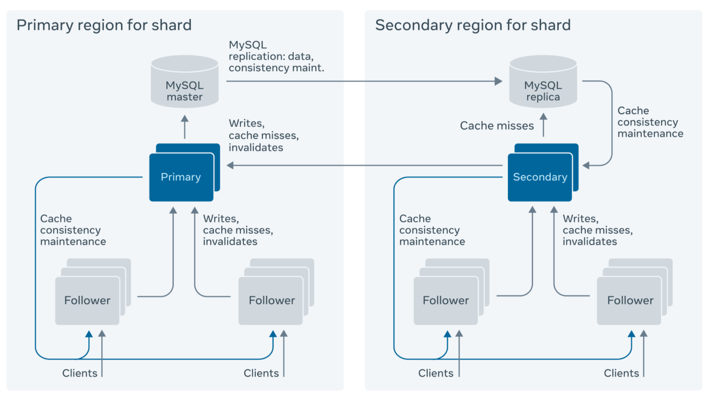
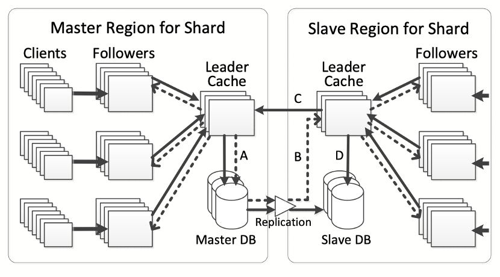
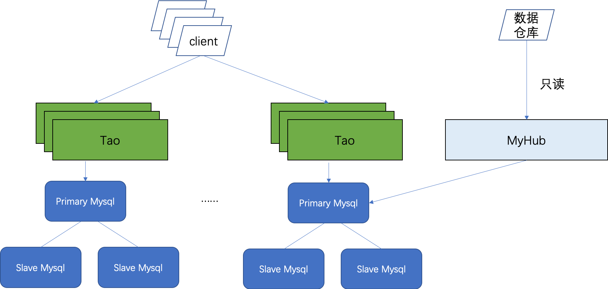
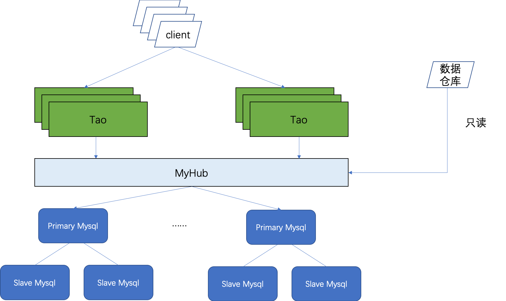

# 背景
TAO是FaceBook的一款分布式数据库。它是一个采用数据“最终一致性”的跨数据中心分布式图数据库，由分布在多个数据中心的数千台服务器构成。提供了单跳大压力下的读查询高性能。

它产生的背景如下：

1. Facebook的社交网络服务的数据模型是基于对象和对象之间的关联来构建的。数据主要表现为对象和关联两类，在这种应用模型下，各种离散的数据之间都有众多的关联关系，难以简单的分类处理，最终的应用展现也千变万化，因此众多的工作不是在更新数据时完成，而只能在查询时再进行处理，所以是一个读为主的过程，读压力非常大。

2. 从一开始，所有的数据都存在运维成熟的MySql里。但是随着用户量的增长， Mysql已经无法满足高峰的读压力。Mysql的内存cache是innodb buffer算法，以block cache来实现的，不能高效满足图的查询语义（查询一个点的所有边）。

3. FaceBook在外面使用了MemCached来存放一个点发出的多条边的关系。但MemCache是基于key，value的语义，它不支持任何图操作，不支持自动缓存填充，不保证分布式缓存一致性。工程师需要写非常复杂的逻辑来存取数据和维护MemCache和数据库的一致性，增加了复杂性和系统设计。

基于上面的这些问题，FaceBook推出了TAO。TAO封装了一跳的查询语义，不需要再直接和MySQL打交道。

Tao解决的问题：

1. 业务赋能
    1. 封装了图数据库一跳的查询和存储，业务接口更清晰更容易使用。比如社交关系的查询。
    2. 性能提升。对读作大量的优化，热数据都在内存里，可以极大的提升读的性能。支持业务的快速扩张。
2. 成本节省:
   1. RedTAO能替换Redis+Mysql的方案，减少Redis和MySql的副本数目，降低成本
3. 高可用:
    1. 避免了对数据库的直接查询，防止业务服务不规范的数据库查询拖垮数据库性能
    2. 对业务服务的访问能够限流，保护MySQL不会打爆
    3. 可以水平扩容解决读热点问题。
    4. 增加了容错，即使MySQL故障，Tao也可以对外提供服务。TAO曾经帮助Facebook避免过大规模事故。某次某粗心数据库管理员（DBA）不小心把某个数据中心的所有MySQL服务器全部关闭，TAO系统利用自身的本地缓存和其可靠的数据中心无缝自动切换逻辑让用户没有任何觉察。充分说明底层MySQL故障或者认为误操作，Tao能够对外提供读服务。

论文地址：https://www.usenix.org/system/files/conference/atc13/atc13-bronson.pdf

# RedTAO 的设计
## 目标
参考贴近Facebook tao的论文，将partition内的节点分为Leader和Follower两种角色。

新版本RedTao目标：

1. 面对大规模数据仍然高效的图(graph)存储和查询（一跳）
2. 优化读操作
    1. 降低读操作的时长
    2. 提高读操作的可用性(最终一致性)
3. 及时完成写操作 (先写再读)
4. 能够限流，保护MySQL不会打爆
5. 支持水平扩容解决读热点问题
6. 增加集群的容错，即使MySQL短时间故障，Tao也能对外服务

## 架构
架构分为三层：
* MySQL数据库 → 持久性（durability）
* Leader缓存 → 协调每个对象的写操作
* Follower缓存 → 用来读而不是用来写。转移所有的写操作到leader缓存。

整体架构上如论文

和Mysql一样，支持跨区部署。但写入都只能在master leader。

Cache的总容量大小用LRU或者TTL淘汰来控制。

## 数据分布
数据分片（Sharding）存储。对象数据按照对象的ID分片，而关系数据按照其起始对象的ID分片。所以关系（id1, atype, id2）和对象id1属于同一个分片。除了对象和关系之外，还有关系数量（Association Count）数据。关系数量（id1, atype）也按照id1分片。

Tao Client根据请求获取一个分片。一个分片内可能有多个Follower，Tao Client按照一致性策略（是否支持read-after-write consistency）选择一个固定的Follower或者按照LoaderBalance选择一个。

每个Shard集群构成一个一致性哈希环。TAO中的任何一个缓存集群可以处理TAO API所支持的所有操作。

Tao将数据发往底层的Myhub。Myhub也用同样的规则将请求映射到一个MySQL实例的表格（Table）之中。关系数据表格在（id1, atype, time）上可以创建有索引以高效地满足查询请求。

缺省情况下，当创建一个新的对象的时候，对象ID是随机分配的，所以该对象所属的数据分片也是随机的。也允许用户在创建对象的时候指定新对象所属的分片，以达到减少通信开销和避免数据热点等问题。

## 支持的API
TAO支持的关系访问API如下：

1. 添加关系：bool addAssoc(1:i32 assocType,2:i64 fromId,3:i64 toId,4:string data);
2. 删除关系：bool deleteAssoc(1:i32 assocType,2:i64 fromId,3:i64 toId);
3. 跟新关系时间：bool refreshUpdateTime(1:i32 assocType,2:i64 fromId,3:i64 toId);
4. 判断是否有关系：bool isAssoc(1:i32 assocType,2:i64 fromId,3:i64 toId);
5. 获取 Assoc id：i64 getAssoc(1:i32 assocType,2:i64 fromId,3:i64 toId);
6. 查询 toId 的集合：list<i64> listAssoc(1:i32 assocType,2:i64 fromId,3:i32 offset,4:i32 limit);
7. 通过rank字段进行排序：list<i64> listAssocByRank(1:i32 assocType,2:i64 fromId,3:i32 rank,4:i32 offset,5:i32 limit);
8. 获取关系 data 数据：string getAssocData(1:i32 assocType,2:i64 fromId,3:i64 toId);
9. 按时间范围获取关系：list<i64> getAssocTimeRange(1:i32 assocType,2:i64 fromId,3:i64 high,4:i64 low, 5:i32 limit);
10. 批量获取关系：set<i64> filterAssoc(11:i32 assocType,2:i64 fromId,3:list<i64> toIds);
11. 获取关系数量：i32 getAssocCount(1:i32 assocType,2:i64 fromId);
12. 失效key：bool invalid(1:i32 assocType,2:i64 fromId);
13. 批量获取关系的count：list<AssocCount> multiGetCount(1:i32 assocType,2:list<i64> fromIds);
14. 同一个（id1, atype）的所有关系按照时间进行排序（近的靠前）：assoc_get(id1, atype, id2[set], optional time range
    
## 数据一致性的设计
1. 一个写操作一般包含一个IN边和一个OUT边。这两个边有可能落在两个不同的Shard上。如果只写成功一个，写另外一个失败，这种需要一个异步工作队列去消除。目前这个逻辑不放在Tao里。由业务来保证。
2. 增加一个version号来表明哪个message更新。比如，follower收到一个落后的请求，那么应该需要识别是否要更新本地cache（可能本地cache的那个更新一些）。
3. leader需要将不同的follower发送给它的请求串行执行。避免多个follower同时更新一个key。
4. 因为所有的读库写库操作都通过leader，leader控制速率避免惊群效应。
5. read-after-write一致性：Follower在等写完成之后，同步更新cache，这样可以保证read-after-write一致性。另外，如果要支持read-after-write一致性，那么需要将client绑定在一个Tao上。client一旦选择一个Tao，在Tao调整个数之前，或者故障之前，都不再切换。
6. 写不能让Follower也做。写只有唯一的Leader能写，保证数据一致。
7. 更新完边之后，边的count数目如果写mysql失败，临时方案为打印一条错误日志，触发运维报警，人工进行修复。
8. Leader更新了cache的话，发送maintain message给follower去删除cache，并且follower会马上从leader拉取最新数据。

Slave区的follower read miss和write都导到local leader，local leader读本地DB。但将写转给master leader。如果local leader收到写成功，马上会更新cache，即使底层的DB也许还没有来得及更新到最新的数据。

Tao的这种跨区访问方案，有潜在的风险是slave DB也许会返回过期数据。如果业务有强要求的话，那么需要另外一种解决方案。

## 热点问题以及超级点的问题
client按照From ID将请求hash到某个partition之后，选择partition内哪个Tao做处理，有几种策略。

如果需要支持read-after-write一致性，那么client的连接按规则hash之后将绑定在一个Tao上不发生变化。这时，当出现Partition内的Tao上负载不均或者某个Tao热点的时候，可以通过clone的Tao的数目来解决。

如果不需要支持，那么client的请求通过load balance或者round robin发送给该partition内的Tao，但此时有可能follower A上写入了数据，但读发送给了follower B，而B上的数据没有同步，就会读到了老数据。

Tao内将统计热点数据，在返回client端的时候将统计值带上。超过一定阀值的话，client会将数据缓存一定时间。但这个时候可能是读到过期数据。这个可以根据场景来判断是否打开这个功能。

超级节点：一个节点的边很多，无法将它全部加载到内存中

1. 利用节点的边数目决定是否要查询数据库

2. 利用节点的创建时间，过滤掉edge小于这个节点创建时间的边，在剩下的边里加快id2的搜索。

## 故障场景的处理
数据库故障：依赖从数据库。

Follower节点故障：client上配置一个超时时间，如果出现连续的fail之后，则换成下一个Follower。但是，这种策略可能会导致read-after-write inconstency的问题。

Leader节点故障：
方案1: 利用zookeeper或者consul选主。paritition内的leader/follower获取分布式锁的方式，当leader故障后，其他follower订阅到消息并触发抢锁逻辑，抢到锁的人成为leader。这样保证leader的唯一性，不会有双主场景存在。partition的个数在16384，zookeeper或者consul对于这样的压力完全没问题。但锁的失效时间可能会有30秒，写请求最坏会被影响30s。zookeeper也提供高精度的分布式锁，但系统压力会比较大。另外zookeeper和consul这两个模块公司内部都没有人维护了。

方案2: 利用mysql选主。当Follower无法和leader通信的时候，Follower去更新mysql语句（force update原子操作），查询leader id的更新时间是否超期。如果超期就用原子操作改成自己，成功之后释放锁并切换到leader模式。Leader定期更新mysql的该行的expire时间。

方案3: 复用我们现有的Gossip协议, 这个协议我们已经非常熟悉, 在RedKV/Redis里一直使用.
倾向于选择方案3。

另外如果leader挂掉后，其他人通过watch锁发现并重新抢锁。但因为leader会持续将cache的更新推送给follower，如果follower没有来得及接受，那么leader会缓存这个消息。因此leader如果宕机的话，那么follower里的消息可能是老的消息了。新的leader起来后，需要invalidate follower cache上所有的内容。。

备注：节点故障论文的设计优先考虑了可用性。新版Tao设计在保证可用优先考虑了数据的一致性。

1. Follower节点故障：client配置两个Follower，一个挂了就发到另外一个。但是，可能会导致read-after-write inconsistency的问题
2. Leader节点故障：随机选一个Follower当leader（或者按一定的优先级）。如果Fail的leader重新恢复。。。前leader将不一致的数据invalidate同步到leader，此时follower会看到过期的数据。如果follower不可用，leader会存下来需要同步的数据。如果leader挂了，那么follower可能有一部分数据永远stale。因此，如果新的leader起来，需要将所有的follower都变成invalidate。

## 扩容缩容
FaceBook的tao和mysql shard是一一对应的关系。扩容可以通过Mysql数据库扩容来实现。并没有详细的细节。

新版的Tao扩容方案如下：

读热点问题的扩容比较简单。只需要启动tao之后，增加apoll里面的配置就可以了。

如果是Tao写能力达到瓶颈，需要扩容shard来提升leader节点的数量，有两个方案：
### 方案1

Tao和下面的MySql一一对应。但因为Tao不提供sql语句，因此数仓如果需要读取数据的话需要通过myhub。

如果需要扩容Shard个数，那么新建一个mysql+tao的分片。具体步骤如下：

1. 新建mysql+tao分片。
2. 等新建的mysql全部数据都拷贝完成之后，让所有的Tao停写并且获取最新的配置
3. 等到新建的mysql数据完全一致
4. 等client都获取到新的分片信息之后，再开启Tao的写入功能
5. 因为不能保证所有的client都及时的从apollo上更新完新配置，因此如果Tao接收到不属于自己分片的请求，则转发的对应的Tao分片集群上。
优点：Tao和Mysql一一对应。读少一跳。

缺点：Myhub和Tao并列，运维上要求Myhub只提供读取的功能。

### 方案2

当需要Tao的数据扩容的时候，建立新的一组Tao，将partition重新分配：

1. 新建一个空的tao分片（可以预热数据）
2. 更新apollo上的meta表
3. 让所有的Tao停写并且获取最新的配置
4. 等待client更新完成之后，开启tao的写入功能
5. 因为不能保证所有的client都及时的从apollo上更新完新配置，因此如果Tao接收到不属于自己分片的请求，则转发的对应的Tao分片集群上
优点：tao和mysql分开，上下层可以独立扩容。

缺点：写tao的时候数据多了一次转发。

本设计中综合考虑之后选择方案2.