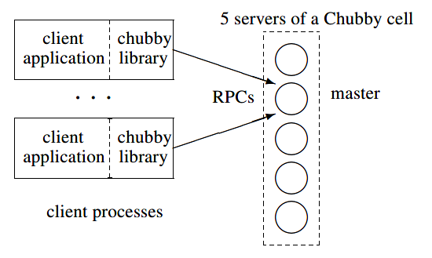

# The Chubby lock service for loosely-coupled distributed systems

## 摘要

我们描述了Chubby Lock服务的经验，该服务旨在为松耦合的分布式系统提供粗粒度锁以及可靠（尽管容量较小）存储。 Chubby提供的界面很像带有咨询锁的分布式文件系统，但是设计重点是可用性和可靠性，而不是高性能。 该服务的许多实例已使用了一年多，其中几个实例同时处理数万个客户端。 本文介绍了初始设计和预期用途，并将其与实际用途进行了比较，并说明了如何修改设计以适应差异。

## 1. Introduction

本文介绍了一种称为Chubby的锁定服务。 它旨在用于由高速网络连接的中等数量的小型机器组成的松耦合分布式系统中。 例如，一个Chubby实例（也称为Chubby单元）可以服务于通过1Gbit/s以太网连接的1万台4处理器机器。 尽管我们确实运行至少一个Chubby单元，其副本之间相距数千公里，但大多数Chubby单元都局限于一个数据中心或机房中。

锁服务的目的是允许其客户端同步其活动并就有关其环境的基本信息达成一致。 主要目标包括可靠性，对大量客户端的可用性以及易于理解的语义。 吞吐量和存储容量被认为是次要的。 Chubby的客户端界面类似于一个简单的文件系统，该界面执行整个文件的读取和写入操作，并具有咨询锁和各种事件通知（例如文件修改）的增强。

我们希望Chubby能够帮助开发人员处理其系统内的粗粒度同步，尤其是要解决从一组其他等效服务器中选拔领导者的问题。 例如，Google文件系统使用Chubby锁来指定GFS master，而Bigtable使用Chubby有以下几种方式：选举一个master，允许该master发现它控制的服务器，以及允许客户端找到master。 此外，GFS和Bigtable都将Chubby用作众所周知的可用位置来存储少量的元数据。 实际上，他们将Chubby用作其分布式数据结构的根。 一些服务使用锁在多个服务器之间对工作进行分区（粗略地划分）。

在部署Chubby之前，Google的大多数分布式系统都采用临时方法进行主选举(primary selection)（当可以无伤害地复制工作时），或者需要操作员干预（当必不可少时）。 在前一种情况下，Chubby节省了一些计算工作量。 在后一种情况下，它在不再需要人工干预故障的系统中实现了可用性的显着提高。

熟悉分布式计算的读者将认识到主选举是分布式共识问题的一个实例，并意识到我们需要使用异步通信的解决方案。 该术语描述了绝大多数实际网络（例如以太网或Internet）的行为，这些网络允许数据包丢失，延迟和重新排序。 （从业者通常应提防基于对环境做出更强假设的模型的协议。）异步共识由Paxos协议解决。 Oki和Liskov使用了相同的协议，其他人则指出了等效的概念。 确实，到目前为止，我们遇到的所有用于异步共识的工作协议都以Paxos为核心。 Paxos无需时序假设即可保持安全性，但必须引入时钟以确保活力。 这克服了Fischer等人的不可能结果。

建立Chubby是满足上述需求的一项工程工作，而不是研究。 我们没有应用新的算法或技术。 本文的目的是描述我们所做的事情和原因，而不是提倡它。 在以下各节中，我们将描述Chubby的设计和实现，以及它根据经验而发生的变化。 我们描述了Chubby的意外使用方式，以及被证明是错误的功能。 我们忽略了文献其他地方涵盖的细节，例如共识协议(consensus protocol)或RPC系统的细节。

## 2. Design

### 2.1. Rationale

可能有人认为我们应该建立一个包含Paxos的库，而不是访问集中式锁服务的库，甚至是一个高度可靠的库。 客户端Paxos库将不依赖于其他服务器（除了命名服务(name server)之外），并且将为程序员提供一个标准框架（假定他们的服务可以实现为状态机）。 实际上，我们提供了一个独立于Chubby的客户端库。

但是，锁服务比客户端库具有一些优势。首先，我们的开发人员有时不按照人们希望的方式计划高可用性。通常，他们的系统从原型开始就具有很少的负载和宽松的可用性保证。始终没有为共识协议使用特殊的代码结构。随着服务的成熟并赢得客户，可用性变得越来越重要。然后将复制和主选举添加到现有设计中。尽管可以使用提供分布式共识的库来完成此操作，但是锁服务器使维护现有程序结构和通信模式更加容易。例如，要选择一个然后写入现有文件服务器的master，只需向现有系统添加两个语句和一个RPC参数：一个将获取一个锁以成为master，并通过附加一个整数（该锁获取计数）写入RPC，并在文件服务器上添加一个if语句，以在获取计数低于当前值时拒绝写入（以防止延迟的数据包）。我们发现此技术比使现有服务器加入共识协议更容易，尤其是如果必须在过渡期间保持兼容性时，这种技术更容易。

其次，我们的许多主选举或在组件之间划分数据的服务都需要一种用于公布结果的机制。 这表明我们应该允许客户端存储和获取少量数据，即读取和写入小文件。 这可以通过命名服务来完成，但是我们的经验是锁服务本身非常适合此任务，这是因为这减少了客户端所依赖的服务器数量，并且因为协议的一致性特性是共享。 Chubby作为命名服务的成功很大程度上归功于它使用一致的客户端缓存，而不是基于时间的缓存。 特别是，我们发现开发人员非常感激不必选择缓存超时（例如DNS生存时间值），如果缓存生存时间选择不当，可能会导致DNS负载较高或客户端故障转移时间较长。

第三，我们的程序员更熟悉基于锁的界面。 Paxos的复制状态机和与排他锁关联的关键部分都可以为程序员提供顺序编程的错觉。 但是，许多程序员以前都曾遇到过锁，并认为他们知道会使用它们。 具有讽刺意味的是，这样的程序员通常是错误的，特别是当他们在分布式系统中使用锁时。 很少有人考虑独立计算机故障对具有异步通信的系统中的锁的影响。 尽管如此，对锁的表观熟悉度克服了说服程序员使用可靠的机制进行分布式决策的障碍。

最后，分布式共识算法使用仲裁来制定决策，因此它们使用多个副本来实现高可用性。例如，Chubby本身通常在每个单元中有五个副本，其中三个必须正在运行才能使该单元正常运行。相反，如果客户端系统使用锁服务，则即使是单个客户端也可以获取锁定并安全地进行进程。因此，锁定服务减少了可靠的客户端系统取得进步(make progress)所需的服务器数量。从广义上讲，可以将锁服务视为提供通用选民的一种方式，该选民允许客户端系统在少于其自身大多数成员的情况下正确地做出决策。可以想象以另一种方式解决最后一个问题：通过提供“共识服务”，使用许多服务器来提供Paxos协议中的“接受者”。就像锁服务一样，共识服务将允许客户即使只有一个活动的客户进程也可以安全地取得进步；类似的技术已经被用来减少拜占庭容错所需的状态机的数量。但是，假设没有将共识服务专门用于提供锁（将其减少为锁服务），则此方法不会解决上述任何其他问题。

这些论点提出了两个关键的设计决策：

1. 我们选择了锁定服务，而不是为了达成共识而使用库或服务。

2. 我们选择提供小文件，以允许elected primaries公布自己及其参数，而不是构建和维护第二项服务。

根据我们的预期用途和环境，可以做出一些决定：

1. 通过Chubby文件宣传其主要内容的服务可能具有数千个客户。 因此，我们必须允许数千个客户端观察此文件，最好不需要许多服务器。

2. 复制服务的客户端和副本可能希望知道primary更改时间，这表明事件通知机制将有助于避免轮询。

3. 即使客户端不需要定期轮询文件，许多人也会这样做。 这是支持许多开发人员的结果。 因此，文件的缓存是可取的。

4. 我们的开发人员对非直观(non-intuitive)的缓存语义感到困惑，因此我们更喜欢一致的缓存。

5. 为了避免财务损失和入狱时间，我们提供了安全机制，包括访问控制。

一种可能使某些读者感到惊讶的选择是，我们不希望锁的使用情况细化，因为锁可能只保留很短的时间（几秒钟或更短）。 相反，我们期望使用粗粒度。 例如，应用程序可能使用锁来选择一个primary，然后primary将在相当长的一段时间（可能是几小时或几天）内处理对数据的所有访问。 这两种使用方式提出了与锁服务器不同的要求。

粗粒度锁对锁服务器的负载要小得多。 特别是，锁获取率通常仅与客户端应用程序的交易率之间存在弱关系。 粗粒度锁很少被获取，因此临时锁服务器不可用不会延迟客户端。 另一方面，将锁从客户端转移到客户端可能需要昂贵的恢复过程，因此，您不希望锁服务器发生故障转移而导致锁丢失。 因此，粗粒度锁可以很好地克服锁服务器故障，很少有人担心这样做的开销，并且这种锁允许适度数量的可用性稍低的锁服务器为许多客户端提供足够的服务。

细粒度的锁得出不同的结论。 锁服务器即使短暂无法使用也可能导致许多客户端停止运行。 性能和随意添加新服务器的能力非常受关注，因为锁服务处的事务速率随客户端的总事务速率一起增长。 通过在锁服务器发生故障时不维护锁来减少锁的开销可能是有利的，而且由于锁持有的时间很短，因此每隔一段时间删除锁的时间代价并不严重。 （客户端必须准备好在网络分区期间丢失锁，因此在锁服务器故障转移上丢失锁不会引入新的恢复路径。）

Chubby旨在仅提供粗粒度锁定。 幸运的是，对于客户来说，实现针对其应用程序量身定制的自己的细粒度锁很简单。 应用程序可能会将其锁划分为多个组，并使用Chubby的粗粒度锁将这些锁组分配给特定于应用程序的锁服务器。 维护这些细粒度锁定所需的状态很少。 服务器只需要保留一个很少更新的非易失性、单调递增的获取计数器。 客户可以在解锁时了解丢失的锁，并且如果使用简单的固定长度租约，则该协议可以简单高效。 该方案最重要的好处是，我们的客户端开发人员将负责提供支持其负载所需的服务器，而不必为自己实现共识而烦恼。

### 2.2. System structure

Chubby有两个通过RPC进行通信的主要组件：服务器和客户端应用程序链接到的库。 请参见下图。Chubby客户端与服务器之间的所有通信均由客户端库进行传导。 第3.1节讨论了可选的第三个组件，即代理服务器。

Chubby单元由一小部分服务器（通常为五台）组成，这些服务器称为副本服务器，它们的放置位置是为了减少相关故障的可能性（例如，在不同的机架中）。 副本使用分布式共识协议选举master。 master必须从大多数副本中获得投票权，并保证这些副本不会在几秒钟的间隔内选出其他master，这称为master lease。 如果master继续赢得多数表决，则副本会定期续签master lease。

副本维护一个简单数据库的副本，但是只有master会启动该数据库的读取和写入。 所有其他副本仅复制使用共识协议发送的来自master的更新。

客户端通过向DNS中列出的副本发送master位置请求来找到master。 非master通过返回master的标识来响应此类请求。 客户端找到master后，客户端会将所有请求定向到该master，直到它停止响应，或者直到它指示它不再是master为止。 写入请求通过共识协议传播到所有副本。 当写入达到单元中大多数副本时，将确认此类请求。 读取请求仅由master满足； 如果master lease尚未到期，则这是安全的，因为可能没有其他master lease。 如果一个master失败，则其他副本在其master租约到期时将运行选举协议；否则，其他副本将运行选举协议。 通常会在几秒钟内选出一位新master。 例如，最近两次选举分别为6s和4s，但我们看到的价值高达30s（第4.1节）。

如果副本失败并且无法恢复数小时，则简单的替换系统将从空闲池中选择一台新计算机，然后在启动锁服务。 然后，它更新DNS表，将失败副本的IP地址替换为新副本的IP地址。 当前的master会定期轮询DNS，并最终注意到更改。 然后，它会更新该单元数据库中该单元的成员列表； 通过普通复制协议，该列表在所有成员之间保持一致。 同时，新副本从文件服务器上存储的备份和活动副本的更新的组合中获取数据库的最新副本。 一旦新副本处理了当前master等待提交的请求，副本就可以在新master的选举中投票。

### 2.3. Files, directories, and handles

Chubby导出类似于UNIX的文件系统接口，但比UNIX简单。 它以通常的方式由严格的文件和目录树组成，名称组件之间用斜杠分隔。 典型名称是：

`/ls/foo/wombat/pouch`

ls前缀是所有Chubby名称所共有的，代表锁服务。 第二个组件（foo）是Chubby单元的名称； 通过DNS查找将其解析为一台或多台Chubby服务器。 特殊单元格名称local表示应使用客户的本地Chubby单元格； 这通常是同一栋大楼(building)中的一栋，因此最有可能进入。 名称的其余部分，/wombat/pouch，在命名的Chubby单元格中解释。 同样在UNIX之后，每个目录都包含一个子文件和目录的列表，而每个文件都包含一系列未解释的字节。

由于Chubby的命名结构类似于文件系统，因此我们能够通过自己的专用API以及其他文件系统（例如Google文件系统）使用的接口将其提供给应用程序使用。 这大大减少了编写基本浏览和名称空间操纵工具所需的工作，并减少了对Chubby临时用户的学习成本。

该设计与UNIX的不同之处在于易于分配。 为了允许不同的Chubby主服务器为不同目录中的文件提供服务，我们不公开将文件从一个目录移动到另一个目录的操作，不维护目录修改时间，并且避免使用路径相关的权限语义（即， 对文件的访问由文件本身的权限控制，而不是由通往文件的路径上的目录所控制。 为了更轻松地缓存文件元数据，系统不会显示最后访问时间。

命名空间仅包含文件和目录，统称为节点（node）。 每个这样的节点在其单元格内只有一个名称， 没有符号（symbolic）或硬链接（hard link）。

节点可以是永久性的，也可以是短暂的。 可以显式删除任何节点，但是如果没有客户端打开临时节点，临时节点也将被删除（对于目录，它们是空的）。 临时文件用作临时文件，并向其他人指示客户端还活着。 任何节点都可以充当咨询读写锁； 这些锁在第2.4节中有更详细的描述。

每个节点具有各种元数据，包括用于控制节点的读取，写入和更改ACL名称的三个访问控制列表（ACL）名称。 除非被覆盖，否则节点将在创建时继承其父目录的ACL名称。 ACL本身就是位于ACL目录中的文件，该目录是单元本地名称空间的众所周知的部分。 这些ACL文件由主体名称的简单列表组成。 因此，如果文件F的写入ACL名称为foo，并且ACL目录中包含一个文件录，其中包含一个入口栏，则允许用户栏写入F。通过RPC系统中内置的机制对用户进行身份验证。 由于Chubby的ACL只是文件，因此希望使用类似访问控制机制的其他服务会自动使用它们。

每个节点的元数据包括四个单调递增的64位数字，这些数字允许客户端轻松检测到更改：

1. 实例编号， 大于任何具有相同名称的先前节点的实例号。

2. 内容generation number （仅文件）， 写入文件内容时会增加。

3. 锁generation number， 当节点的锁从空闲状态转换为持有状态时，会增加。

4. ACL generation number， 写入节点的ACL名称时，会增加。

Chubby还公开了64位文件内容校验和，以便客户端可以判断文件是否不同。

客户端打开节点以获得类似于UNIX文件描述符的句柄（Handle）。 句柄包括：

1. 检查数字，以防止客户端创建或猜测句柄，因此仅在创建句柄时才需要执行完全访问控制检查（与UNIX比较，后者在打开时检查其权限位，但在每次读/写时均不检查，因为文件描述符不能伪造）。

2. 一个序号，它允许master告诉句柄是由它还是由先前的master生成的。

3. 在开放时间提供的模式信息，以便在将旧句柄提供给新重启的master时允许master重新创建其状态。

### 2.4. Locks and sequencers

每个Chubby文件和目录都可以充当读写锁：一个客户端句柄可以以独占（写）模式持有该锁，或者任意数量的客户端句柄可以以共享（读）模式持有该锁。 像大多数程序员都知道的互斥锁一样，锁是建议性的。 也就是说，它们仅与获取同一锁的其他尝试冲突：持有称为F的锁既不需要访问文件F，也可以防止其他客户端这样做。 我们拒绝了强制性锁定，这使不持有锁定的客户端无法访问锁定的对象：

* Chubby锁通常保护其他服务实现的资源，而不仅仅是与锁相关联的文件。 要以有意义的方式强制执行强制锁定，将需要我们对这些服务进行更广泛的修改。
* 我们不希望强迫用户在出于调试或管理目的而需要访问锁定文件时关闭应用程序。 在复杂的系统中，很难使用大多数个人计算机上使用的方法，在该方法中，管理软件可以简单地通过指示用户关闭其应用程序或重新引导来打破强制性锁定。
* 我们的开发人员通过编写断言（例如“持有X锁”）以传统方式执行错误检查，因此他们从强制检查中受益甚少。 当没有持有锁时，杂乱无章或恶意的进程很可能会破坏数据，因此我们发现强制锁提供的额外防护措施意义不大。

在Chubby中，以任何一种方式获得锁都需要写的权限，以便没有权限的读者不能阻止写者的动作。

锁在分布式系统中很复杂，因为通信通常是不确定的，并且进程可能会独立失败。 因此，持有锁L的进程可能会发出请求R，但随后失败。 另一个进程可能会获取L并在R到达其目的地之前执行一些操作。 如果R稍后到达，则可能在没有L保护的情况下对其采取行动，并且可能会对不一致的数据采取措施。 乱序接收消息的问题已经得到很好的研究。 解决方案包括虚拟时间和虚拟同步，它通过确保按照与每个参与者的观察一致的顺序处理消息来避免此问题。

将序列号（sequence）引入到现有复杂系统中的所有交互中是昂贵的。取而代之的是，Chubby提供了一种方法，通过该方法可以将序列号仅引入那些使用锁的交互中。在任何时候，锁持有者都可以请求序列号，即不透明的字节串，用于描述获取后立即锁的状态。它包含锁的名称，获取锁的方式（独占或共享）以及锁的生成编号。如果客户端希望该操作受锁保护，则将序列号生成器传递给服务器（例如文件服务器）。预期接收方服务器测试序列号生成器是否仍然有效并具有适当的模式；如果不是，则应拒绝该请求。可以根据服务器的Chubby缓存来检查序列号生成器的有效性，或者如果服务器不希望与Chubby保持会话，则可以根据服务器观察到的最新序列号生成器来检查序列号生成器的有效性。序列号机制只需要在受影响的消息中添加字符串，就可以很容易地向我们的开发人员解释。

尽管我们发现序列号生成器易于使用，但重要的协议却发展缓慢。 因此，Chubby提供了一种不完善但更简单的机制，以减少对不支持序列号生成器的服务器的请求被延迟或重新排序的风险。 如果客户端以正常方式释放锁，则其他客户端可以立即获得该锁，就像人们期望的那样。 但是，如果由于持有人发生故障或无法访问而使锁释放，则锁服务器将阻止其他客户端在称为锁延迟的时间段内索取该锁。 客户可以指定任何锁定延迟，最多延迟一分钟，目前为一分钟； 此限制可防止有故障的客户端使锁定（以及某些资源）在任意长时间内不可用。 虽然不完美，但锁定延迟可以保护未修改的服务器和客户端免受消息延迟和重新启动引起的日常问题。

### 2.5. Events

Chubby客户端在创建句柄时可能会订阅一系列事件。 这些事件通过来自Chubby库的向上调用异步传递给客户端。 事件包括：

* 文件内容已修改-通常用于监视通过文件发布的服务的位置。

* 添加，删除或修改的子节点，用于实现镜像（第2.12节）。 （除了允许发现新文件之外，返回子节点的事件还可以监视临时文件，而不会影响它们的引用计数。）

* Chubby master进行了故障转移-警告客户端其他事件可能已经丢失，因此必须重新扫描数据。

* 获得的锁-可用于确定何时选择primary。

* 来自另一个客户端的冲突锁请求-允许缓存锁。

事件在相应的动作发生后传递。 因此，如果通知客户端文件内容已更改，则可以保证在随后读取文件时看到新数据（或更新的数据）。

最后两个事件很少使用，事件发生后可以省略。 例如，在选择primary之后，客户端通常需要与新的primary进行通信，而不是简单地知道一个primary存在。 因此，它们等待文件修改事件，该事件指示新的primary已将其地址写入文件中。 从理论上讲，冲突锁事件允许客户端使用Chubby锁来维护其他服务器上的数据，以保持缓存的一致性。 锁请求冲突的通知将告诉客户端完成使用与锁相关联的数据：它将完成挂起的操作，刷新对归属位置的修改，丢弃缓存的数据并释放。 到目前为止，还没有人采用这种使用方式。

### 2.6. API

