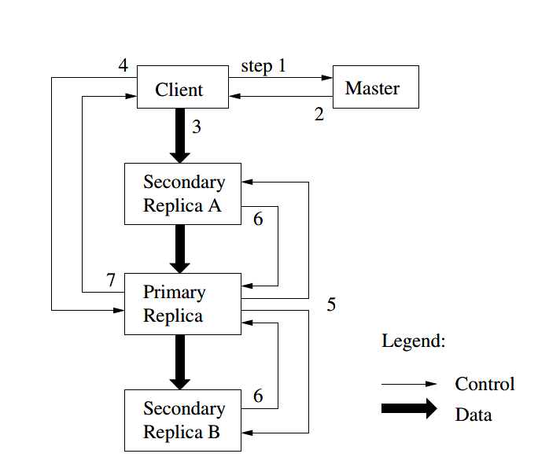

# The Google File System

**关键字**：容错，扩展性，数据存储，集群存储

## 1. 介绍

我们已经设计并实现了Google File System(GFS)来应对Google在数据处理方面快速增长的需求。GFS有着和以前的分布式文件系统共同的目标，比如性能，扩展性，可靠性和可用性。然而，其设计一直由对我们当前和预期的应用程序负载和技术氛围的观察所驱动，这也反映出与一些早期文件系统设计理念有差异。

**第一，组件的失败并非是异常，而是正常的**。这个文件系统由成百上千个廉价的商品部件拼装的存储机器组成，并且被相当数量的客户端机器访问。组件的数量和质量实际上保证了某些组件在任何给定的时间都无法运行，并且某些组件将无法从当前的失败中恢复过来。我们已经见过由下列因素造成的问题：程序bug，操作系统bug，人类犯错，以及磁盘，内存，连接器，网络，电源的失败。所以，不间断的监控，错误侦测，错误容忍，以及自动恢复这些功能必定要集成到系统中。

**第二，按照传统标准文件是巨大的**。几GB的文件很常见。每个文件通常包含很多应用程序对象，比如web文档。当我们定期处理包含数十亿对象的许多TBs的快速增长的数据集，即使文件系统支持数十亿约KB大小的文件，也难以管理。总之，必须重新考虑设计理念以及一些参数，比如I/O操作和块大小。

**第三，大部分文件的修改是追加新数据而不是覆写原数据**。实际中，文件的随机写是不存在的。文件被写入后只用来读，而且经常是顺序读。各种数据都拥有这些特征。一些可能会组成大型存储库，被数据分析程序扫描。一些可能是应用程序持续生成的数据流。一些可能是归档数据。一些可能是一台机器上产生的中间结果，而在另一台机器上同时或稍后产生。鉴于对大型文件的这种访问方式，追加写成为性能优化和原子性保证的重点，然而把数据块存储在客户端则失去了吸引力。

**第四，共同设计应用程序和文件系统API增加灵活性使得整个系统受益**。例如，我们放宽了GFS的一致性模型，以极大地简化文件系统，并且不会给应用程序带来繁重的负担。我们也介绍了一个原子性的并发操作以至于多个客户端可以同时对一个文件追加而不需要额外的同步。

## 2. 设计概述

### 2.1. 假设

* 该系统由许多经常发生故障的廉价商品组件组成。它必须不间断地自我监控和检测，并从组件故障中迅速恢复。

* 系统存储少量的大文件。我们预计有几百万个文件，每个通常100MB或者更大。几GB的文件很常见，需要有效地管理。小文件必须支持，但是我们不必对其优化。

* 工作负载主要源于两种读：大量流读取和小量随机读。对于大量流读取，每次通常读取几百KBs，1MB或更多。同一个客户端的后续操作经常读取文件的连续区域。一个小量随机读通常在随机位置读取几KBs。注重性能的应用程序经常对小读取进行批处理和排序，以稳定地通过文件而不是来回移动。

* 高持续带宽比低延迟更重要，我们的大多数目标应用程序都很重视高速处理大量数据，而很少会对单次读写的响应时间有严格要求。

### 2.2. 接口

GFS提供熟悉的文件系统接口，尽管它没有实现一个标准API比如POSIX。文件在目录中按层次结构组织，并由路径名标识。 我们支持创建，删除，打开，关闭，读取和写入文件的常规操作。

除此之外，GSF有快照和记录追加操作。快照低成本地创建文件或目录树的副本。记录追加允许多个客户端同时将数据追加到同一个文件中，同时保证每个客户端的追加的原子性。这对于实现多路合并结果和生产者消费者队列很有用，许多客户端可以在不加锁的情况下追加。

### 2.3. 架构

一个GFS集群由一个master和多个chunkservers组成，并且被多个客户端访问。如下图，这些设备通常都是运行用户级服务器进程的商用Linux机器。同一个机器上很容易运行一个chunkserver和一个客户端，只要机器资源允许，并且可以接受运行不稳定的应用程序引起较低的可靠性。

文件被划分到固定大小的chunk。每个chunk被创建时，master会分配一个不可变、全局唯一的64位chunk handle，并以此标识。Chunkservers以Linux文件的形式存储chunks在本地磁盘，并读写由chunk handle和字节范围指定的chunk数据。对于可靠性，每个chunk在多个chunkservers上被复制。默认情况下，我们存储三个副本，尽管用户可以为文件名称空间的不同区域指定不同的复制级别。

Master维护所有的文件系统元数据，包括命名空间，访问控制信息，文件到chunk的映射，和chunks的当前位置。它还控制整个系统的活动，例如chunk的租赁管理，孤立块的垃圾回收以及chunk在chunkservers的迁移。Master周期性地以心跳消息与每个chunkservers通信，下达指令和收集状态。

GFS客户端实现了文件系统API，并与master和chunkservers通信以代表应用程序读写数据。客户端与服务器交互来进行元数据操作，但是所有承载数据的通信都直接发送给chunkservers。

客户端和chunkservers都不缓存文件数据。客户端缓存几乎没有什么好处，因为大多数应用程序会处理巨大的文件，或者工作集太大而无法缓存。 没有它们，就消除了缓存一致性问题，从而简化了客户端和整个系统。 （但是，客户端确实缓存元数据。）块服务器不需要缓存文件数据，因为大块存储为本地文件，因此Linux的缓冲区缓存已经将经常访问的数据保存在内存中。

### 2.4. Single Master

拥有一个master极大地简化了我们的设计，并使master可以使用全局信息来制定复杂的chunk放置和复制决策。然而， 我们必须最小化它在读写中的参与，以免它成为瓶颈。客户端永远不会通过master读写文件数据。取而代之的是，客户端询问主服务器应该联系哪些块服务器。 它在有限的时间内缓存此信息，并直接与块服务器交互以进行许多后续操作。

我们参考上图简单解释一下读操作的交互，首先，使用固定的chunk大小，客户端将应用程序指定的文件名和字节偏移量转换为文件内的chunk索引。 然后，它向master发送一个包含文件名和chunk索引的请求。 master响应相应的chunk handle和副本的位置。 客户端使用文件名和chunk索引作为关键字来缓存此信息。

然后，客户端将请求发送到其中一个副本，很可能是最接近的副本。 该请求指定了chunk handle和该chunk内的字节范围。 在缓存信息过期或重新打开文件之前，对同一chunk的进一步读取不再需要客户端与master之间的交互。 实际上，客户端通常会在同一请求中请求多个chunk，而master也可以在请求的chunk之后立即包含chunk的信息。 这些额外的信息绕开了未来几个客户-master交互的机会，而实际上没有任何额外的开销。

### 2.5. Chunk Size

Chunk size是一个关键的设计参数。我们选择了64MB，比通常的文件系统block size大得多。每个chunk副本作为纯Linux文本存储在chunkserver，并且在需要时进行扩展。Lazy空间分配避免了由于内部碎片而浪费空间。

大chunk size具有几个重要的优点。第一，它减少了客户端与master的交互需求，因为对同一个chunk的读写只需要向master发生一个初始请求即可获取chunk位置信息。这对于我们的工作量尤其重要，因为应用程序通常顺序读写大文件。即使是小的随机读，客户端也可以轻松地缓存多个TB工作集的所有chunk位置信息。其次，由于在较大的块上，客户端更有可能在给定的块上执行许多操作，因此它可以通过在延长的时间段内保持与块服务器的持久TCP连接来减少网络开销。第三，它减小了存储在主服务器上的元数据的大小。 这使我们能够将元数据保留在内存中，从而带来其他优势，

另一方面，大chunk size（即使具有惰性空间分配）也有其缺点。 一个小文件由少量chunk组成，也许只有一个。 如果许多客户端正在访问同一文件，则存储这些chunks的chunkservers可能会成为热点。 实际上，热点并不是主要问题，因为我们的应用程序通常会顺序读取大型的多chunks文件。

但是，当批处理队列系统首次使用GFS时，热点确实出现了：可执行文件作为一个单chunk文件写入GFS，然后同时在数百台计算机上启动。 数以百计的同时请求使存储此可执行文件的少数块服务器超负荷运行。 我们通过存储具有较高复制因子的可执行文件并通过使批处理队列系统错开应用程序的启动时间来解决此问题。 潜在的长期解决方案是在这种情况下允许客户端从其他客户端读取数据。

### 2.6. Metadata

Master存储三种主要类型的元数据：文件和chunk命名空间，从文件到chunk的映射以及每个chunk副本的位置。所有元数据都保存在master的内存中，前两种类型（命名空间和文件到chunk的映射）还通过将修改记录到存储在master本地磁盘上并在远程计算机上复制的操作日志中而保持不变。使用日志可以使我们简单、可靠地更新master状态，而不会在master崩溃时冒不一致的风险。master服务器不会永久存储块位置信息，相反，它会在启动时以及每当一个chunkserver加入集群时就向每个chunkserver询问其chunk。

#### 2.6.1. 内存数据结构

因为元数据存储在内存，所以master的操作很快，master可以在后台容易且有效地周期性地扫描整体的状态。此定期扫描用于实现chunk垃圾回收，在chunkserver发生故障时进行重新复制以及chunk迁移以平衡chunkserver之间的负载和磁盘空间使用情况。

这种仅使用内存的方法的一个潜在问题是chunk的数量以及整个系统的容量受master拥有多少内存的限制。在实践中这不是严重的限制。 Master为每个64 MB chunk维护少于64字节的元数据。 大多数chunk是满的，因为大多数文件包含许多chunk，只有最后一部分可能会被部分填充。 同样，文件名称空间数据每个文件通常需要少于64个字节，因为它使用前缀压缩将文件名压缩存储。

如果需要支持更大的文件系统，则向master添加额外内存的成本也很小，通过将元数据存储在内存中而获得的简单性，可靠性，性能和灵活性。

#### 2.6.2. Chunk 位置

Master不保留有关哪些chunkserver具有给定chunk副本的持久记录。 它只是在启动时轮询chunkserver以获取该信息。 之后，master可以保持最新状态，因为它可以控制所有块的放置并使用常规HeartBeat消息监视块服务器的状态。

我们最初尝试将chunk位置信息永久保留在master上，但是我们决定在启动时向chunkserver请求数据，那样要容易得多，此后再定期进行。 这消除了在chunkserver加入和离开集群，更改名称，失败，重新启动等时，使master和chunkserver保持同步的问题。 在具有数百台服务器的群集中，这种事经常发生。

理解这个设计的另一种方法是认识到，chunkserver对自己的磁盘上有没有chunk有最终决定权。 试图在master上维护此信息的一致性视图没有任何意义，因为chunkserver上的错误可能会导致chunk自发消失（例如，磁盘可能损坏并被禁用），或者操作员可能会重命名chunkserver。

#### 2.6.3. 操作日志

操作日志包含关键元数据更改的历史记录。 它是GFS的核心。 它不仅是元数据的唯一持久记录，而且还用作定义并发操作顺序的逻辑时间表。 文件和chunk及其版本均由创建它们的逻辑时间唯一且永恒地标识。

由于操作日志至关重要，因此我们必须可靠地存储日志，并且在使元数据更改保持不变之前，更改对客户端不可见。 否则，即使这些chunk本身仍然存在，我们也会有效地丢失整个文件系统或最近的客户端操作。 因此，我们将其复制到多台远程计算机上，并且仅在将相应的日志记录刷新到本地和远程磁盘后才响应客户端操作。 主服务器在刷新之前将几个日志记录一起批处理，从而减少了刷新和复制对整个系统吞吐量的影响。

主服务器通过重放操作日志来恢复其文件系统状态。 为了最大程度地减少启动时间，我们必须保持日志较小。 每当日志增长到超过特定大小时，master就会检查其状态，以便可以通过从本地磁盘加载最新的检查点并在此之后仅重放有限数量的日志记录来进行恢复。 该检查点采用类似于B树的紧凑形式，可以直接映射到内存中并用于命名空间查找，而无需额外的解析。 这进一步加快了恢复速度并提高了可用性。

由于建立检查点可能要花一些时间，因此master的内部状态的构造方式可以在不延迟传入改变的情况下创建新的检查点。 Master切换到新的日志文件，并在单独的线程中创建新的检查点。 新的检查点包括切换之前的所有改变。 对于具有数百万个文件的群集，可以在一分钟左右的时间内创建它。 完成后，将其本地和远程写入磁盘。

恢复仅需要最新的完整检查点和后续日志文件。 可以自由删除较旧的检查点和日志文件，尽管我们保留了一些检查点以防灾难。 检查点期间的故障不会影响正确性，因为恢复代码会检测并跳过不完整的检查点。

### 2.7. 一致性模型

GFS拥有一个宽松的一致性模型，该模型可以很好地支持我们高度分散的应用程序，但是实现起来相对简单有效。 现在，我们讨论GFS的担保及其对应用程序的意义。 我们还将重点介绍GFS如何维持这些保证，但将细节留给本文的其他部分。

#### 2.7.1. GFS's 担保

文件命名空间修改（例如文件创建）是原子的。 它们仅由master处理：命名空间锁定可确保原子性和正确性； master操作日志定义了这些操作的全局总顺序。

数据修改后文件区域的状态取决于修改的类型，它是成功还是失败以及是否存在并发修改。下表总结了结果。如果所有客户端始终读取相同的数据，则无论它们从哪个副本中读取文件，文件区域都是一致的。如果文件数据修改是一致的，则定义一个区域，客户端将看到该修改的全部内容。当修改成功而不受并发写的干扰时，将定义受影响的区域（并通过隐含一致的方式）：所有客户端将始终看到该修改所写的内容。并发成功的修改使该区域不确定但保持一致：所有客户都看到相同的数据，但可能无法反映任何一个修改所写的内容。通常，它由来自多个修改的混合片段组成。失败的修改会使区域不一致（因此也未定义）：不同的客户端可能会在不同的时间看到不同的数据。我们在下面描述我们的应用程序如何区分已定义区域和未定义区域。应用程序无需进一步区分不同类型的未定义区域。

||Write|Record append|
|-|-|-|
|Serial success|defined|defined interspersed with inconsistent|
|COncurrent successes|consistent but undefined|defined interspersed with inconsistent|
|Failure|inconsistent|inconsistent|

数据突变可以是写入或记录追加。 写入会导致将数据写入应用程序指定的文件偏移中。 记录追加使数据（“记录”）即使在存在并发突变的情况下也至少原子地追加了一次，但要经过GFS的选择。 （相比之下，“常规”追加只是客户机认为其是文件当前结尾的偏移量上的写操作。）此偏移量将返回给客户端，并标记包含记录的已定义区域的开始。 此外，GFS可能会在其间插入填充或记录重复项。 它们占据被认为不一致的区域，通常与用户数据量相形见绌。

经过一系列成功的修改后，可以确保定义了修改的文件区域，并包含最后一次修改写入的数据。 GFS通过在其所有副本上以相同顺序对chunk apply突变来实现此目的，以及使用chunk版本号来检测由于其chunkserver宕机时丢失了修改而变得陈旧的任何副本。 陈旧的副本永远不会参与任何修改，也不会提供给客户端向master询问块位置。 它们会被尽快回收。

由于客户端缓存chunk位置，因此它们可以在刷新该信息之前从陈旧的副本中读取。 这个时间窗口受缓存条目的超时和文件的下一次打开限制，文件从缓存中清除该文件的所有chunk信息。 此外，由于我们的大多数文件都是仅追加文件，所以陈旧的副本通常会返回块的过早结尾，而不是陈旧的数据。 当客户端重试并联系master时，它将立即获得当前块位置。

成功修改后很长时间，组件故障仍会破坏或破坏数据。 GFS通过master与所有chunkserver之间的定期握手来识别故障的chunkserver，并通过校验和检测数据损坏。 一旦出现问题，将尽快从有效副本中恢复数据。 只有在GFS可以做出反应之前（通常在几分钟之内），所有chunk的所有副本都丢失，才会不可逆转地丢失块。 即使在这种情况下，它也变得不可用，而不是损坏：应用程序将收到明显的错误而不是损坏的数据。

#### 2.7.2. Implications for Applications

GFS应用程序可以使用一些简单技术来适应宽松的一致性模型：依靠追加而不是覆写，检查点以及编写自验证，自识别记录。

实际上，我们所有的应用程序都通过追加而不是覆写来使文件发生修改。 一种典型的用法，写者会从头到尾生成一个文件。 写入所有数据后，它会原子地将文件重命名为永久名称，或者定期检查成功写入了多少数据。 检查点还可以包括应用程序级别的校验和。 读者仅验证和处理直到最后一个已定义检查点的文件区域。 无论一致性和并发性问题如何，这种方法都为我们提供了很好的服务。 与随机写入相比，追加的效率要高得多，并且对应用程序故障的恢复能力也更高。 检查点允许写者以增量方式重新启动，并阻止读者处理从应用程序角度来看仍不完整的成功写入文件数据。

在另一种典型用法中，许多写着同时将其追加到文件中以合并结果或作为生产者-消费者队列。记录追加的至少一次追加语义保留了每个写着的输出。读者对偶尔的填充和重复项的处理如下，写者编写的每条记录都包含诸如校验和之类的额外信息，以便可以验证其有效性。读者可以使用校验和识别并丢弃多余的填充并记录片段。如果它不能容忍偶尔的重复（例如，如果它们会触发非幂等的操作），则可以使用记录中的唯一标识符将其过滤掉，而无论如何要为相应的应用程序实体（例如Web文档）命名，通常都需要使用这些标识符。记录I / O的这些功能（去除冗余除外）在库代码中，并且适用于Google的其他文件接口实现。这样一来，相同的记录顺序，加上稀有的重复项，始终会传送到读者。

## 3. 系统交互

我们设计了该系统，以最大程度地减少master参与所有操作的时间。 在此背景下，我们现在描述客户端，master和chunkserver如何交互以实现数据修改，原子记录追加和快照。

### 3.1. 租约和变更顺序

修改是一种更改chunk的内容或元数据的操作，例如写操作或追加操作。 每个修改都在所有chunk的副本中执行。 我们使用租约来维护副本之间一致的突变顺序。 Master将chunk租约授予其中一个副本，我们称之为主副本。 主副本为该chunk的所有修改选择一个序列顺序。 应用修改时，所有副本均遵循此顺序。 因此，全局突变顺序首先由master选择的租赁授权顺序定义，而在租赁范围内则由主副本分配的序列号定义。

租赁机制旨在最大程度地减少master上的管理开销。 租约的初始超时为60秒。 但是，只要对chunk进行了修改，主副本就可以无限期地请求并通常从master接收扩展。 这些扩展请求和授权会承载在master与所有chunkserver之间定期交换的HeartBeat消息上。 Master有时可能会尝试在租约到期之前撤销租约（例如，当master希望对正在重命名的文件禁用修改时）。 即使master与主副本失去通信，它也可以在旧租约到期后安全地将新租约授予另一个副本。

在下图中，我们通过遵循这几步写入控制流程来说明此过程。

1. 客户端向master询问哪个chunkserver持有该chunk的当前租约以及其他副本的位置。 如果没有人租用，则master将其授予其选择的副本（未显示）。
2. Master响应主副本的标识以及其他（辅助）副本的位置。 客户端缓存此数据以备将来使用。 仅当主副本无法访问或响应它不再持有租约时，它才需要再次与master联系。
3. 客户端将数据推送到所有副本。 客户端可以按照任何顺序进行操作。 每个chunkserver将数据存储在内部LRU缓冲区缓存中，直到数据被使用或过期。 通过将数据流与控制流分离，我们可以通过基于网络拓扑调度昂贵的数据流来提高性能，而不管哪个chunkserver是主要的。
4. 一旦所有副本都确认已接收到数据，客户端就会向主副本发送写请求。 该请求标识了较早推送到所有副本的数据。 主副本为可能从多个客户端接收到的所有修改分配连续的序列号，这提供了必要的序列化。 它将修改按序列号顺序应用于自己的本地状态。
5. 主副本将写请求转发到所有从副本。 每个从副本均按主副本分配的相同序列号顺序应用修改。
6. 从副本均答复主副本，表明它们已完成操作。
7. 主副本答复客户端。在任何副本上遇到的任何错误都将报告给客户端。 如果有错误，写操作可能会在主副本和从副本的任意子集成功完成。 （如果它在主副本上失败，则不会分配序列号并转发。）客户端请求被视为失败，并且修改后的区域处于不一致状态。 我们的客户代码通过重试失败的修改来处理此类错误。 在从写入开始返回到重试之前，它将在步骤（3）到（7）进行一些尝试。

如果应用程序的写操作很大或跨越chunk边界，则GFS客户端代码会将其分解为多个写操作。 它们都遵循上述控制流程，但可能与其他客户端的并发操作交错并被其覆盖。 因此，共享文件区域可能最终包含来自不同客户端的片段，尽管这些副本将是相同的，因为各个操作在所有副本上均以相同的顺序成功完成。 如前面所述，这会使文件区域处于一致但未定义的状态。

### 3.2. 数据流

我们将数据流与控制流分离开来，以有效地使用网络。 当控制权从客户端流向主副本，然后流至所有从副本时，数据将以流水线方式沿着精心挑选的chunkserver链线性推送。 我们的目标是充分利用每台计算机的网络带宽，避免网络瓶颈和高延迟链路，并最小化推送所有数据的延迟。

为了充分利用每台机器的网络带宽，数据会沿着chunkserver链线性地推送，而不是以其他拓扑结构（例如，树）分布。 因此，每台机器的全部出站带宽用于尽可能快地传输数据，而不是在多个接收者之间分配。

为了尽可能避免网络瓶颈和高延迟链路（例如，交换机间的链路经常同时出现），每台计算机都将数据转发到尚未接收到数据的网络拓扑中的“最近”计算机。 假设客户端将数据推送到chunkserver S1到S4。 它将数据发送到最近的chunkserver，例如S1。 S1通过最接近S1的S4（例如S2）将其转发到最接近的S2。 同样，S2将其转发到S3或S4，以更接近S2的那个为准，依此类推。 我们的网络拓扑非常简单，可以从IP地址准确估计“距离”。

最后，我们通过流水线化TCP连接上的数据传输来最大程度地减少延迟。 chunkserver一旦收到一些数据，便立即开始转发。 流水线对我们特别有用，因为我们使用具有全双工链接的交换网络。 立即发送数据不会降低接收率。 在没有网络拥塞的情况下，将B字节传输到R副本的理想经过时间为B / T + RL，其中T是网络吞吐量，L是在两台机器之间传输字节的延迟。 我们的网络链路通常为100 Mbps（T），L远远低于1 ms。 因此，理想情况下，可以在大约80毫秒内分配1 MB。

### 3.3. 原子记录追加

GFS提供了一个称为记录追加的原子追加操作。 在传统的写入中，客户端指定要写入数据的位置。 并发写入同一区域不可序列化：该区域最终可能包含来自多个客户端的数据片段。 但是，在记录追加中，客户端仅指定数据。 GFS根据选择的方式将其至少原子地（即，作为一个连续的字节序列）一次附加到文件中，然后将该偏移量返回给客户端。 这类似于在多个编写器同时执行的情况下，写入以O APPEND模式在Unix中打开的文件而没有竞争条件。

记录追加在我们的分布式应用程序中被大量使用，其中不同计算机上的许多客户端同时向同一文件追加。 如果客户端使用传统写入操作，则它们将需要其他复杂且昂贵的同步，例如通过分布式锁。 在我们的工作负载中，此类文件通常充当多生产者/单消费者队列，或包含来自许多不同客户端的合并结果。

记录追加是一种修改，它遵循前面的控制流，而在主副本中仅包含一些额外的逻辑。 客户端将数据推送到文件最后一个块的所有副本，然后，将其请求发送到主副本。 主副本检查是否将记录追加到当前块上会导致该块超过最大大小（64 MB）。 如果是这样，它会将数据块填充到最大大小，告诉从副本执行相同的操作，然后回复客户端，指示应在下一个数据块上重试该操作。 （记录追加被限制为最大块大小的四分之一，以使最坏情况的碎片保持在可接受的水平。）如果记录适合最大大小（通常是这样），则主副本将数据追加到其副本中 ，告诉从副本在准确的位置写入数据，最后向客户端回复成功。

### 3.4. 快照

快照操作几乎可以立即复制文件或目录树（“源”），同时最大程度地减少正在进行的修改的中断。 我们的用户使用它来快速创建大型数据集的分支副本（通常是递归创建这些副本的副本），或者在尝试进行以后可以轻松提交或回滚的更改之前检查当前状态。

我们使用标准的copy-on-write技术来实现快照。 当master接收到快照请求时，它首先撤销将要快照的文件中的chunk上所有未完成的租约。 这确保了对这些chunk的任何后续写入都将需要与master进行交互以找到租约持有人。 这将使master有机会首先创建chunk的新副本。

租约被撤销或过期后，master将操作记录到磁盘。 然后，它通过复制源文件或目录树的元数据，将此日志记录应用于其内存中状态。 新创建的快照文件指向与源文件相同的块。

快照操作之后，客户端第一次要写入块C，它将向master发送请求以查找当前的租约持有人。 Master注意到块C的引用计数大于1。 它推迟了对客户请求的答复，而是选择了一个新的chunk handle C'。 然后，它要求具有当前C副本的每个chunkserver创建一个名为C'的新块。 通过在与原始服务器相同的chunkserver上创建新的chunk，我们确保可以在本地复制数据，而不是通过网络复制（我们的磁盘速度大约是我们100 Mb以太网链路的三倍）。 从这一点来看，请求处理与任何块都没有什么不同：master授予副本之一对新块C'的租约，并回复客户端，客户端可以正常写入该块，而不知道它刚被从现有块创建。

## 4. Master操作

主机执行所有命名空间操作。 此外，它管理整个系统中的chunk副本：它可以做出放置决策，创建新chunk以及副本，并协调各种系统范围内的活动以保持chunk完全复制，平衡所有chunkserver的负载并回收未使用的存储。 现在，我们讨论每个主题。

### 4.1. 命名空间管理和锁

与许多传统文件系统不同，GFS没有按目录的数据结构来列出该目录中的所有文件。 它也不支持相同文件或目录的别名（即Unix术语中的硬链接或符号链接）。 GFS在逻辑上将其命名空间表示为将完整路径名映射到元数据的查找表。 通过前缀压缩，查找表可以在内存中有效地表示。 命名空间树中的每个节点（绝对文件名或绝对目录名）都具有关联的读写锁。

每个master操作在运行之前都需要获取一组锁。 通常，如果涉及到/d1/d2/.../dn/leaf，它将获取目录名称/d1、/d1/d2、...、/d1/d2/.../dn上的读锁，并在完整路径名/d1/d2/.../dn/leaf上具有读锁或写锁。 请注意，取决于操作，leaf可以是文件或目录。

现在，我们说明该锁机制如何防止在将/ home / user快照到/ save / user时创建文件/ home / user / foo。 快照操作获取/ home和/ save上的读锁，并获取/ home / user和/ save / user上的写锁。 文件创建在/ home和/ home / user上获得读锁定，在/ home / user / foo上获得写锁定。 这两个操作将正确串行化，因为它们试图在/ home / user上获得冲突的锁。 文件创建不需要在父目录上进行写锁定，因为没有“目录”或类似inode的数据结构需要保护，以免被修改。 名称上的读取锁足以保护父目录免遭删除。

此种锁定方案的一个不错的特性是，它允许在同一目录中进行并发修改。 例如，可以在同一目录中同时执行多个文件创建：每个文件创建都获得目录名称的读取锁定和文件名称的写入锁定。 目录名称上的读取锁定足以防止目录被删除，重命名或快照。 对文件名的写锁定会串行化两次尝试创建具有相同名称的文件。

由于命名空间可以有许多节点，因此读写锁对象会延迟分配，并且在不使用时将其删除。 同样，以一致的总顺序获取锁以防止死锁：它们首先在命名空间树中按级别排序，并按字典顺序在同一级别内进行排序。

### 4.2. 副本放置

一个GFS集群高度分布在多个层级上。 它通常具有分布在许多机架上的数百个chunkserver。 反过来，可以从相同或不同机架的数百个客户端访问这些chunkserver。 不同机架上的两台计算机之间的通信可能会跨越一个或多个网络交换机。 另外，进出机架的带宽可能小于机架内所有计算机的总带宽。 多级分发对分发数据以实现可伸缩性，可靠性和可用性提出了独特的挑战。

chunk副本放置策略有两个目的：最大化数据可靠性和可用性，以及最大化网络带宽利用率。 对于两者而言，仅在计算机之间分布副本是不够的，仅防止磁盘或计算机故障并充分利用每台计算机的网络带宽。 我们还必须将chunk副本散布在机架上。 这样可确保即使整个机架损坏或脱机（例如，由于共享资源（如网络交换机或电源电路）故障），某些副本也将保留并保持可用。这也意味着一个块的流量（尤其是读取）可以利用多个机架的总带宽。 另一方面，写入流量必须流经多个机架，我们很乐意做一个交易。

### 4.3. 创建，重新复制，重新平衡

创建chunk副本的原因有以下三个：chunk创建，重新复制和重新平衡。

当master创建一个chunk时，它选择放置最初为空的副本的位置。 它考虑了几个因素。 （1）我们希望将新副本放置在磁盘服务器利用率低于平均水平的chunkserver上。 随着时间的流逝，这将使chunkserver之间的磁盘利用率均等。 （2）我们想限制每个chunkserver上“最近”创建的数量。 尽管创建本身很便宜，但是它可以可靠地预测即将到来的大量写流量，因为在写入需要时会创建chunk，并且在我们的“一次读取多次”工作负载中，一旦完全写入，它们通常几乎变为只读。 （3）如上所述，我们希望在机架上分布块的副本。

一旦可用副本的数量降到用户指定的目标以下，master就会重新复制chunk。 可能由于多种原因而发生这种情况：chunkserver变得不可用，chunkserver报告其副本可能已损坏，由于错误而禁用了其中一个磁盘，或者提高了复制目标。 需要重新复制的每个chunk都基于多个因素确定优先级。 一是离复制目标还有多远。 例如，对于丢失了两个副本的chunk，我们给予比仅丢失一个副本的chunk更高的优先级。 另外，相对于属于最近删除的文件的chunk，我们更喜欢先为活动文件重新复制chunk。 最后，为了最大程度地减少故障对正在运行的应用程序的影响，我们提高了阻止客户端进度的任何chunk的优先级。

Master选择最高优先级的chunk，并通过指示某些chunkserver直接从现有有效副本中复制chunk数据来对其进行“克隆”。 放置新副本的目标类似于创建副本的目标：均衡磁盘空间利用率，限制任何单个chunkserver上的活动克隆操作以及将副本分布在机架上。 为了防止克隆的通信量淹没客户端的通信量，master限制集群和每个chunkserver的活动克隆操作数。 此外，每个chunkserver通过限制其对源chunkserver的读取请求来限制其在每个克隆操作上花费的带宽量。

最后，master会定期重新平衡副本：它检查当前副本分发，并移动副本以获得更好的磁盘空间和负载平衡。 同样通过此过程，master逐渐填充新的chunkserver，而不是立即用新的chunk和随之而来的大量写入流量将其淹没。 新副本的放置标准与上面讨论的相似。 此外，master还必须选择要删除的现有副本。 通常，它更喜欢删除chunkserver上具有低于平均可用空间的磁盘，以均衡磁盘空间的使用。

### 4.4. 垃圾回收

删除文件后，GFS不会立即回收可用的物理存储。 它仅在文件和chunk级别的常规垃圾回收期间才这样做。 我们发现这种方法使系统更加简单和可靠。

#### 4.4.1. 策略

当应用程序删除文件时，master会像其他更改一样立即记录该删除操作。 但是，不是立即回收资源，而是将文件重命名为包含删除时间戳记的隐藏名称。 在主文件系统定期扫描文件系统名称空间的过程中，如果这些隐藏文件存在时间超过三天（时间间隔是可配置的），它将删除这些文件。 在此之前，仍可以使用新的特殊名称读取文件，并且可以通过将其重命名为正常名称来取消删除该文件。 当从名称空间中删除隐藏文件时，其内存元数据将被删除。 这有效地切断了其所有块的链接。

在对chunk命名空间的类似常规扫描中，master识别孤立的块（即无法从任何文件访问的块）并清除这些块的元数据。 在定期与master交换的HeartBeat消息中，每个chunkserver报告其拥有的块的子集，master以元数据中不再存在的所有chunk的标识进行响应。 chunkserver可以自由删除其此类chunk的副本。

#### 4.4.2 讨论

尽管分布式垃圾回收是一个棘手的问题，需要在编程语言的上下文中提供复杂的解决方案，但是在我们的案例中，这非常简单。我们可以轻松地识别所有对块的引用：它们在master专有的文件到chunk映射中。 我们还可以轻松地识别所有chunk副本：它们是每个chunkserver上指定目录下的Linux文件。 Master不知道的任何此类副本都是“垃圾”。

与直接删除相比，用于存储回收的垃圾收集方法具有多个优点。首先，它在组件故障常见的大型分布式系统中既简单又可靠。chunk创建可能在某些chunkserver上成功，但在另一些chunkserver上无法成功，从而留下master不知道的副本。副本删除消息可能会丢失，master必须记住要在失败时重新发送它们，无论是自身的还是chunkserver的。垃圾收集提供了一种统一且可靠的方式来清理所有未知有用的副本。其次，它将存储回收合并到master的常规后台活动中，例如对命名空间的常规扫描和与chunkserver的握手。因此，它是分批完成的，成本也要摊销。而且，仅当master相对空闲时才执行此操作。管理员可以更迅速地响应需要及时关注的客户请求。第三，回收存储的延迟为防止意外的、不可逆的删除提供了一个安全网。

根据我们的经验，主要缺点是延迟有时会阻止用户在存储空间紧张时无法精准调度使用情况。 重复创建和删除临时文件的应用程序可能无法立即重用存储空间。 如果删除的文件再次被明确删除，我们将通过加快存储回收来解决这些问题。 我们还允许用户将不同的复制和回收策略应用于命名空间的不同部分。 例如，用户可以指定某个目录树中文件中的所有块都应存储而不复制，并且所有已删除的文件都会立即且不可撤消地从文件系统状态中删除。

### 4.5. 陈旧副本探测

如果chunkserver发生故障并在其关闭时错过对chunk的修改，则chunk副本可能会过时。 对于每个chunk，master维护一个chunk版本号，以区分最新副本和陈旧副本。

每当master授予chunk新租约时，它都会增加chunk版本号并通知最新的副本。 Master和这些副本都以其持久状态记录新版本号。 这发生在任何客户端被通知之前，因此在它可以开始写入块之前。 如果另一个副本当前不可用，则其块版本号将不增加。 当chunkserver重新启动并报告其chunk集及其关联的版本号时，master将检测到该chunkserver具有陈旧的副本。 如果master在其记录中看到的版本号大于其记录中的版本号，则master会认为在授予租约时它失败了，因此将更高的版本更新为最新版本。

Master在其常规垃圾回收中删除陈旧的副本。 在此之前，当它响应客户端对chunk信息的请求时，它有效地认为陈旧的副本根本不存在。 作为另一种保护措施，当master在克隆操作中通知客户端哪个chunkserver持有该chunk的租约时或当它指示chunkserver从另一个chunkserver读取chunk时，master会包含chunk版本号。 客户端或shunkserver在执行操作时会验证版本号，以便它始终在访问最新数据。

## 5. 容错与诊断

在设计系统时，我们面临的最大挑战之一就是应对频繁出现的组件故障。 组件的质量和数量使这些问题比异常更为常见：我们不能完全信任机器，也不能完全信任磁盘。 组件故障可能导致系统不可用，或者更糟的是损坏数据。 我们将讨论如何应对这些挑战，以及我们已在系统中内置的工具，这些工具可以在不可避免的情况下诊断出问题。

### 5.1. 高可用

在GFS集群中的数百台服务器中，有些服务器在任何给定时间都将不可用。 我们通过两种简单而有效的策略来保持整个系统的高可用性：快速恢复和复制。

#### 5.1.1 快速恢复

Master和chunkserver均旨在恢复其状态并在几秒钟内启动，无论它们如何终止。 实际上，我们不区分正常终止和异常终止。通常，通过杀死进程来关闭服务器。 客户端和其他服务器在未完成的请求超时，重新连接到重新启动的服务器并重试时会遇到轻微的颠簸。

#### 5.1.2 Chunk 复制

如前所述，每个chunk都在不同机架上的多个chunkserver上复制。 用户可以为文件命名空间的不同部分指定不同的复制级别， 默认值为三。 Master根据需要克隆现有副本，以在chunkserver脱机或通过校验和验证检测损坏的副本时保持每个chunk完全复制。 尽管复制为我们提供了很好的服务，但我们仍在探索其他形式的跨服务器冗余，例如奇偶校验或擦除代码，以适应不断增长的只读存储需求。 我们希望在我们非常松耦合的系统中实现这些更复杂的冗余方案具有挑战性，但可管理，因为我们的流量主要由追加和读取操作而不是较小的随机写入操作。

#### 5.1.3 Master 复制

复制Master的状态以提高可靠性。 它的操作日志和检查点被复制到多台计算机上。 仅在将其状态记录的日志记录刷新到本地和所有Master副本上的磁盘后，才认为对该状态的更改已提交。 为简单起见，一个主进程负责所有修改以及后台活动（例如在内部更改系统的垃圾回收）。 当它失败时，它几乎可以立即重新启动。 如果其计算机或磁盘发生故障，则GFS外部的监视基础结构将在其他位置使用复制的操作日志启动新的主进程。 客户端仅使用master的规范名称（例如gfs-test），这是一个DNS别名，如果将master重定位到另一台计算机，则可以更改该DNS别名。

此外，“影子”master即使在master宕机时也提供对文件系统的只读访问。 它们是影子，而不是镜子，因为它们可能会稍微滞后于master，通常是几分之一秒。 它们提高了未被主动修改的文件或不介意获得稍微陈旧结果的应用程序的读取可用性。 实际上，由于从chunkserver读取文件内容，因此应用程序不会观察到过时的文件内容。 短的时间窗口内可能过时的是文件元数据，例如目录内容或访问控制信息。

为了随时了解情况，影子master读取了不断增长的操作日志的副本，并对其数据结构进行了与master完全相同的修改序列。 像master一样，它在启动时（且之后很少）轮询chunkserver，以查找chunk副本，并与它们交换频繁的握手消息以监视其状态。 它仅依赖于master上的副本位置更新，该更新是由master决定创建和删除副本而导致的。

### 5.2. 数据完整性

每个chunkserver使用校验和来检测存储数据的损坏。 鉴于GFS集群通常在数百台计算机上具有数千个磁盘，因此它经常会遇到磁盘故障，从而导致数据丢失或读写路径丢失。 我们可以使用其他chunk副本从损坏中恢复，但是通过比较chunkserver之间的副本来检测损坏是不切实际的。 此外，不同的副本可能是合法的：GFS改变的语义，尤其是如前所述的原子记录追加，不能保证相同的副本。 因此，每个chunkserver都必须通过维护校验和来独立验证其副本的完整性。

Chunk被分成64 KB的block。 每个都有对应的32位校验和。 与其他元数据一样，校验和与用户数据分开保存在内存中，并通过日志记录持久存储。

对于读操作，chunkserver在将任何数据返回给请求者（无论是客户端还是其他chunkserver）之前，会验证与读取范围重叠的数据块的校验和。 因此，chunkserver不会将损坏传播到其他计算机。 如果chunk与记录的校验和不匹配，则chunkserver将错误返回给请求者，并将不匹配项报告给master。 作为响应，请求者将从其他副本中读取数据，而master将从其他副本中分离出chunk。 放置有效的新副本后，master指示报告不匹配的chunkserver删除其副本。

由于几个原因，校验和对读操作性能影响很小。 由于我们的大多数读操作至少跨越了几个chunk，因此我们仅需要读取和校验和相对少量的额外数据即可进行验证。 GFS客户端代码通过尝试在校验和chunk边界对齐读取来进一步减少这种开销。 此外，无需任何I/O即可完成对chunkserver的校验和查找和比较，并且校验和计算通常会与I/O重叠。

校验和计算已针对添加到chunk末尾的写入（与覆盖现有数据的写入相反）进行了优化，因为它们在我们的工作负载中占主导地位。 我们只是增量地更新最后的部分校验和的校验和，并为附加的填充的任何全新校验和块计算新的校验和。 即使最后一个部分校验和block已经损坏，而我们现在也无法检测到，新的校验和值将与存储的数据不匹配，并且下次读取该block时将照常检测到损坏。

相反，如果写入覆盖了chunk的现有范围，则我们必须读取并验证要覆盖范围的第一个和最后一个block，然后执行写入操作，最后计算并记录新的校验和。 如果我们在部分覆盖第一个和最后一个block之前没有对其进行验证，则新的校验和可能会隐藏未覆盖区域中存在的损坏。

在空闲期间，chunkserver可以扫描并验证非活动chunk的内容。 这使我们能够检测很少读取的chunk中的损坏。 一旦检测到损坏，master即可创建新的未损坏副本，并删除损坏的副本。 这样可以防止不活动但已损坏的chunk副本欺骗master，使其认为它具有足够的有效chunk副本。

### 5.3. 诊断工具

广泛而详细的诊断日志记录在问题隔离、调试和性能分析方面提供了不可估量的帮助，同时仅产生了最小的成本。 如果没有日志，则很难理解机器之间的瞬时，不可重复的交互。 GFS服务器生成诊断日志，该日志记录许多重要事件（例如，启动和关闭块服务器）以及所有RPC请求和答复。 这些诊断日志可以自由删除，而不会影响系统的正确性。 但是，我们尝试将这些日志保留在空间允许的范围内。

RPC日志包括在线上发送的确切请求和响应，但读取或写入的文件数据除外。 通过将请求与答复匹配并在不同的机器上整理RPC记录，我们可以重建整个交互历史以诊断问题。 日志还用作负载测试和性能分析的跟踪。

日志记录对性能的影响是最小的（其好处远远超过了它），因为这些日志是按顺序和异步写入的。 最新事件也保存在内存中，可用于连续在线监视。
