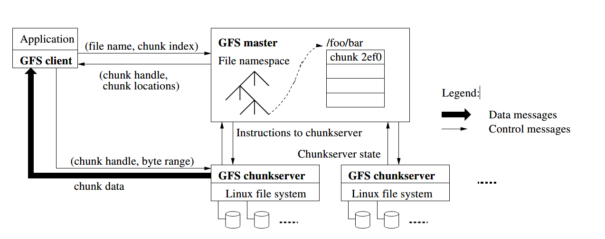

# The Google File System

**关键字**：容错，扩展性，数据存储，集群存储

## 1. 介绍

我们已经设计并实现了Google File System(GFS)来应对Google在数据处理方面快速增长的需求。GFS有着和以前的分布式文件系统共同的目标，比如性能，扩展性，可靠性和可用性。然而，其设计一直由对我们当前和预期的应用程序负载和技术氛围的观察所驱动，这也反映出与一些早期文件系统设计理念有差异。

**第一，组件的失败并非是异常，而是正常的**。这个文件系统由成百上千个廉价的商品部件拼装的存储机器组成，并且被相当数量的客户端机器访问。组件的数量和质量实际上保证了某些组件在任何给定的时间都无法运行，并且某些组件将无法从当前的失败中恢复过来。我们已经见过由下列因素造成的问题：程序bug，操作系统bug，人类犯错，以及磁盘，内存，连接器，网络，电源的失败。所以，不间断的监控，错误侦测，错误容忍，以及自动恢复这些功能必定要集成到系统中。

**第二，按照传统标准文件是巨大的**。几GB的文件很常见。每个文件通常包含很多应用程序对象，比如web文档。当我们定期处理包含数十亿对象的许多TBs的快速增长的数据集，即使文件系统支持数十亿约KB大小的文件，也难以管理。总之，必须重新考虑设计理念以及一些参数，比如I/O操作和块大小。

**第三，大部分文件的修改是追加新数据而不是覆写原数据**。实际中，文件的随机写是不存在的。文件被写入后只用来读，而且经常是顺序读。各种数据都拥有这些特征。一些可能会组成大型存储库，被数据分析程序扫描。一些可能是应用程序持续生成的数据流。一些可能是归档数据。一些可能是一台机器上产生的中间结果，而在另一台机器上同时或稍后产生。鉴于对大型文件的这种访问方式，追加写成为性能优化和原子性保证的重点，然而把数据块存储在客户端则失去了吸引力。

**第四，共同设计应用程序和文件系统API增加灵活性使得整个系统受益**。例如，我们放宽了GFS的一致性模型，以极大地简化文件系统，并且不会给应用程序带来繁重的负担。我们也介绍了一个原子性的并发操作以至于多个客户端可以同时对一个文件追加而不需要额外的同步。

## 2. 设计概述

### 1. 假设

* 该系统由许多经常发生故障的廉价商品组件组成。它必须不间断地自我监控和检测，并从组件故障中迅速恢复。

* 系统存储少量的大文件。我们预计有几百万个文件，每个通常100MB或者更大。几GB的文件很常见，需要有效地管理。小文件必须支持，但是我们不必对其优化。

* 工作负载主要源于两种读：大量流读取和小量随机读。对于大量流读取，每次通常读取几百KBs，1MB或更多。同一个客户端的后续操作经常读取文件的连续区域。一个小量随机读通常在随机位置读取几KBs。注重性能的应用程序经常对小读取进行批处理和排序，以稳定地通过文件而不是来回移动。

* 高持续带宽比低延迟更重要，我们的大多数目标应用程序都很重视高速处理大量数据，而很少会对单次读写的响应时间有严格要求。

### 2. 接口

GFS提供熟悉的文件系统接口，尽管它没有实现一个标准API比如POSIX。文件在目录中按层次结构组织，并由路径名标识。 我们支持创建，删除，打开，关闭，读取和写入文件的常规操作。

除此之外，GSF有快照和记录追加操作。快照低成本地创建文件或目录树的副本。记录追加允许多个客户端同时将数据追加到同一个文件中，同时保证每个客户端的追加的原子性。这对于实现多路合并结果和生产者消费者队列很有用，许多客户端可以在不加锁的情况下追加。

### 3. 架构

一个GFS集群由一个master和多个chunkservers组成，并且被多个客户端访问。如下图，这些设备通常都是运行用户级服务器进程的商用Linux机器。同一个机器上很容易运行一个chunkserver和一个客户端，只要机器资源允许，并且可以接受运行不稳定的应用程序引起较低的可靠性。

