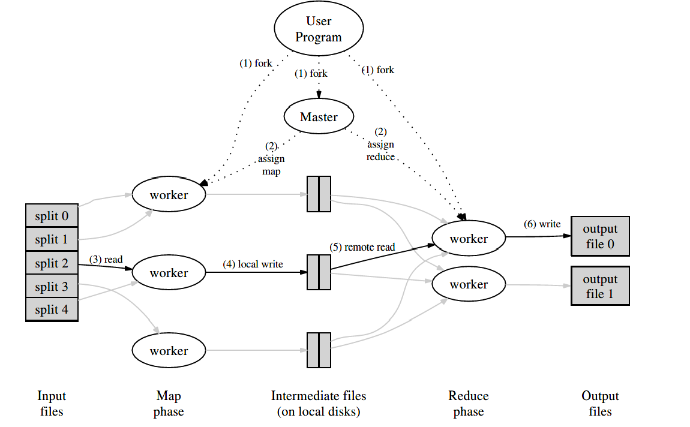

# MapReduce: Simpli ed Data Processing on Large Clusters

## 摘要

MapReduce是用于处理和生成大型数据集的编程模型和相关的实现。 用户指定一个处理键/值对以生成一组中间键/值对的map函数，以及一个归并与同一中间键关联的所有中间值的reduce函数。 如本文所示，在此模型中可以表达许多现实世界中的任务。

以这种功能风格编写的程序会自动并行化，并在大型商用机器集群上执行。 运行时系统负责划分输入数据，安排程序在一组机器上的执行，处理机器故障以及管理所需的机器间通信的细节。 这使没有并行和分布式系统经验的程序员可以轻松利用大型分布式系统的资源。

我们对MapReduce的实现可在大型商用机器集群上运行，并且具有高度可扩展性：典型的MapReduce计算可在数千台机器上处理数TB的数据。 程序员发现该系统易于使用：每天执行数百个MapReduce程序，每天在Google的集群上执行多达一千个MapReduce作业。

## 1. 介绍

在过去的五年中，Google的作者和许多其他人已经实现了数百种特殊用途的计算，这些计算处理大量的原始数据（例如抓取的文档，Web请求日志等），以计算各种派生数据，例如作为倒排索引，Web文档的图形结构的各种表示形式，每个主机爬网的页面数摘要，给定一天中最频繁的查询集等。大多数此类计算在概念上都很简单。 但是，输入数据通常很大，并且必须在数百或数千台机器上分布计算，以便在合理的时间内完成操作。 如何并行化计算，分配数据和处理故障的问题共同困扰了使用大量复杂代码来掩盖最初的简单计算，以应对这些问题。

为了应对这种复杂性，我们设计了一个新的抽象，该抽象使我们能够表达我们试图执行的简单计算，但在库中隐藏了并行化，容错，数据分发和负载均衡的混乱细节。 我们的抽象受到Lisp和许多其他功能语言中存在的Map和Reduce原语的启发。 我们意识到，大多数计算都涉及对输入中的每个逻辑“记录”应用Map操作，以便计算一组中间键/值对，然后对共享同一键的所有值应用Reduce操作， 为了适当地组合得出的数据。 我们使用具有用户指定的Map和Reduce运算的功能模型，使我们能够轻松地并行进行大型计算，并将重新执行用作容错的主要机制。

这项工作的主要贡献是一个简单而强大的界面，该界面可实现大规模计算的自动并行化和分配，并结合了该界面的实现，可在大型商用PC集群上实现高性能。

第2节描述了基本的编程模型，并给出了一些示例。 第3节介绍了针对我们基于集群的计算环境量身定制的MapReduce接口的实现。 第4节描述了一些有用的编程模型改进。 第5节对我们执行各种任务的性能进行了度量。 第6节探讨了MapReduce在Google中的用法，包括我们使用它作为重写生产索引系统基础的经验。 第7节讨论相关和未来的工作。

## 2. 编程模型

该计算采用一组输入键/值对，并产生一组输出键/值对。 MapReduce库的用户将计算表示为两个函数：Map和Reduce。

由用户编写的Map接受一个输入对，并生成一组中间键/值对。 MapReduce库将与同一中间键I关联的所有中间值分组在一起，并将它们传递给Reduce函数。

还由用户编写的Reduce函数接受中间键I和该键的一组值。 它将这些值合并在一起以形成可能较小的一组值。 通常，每个Reduce调用仅产生零或一个输出值。 中间值通过迭代器提供给用户的Reduce函数。 这使我们能够处理太大而无法容纳在内存中的值列表。

## 2.1. Example

考虑对大量文档中每个单词的出现次数进行计数的问题。 用户将编写类似于以下伪代码的代码：

```js
map(String key, String value):
    // key: document name
    // value: document contents
    for each word w in value:
    EmitIntermediate(w, "1");
reduce(String key, Iterator values):
    // key: a word
    // values: a list of counts
    int result = 0;
    for each v in values:
    result += ParseInt(v);
    Emit(AsString(result));

```

Map函数发出每个单词以及相关的出现次数（在此简单示例中为“1”）。 减少功能将特定单词发出的所有计数加在一起。

另外，用户使用输入和输出文件的名称以及可选的调整参数在mapreduce规范对象中将代码写入ll。 然后，用户调用MapReduce函数，并将其传递给指定对象。 用户代码与MapReduce库（在C ++中实现）链接在一起。 附录A包含此示例的完整程序文本。

另外，用户编写代码以使用输入和输出文件的名称以及可选的调整参数来填充mapreduce规范对象。 然后，用户调用MapReduce函数，并将其传递给指定对象。 用户代码与MapReduce库（在C ++中实现）链接在一起。 附录A包含此示例的完整程序文本。

## 2.2. Types

即使先前的伪代码是根据字符串输入和输出编写的，但从概念上讲，用户提供的map和reduce函数具有关联的类型：

`map (k1,v1)          -> list(k2,v2)`

`reduce (k2,list(v2)) -> list(v2)`

即，输入键和值是从与输出键和值不同的域中提取的。 此外，中间键和值与输出键和值来自同一域。

我们的C ++实现在用户定义的函数之间传递字符串，并将其留给用户代码以在字符串和适当的类型之间进行转换。

## 2.3. More Examples

这是一些有趣的程序的简单示例，可以轻松地表达为MapReduce计算。

### 2.3.1 Distributed Grep

如果地图功能与提供的模式匹配，则会发出这一行。 Reduce函数是一个标识函数，它仅将提供的中间数据复制到输出中。

### 2.3.2 Count of URL Access Frequency

Map功能处理网页请求的日志并输出<URL，1>。 Reduce函数将同一URL的所有值加在一起，并发出<URL，total count>对。

### 2.3.3 Reverse Web-Link Graph

Map函数将每个链接的<target，source>对输出到在名为source的页面中找到的目标URL。 Reduce函数将与给定目标URL关联的所有源URL的列表连接起来，并发出对<target，list（source>。

### 2.3.4 Term-Vector per Host

Term-Vector将在一个文档或一组文档中出现的最重要的单词概括为<word, frequency>对的列表。 Map函数为每个输入文档发出一个<hostname, term vector>对（其中主机名是从文档的URL中提取的）。 将减少功能传递给给定主机的所有每个文档术语向量。 它将这些术语向量相加，丢弃不常用的术语，然后发出最后的<hostname,  term vector>对。

### 2.3.5 Inverted Index

map函数解析每个文档，并发出一系列<word，document ID>对。 reduce函数接受给定单词的所有对，对相应的文档ID进行排序，并发出<word，list（document ID）>对。 所有输出对的集合形成一个简单的反向索引。 易于扩展此计算以跟踪单词位置。

### 2.3.6 Distributed Sort

map函数从每个记录中提取键，并发出一个<key，record>对。 reduce函数将所有对保持不变。 该计算取决于第4.1节中描述的分区功能和第4.2节中描述的排序属性。

## 3. 实现

MapReduce接口的许多不同实现都是可能的。 正确的选择取决于环境。 例如，一种实现可能适用于小型共享内存计算机，另一种则适用于大型NUMA多处理器，而另一种则适用于网络计算机的更大集合。

本节介绍了针对Google广泛使用的计算环境的实现：通过交换式以太网连接在一起的大型商用PC集群。 在我们的环境中：

1. 机器通常是运行Linux的双处理器x86处理器，每台机器具有2-4 GB的内存。

2. 使用商品网络硬件–在机器级别通常为100MB/S或1GB/S，但是整体对分带宽的平均要小得多。

3. 群集由数百或数千台计算机组成，因此，机器故障很常见。

4. 直接连接到单个计算机的廉价IDE磁盘提供存储。 内部开发的分布式文件系统用于管理存储在这些磁盘上的数据。 该文件系统使用复制在不可靠的硬件上提供可用性和可靠性。

5. 用户将作业提交到调度系统。 每个作业包含一组任务，并由调度程序映射到集群中的一组可用计算机。

### 3.1 执行概述

通过将输入数据自动划分为一组M个拆分，Map调用分布在多台计算机上。 输入拆分可由不同的机器并行处理。 通过使用分区函数（例如，hash（key）mod R）将中间键空间划分为R个片段，可以分布Reduce调用。 分区数（R）和分区功能由用户指定。



上图显示了我们实现中MapReduce操作的整体效果。 当用户程序调用MapReduce函数时，将发生以下操作序列（上图中的编号标签与下面列表中的数字相对应）：

1. 用户程序中的MapReduce库首先将输入文件拆分为M个片段，每个片段通常为16MB至64MB（可由用户通过可选参数控制）。然后，它在计算机群集上启动该程序的许多副本。

2. 该程序的副本之一是特殊的-master。 其余的是由master分配工作的worker。 要分配M个Map任务和R个Reduce任务。 Master选择空闲的worker，并为每个worker分配一个map任务或一个reduce任务。

3. 分配了map任务的worker将读取相应输入拆分的内容。 它从输入数据中解析键/值对，并将每对传递给用户定义的Map函数。 由Map函数产生的中间键/值对被缓存在内存中。

4. 缓冲对将定期写入本地磁盘，并通过分区函数划分为R个区域。 这些缓冲对的位置在本地磁盘上被传递回master，该master负责将这些位置转发给reduce worker。

5. 当主服务器通知reduce worker这些位置时，它将使用远程过程调用从map worker的本地磁盘读取缓冲的数据。 当reduce worker读取了所有中间数据时，它将按中间键对数据进行排序，以便将同一键的所有出现都分组在一起。 之所以需要排序，是因为通常有许多不同的键映射到相同的reduce任务。 如果中间数据量太大而无法容纳在内存中，则使用外部排序。

6. Reduce worker对排序的中间数据进行迭代，对于遇到的每个唯一的中间键，它将键和相应的中间值集传递给用户的Reduce函数。 Reduce函数的输出将附加到此reduce分区的最终输出文件中。

7. 完成所有map任务和reduce任务后，master将唤醒用户程序。 此时，用户程序中的MapReduce调用返回到用户代码。

成功完成后，可在R输出文件中使用mapreduce执行的输出（每个归约任务一个，其文件名由用户指定）。 通常，用户不需要将这些R输出文件组合到一个文件中–他们通常将这些文件作为输入传递到另一个MapReduce调用，或者从另一个能够处理被分成多个文件的输入的分布式应用程序中使用它们。

### 3.2. Master Data Structures

Master保留几个数据结构。 对于每个map任务和reduce任务，它存储状态（空闲，进行中或已完成）和worker的标识（对于非空闲任务）。

Master是将中间文件区域的位置从Map任务传播到Reduce任务的管道。 因此，对于每个完成的Map任务，master存储由Map任务生成的R个中间文件区域的位置和大小。 Map任务完成后，将接收到此位置和大小信息的更新。 信息将逐步推送给正在进行Reduce任务的worker。

### 3.3. Fault Tolerance

由于MapReduce库旨在帮助使用数百或数千台计算机处理大量数据，因此该库必须能够容忍机器故障。

#### 3.3.1 Worker Failure

Master定期对每个worker执行ping操作。 如果在一定时间内没有收到来自worker的响应，则master将worker标记为失败。 由worker完成的所有Map任务都将重置为其初始空闲状态，因此有资格在其他worker上进行调度。 同样，在失败的worker上进行的任何Map任务或Reduce任务也将重置为空闲，并有资格进行重新计划。

完成的Map任务在发生故障时会重新执行，因为它们的输出存储在故障机器的本地磁盘上，因此无法访问。 已完成的Reduce任务的输出存储在全局文件系统中，因此无需重新执行。

当先由workerA执行map任务，然后再由workerB执行map任务（因为A失败）时，将向所有执行reduce任务的worker通知重新执行。 任何尚未从workerA读取数据的reduce任务都将从workerB读取数据。

MapReduce可以抵抗大规模的worker故障。 例如，在一次MapReduce操作期间，正在运行的集群上的网络维护导致几分钟内无法访问80个计算机的组。 MapReduce Master只是简单地重新执行了无法访问的worker所完成的工作，并继续取得进展，最终完成了MapReduce操作。

#### 3.3.2 Master Failure

很容易使master写入上述master数据结构的定期检查点。 如果master任务死亡，则可以从最后一个检查点状态开始新副本。 但是，由于只有一个master，因此发生故障的可能性不大。 因此，如果master失败，我们当前的实现将中止MapReduce计算。 客户可以检查这种情况，并根据需要重试MapReduce操作。

#### 3.3.3 Semantics in the Presence of Failures

当用户提供的map和reduce运算符是其输入值的确定性函数时，我们的分布式实现将产生与整个程序的无故障顺序执行相同的输出。

我们依靠Map和Reduce任务输出的原子提交来实现此属性。 每个正在进行的任务都将其输出写入私有临时文件。 Reduce任务产生一个这样的文件，而Map任务产生R个这样的文件（每个Reduce任务一个）。 Map任务完成后，worker会向master发送一条消息，并在消息中包含R个临时文件的名称。 如果master收到有关已完成的map任务的完成消息，它将忽略该消息。 否则，它将在master数据结构中记录R文件的名称。

当reduce任务完成时，reduce worker自动将其临时输出文件重命名为最终输出文件。 如果在多台计算机上执行相同的reduce任务，则将对同一最终输出文件执行多个重命名调用。 我们依赖于底层文件系统提供的原子重命名操作，以确保最终文件系统状态仅包含一次执行reduce任务所产生的数据。

我们的map和reduce运算符绝大多数是确定性的，在这种情况下我们的语义等同于顺序执行的事实使程序员很容易就其程序行为进行推理。 当map and/or reduce运算符不确定时，我们提供较弱但仍然合理的语义。 在存在不确定性运算符的情况下，特定reduce任务R1的输出等效于由不确定性程序的顺序执行产生的R1的输出。 然而，用于不同reduce任务R2的输出可以对应于由不确定性程序的不同顺序执行所产生的用于R2的输出。

考虑map任务M和reduce任务R1和R2。 令e（Ri）为已落实的Ri的执行（恰好有一个这样的执行）。 之所以出现较弱的语义，是因为e（R1）可能已经读取了一次执行M所产生的输出，而e（R2）可能已经读取了执行不同的M所产生的输出。

### 3.4. Locality

在我们的计算环境中，网络带宽是相对稀缺的资源。 我们利用输入数据（由GFS管理）存储在组成集群的计算机的本地磁盘上的事实，从而节省了网络带宽。 GFS将每个文件分成64 MB的块，并在不同的计算机上存储每个块的几个副本（通常为3个副本）。 MapReduce Master将输入文件的位置信息考虑在内，并尝试在包含相应输入数据副本的计算机上计划Map任务。 如果失败，它将尝试在该任务的输入数据的副本附近计划Map任务（例如，在与包含数据的计算机位于同一网络交换机的worker计算机上）。 在集群中很大一部分的工作线程上运行大型MapReduce操作时，大多数输入数据都在本地读取，并且不占用网络带宽。

### 3.5. Task Granularity

如上所述，我们将Map阶段细分为M个片段，将Reduce阶段细分为R个片段。 理想情况下，M和R应该比工作计算机的数量大得多。 让每个worker执行许多不同的任务可以改善动态负载平衡，并且还可以在worker失败时加快恢复速度：它完成的许多Map任务可以分布在所有其他worker计算机上。

如上所述，由于master必须制定O（M + R）调度决策并将O（M \* R）状态保留在内存中，因此在我们的实现中可以有多大的M和R有实际的界限。 （但是，内存使用量的常量因素很小：状态的O（M \* R）块每个Map任务/Reduce任务对大约包含一个字节的数据。）

此外，R通常受用户约束，因为每个reduce任务的输出最终都存储在单独的输出文件中。 在实践中，我们倾向于选择M，以便每个单独的任务大约是16 MB到64 MB的输入数据（这样，上述的位置优化是最有效的），并且我们将R设为我们worker计算机数量的一小部分期望使用。 我们经常使用2,000个worker执行M = 200,000和R = 5,000的MapReduce计算。

### 3.6. Backup Tasks

延长MapReduce操作总时间的常见原因之一是Straggler：一台机器花费异常长的时间来完成最后几个Map之一或Reduce计算任务。 Straggler之所以出现，可能是由于多种原因。 例如，磁盘损坏的计算机可能会经常遇到可纠正的错误，从而将其读取性能从30 MB / s降低到1 MB / s。 集群调度系统可能已在计算机上调度了其他任务，由于竞争CPU，内存，本地磁盘或网络带宽，导致其执行MapReduce代码的速度较慢。 我们最近遇到的一个问题是机器初始化代码中的一个错误，该错误导致了处理器缓存被禁用：受影响机器上的计算速度降低了100倍。

我们有一个通用的机制来缓解Straggler的问题。 当MapReduce操作接近完成时，Master会调度其余正在进行的任务的备份执行。 每当主执行或备份执行完成时，该任务就会标记为已完成。 我们已经对该机制进行了调整，以使其通常将操作使用的计算资源增加不超过百分之几。 我们发现，这大大减少了完成大型MapReduce操作的时间。 例如，禁用备份任务机制时，第5.3节中描述的排序程序需要延长44％的时间才能完成。

## 4. Refinements

尽管只需编写Map和Reduce函数即可满足大多数需求，但我们发现一些扩展很有用。 这些将在本节中介绍。

### 4.1. Partitioning Function

MapReduce的用户指定他们想要的Reduce任务/输出文件的数量（R）。 使用中间键上的分区功能，可以跨这些任务对数据进行分区。 提供了使用散列的默认分区功能（例如“ hash（key）mod R”）。 这往往会导致分区相当均衡。 但是，在某些情况下，通过键的其他功能对数据进行分区很有用。 例如，有时输出键是URL，我们希望单个主机的所有条目都以同一输出文件结尾。 为了支持这种情况，MapReduce库的用户可以提供特殊的分区功能。 例如，使用“ hash（Hostname（urlkey））mod R”作为分区功能会使来自同一主机的所有URL最终都位于同一输出文件中。

### 4.2. Ordering Guarantees

我们保证在给定的分区内，中间键/值对以递增的键顺序进行处理。 这种排序保证使按分区容易地生成分类的输出文件，当输出文件格式需要通过键支持有效的随机访问查找，或者输出的用户发现对数据进行分类很方便时，这很有用。

### 4.3. Combiner Function

在某些情况下，每个Map任务产生的中间键都有大量重复，并且用户指定的Reduce函数是可交换的和关联的。 一个很好的例子是2.1节中的单词计数例子。 由于单词频率倾向于遵循Zipf分布，因此每个Map任务都会产生成百上千的<the，1>形式的记录。 所有这些计数将通过网络发送到单个Reduce任务，然后通过Reduce功能加在一起以产生一个数字。 我们允许用户指定一个可选的Combiner函数，该函数会在通过网络发送数据之前进行部分合并(Combiner)。

在执行map任务的每台计算机上执行Combiner功能。 通常，使用相同的代码来实现Combiner和reduce函数。 reduce函数和Combiner之间的唯一区别是MapReduce库如何处理函数的输出。 reduce函数的输出将写入最终输出文件。 Combiner的输出将写入一个中间文件，该文件将被发送到reduce任务。

部分组合可显着加快某些类的MapReduce操作。 附录A包含一个使用Combiner的示例。

### 4.4. Input and Output Types

MapReduce库提供了以几种不同格式读取输入数据的支持。 例如，“文本”模式输入将每行视为键/值对：键是文件中的偏移量，值是行的内容。 另一种常用的受支持格式存储按键排序的键/值对序列。 每个输入类型的实现都知道如何将自己拆分为有意义的范围，以作为单独的Map任务进行处理（例如，文本模式的范围拆分可确保范围拆分仅在行边界发生）。 用户可以通过提供简单reader界面的实现来添加对新输入类型的支持，尽管大多数用户仅使用少数预定输入类型之一。

Reader不一定需要提供从文件读取的数据。 例如，定义一个reader很容易，它可以从数据库或映射到内存中的数据结构中读取记录。

以类似的方式，我们支持一组输出类型，用于生成不同格式的数据，并且用户代码很容易添加对新输出类型的支持。

### 4.5. Side-effects

在某些情况下，MapReduce的用户发现可以方便地生成辅助文件，作为其map的附加输出 and/or reduce运算符。 我们依靠应用程序编写者来使此类副作用成为原子和幂等的。 通常，应用程序将写入一个临时文件，并在该文件完全生成后自动对其重命名。

我们不支持单个任务产生的多个输出文件的原子两阶段提交。 因此，产生具有跨文件一致性要求的多个输出文件的任务应该是确定性的。 实际上，这种限制从来都不是问题。

### 4.6. Skipping Bad Records

有时，用户代码中的错误会导致Map或Reduce函数在某些记录上确定性地崩溃。 此类错误会阻止MapReduce操作完成。 通常的做法是修复bug，但有时这是不可行的； 该错误可能存在于第三方库中，该库的源代码不可用。 同样，有时可以忽略一些记录，例如在对大型数据集进行统计分析时。 我们提供了一种可选的执行模式，其中MapReduce库检测哪些记录导致确定性崩溃，并跳过这些记录以取得进展。

每个worker进程都安装一个信号处理程序，以捕获分段违规和总线错误。 在调用用户Map或Reduce操作之前，MapReduce库将参数的序列号存储在全局变量中。 如果用户代码生成信号，则信号处理程序将包含序列号的“last gasp” UDP数据包发送到MapReduce Master。 当master在特定记录上看到多个故障时，表明在下一次重新执行对应的Map或Reduce任务时应跳过该记录。

### 4.7. Local Execution

Map或Reduce函数中的调试问题可能很棘手，因为实际的计算是在分布式系统中进行的，通常是在几千台机器上，而工作分配决定是由master动态地做出的。 为了帮助进行调试，概要分析和小规模测试，我们开发了MapReduce库的替代实现，该库可在本地计算机上顺序执行MapReduce操作的所有工作。 提供给用户的控件使计算可以限于特定的Map任务。 用户使用特殊标志调用程序，然后可以轻松使用他们认为有用的任何调试或测试工具（例如gdb）。

### 4.8. Status Information

Master运行一个内部HTTP服务器，并导出一组状态页面供人类使用。 状态页显示计算进度，例如已完成多少任务，正在进行多少任务，输入字节，中间数据字节，输出字节，处理速率等。这些页面还包含指向以下内容的链接： 每个任务生成的标准错误和标准输出文件。 用户可以使用此数据来预测计算将花费多长时间，以及是否应将更多资源添加到计算中。 这些页面还可以用于计算出比预期慢得多的时间。

此外，顶层状态页面显示了哪些worker已失败，以及他们在失败时正在处理的Map和Reduce任务。 尝试诊断用户代码中的错误时，此信息很有用。

### 4.9. Counters

MapReduce库提供了一种计数器功能，可以对各种事件的发生进行计数。 例如，用户代码可能要计算处理的单词总数或索引的德语文档的数量，等等。

要使用此功能，用户代码将创建一个命名计数器对象，然后在Map和/或Reduce函数中适当增加计数器。 例如：

```c++
Counter* uppercase;
uppercase = GetCounter("uppercase");
map(String name, String contents):
    for each word w in contents:
        if (IsCapitalized(w)):
        uppercase->Increment();
    EmitIntermediate(w, "1");
```

来自各个worker计算机的计数器值会定期传播到Master（piggybacked on the ping response）。 Master从成功的Map和Reduce任务中聚合计数器值，并在MapReduce操作完成后将其返回给用户代码。 当前计数器值也显示在主状态页面上，以便人们可以观看实时计算的进度。 汇总计数器值时，Master消除了重复执行同一映射或减少任务以避免重复计数的影响。 （重复执行可能是由于我们使用备份任务以及由于失败而重新执行任务引起的。）

MapReduce库会自动维护一些计数器值，例如处理的输入键/值对的数量和产生的输出键/值对的数量。

用户发现计数器功能对于完整性检查MapReduce操作的行为很有用。 例如，在某些MapReduce操作中，用户代码可能想要确保生成的输出对的数量完全等于已处理的输入对的数量，或者要确保已处理的德语文档的比例在文档总数的某个可容忍的比例之内处理。

## 5. Performance

## 6. Experience

## 7. Related Work

## 8. Conclusions

Google已成功将MapReduce编程模型用于许多不同目的。 我们将此成功归因于几个原因。 首先，该模型易于使用，即使对于没有并行和分布式系统经验的程序员而言也是如此，因为它隐藏了并行化，容错，局部性优化和负载平衡的细节。 其次，各种各样的问题都可以很容易地表达为MapReduce计算。 例如，MapReduce用于为Google的生产网络搜索服务生成数据，进行排序，进行数据挖掘，用于机器学习以及许多其他系统。 第三，我们开发了MapReduce的实现，该实现可扩展到包含数千台机器的大型机器集群。 该实现有效利用了这些机器资源，因此适合用于Google遇到的许多大型计算问题。

我们从这项工作中学到了几件事。 首先，限制编程模型可以使并行计算和分布式计算变得容易，并使此类计算具有容错性。 其次，网络带宽是一种稀缺资源。 因此，我们系统中的许多优化旨在减少通过网络发送的数据量：位置优化使我们能够从本地磁盘读取数据，并将中间数据的单个副本写入本地磁盘可节省网络带宽。 第三，可以使用冗余执行来减少运行缓慢的计算机的影响，并处理计算机故障和数据丢失。
