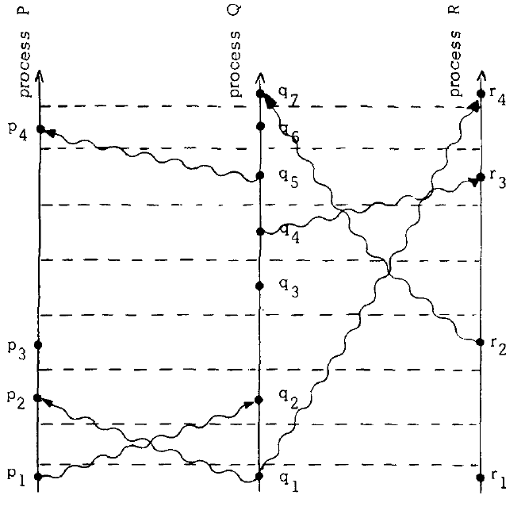

# Time-Clocks-and-the-Ordering-of-Events-in-a-Distributed-System

## Introduce

时间的概念至关重要，它衍生于事件发生的顺序。如果一件事情发生于时钟读取3:15之后并且在3:16之前，我们就说它发生的时间是3:15。然而，在分布式系统中，我们必须重新看待这个概念。

在分布式系统中，有时我们不可能说出两件事情中哪一件先发生。“先行发生(happened before)”关系仅仅表示系统中事件的偏序关系。

## The Partial Ordering

很多人可能会说如果事件a比事件b发生在一个更早的时间点，那么事件a比事件b先发生。他们会用物理学的事件来证明。
然而，如果系统正确地满足规范，则必须根据系统内可观察到的事件来给出该规范。如果这个规范是物理时间，那么系统必须包含真实的时钟。即使它真的包含真实的时钟，还是会有一些问题，这样的时钟并非完全准确，不能保证精确的物理时间。我们将不使用物理时间来定义“先行发生”关系。

我们假设系统由一些进程组成，每个进程由一系列事件组成。我们假设系统中的事件组成一个序列，如果a先行发生于b那么在这个序列中a发生于b之前。

我们假设发送或接收消息是流程中的事件。 如下，我们可以定义“先行发生”关系，用“--->”表示。

系统事件集上的关系“--->”是满足以下三个条件的最小关系：**（1）如果a和b是同一进程中的事件，并且a在b之前，则a ---> b。 （2）如果a是一个进程发送的消息，而b是另一个进程接收的同一消息，则a ---> b。 （3）如果a ---> b并且b ---> c，则a ---> c。 如果a -/-> b并且b -/-> a，则两个不同的事件a和b称为并发。**

并且对于任意a，满足 a -/-> a。这意味着 --> 是系统中所有事件集合的非自反偏序。

举例如下图，我们可以得到 p1 --> r4。

从另外一个角度来看，a ---> b也意味着可能事件a因果影响事件b（it is possible for event a to causally affect event b. ）。如果两个事件互不影响那么就是并发的。举例上图，p3和q3就是并发的，尽管q3发生的物理时间比p3更早，但是进程P无法得知进程Q在q3时间点做了什么，直到在q4时间点接收了消息。

## Logical Clocks

从一个抽象的观点开始，时钟只是为事件分配数字的一种方式，数字可以认为是事件发生的时间。

我们为每个进程Pi定义一个方法Ci()，对于这个进程中的任意事件a，分配一个数字Ci(a)。

我们认为Ci是逻辑时钟而不是物理时钟，可以用计数器来实现，而不需要真实的时间策略。

我们现在考虑这样的时钟系统的正确性意味着什么。我们的定义并未基于物理时间，而是基于事件发生的顺序。

最严格、合理的条件是，如果一个事件a在另一个事件b之前发生，那么a应该比b发生的时间更早。 我们将这种情况更正式地定义如下规则。
> Clock Condition. For any events a, b: if a ---> b then C(a) < C(b).

请注意，我们不能期望反过来也成立，因为这意味着任何两个并发事件必须同时发生。

Clock Condition满足下列两个条件：

1. C1. 如果a和b是进程Pi中的事件，并且a在b之前，则Ci（a）< Ci（b）。
2. C2. 如果a是进程Pi发送消息，b是接收这个消息，则Ci（a）< Ci（b）。

再看上图，我们想象一个过程的时钟“滴答”通过每个数字，滴答声发生在过程的事件之间。例如，如果a和b是进程Pi中的连续事件，且Ci(a)= 4且Ci(b)= 7，则时钟滴答5、6和7在两个事件之间发生。

我们通过不同进程的所有类似编号的刻度线绘制一条虚线“tick line”。

如何实现满足Clock Condition。其中C1很简单：

* IR1.每个进程Pi在任何两个连续事件之间使Ci递增。

为了满足C2，我们需要每个消息m都包含一个时间戳Tm, 是消息发送的时间。一旦收到时间戳为Tm的消息，该进程必须b把时钟拨到Tm之后。

* IR2. (a)如果事件a是进程Pi发送消息m，则消息m包含时间戳Tm = Ci(a)。(b)在接收到消息m时，进程Pi将Ci设置为大于或等于其当前值并且大于Tm。

## Ordering the Events Totally

满足了Clock Condition，我们可以定义系统所有事件的全局顺序。我们简单地按照事件发生的时间来排序。

我们定义了一个遵守如下规则的关系 => : 如果a是进程Pi的一个事件，b是进程pj的一个事件，当且仅当下面两个条件之一时，a => b。

1. Ci(a) < Cj(b).

2. Ci(a) == Cj(b)且Pi < Pj. (为了打破平局，我们对进程使用任何任意的总排序)

我们用关系 => 将“先行发生”部分排序完善为全局排序。=> 的顺序取决于系统时钟Ci，并且不是唯一的。

有了事件的全局顺序在分布式系统中非常有用，实际上，实现正确的逻辑时钟系统的原因是为了获得这样的总排序。我们将使用这个理论来解决一种互斥问题。

考虑一个由共享单个资源的多个进程组成的系统，一次只能有一个进程使用资源，因此，这些进程必须进行同步以避免冲突。我们希望找到一种将资源授予满足以下三个条件的进程的算法：

1. 已被授予资源的进程必须先释放它，然后才能将其授予另一个进程。

2. 必须按发出请求的顺序授予对资源的不同请求。

3. 如果每个被授予资源的进程最终都释放了它，那么每个请求最终都会被授予。

我们假定资源最初正好了授予一个进程。

要注意这不是一个简单的问题。使用中央调度进程按接收顺序授予请求将无法正常工作，除非做额外的假设。

使P0为调度进程，假设P1发送一个请求给P0，然后发送一个消息给P2，P2在收到消息之后发送请求给P0。有可能P2的请求比P1的请求先到达P0。如果首先批准了P2的请求，则违反条件II。

为了解决这个问题，我们使用前面的IR1和IR2来实现系统的时钟，然后定义的所有事件的全局顺序，问题也就迎刃而解。剩下的就是确保每个进程要知道其他进程的操作。

为了简化问题，我们来做一些假设。首先，对于任意两个进程Pi和Pj，从Pi发送给Pj的消息被按照发送的顺序所接收。更进一步，我们假设每个消息最终都会被接收，还有每个进程可以直接给其他进程发送消息。

每个进程维护一个对其他进程不可见的请求队列，队列初始包含一个消息T0:P0，P0是最初授予资源的进程，T0小于任何时钟的初始值。还有以下五个规则，方便起见，每个规则定义的动作都构成一个事件。

1. 为了请求资源，进程Pi发送消息Tm:Pi向其他每个进程请求资源，并将该消息放在其请求队列中，其中Tm是消息的时间戳。

2. 当进程Pj收到消息Tm：Pi请求资源时，它将其放置在其请求队列中，并向Pi发送（带时间戳）确认消息。

3. 为了释放资源，进程Pi从其请求队列中删除所有Tm:Pi请求资源消息，并将（带时间戳）Pi释放资源消息发送给所有其他进程。

4. 当进程Pj收到Pi释放资源消息时，它将从其请求队列中删除所有Tm:Pi请求资源消息。

5. 当满足以下两个条件时，将为进程Pi授予资源：（i）在其请求队列中有一个Tm:Pi请求资源消息，该消息在队列中的其他任何请求之前，按关系=>排序。 （为了给消息定义关系“ =>”，我们将发送该消息的事件来确定这条消息。）（ii）Pi从其他进程接收到的消息时间戳晚于Tm。

这是一种分布式算法。 每个进程都独立遵循这些规则，并且没有中央同步进程或中央存储。对于这种分布式多进程系统， 可以推广这种方法来实现任何所需的同步。

然而，这个算法需要所有进程的积极参与。一个进程必须知道其他进程的消息，所以单个进程的失败将会导致整个系统失败。

这个失败的问题难以解决，讨论其细节超出了本文的范畴。我们将观察到，整个失败的概念仅在物理时间的背景下才有意义。 没有物理时间，就无法将失败的进程与仅在事件之间暂停的进程区分开。用户只能因为等待响应的时间太长才知道系统“崩溃”。
