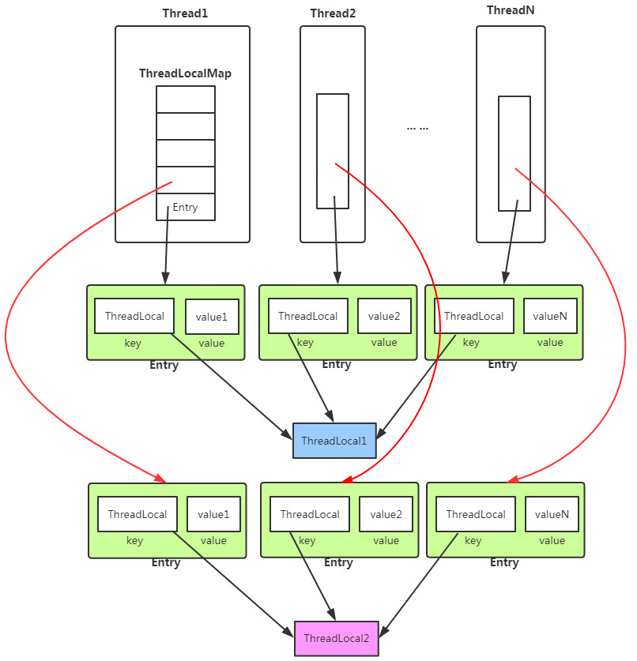

# ThreadLocal解析
## ThreadLocal是什么
ThreadLocal是一个本地线程变量副本工具类。主要用于将线程和该线程存放的变量副本作一个映射，各个线程之间的变量互不影响。
在高并发场景下，可以实现无状态的调用，特别适用于各个线程依赖不通的变量值完成操作的场景。

下图为ThreadLocal的内部结构图：



从上面的结构图，我们可以知道ThreadLocal的核心机制
* 每个Thread线程内部有一个map
* map里面存储线程本地对象(key)和线程的变量副本(value)
* 但是，Thread内部的map是由ThreadLocal维护的，由ThreadLocal负责向map获取和设置线程的变量值

所以对于不同的线程，每次获取副本值时，别的线程并不能获取到当前线程的副本值，形成了副本的隔离，互不干扰。
```
public class Thread implements Runnable {
    /* ThreadLocal values pertaining to this thread. This map is maintained
     * by the ThreadLocal class. 
     */
    ThreadLocal.ThreadLocalMap threadLocals = null;
```

## ThreadLocal
ThreadLocal提供了几个核心方法
```
public T get() {} //返回当前线程的变量副本值
private T setInitialValue() {} //为当前线程设置变量副本初始值
public void set(T value) {} //设置当前线程的变量副本值
public void remove() {} //删除当前线程的变量副本值
```

## ThreadLocalMap
ThreadLocalMap是ThreadLocal的内部类，没有实现Map接口，用独立的方式实现了Map的功能，其内部的Entry也独立实现。

ThreadLocalMap是用Entry来保存K-V结构数据的，key只能是ThreadLocal对象
```
static class Entry extends WeakReference<ThreadLocal<?>> {
    /** The value associated with this ThreadLocal. */
    Object value;

    Entry(ThreadLocal<?> k, Object v) {
        super(k);
        value = v;
    }
}
```
Entry继承自WeakReference（弱引用，生命周期只能存活到下次GC前），但只有Key是弱引用类型的，Value并非弱引用。

ThreadLocalMap的成员变量：
```
static class ThreadLocalMap {
    /**
     * The initial capacity -- MUST be a power of two.
     */
    private static final int INITIAL_CAPACITY = 16;

    /**
     * The table, resized as necessary.
     * table.length MUST always be a power of two.
     */
    private Entry[] table;

    /**
     * The number of entries in the table.
     */
    private int size = 0;

    /**
     * The next size value at which to resize.
     */
    private int threshold; // Default to 0
}
```
和HashMap的最大的不同在于，ThreadLocalMap结构非常简单，没有next引用，
也就是说ThreadLocalMap中解决Hash冲突的方式并非链表的方式，而是采用线性探测的方式。
> 所谓线性探测，就是根据初始key的hashcode值确定元素在table数组中的位置，如果发现这个位置上已经有其他key值的元素被占用，
则利用固定的算法寻找一定步长的下个位置，依次判断，直至找到能够存放的位置。

ThreadLocalMap解决Hash冲突的方式就是简单的步长加1或减1，寻找下一个相邻的位置。
```
private static int nextIndex(int i, int len) {
    return ((i + 1 < len) ? i + 1 : 0);
}
private static int prevIndex(int i, int len) {
    return ((i - 1 >= 0) ? i - 1 : len - 1);
}
```
显然ThreadLocalMap采用线性探测的方式解决Hash冲突的效率很低，如果有大量不同的ThreadLocal对象放入map中时发送冲突，或者发生二次冲突，则效率很低。

所以这里引出的良好建议是：每个线程只存一个变量，这样的话所有的线程存放到map中的Key都是相同的ThreadLocal，
如果一个线程要保存多个变量，就需要创建多个ThreadLocal，多个ThreadLocal放入Map中时会极大的增加Hash冲突的可能。

### ThreadLocalMap的问题
由于ThreadLocalMap的key是弱引用，而Value是强引用。这就导致了一个问题，ThreadLocal在没有外部对象强引用时，发生GC时弱引用Key会被回收，而Value不会回收，
如果创建ThreadLocal的线程一直持续运行，那么这个Entry对象中的value就有可能一直得不到回收，发生内存泄露。

**如何避免泄漏**

既然Key是弱引用，那么我们要做的事，就是在调用ThreadLocal的get()、set()方法时完成后再调用remove方法，
将Entry节点和Map的引用关系移除，这样整个Entry对象在GC Roots分析后就变成不可达了，下次GC的时候就可以被回收。

如果使用ThreadLocal的set方法之后，没有显示的调用remove方法，就有可能发生内存泄露(关于内存泄露更多细节参考[ThreadLocal内存泄漏](https://www.jianshu.com/p/98b68c97df9b))
，所以养成良好的编程习惯十分重要，使用完ThreadLocal之后，记得调用remove方法。
```
ThreadLocal<Integer> threadLocal = new ThreadLocal<Session>();
try {
    threadLocal.set((int) (Math.random() * 1000));
    // other
} finally {
    threadLocal.remove();
}
```