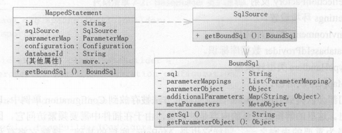
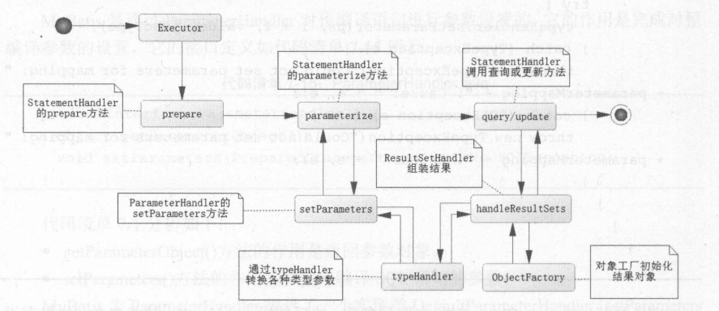

# MyBatis解析和运行原理
MyBatis的运行过程分为两大步：第一步，读取配置文件缓存到Configuration对象，用以创建SqlSessionFactory；第二步，SqlSession的执行过程。
## 创建SqlSessionFactory
SqlSessionFactory是Mybatis的核心类之一，其最重要的功能是创建MyBatis的核心接口SqlSession。为此需要提供配置文件和相关的参数，以Builder模式去构建。

其构建过程分为两步，
1. 通过org.apache.ibatis.builder.xml.XMLConfigBuilder解析配置的XML文件，将解析的结果放入org.apache.ibatis.session.Configuration对象中。
而 Configuration 采用的是单例模式，几乎所有的 MyBatis 配置内容都会存放在这个单例对象中，以便后续将这些内容读出。
2. 用Configuration对象去创建SqlSessionFactory。默认会创建一个实现类org.apache.ibatis.session.defaults.DefaultSqlSessionFactory。

以下是XMLConfigBuilder中解析config的步骤，
```
private void parseConfiguration(XNode root) {
    try {
        //issue #117 read properties first
        propertiesElement(root.evalNode("properties"));
        Properties settings = settingsAsProperties(root.evalNode("settings"));
        loadCustomVfs(settings);
        typeAliasesElement(root.evalNode("typeAliases"));
        pluginElement(root.evalNode("plugins"));
        objectFactoryElement(root.evalNode("objectFactory"));
        objectWrapperFactoryElement(root.evalNode("objectWrapperFactory"));
        reflectorFactoryElement(root.evalNode("reflectorFactory"));
        settingsElement(settings);
        // read it after objectFactory and objectWrapperFactory issue #631
        environmentsElement(root.evalNode("environments"));
        databaseIdProviderElement(root.evalNode("databaseIdProvider"));
        typeHandlerElement(root.evalNode("typeHandlers")); 
        mapperElement(root.evalNode("mappers"));
    } catch (Exception e) {
        throw new BuilderException("Error parsing SQL Mapper Configuration. Cause: " + e, e);
    }
}
```
从源码中可以看到，它是通过一步步解析 XML 的内容得到对应的信息的，而这些信息正是我们在配置文件中配置的内容。
我们以typeHandlers为例，进行更深一步的分析。
```
private void typeHandlerElement(XNode parent) throws Exception {
    if (parent != null) {
        for (XNode child : parent.getChildren()) {
            if ("package".equals(child.getName())) {
                String typeHandlerPackage = child.getStringAttribute("name");
                typeHandlerRegistry.register(typeHandlerPackage);
            } else {
                String javaTypeName = child.getStringAttribute("javaType");
                String jdbcTypeName = child.getStringAttribute("jdbcType");
                String handlerTypeName = child.getStringAttribute("handler");
                Class<?> javaTypeClass = resolveClass(javaTypeName);
                JdbcType jdbcType = resolveJdbcType(jdbcTypeName);
                Class<?> typeHandlerClass = resolveClass(handlerTypeName);
                if (javaTypeClass != null) {
                    if (jdbcType == null) {
                        typeHandlerRegistry.register(javaTypeClass, typeHandlerClass);
                    } else {
                        typeHandlerRegistry.register(javaTypeClass, jdbcType, typeHandlerClass);
                    }
                } else {
                    typeHandlerRegistry.register(typeHandlerClass);
                }
            }
        }
    }
}
```
配置的 typeHandler 都会被注册到 typeHandlerRegistry对象中去，typeHandlerRegistry对象其实就是 Configuration 的一个属性。
### 构建Configuration
在 SqlSessionFactory 构建中，Configuration 是最重要的，它的作用是：
* 读入配置文件，包括基础配置的 XML 和映射器 XML （或注解）
* 初始化一些基础配置，比如 MyBatis 的别名等， 一些重要的类对象（比如插件、映射器、 Object 工厂、 typeHandlers 对象等）
* 提供单例，为后续创建 SessionFactory 服务，提供配置的参数
* 执行一些重要对象的初始化方法

儿乎所有的配置都是通过 XMLConfigBuilder 去构建的，首先它会读出所有 XML 配置的信息，然后把它们解析并保存在 Configuration 单例中。
### 构建映射器的内部组成
解析配置时，最重要的部分就是映射器。当 XMLConfigBuilder 解析 XML 时，会将每一个 SQL 和其配置的内容保存起来，那么它是怎么保存的呢？

一般而言，在 MyBatis 中一条 SQL 和它相关的配置信息是由 3 个部分组成的，它们分别是 MappedStatement、 SqlSource 和 BoundSql 。
* MappedStatement的作用是保存一个映射器节点（select|insert|delete|update）的内容。
它是一个类，包括许多我们配置的 SQL 、 SQL 的 id 、缓存信息、 resultMap、 parameterType 、 resultType 、 resultMap 、 languageDriver 等重要配置内容。它还有一
个重要的属性 sqISource 。 MyBatis 通过读取它来获得某条 SQL 配置的所有信息。
* SqlSource 是提供 BoundSql 对象的地方，它是 MappedStatement 的一个属性。它有几个重要的实现类：DynamicSqlSource 、 ProviderSqISource 、 RawSqlSource 、 StaticSqlSource 。
它的作用是根据上下文和参数解析生成需要的 SQL ，比如动态 SQL 采取了 DynamicSqISource 配合参数进行解析后得到的。
* BoundSql 是一个结果对象，也就是 SqlSource 通过对 SQL 和参数的联合解析得到。

先来看看映射器的内部组成：



注意，这里只列举了主要的属性和方法。 MappedStatement 对象涉及的东西较多， 一般不去修改它，因为容易产生不必要的错误。 SqlSource 是一个接口，它的主要作用是根据参数
和其他的规则组装 SQL（包括动态 SQL），这些都是很复杂的东西，好在 MyBatis本身已经实现了它们，一般不需要去修改。对于最终的参数和 SQL 都反映在 BoundSql 类对象上，
在插件中往往需要拿到它进而可以拿到当前运行的 SQL 和参数，从而对运行过程做出必要的修改，来满足特殊的需求，这便是 MyBatis 插件提供的功能。

由上图可知 BoundSql 会提供 3 个主要的属性： parameterMappings 、 parameterObject 和 sql 。
* parameterObject为参数本身， parameterObject 为参数本身，可以传递简单对象、 POJO 或者 Map 、 ＠Param 注解的参数
* parameterMappings是一个list，ParameterMapping 对象会描述参数，参数包括属性名称、表达式， javaType 、 jdbcType 、 typeHandler 等重要信息，
一般不需要去改变它。通过它就可以实现参数和 SQL 的结合。
* sql 属性就是书写在映射器里面的一条被 SqlSource 解析后的 SQL。在大部分时候无须修改它，只是在使用插件时可以根据需要进行改写，改写 SQL 将是一件危险的事情，需要考虑周全。
### 构建 SqlSessionFactory
有了 Configuration 对象，构建 SqlSessionFactory 是很简单的。
```
sqlSessionFactory = new SqlSessionFactoryBuilder().build(inputStream);
```
通过上分析我们知道 MyBatis 会根据文件流先生成 Configuration 对象，进而构建 SqlSessionFactory 对象，真正的难点在于构建 Configuration 对象。

## SqlSession运行过程
### 映射器的动态代理
可以通过 SqlSession 的 getMapper 方法获取映射器。
```
RoleMapper roleMapper = sqlSession.getMapper(RoleMapper.class);
```
先看看 MyBatis 的源码是如何实现 getMapper 方法的，
```
public <T> T getMapper(Class<T> type) {
    return configuration.<T>getMapper(type, this);
}
public <T> T getMapper(Class<T> type, SqlSession sqlSession) {
    return mapperRegistry.getMapper(type, sqlSession);
}
```
最终是通过映射器里的注册器mapperRegistry来获取对应的接口对象，
```
public <T> T getMapper(Class<T> type, SqlSession sqlSession) {
    final MapperProxyFactory<T> mapperProxyFactory = (MapperProxyFactory<T>) knownMappers.get(type);
    if (mapperProxyFactory == null) {
        throw new BindingException("Type " + type + " is not known to the MapperRegistry.");
    }
    try {
        return mapperProxyFactory.newInstance(sqlSession);
    } catch (Exception e) {
        throw new BindingException("Error getting mapper instance. Cause: " + e, e);
    }
}
```
首先它判断是否注册一个 Mapper，如果没有则会抛出异常信息，如果有，就会启用 MapperProxyFactory 工厂来生成一个代理实例
```
public class MapperProxyFactory<T> {

  private final Class<T> mapperInterface;
  private final Map<Method, MapperMethod> methodCache = new ConcurrentHashMap<Method, MapperMethod>();

  public MapperProxyFactory(Class<T> mapperInterface) {
      this.mapperInterface = mapperInterface;
  }

  public Class<T> getMapperInterface() {
      return mapperInterface;
  }

  public Map<Method, MapperMethod> getMethodCache() {
      return methodCache;
  }

  @SuppressWarnings("unchecked")
  protected T newInstance(MapperProxy<T> mapperProxy) {
      return (T) Proxy.newProxyInstance(mapperInterface.getClassLoader(), new Class[] { mapperInterface }, mapperProxy);
  }

  public T newInstance(SqlSession sqlSession) {
      final MapperProxy<T> mapperProxy = new MapperProxy<T>(sqlSession, mapperInterface, methodCache);
      return newInstance(mapperProxy);
  }
}
```
通过Proxy.newProxyInstance，我们可以知道 Mapper 映射是通过动态代理来实现的。我们再看看MapperProxy类
```
public class MapperProxy<T> implements InvocationHandler, Serializable {

  ...

  @Override
  public Object invoke(Object proxy, Method method, Object[] args) throws Throwable {
    try {
      if (Object.class.equals(method.getDeclaringClass())) {
        return method.invoke(this, args);
      } else if (isDefaultMethod(method)) {
        return invokeDefaultMethod(proxy, method, args);
      }
    } catch (Throwable t) {
      throw ExceptionUtil.unwrapThrowable(t);
    }
    final MapperMethod mapperMethod = cachedMapperMethod(method);
    return mapperMethod.execute(sqlSession, args);
  }
  
  ...
}
```
可以看到这里的 invoke 方法逻辑。invoke 首先判断是否是一个类，这里 Mapper 是一个接口不是类，所以判定失败。然后会生成 MapperMethod 对象，
它是通过 cachedMapperMethod 方法对其初始化的 。最后执行 execute 方法，把 SqlSession 和当前运行的参数传递进去。
```
public class MapperMethod {

  private final SqlCommand command;
  private final MethodSignature method;

  public MapperMethod(Class<?> mapperInterface, Method method, Configuration config) {
    this.command = new SqlCommand(config, mapperInterface, method);
    this.method = new MethodSignature(config, mapperInterface, method);
  }

  public Object execute(SqlSession sqlSession, Object[] args) {
    Object result;
    switch (command.getType()) {
      case INSERT: {
        Object param = method.convertArgsToSqlCommandParam(args);
        result = rowCountResult(sqlSession.insert(command.getName(), param));
        break;
      }
      case UPDATE: {
        Object param = method.convertArgsToSqlCommandParam(args);
        result = rowCountResult(sqlSession.update(command.getName(), param));
        break;
      }
      case DELETE: {
        Object param = method.convertArgsToSqlCommandParam(args);
        result = rowCountResult(sqlSession.delete(command.getName(), param));
        break;
      }
      case SELECT:
        if (method.returnsVoid() && method.hasResultHandler()) {
          executeWithResultHandler(sqlSession, args);
          result = null;
        } else if (method.returnsMany()) {
          //代码比较长，我们不需要完全理解，只要看到查询最常用的方法即可
          result = executeForMany(sqlSession, args);
        } else if (method.returnsMap()) {
          result = executeForMap(sqlSession, args);
        } else if (method.returnsCursor()) {
          result = executeForCursor(sqlSession, args);
        } else {
          Object param = method.convertArgsToSqlCommandParam(args);
          result = sqlSession.selectOne(command.getName(), param);
        }
        break;
      case FLUSH:
        result = sqlSession.flushStatements();
        break;
      default:
        throw new BindingException("Unknown execution method for: " + command.getName());
    }
    if (result == null && method.getReturnType().isPrimitive() && !method.returnsVoid()) {
      throw new BindingException("Mapper method '" + command.getName() 
          + " attempted to return null from a method with a primitive return type (" + method.getReturnType() + ").");
    }
    return result;
  }
  ...
  private <E> Object executeForMany(SqlSession sqlSession, Object[] args) {
    List<E> result;
    Object param = method.convertArgsToSqlCommandParam(args);
    if (method.hasRowBounds()) {
      RowBounds rowBounds = method.extractRowBounds(args);
      result = sqlSession.<E>selectList(command.getName(), param, rowBounds);
    } else {
      result = sqlSession.<E>selectList(command.getName(), param);
    }
    // issue #510 Collections & arrays support
    if (!method.getReturnType().isAssignableFrom(result.getClass())) {
      if (method.getReturnType().isArray()) {
        return convertToArray(result);
      } else {
        return convertToDeclaredCollection(sqlSession.getConfiguration(), result);
      }
    }
    return result;
  }
}
```
MapperMethod 类采用命令模式运行，最后都是通过SqlSession对象去运行对象的SQL。

至此，相信大家己经知道 MyBatis 为什么只用 Mapper 接口便能够运行了，因为 Mapper 的 XML 文件的命名空间对应的是这个接口的全限定名，而方法就是那条 SQL 的 id ，
这样 MyBatis 就可以根据全路径和方法名，将其和代理对象绑定起来。通过动态代理技术，让这个接口运行起来起来，而后采用命令模式。最后使用 SqlSession 接口的方法使
得它能够执行对应的 SQL。只是有了这层封装，就可以采用接口编程， 这样的编程更为简单明了。
### SqlSession下的四大对象
映射器就是通过动态代理进入到了 MapperMethod 的 execute 方法，然后它经过简单地判断就进入了 SqlSession 的 delete 、 update 、 insert、 select 等方法。

实际上 SqlSession 的执行过程是通过 Executor 、StatementHandler 、 ParameterHandler 和 ResultSetHandler 来完成数据库操作和结果返回的，在本书中我们把它们简称为四大对象。
* Executor代表执行器 ， 由它调度 StatementHandler、 ParameterHandler、 ResultSetHandler 等来执行对应的 SQL，其中 StatementHandler 是最重要的
* StatementHandler的作用是使用数据库的 Statement （PreparedStatement）执行操作，它是四大对象的核心，起到承上启下的作用， 许多重要的插件都是通过拦截它来实现的
* ParameterHandler是用来处理 SQL 参数的
* ResultSetHandler是进行数据集（ResultSet）的封装返回处理的，它相当复杂，好在我们不常用它。
#### Executor——执行器
Executor 是一个执行器。SqlSession 其实是一个门面，真正干活的是执行器，它是一个真正执行 Java 和数据库交互的对象，所以它十分的重要。MyBatis 中有 3 种执行器。我们可以在 MyBatis 的配置文件中进行选择。
* SAMPLE：简易执行器， 它没有什么特别的， 不配置它就使用默认执行器
* REUSE：它是一种能够执行重用预处理语旬的执行器
* BATCH：执行器重用语句和批量更新，批量专用的执行器

执行器提供了查询（query）方法、更新（update）方法和相关的事务方法，这些和其他框架并无不同。先看看 MyBatis 是如何创建 Executor 的，这段代码在 Configuration 类当中，
```
public Executor newExecutor(Transaction transaction, ExecutorType executorType) {
  executorType = executorType == null ? defaultExecutorType : executorType;
  executorType = executorType == null ? ExecutorType.SIMPLE : executorType;
  Executor executor;
  if (ExecutorType.BATCH == executorType) {
    executor = new BatchExecutor(this, transaction);
  } else if (ExecutorType.REUSE == executorType) {
    executor = new ReuseExecutor(this, transaction);
  } else {
    executor = new SimpleExecutor(this, transaction);
  }
  if (cacheEnabled) {
    executor = new CachingExecutor(executor);
  }
  executor = (Executor) interceptorChain.pluginAll(executor);
  return executor;
}
```
MyBatis 将根据配置类型去确定需要创建哪一种 Executor ，它的缓存则用 CachingExecutor 进行包装 Executor。
在运用插件时，拦截 Executor 就有可能获取这样的一个对象了， 在创建对象之后，会去执行这样的一行代码:
```
executor = (Executor) interceptorChain.pluginAll(executor);
```
这就是 MyBatis 的插件。它将构建一层层的动态代理对象，我们可以修改在调度真实的 Executor 方法之前执行配置插件的代码，这就是插件的原理。 
现在不妨先看看其方法内部，以 SIMPLE 执行器 SimpleExecutor 的 query 方法作为例子进行讲解 
```
public class SimpleExecutor extends BaseExecutor {
  ...
  public <E> List<E> doQuery(MappedStatement ms, Object parameter, RowBounds rowBounds, ResultHandler resultHandler, BoundSql boundSql) throws SQLException {
    Statement stmt = null;
    try {
      Configuration configuration = ms.getConfiguration();
      StatementHandler handler = configuration.newStatementHandler(wrapper, ms, parameter, rowBounds, resultHandler, boundSql);
      stmt = prepareStatement(handler, ms.getStatementLog());
      return handler.<E>query(stmt, resultHandler);
    } finally {
      closeStatement(stmt);
    }
  }
  ...
  private Statement prepareStatement(StatementHandler handler, Log statementLog) throws SQLException {
    Statement stmt;
    Connection connection = getConnection(statementLog);
    stmt = handler.prepare(connection, transaction.getTimeout());
    handler.parameterize(stmt);
    return stmt;
  }
}
```
显然 MyBatis 根据 Configuration 来构建 StatementHandler，然后使用 prepareStatement 方法，对 SQL 编译和参数进行初始化。
实现过程：它调用了 StatementHandler 的 prepare() 进行了预编译和基础的设置， 然后通过 StatementHandler 的 parameterize() 来设置参数， 
最后使用 StatementHandler 的 query 方法，把 ResultHandler 传递进去，使用它组织结果返回给调用者来完成一次查询，这样焦点又转移到了 StatementHandler 对象上。
#### StatementHandler——数据库会话器
顾名思义，数据库会话器就是专门处理数据库会话的。 MyBatis 生成 StatementHandler,
```
public StatementHandler newStatementHandler(Executor executor, MappedStatement mappedStatement, Object parameterObject, RowBounds rowBounds, ResultHandler resultHandler, BoundSql boundSql) {
    StatementHandler statementHandler = new RoutingStatementHandler(executor, mappedStatement, parameterObject, rowBounds, resultHandler, boundSql);
    statementHandler = (StatementHandler) interceptorChain.pluginAll(statementHandler);
    return statementHandler;
}
```
很显然创建的真实对象是一个RoutingStatementHandler的对象，它实现了StatementHandler接口。

RoutingStatementHandler 不是真实的服务对象，它是通过适配模式来找到对应的 StatementHandler 来执行的。在 MyBatis 中， 与 Executor 一样， 
RoutingStatementHandler 分为 3 种： SimpleStatementHandler、 PreparedStatementHandler、 CallableStatementHandler。
它所对应的是 JDBC 的 Statement、 PreparedStatement（预编译处理）和 CallableStatement （存储过程处理）。

在初始化 RoutingStatementHandler 对象时，它会根据上下文环境决定创建哪个具体的 StatementHandler 对象实例
```
public class RoutingStatementHandler implements StatementHandler {

  private final StatementHandler delegate;

  public RoutingStatementHandler(Executor executor, MappedStatement ms, Object parameter, RowBounds rowBounds, ResultHandler resultHandler, BoundSql boundSql) {

    switch (ms.getStatementType()) {
      case STATEMENT:
        delegate = new SimpleStatementHandler(executor, ms, parameter, rowBounds, resultHandler, boundSql);
        break;
      case PREPARED:
        delegate = new PreparedStatementHandler(executor, ms, parameter, rowBounds, resultHandler, boundSql);
        break;
      case CALLABLE:
        delegate = new CallableStatementHandler(executor, ms, parameter, rowBounds, resultHandler, boundSql);
        break;
      default:
        throw new ExecutorException("Unknown statement type: " + ms.getStatementType());
    }

  }
  ...
}
```
它定义了一个对象的配适器——delegate，它是一个 StatementHandler 接口对象，然后构造方法根据配置来配适对应的 StatementHandler 对象。
它的作用是给 3 个接口对象的使用提供一个统一且简易的配适器，可以使用对象配适器来尽可能地使用己有的类对外提供服务，可以根据需要对外屏蔽或者提供服务，甚至是加入新的服务。

以最常用的 PreparedStatementHandler 为例，看看 MyBatis 是怎么执行查询的。 Executor执行查询时会执行 StatementHandler 的 prepare 、 parameterize 和 que可方法， 
其中PreparedStatementHandler 的 prepare 方法如下。
```
public Statement prepare(Connection connection, Integer transactionTimeout) throws SQLException {
  ErrorContext.instance().sql(boundSql.getSql());
  Statement statement = null;
  try {
    statement = instantiateStatement(connection);
    setStatementTimeout(statement, transactionTimeout);
    setFetchSize(statement);
    return statement;
  } catch (SQLException e) {
    closeStatement(statement);
    throw e;
  } catch (Exception e) {
    closeStatement(statement);
    throw new ExecutorException("Error preparing statement.  Cause: " + e, e);
  }
}
```
instantiateStatement()方法是对 SQL 进行了预编译，然后做一些基础配置，比如超时、获取的最大行数等的设置。 Executor 中会调用它的 parameterize()方法去设置参数，
```
public void parameterize(Statement statement) throws SQLException {
  parameterHandler.setParameters((PreparedStatement) statement);
}
```
显然这个时候它是调用 ParameterHandler 去完成的，下节再来讨论它是如何实现的 ，这里先看查询的方法——执行 SQL 返回结果：
```
public <E> List<E> query(Statement statement, ResultHandler resultHandler) throws SQLException {
  PreparedStatement ps = (PreparedStatement) statement;
  ps.execute();
  return resultSetHandler.<E> handleResultSets(ps);
}
```
在执行前参数和 SQL 都被 prepare()方法预编译，参数在 parameterize()方法中己经进行了设置，所以只要执行 SQL ， 然后返回结果就可以了。执行之后我们看到了 ResultSetHandler对结果的封装和返回。

一条查询 SQL 的执行过程：Executor 先调用 StatementHandler 的 prepare()方法预编译 SQL，同时设置一些基本运行的参数。然后用 parameterize()方法启用 ParameterHandler 
设置参数，完成预编译，执行查询， update()也是这样的。如果是查询， MyBatis 会使用 ResultSetHandler 封装结果返回给调用者。
#### ParameterHandler——参数处理器
MyBatis 是通过 ParameterHandler 对预编译语句进行参数设置的，它的作用是完成对预编译参数的设置，它的接口定义如下
```
public interface ParameterHandler {
  // 返回参数对象
  Object getParameterObject();
  // 设置预编译 SQL 语句的参数
  void setParameters(PreparedStatement ps)
      throws SQLException;

}
```
MyBatis 为 ParameterHandler 提供了一个实现类 DefaultParameterHandler，setParameters()方法的实现如下
```
public void setParameters(PreparedStatement ps) {
  ErrorContext.instance().activity("setting parameters").object(mappedStatement.getParameterMap().getId());
  List<ParameterMapping> parameterMappings = boundSql.getParameterMappings();
  if (parameterMappings != null) {
    for (int i = 0; i < parameterMappings.size(); i++) {
      ParameterMapping parameterMapping = parameterMappings.get(i);
      if (parameterMapping.getMode() != ParameterMode.OUT) {
        Object value;
        String propertyName = parameterMapping.getProperty();
        if (boundSql.hasAdditionalParameter(propertyName)) { // issue #448 ask first for additional params
          value = boundSql.getAdditionalParameter(propertyName);
        } else if (parameterObject == null) {
          value = null;
        } else if (typeHandlerRegistry.hasTypeHandler(parameterObject.getClass())) {
          value = parameterObject;
        } else {
          MetaObject metaObject = configuration.newMetaObject(parameterObject);
          value = metaObject.getValue(propertyName);
        }
        TypeHandler typeHandler = parameterMapping.getTypeHandler();
        JdbcType jdbcType = parameterMapping.getJdbcType();
        if (value == null && jdbcType == null) {
          jdbcType = configuration.getJdbcTypeForNull();
        }
        try {
          typeHandler.setParameter(ps, i + 1, value, jdbcType);
        } catch (TypeException e) {
          throw new TypeException("Could not set parameters for mapping: " + parameterMapping + ". Cause: " + e, e);
        } catch (SQLException e) {
          throw new TypeException("Could not set parameters for mapping: " + parameterMapping + ". Cause: " + e, e);
        }
      }
    }
  }
}
```
它还是从 parameterObject 对象中取到参数，然后使用 typeHandler 转换参数，如果有设置，那么它会根据签名注册的 typeHandler 对参数进行处理。
而 typeHandler 也是在 MyBatis初始化时，注册在 Configuration 里面的，需要时就可以直接拿来用了， MyBatis 就是通过这样完成参数设置的。
#### ResultSetHandler——结果处理器
ResultSetHandler是组装结果集返回的， ResultSetHandler 的接口定义如下
```
public interface ResultSetHandler {

  <E> List<E> handleResultSets(Statement stmt) throws SQLException;

  <E> Cursor<E> handleCursorResultSets(Statement stmt) throws SQLException;

  void handleOutputParameters(CallableStatement cs) throws SQLException;

}
```
其中， handleOutputParameters()方法是处理存储过程输出参数的，暂时不必管它。重点看一下 handleResultSets()方法，它是包装结果集的。
MyBatis 提供了一个 DefaultResultSetHandler 的实现类，在默认情况下都是通过这个类进行处理的。

## SqlSession 运行总结
总结一下 SqlSession 的运行过程，



SqlSession 是通过执行器 Executor 调度 StatementHandler 来运行的。而 StatementHandler经过 3 步：
* prepared 预编译 SQL
* parameterize 设置参数
* query/update 执行 SQL

其中，parameterize 是调用 parameterHandler 的方法设置的，而参数是根据类型处理器 typeHandler 处理的。query/update 方法通过 ResultSetHandler 进行处理结果的封装，
如果是update 语旬，就返回整数，否则就通过 typeHandler 处理结果类型，然后用 ObjectFactory 提供的规则组装对象，返回给调用者。

