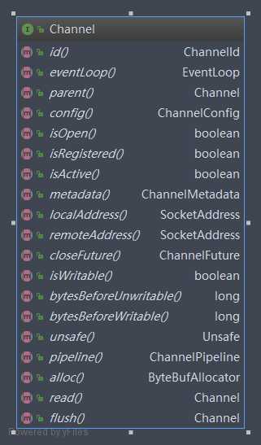
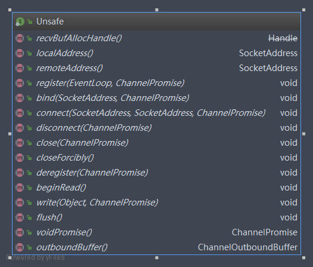
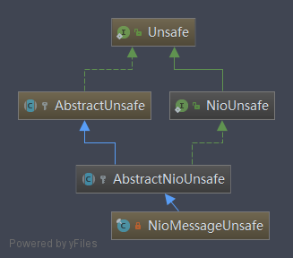

# Channel and Unsafe及相关类学习
类似于NIO的Channel，Netty提供了自己的Channel及其子类实现，用于异步IO和其他相关的操作。

Unsafe是一个内部接口，聚合在Channel中协助进行网络读写相关的操作，因为它的设计初衷就是Channel的内部辅助类，不应该被上层使用者调用，
所以命名为Unsafe，而不能认为它是不安全的操作。

## Channel功能说明
   io.netty.channel.Channel是Netty网络操作抽象类，它聚合了一组功能，包括但不限于网络的读、写，客户端发起连接，主动关闭连接，链路关闭，获取通信双方的网络地址等。
   也包含了Netty框架相关的一些功能，比如获取EventLoop、ByteBufAllocator和Pipeline等。
   
   1. Channel的工作原理
      
      它的设计原理比较简单，但是功能却比较繁杂，主要设计理念如下：
      * 在Channel接口层，采用Facade模式进行统一封装，将网络I/O操作，网络I/O相关的其它操作封装起来，统一对外提供。
      * Channel接口的定义尽量大而全，为SocketChannel和ServerSocketChannel提供统一的视图，由不同子类实现不同的功能，公共功能在抽象父类中实现。
      * 采用聚合而非包含的方式，将相关的功能类聚合在Channel中，由Channel统一负责分配和调度。
      
   2. Channel的功能介绍
    
      Channel网络I/O相关的方法如下：
      
      
      其它常用的API
      1. eventLoop()：Channel需要注册到EventLoop的多路复用器上，用于处理I/O事件，通过eventLoop方法可以获取到Channel注册的EventLoop。
      EventLoop本质上就是处理网络读写事件的Reactor线程。在Netty中，它不仅处理网络事件，也可以执行定时任务和用户自定义task。
      2. metadata()：当创建Socket的时候需要指定TCP参数，例如接收和发送的TCP缓冲区大小、TCP的超时时间，是否重用地址等。
      在Netty中，每个Channel对应一个物理连接，每个连接都有自己的TCP参数配置。所以Channel会聚合一个ChannelMetadata用来对TCP参数提供元数据描述信息，
      通过metadata()方法可以获取当前Channel的TCP参数配置。
      3. parent()：对于服务端Channel而言，它的父Channel为空，对于客户端而言，它的父Channel为创建它的ServerSocketChannel。
      4. id()：获取当前Channel的全局唯一标识id，它的可能生成策略如下：
        * 机器的MAC地址
        * 当前的进程ID
        * 当前系统毫秒数
        * 当前系统纳秒数
        * 32位的随机整形数
        * 32位的自增序列数
   
   3. Channel的源码分析
   
      Channel的实现子类非常多，继承关系复杂，我们抽取最重要的两个io.netty.channel.socket.nio。NioServerSocketChannel和
      io.netty.channel.socket.nio.NioSocketChannel。
      
      1. Channel的主要继承关系类图
      
         
      
         
         
      2. AbstractChannel源码分析
         
         1. 成员变量定义
            ```
            public abstract class AbstractChannel extends DefaultAttributeMap implements Channel {
            
                private static final InternalLogger logger = InternalLoggerFactory.getInstance(AbstractChannel.class);
            
                private static final ClosedChannelException FLUSH0_CLOSED_CHANNEL_EXCEPTION = ThrowableUtil.unknownStackTrace(
                        new ClosedChannelException(), AbstractUnsafe.class, "flush0()");
                private static final ClosedChannelException ENSURE_OPEN_CLOSED_CHANNEL_EXCEPTION = ThrowableUtil.unknownStackTrace(
                        new ClosedChannelException(), AbstractUnsafe.class, "ensureOpen(...)");
                private static final ClosedChannelException CLOSE_CLOSED_CHANNEL_EXCEPTION = ThrowableUtil.unknownStackTrace(
                        new ClosedChannelException(), AbstractUnsafe.class, "close(...)");
                private static final ClosedChannelException WRITE_CLOSED_CHANNEL_EXCEPTION = ThrowableUtil.unknownStackTrace(
                        new ClosedChannelException(), AbstractUnsafe.class, "write(...)");
                private static final NotYetConnectedException FLUSH0_NOT_YET_CONNECTED_EXCEPTION = ThrowableUtil.unknownStackTrace(
                        new NotYetConnectedException(), AbstractUnsafe.class, "flush0()");
            
                private final Channel parent;
                private final ChannelId id;
                private final Unsafe unsafe;
                private final DefaultChannelPipeline pipeline;
                private final VoidChannelPromise unsafeVoidPromise = new VoidChannelPromise(this, false);
                private final CloseFuture closeFuture = new CloseFuture(this);
            
                private volatile SocketAddress localAddress;
                private volatile SocketAddress remoteAddress;
                private volatile EventLoop eventLoop;
                private volatile boolean registered;
                private boolean closeInitiated;
            
                /** Cache for the string representation of this channel */
                private boolean strValActive;
                private String strVal;
            ```   
            首先是定义了一些异常，然后聚合了以下变量：
            * parent：代表父类Channel
            * id：默认方式生成全局唯一id
            * unsafe：封装pipeline读写过程的Unsafe对象
            * pipeline：关联的Pipeline对象
            * eventLoop：当前channel注册的EventLoop
            
         2. 核心API分析 
            
            首先看下网络读写操作，它会触发ChannelPipeline中对应的事件方法。Netty基于事件驱动，我们可以理解位当Channel进行I/O操作时，会产生对应的I/O事件，
            然后驱动事件在ChannelPipeline中传播，由对应的ChannelHandler对事件进行拦截和处理，不关心的事件可以直接忽略。采用事件驱动的方式可以非常轻松地
            通过事件定义来划分事件拦截切面，方便业务的定制和功能扩展，相比AOP，性能更高。
            
            网络I/O操作直接调用DefaultChannelPipeline的相关方法，由DefaultChannelPipeline中相应的ChannelHandler进行具体的逻辑处理。
            ```
            @Override
            public ChannelFuture bind(SocketAddress localAddress) {
                return pipeline.bind(localAddress);
            }
        
            @Override
            public ChannelFuture connect(SocketAddress remoteAddress) {
                return pipeline.connect(remoteAddress);
            }
        
            @Override
            public ChannelFuture connect(SocketAddress remoteAddress, SocketAddress localAddress) {
                return pipeline.connect(remoteAddress, localAddress);
            }
        
            @Override
            public ChannelFuture disconnect() {
                return pipeline.disconnect();
            }
        
            @Override
            public ChannelFuture close() {
                return pipeline.close();
            }
        
            @Override
            public ChannelFuture deregister() {
                return pipeline.deregister();
            }
        
            @Override
            public Channel flush() {
                pipeline.flush();
                return this;
            }
            ```
            AbstractChannel也提供了一些公共API的实现，例如localAddress和remoteAddress
            ```
            @Override
            public SocketAddress localAddress() {
                SocketAddress localAddress = this.localAddress;
                if (localAddress == null) {
                    try {
                        this.localAddress = localAddress = unsafe().localAddress();
                    } catch (Throwable t) {
                        // Sometimes fails on a closed socket in Windows.
                        return null;
                    }
                }
                return localAddress;
            }
            
            @Override
            public SocketAddress remoteAddress() {
                SocketAddress remoteAddress = this.remoteAddress;
                if (remoteAddress == null) {
                    try {
                        this.remoteAddress = remoteAddress = unsafe().remoteAddress();
                    } catch (Throwable t) {
                        // Sometimes fails on a closed socket in Windows.
                        return null;
                    }
                }
                return remoteAddress;
            }
            ```      
      3. AbstractNioChannel源码分析
         
           1. 成员变量定义
               ```
               private final SelectableChannel ch;
               protected final int readInterestOp;
               volatile SelectionKey selectionKey;
               boolean readPending;
               private final Runnable clearReadPendingRunnable = new Runnable() {
                   @Override
                   public void run() {
                       clearReadPending0();
                   }
               };
           
               /**
                * The future of the current connection attempt.  If not null, subsequent
                * connection attempts will fail.
                */
               private ChannelPromise connectPromise;
               private ScheduledFuture<?> connectTimeoutFuture;
               private SocketAddress requestedRemoteAddress;
               ```
               SelectableChannel是java.nio.ServerSocketChannel和java.nio.SocketChannel的公共父类，用于设置SelectableChannel参数和进行I/O操作。
               
               readInterestOp代表JDK SelectionKay的OP_READ。
               
               selectionKey是Channel注册到EventLoop后返回的选择键，由于Channel会面临多个业务线程的并发写操作，所以需要用volatile修饰来保证可见性。
               
               最后定义了代表连接操作结果的ConnectPromise，连接超时定时器ScheduledFuture和请求的通信地址信息。
           
           2. 核心API源码分析
               
               首先是Channel的注册
               ```
               @Override
               protected void doRegister() throws Exception {
                   boolean selected = false;
                   for (;;) {
                       try {
                           selectionKey = javaChannel().register(eventLoop().unwrappedSelector(), 0, this);
                           return;
                       } catch (CancelledKeyException e) {
                           if (!selected) {
                               // Force the Selector to select now as the "canceled" SelectionKey may still be
                               // cached and not removed because no Select.select(..) operation was called yet.
                               eventLoop().selectNow();
                               selected = true;
                           } else {
                               // We forced a select operation on the selector before but the SelectionKey is still cached
                               // for whatever reason. JDK bug ?
                               throw e;
                           }
                       }
                   }
               }
               ```
               定义一个布尔变量selected标识是否注册成功，调用SelectableChannel的register方法，将当前的Channel注册到EventLoop的多路复用器，
               ```
               public abstract SelectionKey register(Selector sel, int ops, Object att)
                       throws ClosedChannelException;
               ```
               注册Channel的时候需要指定监听的网络操作位来表示Channel对哪几类网络事件感兴趣，
               * public static final int OP_READ = 1 << 0;
               * public static final int OP_WRITE = 1 << 2;
               * public static final int OP_CONNECT = 1 << 3;
               * public static final int OP_ACCEPT = 1 << 4;
               
               AbstractNioChannel注册的是0，表示对任何事件都不感兴趣，仅仅完成注册操作。
               注册时可以指定附件，后续Channel接收到网络事件通知时可以从SelectionKey中获取之前的附件，此处将AbstractNioChannel的实现子类自身当作附件注册。
               如果注册成功，则返回SelectionKey，通过SelectionKey可以从多路复用器中获取Channel对象。
               
               下面看一个比较重要的方法：准备处理读操作前需要设置网络操作位为读。
               ```
               @Override
               protected void doBeginRead() throws Exception {
                   // Channel.read() or ChannelHandlerContext.read() was called
                   final SelectionKey selectionKey = this.selectionKey;
                   if (!selectionKey.isValid()) {
                       return;
                   }
           
                   readPending = true;
           
                   final int interestOps = selectionKey.interestOps();
                   if ((interestOps & readInterestOp) == 0) {
                       selectionKey.interestOps(interestOps | readInterestOp);
                   }
               }
               ```
      
      4. AbstractNioByteChannel源码分析
      
         有一个重要的成员变量flushTask负责刷新发送缓存链表中的数据
         ```
         private final Runnable flushTask = new Runnable() {
             @Override
             public void run() {
                 // Calling flush0 directly to ensure we not try to flush messages that were added via write(...) in the
                 // meantime.
                 ((AbstractNioUnsafe) unsafe()).flush0();
             }
         };
         ```
         最主要的方法就是doWrite(ChannelOutboundBuffer in)
         ```
         @Override
         protected void doWrite(ChannelOutboundBuffer in) throws Exception {
             // 获取循环发送的次数，默认为16次 
             int writeSpinCount = config().getWriteSpinCount();
             do {
                 Object msg = in.current();
                 if (msg == null) {
                     // Wrote all messages.
                     clearOpWrite();
                     // Directly return here so incompleteWrite(...) is not called.
                     return;
                 }
                 writeSpinCount -= doWriteInternal(in, msg);
             } while (writeSpinCount > 0);
     
             incompleteWrite(writeSpinCount < 0);
         }
         
         protected final void clearOpWrite() {
             final SelectionKey key = selectionKey();
             // Check first if the key is still valid as it may be canceled as part of the deregistration
             // from the EventLoop
             // See https://github.com/netty/netty/issues/2104
             if (!key.isValid()) {
                 return;
             }
             final int interestOps = key.interestOps();
             if ((interestOps & SelectionKey.OP_WRITE) != 0) {
                 key.interestOps(interestOps & ~SelectionKey.OP_WRITE);
             }
         }
         ```
         从发送消息环形链表ChannelOutboundBuffer弹出一条消息，如果该消息为空，说明消息发送链表里所有的消息都发送完了，取消注册到selector上的OP_WRITE事件，返回。
         如果消息不为空，则继续处理
         ```
         private int doWriteInternal(ChannelOutboundBuffer in, Object msg) throws Exception {
             if (msg instanceof ByteBuf) {
                 ByteBuf buf = (ByteBuf) msg;
                 if (!buf.isReadable()) {
                     // 如果当前消息不可读，则从缓冲链表里删除该消息，继续处理其它消息
                     in.remove();
                     return 0;
                 }
     
                 // 则调用doWriteBytes()方法发送消息，直接写到 Socket 中发送出去，并且返回发送的字节数。
                 final int localFlushedAmount = doWriteBytes(buf);
                 if (localFlushedAmount > 0) {
                     // 调用 in.progress() 更新消息发送的进度
                     in.progress(localFlushedAmount);
                     // 判断当前的 buf 中的数据是否已经全部发送完成，如果完成则从 ChannelOutboundBuffer 缓存链表中删除该消息
                     if (!buf.isReadable()) {
                         in.remove();
                     }
                     // 如果调用 doWriteBytes 发送消息，只要发送的消息字节数大于0，就计入一次循环发送次数
                     return 1;
                 }
             } else if (msg instanceof FileRegion) {
                 FileRegion region = (FileRegion) msg;
                 if (region.transferred() >= region.count()) {
                     in.remove();
                     return 0;
                 }
     
                 long localFlushedAmount = doWriteFileRegion(region);
                 if (localFlushedAmount > 0) {
                     in.progress(localFlushedAmount);
                     if (region.transferred() >= region.count()) {
                         in.remove();
                     }
                     return 1;
                 }
             } else {
                 // Should not reach here.
                 throw new Error();
             }
             // 如果调用 doWriteBytes 发送消息，发送的字节数为0,则返回Integer.MAX_VALUE
             // 直接退出循环发送，稍后再尝试写入
             return WRITE_STATUS_SNDBUF_FULL;
         }
         ```
         ```
         protected final void incompleteWrite(boolean setOpWrite) {
             // Did not write completely.
             if (setOpWrite) {
                 setOpWrite();
             } else {
                 // It is possible that we have set the write OP, woken up by NIO because the socket is writable, and then
                 // use our write quantum. In this case we no longer want to set the write OP because the socket is still
                 // writable (as far as we know). We will find out next time we attempt to write if the socket is writable
                 // and set the write OP if necessary.
                 clearOpWrite();
     
                 // Schedule flush again later so other tasks can be picked up in the meantime
                 // 写半包任务线程
                 eventLoop().execute(flushTask);
             }
         }
         ```
         boolean setOpWrite = writeSpinCount < 0;上面已经分析过，如果调用 doWriteBytes 发送消息，发送的字节数为0，则返回一个WRITE_STATUS_SNDBUF_FULL = Integer.MAX_VALUE值。
         Socket 的 Buffer 已经写满，无法再继续发送数据。这说明该消息还未写完，然后调用 setOpWrite() 方法，在 Selector 上注册写标识。
                                                 
      5. AbstractNioMessageChannel源码分析
      
         我们分析它的doWrite(ChannelOutboundBuffer in)方法
         ```
         @Override
         protected void doWrite(ChannelOutboundBuffer in) throws Exception {
             final SelectionKey key = selectionKey();
             final int interestOps = key.interestOps();
     
             for (;;) {
                 Object msg = in.current();
                 if (msg == null) {
                     // Wrote all messages.
                     // 清楚OP_WRITE标识，退出循环
                     if ((interestOps & SelectionKey.OP_WRITE) != 0) {
                         key.interestOps(interestOps & ~SelectionKey.OP_WRITE);
                     }
                     break;
                 }
                 try {
                     boolean done = false;
                     // 默认循环16次
                     for (int i = config().getWriteSpinCount() - 1; i >= 0; i--) {
                         if (doWriteMessage(msg, in)) {
                             done = true;
                             break;
                         }
                     }
     
                     if (done) {
                         in.remove();
                     } else {
                         // Did not write all messages.
                         if ((interestOps & SelectionKey.OP_WRITE) == 0) {
                             key.interestOps(interestOps | SelectionKey.OP_WRITE);
                         }
                         break;
                     }
                 } catch (Exception e) {
                     if (continueOnWriteError()) {
                         in.remove(e);
                     } else {
                         throw e;
                     }
                 }
             }
         }
         ```
         在循环体内对消息进行发送，从ChannelOutboundBuffer弹出一条消息。具体过程和AbstractNioByteChannel的doWrite很像，
         不同的是，前者可以发送ByteBuf和FileRegion，后者发送的是Object。
         
      6. NioServerSocketChannel源码分析
      
         首先看成员变量
         ```
         private static final ChannelMetadata METADATA = new ChannelMetadata(false, 16);
         private static final SelectorProvider DEFAULT_SELECTOR_PROVIDER = SelectorProvider.provider();
     
         private static final InternalLogger logger = InternalLoggerFactory.getInstance(NioServerSocketChannel.class);
     
         private static ServerSocketChannel newSocket(SelectorProvider provider) {
             try {
                 /**
                  *  Use the {@link SelectorProvider} to open {@link SocketChannel} and so remove condition in
                  *  {@link SelectorProvider#provider()} which is called by each ServerSocketChannel.open() otherwise.
                  *
                  *  See <a href="https://github.com/netty/netty/issues/2308">#2308</a>.
                  */
                 return provider.openServerSocketChannel();
             } catch (IOException e) {
                 throw new ChannelException(
                         "Failed to open a server socket.", e);
             }
         }
     
         // 配置ServerSocketChannel的TCP参数
         private final ServerSocketChannelConfig config;

         ```
         再看下相关的接口实现
         ```
         @Override
         public boolean isActive() {
             return javaChannel().socket().isBound();
         }
     
         @Override
         public InetSocketAddress remoteAddress() {
             return null;
         }
     
         @Override
         protected ServerSocketChannel javaChannel() {
             return (ServerSocketChannel) super.javaChannel();
         }
     
         @Override
         protected SocketAddress localAddress0() {
             return SocketUtils.localSocketAddress(javaChannel().socket());
         }
     
         @Override
         protected void doBind(SocketAddress localAddress) throws Exception {
             if (PlatformDependent.javaVersion() >= 7) {
                 javaChannel().bind(localAddress, config.getBacklog());
             } else {
                 javaChannel().socket().bind(localAddress, config.getBacklog());
             }
         }
         ```
         下面继续ServerSocketChannel的doReadMessages(List<Object> buf)
         ```
         @Override
         protected int doReadMessages(List<Object> buf) throws Exception {
             SocketChannel ch = SocketUtils.accept(javaChannel());
     
             try {
                 if (ch != null) {
                     buf.add(new NioSocketChannel(this, ch));
                     return 1;
                 }
             } catch (Throwable t) {
                 logger.warn("Failed to create a new channel from an accepted socket.", t);
     
                 try {
                     ch.close();
                 } catch (Throwable t2) {
                     logger.warn("Failed to close a socket.", t2);
                 }
             }
     
             return 0;
         }
         ```
         首先通过SocketUtils.accept接收新的客户端连接，如果SocketChannel不为空，则创建新的NioSocketChannel。
         并将其加到List<Object> buf，返回1，表示服务端读取消息成功。
         
      7. NioSocketChannel源码分析
      
         1. 连接操作
            
            我们重点分析与客户端连接相关的API，首先看连接方法的实现
            ```
            @Override
            protected boolean doConnect(SocketAddress remoteAddress, SocketAddress localAddress) throws Exception {
                if (localAddress != null) {
                    doBind0(localAddress);
                }
        
                boolean success = false;
                try {
                    boolean connected = SocketUtils.connect(javaChannel(), remoteAddress);
                    if (!connected) {
                        selectionKey().interestOps(SelectionKey.OP_CONNECT);
                    }
                    success = true;
                    return connected;
                } finally {
                    if (!success) {
                        doClose();
                    }
                }
            }
            ```
            先判断是否需要绑定本地地址。然后调用java.nio.SocketChannel.connect发起TCP连接。连接结果由三种情况
            * 连接成功，返回true
            * 暂时没有连接上，服务器没有返回ACK应答，连接结果不确定，返回fasle。需要设置SelectionKey为OP_CONNECT，继续监听网络连接操作位
            * 连接失败，抛出IOException
         
         2. 写半包
         
            继续分析写操作
            ```
            @Override
            protected void doWrite(ChannelOutboundBuffer in) throws Exception {
                SocketChannel ch = javaChannel();
                // 写操作循环次数，默认16
                int writeSpinCount = config().getWriteSpinCount();
                do {
                    if (in.isEmpty()) {
                        // All written so clear OP_WRITE
                        clearOpWrite();
                        // Directly return here so incompleteWrite(...) is not called.
                        return;
                    }
        
                    // Ensure the pending writes are made of ByteBufs only.
                    // 获取需要发送的总字节数
                    int maxBytesPerGatheringWrite = ((NioSocketChannelConfig) config).getMaxBytesPerGatheringWrite();
                    ByteBuffer[] nioBuffers = in.nioBuffers(1024, maxBytesPerGatheringWrite);
                    // 获取待发送的ByteBuf个数
                    int nioBufferCnt = in.nioBufferCount();
        
                    // Always us nioBuffers() to workaround data-corruption.
                    // See https://github.com/netty/netty/issues/2761
                    switch (nioBufferCnt) {
                        case 0:
                            // We have something else beside ByteBuffers to write so fallback to normal writes.
                            writeSpinCount -= doWrite0(in);
                            break;
                        case 1: {
                            // Only one ByteBuf so use non-gathering write
                            // Zero length buffers are not added to nioBuffers by ChannelOutboundBuffer, so there is no need
                            // to check if the total size of all the buffers is non-zero.
                            ByteBuffer buffer = nioBuffers[0];
                            int attemptedBytes = buffer.remaining();
                            final int localWrittenBytes = ch.write(buffer);
                            if (localWrittenBytes <= 0) {
                                incompleteWrite(true);
                                return;
                            }
                            adjustMaxBytesPerGatheringWrite(attemptedBytes, localWrittenBytes, maxBytesPerGatheringWrite);
                            in.removeBytes(localWrittenBytes);
                            --writeSpinCount;
                            break;
                        }
                        default: {
                            // Zero length buffers are not added to nioBuffers by ChannelOutboundBuffer, so there is no need
                            // to check if the total size of all the buffers is non-zero.
                            // We limit the max amount to int above so cast is safe
                            long attemptedBytes = in.nioBufferSize();
                            final long localWrittenBytes = ch.write(nioBuffers, 0, nioBufferCnt);
                            if (localWrittenBytes <= 0) {
                                incompleteWrite(true);
                                return;
                            }
                            // Casting to int is safe because we limit the total amount of data in the nioBuffers to int above.
                            adjustMaxBytesPerGatheringWrite((int) attemptedBytes, (int) localWrittenBytes,
                                    maxBytesPerGatheringWrite);
                            in.removeBytes(localWrittenBytes);
                            --writeSpinCount;
                            break;
                        }
                    }
                } while (writeSpinCount > 0);
        
                incompleteWrite(writeSpinCount < 0);
            }
            ```
            调用SocketChannel的write方法，它有三个参数，第一个是需要发送的ByteBuffer，第二个是数组的偏移量，迪桑是发送的ByteBuffer的个数。返回值是写入SocketChannel的字节数。
            如果写入字节数 <= 0，说明TCP发送缓冲区已满, 后续再进行写操作。如果大于0，更新attemptedBytes和maxBytesPerGatheringWrite，并释放已写入SocketChannel的字节。
            ```
            if (localWrittenBytes <= 0) {
                incompleteWrite(true);
                return;
            }
            
            protected final void incompleteWrite(boolean setOpWrite) {
                if (setOpWrite) {
                    this.setOpWrite();
                } else {
                    this.clearOpWrite();
                    this.eventLoop().execute(this.flushTask);
                }
        
            }
            ```
         3. 读写操作
         
            NioSocketChannel的读写操作是基于NIO的SocketChannel和Netty的ByteBuf封装而成，
            ```
            @Override
            protected int doReadBytes(ByteBuf byteBuf) throws Exception {
                final RecvByteBufAllocator.Handle allocHandle = unsafe().recvBufAllocHandle();
                allocHandle.attemptedBytesRead(byteBuf.writableBytes());
                return byteBuf.writeBytes(javaChannel(), allocHandle.attemptedBytesRead());
            }
            ```
            实际上就是从SocketChannel中读取L个字节到ByteBuf中，L为ByteBuf可写的字节数
            ```
            public int writeBytes(ScatteringByteChannel in, int length) throws IOException {
                this.ensureWritable(length);
                int writtenBytes = this.setBytes(this.writerIndex, in, length);
                if (writtenBytes > 0) {
                    this.writerIndex += writtenBytes;
                }
        
                return writtenBytes;
            }
            ```
            
## Unsafe功能说明
   Unsafe接口是Channel接口的复制接口，它不应该被用户直接调用，实际的I/O读写操作都是由Unsafe完成的。看一下它的API定义
   
   
## Unsafe源码分析
   1. Unsafe继承关系类图
      
               
   2. AbstractUnsafe源码分析
      1. register方法
         
         register方法主要用于将当前Unsafe对应的Channel注册到EventLoop的多路复用器上，然后调用DefaultPipeLine的fireChannelRegistered方法。
         如果Channel被激活，则调用DefaultPipeLine的fireChannelActive方法。
         ```
         @Override
         public final void register(EventLoop eventLoop, final ChannelPromise promise) {
             if (eventLoop == null) {
                 throw new NullPointerException("eventLoop");
             }
             if (isRegistered()) {
                 promise.setFailure(new IllegalStateException("registered to an event loop already"));
                 return;
             }
             if (!isCompatible(eventLoop)) {
                 promise.setFailure(
                         new IllegalStateException("incompatible event loop type: " + eventLoop.getClass().getName()));
                 return;
             }
 
             AbstractChannel.this.eventLoop = eventLoop;
 
             if (eventLoop.inEventLoop()) {
                 // 当前线程是Channel对应的NioEventLoop线程，不存在并发问题，直接注册。
                 register0(promise);
             } else {
                 try {
                     // 放入NioEventLoop任务队列中执行
                     eventLoop.execute(new Runnable() {
                         @Override
                         public void run() {
                             register0(promise);
                         }
                     });
                 } catch (Throwable t) {
                     logger.warn(
                             "Force-closing a channel whose registration task was not accepted by an event loop: {}",
                             AbstractChannel.this, t);
                     closeForcibly();
                     closeFuture.setClosed();
                     safeSetFailure(promise, t);
                 }
             }
         }
         ```
         下面看register0方法的实现。
         ```
         private void register0(ChannelPromise promise) {
             try {
                 // 首先检查Channel是否被打开
                 if (!promise.setUncancellable() || !ensureOpen(promise)) {
                     return;
                 }
                 boolean firstRegistration = neverRegistered;
                 doRegister();
                 neverRegistered = false;
                 registered = true;
 
                 // Ensure we call handlerAdded(...) before we actually notify the promise. This is needed as the
                 // user may already fire events through the pipeline in the ChannelFutureListener.
                 pipeline.invokeHandlerAddedIfNeeded();
 
                 // 将ChannelFuture状态设置为成功
                 safeSetSuccess(promise);
                 pipeline.fireChannelRegistered();
                 // Only fire a channelActive if the channel has never been registered. This prevents firing
                 // multiple channel actives if the channel is deregistered and re-registered.
                 if (isActive()) {
                     if (firstRegistration) {
                         pipeline.fireChannelActive();
                     } else if (config().isAutoRead()) {
                         // This channel was registered before and autoRead() is set. This means we need to begin read
                         // again so that we process inbound data.
                         //
                         // See https://github.com/netty/netty/issues/4805
                         beginRead();
                     }
                 }
             } catch (Throwable t) {
                 // Close the channel directly to avoid FD leak.
                 closeForcibly();
                 closeFuture.setClosed();
                 safeSetFailure(promise, t);
             }
         }
         
         @Override
         protected void doRegister() throws Exception {
             boolean selected = false;
             for (;;) {
                 try {
                     selectionKey = javaChannel().register(eventLoop().unwrappedSelector(), 0, this);
                     return;
                 } catch (CancelledKeyException e) {
                     if (!selected) {
                         // Force the Selector to select now as the "canceled" SelectionKey may still be
                         // cached and not removed because no Select.select(..) operation was called yet.
                         eventLoop().selectNow();
                         selected = true;
                     } else {
                         // We forced a select operation on the selector before but the SelectionKey is still cached
                         // for whatever reason. JDK bug ?
                         throw e;
                     }
                 }
             }
         }
         ```   
         doRegister方法再前面AbstractNioChannel处已经分析过了。如果该方法没有抛出异常，则说明Channel已经注册成功。
         
      2. bind方法   
         
         bind方法主要用于绑定指定的端口，对于服务端，用于绑定监听端口，可以设置backlog参数。对于客户端，主要用于指定客户端Channel的本地绑定socket地址。
         ```
         @Override
         public final void bind(final SocketAddress localAddress, final ChannelPromise promise) {
             assertEventLoop();
 
             if (!promise.setUncancellable() || !ensureOpen(promise)) {
                 return;
             }
 
             // See: https://github.com/netty/netty/issues/576
             if (Boolean.TRUE.equals(config().getOption(ChannelOption.SO_BROADCAST)) &&
                 localAddress instanceof InetSocketAddress &&
                 !((InetSocketAddress) localAddress).getAddress().isAnyLocalAddress() &&
                 !PlatformDependent.isWindows() && !PlatformDependent.maybeSuperUser()) {
                 // Warn a user about the fact that a non-root user can't receive a
                 // broadcast packet on *nix if the socket is bound on non-wildcard address.
                 logger.warn(
                         "A non-root user can't receive a broadcast packet if the socket " +
                         "is not bound to a wildcard address; binding to a non-wildcard " +
                         "address (" + localAddress + ") anyway as requested.");
             }
 
             boolean wasActive = isActive();
             try {
                 doBind(localAddress);
             } catch (Throwable t) {
                 safeSetFailure(promise, t);
                 closeIfClosed();
                 return;
             }
 
             if (!wasActive && isActive()) {
                 invokeLater(new Runnable() {
                     @Override
                     public void run() {
                         pipeline.fireChannelActive();
                     }
                 });
             }
 
             safeSetSuccess(promise);
         }
         
         ```
         实际在调用doBind方法，这个方法在NioSocketChannel和NioServerSocketChannel有不同的实现.
         客户端实现如下
         ```
         private void doBind0(SocketAddress localAddress) throws Exception {
             if (PlatformDependent.javaVersion() >= 7) {
                 SocketUtils.bind(this.javaChannel(), localAddress);
             } else {
                 SocketUtils.bind(this.javaChannel().socket(), localAddress);
             }
     
         }
         ```
         服务端实现如下
         ```
         protected void doBind(SocketAddress localAddress) throws Exception {
             if (PlatformDependent.javaVersion() >= 7) {
                 this.javaChannel().bind(localAddress, this.config.getBacklog());
             } else {
                 this.javaChannel().socket().bind(localAddress, this.config.getBacklog());
             }
     
         }
         ```
         如果绑定本地接口发送异常，则将异常设置到ChannelPromise中通知ChannelFuture，随后调用closeIfClosed方法来关闭Channel。
      
      3. disconnect方法
      
         disconnect方法用于客户端或服务端主动关闭连接。
         ```
         @Override
         public final void disconnect(final ChannelPromise promise) {
             assertEventLoop();
 
             if (!promise.setUncancellable()) {
                 return;
             }
 
             boolean wasActive = isActive();
             try {
                 doDisconnect();
             } catch (Throwable t) {
                 safeSetFailure(promise, t);
                 closeIfClosed();
                 return;
             }
 
             if (wasActive && !isActive()) {
                 invokeLater(new Runnable() {
                     @Override
                     public void run() {
                         pipeline.fireChannelInactive();
                     }
                 });
             }
 
             safeSetSuccess(promise);
             closeIfClosed(); // doDisconnect() might have closed the channel
         }
         ```
         
