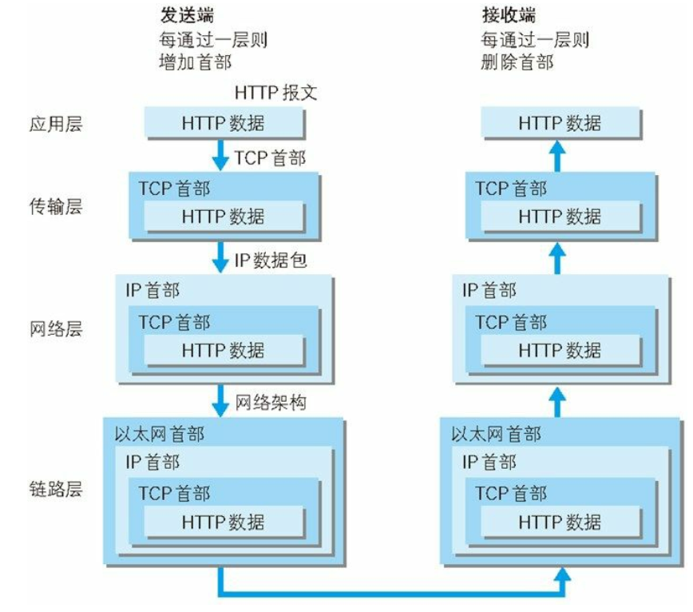

# HTTP协议
## 网络传输

发送端在层与层之间传输数据时，每经过一层时被必定打上一个该层的首部信息。反之，接收端在层与层之间传输数据时，每经过一层时要去掉一个该层的首部信息。

这种把数据信息包装起来的方法叫封装。

## 无状态协议
HTTP是一种无状态协议，不对请求和响应之间的通信状态进行保存。这是为了更快地处理大量请求，确保协议的可伸缩性，特意把HTTP协议设计成如此简单。

但是有时候我们需要保存用户状态，要如何处理呢？可以看看[cookie and session](cookie%20and%20session.md)

## HTTP METHOD
常见的请求方法有GET，POST，PUT，DELETE等等，但是PUT和DELETE主要在Restful架构中才会使用，所以我们主要聊聊GET和POST。

从应用场景来说，GET主要用于无副作用、幂等的场景，如搜索；POST则主要用于有副作用、不幂等的场景，例如添加。

还有其它的区别：
* GET请求能缓存，POST不可以
* POST相比GET安全一些，因为GET请求都包含在URL里，但是POST也可以被抓包工具看到
* GET请求传输的数据有长度限制，由浏览器规定；但POST可以通过请求体传输更多的数据
* POST支持更多的编码类型且不对数据类型作限制

## 持久连接
HTTP协议的初始版本，每进行一次HTTP通信就要断开一次TCP连接，这在以前都是一些小容量的文本传输没多大问题。可随着HTTP的普及，文档中包含大量图片的情况多了起来。

比如，使用浏览器浏览一个包含多张图片的HTML页面时，在发送请求访问HTML页面资源的同时，也会请求该HTML页面里包含的其他资源。
因此，每次的请求都会造成无谓的TCP连接建立和断开，增加通信量的开销。

为解决上述问题，HTTP/1.1引入了持久连接keep-alive的方法，其特点是：只要任意一段没有明确提出断开连接，则保持TCP连接状态。

持久连接的好处在于减少了TCP连接的重复建立和断开所造成的额外开销，减轻了服务器端的负载。另外，减少开销的那部分时间，使HTTP请求和响应能够更早地结束，
这样Web页面的显示速度也就相应提高了。

### pipeline
持久连接使得多数请求以管道化(pipeline)方式发送成为可能。

从前发送请求后需等待并收到响应，才能发送下一个请求。管道化技术出现后，不用等待响应亦可直接发送下一个请求。这样就能够做到同时并行发送多个请求，而不需要一个接一个地等待响应了。

## 报文结构
HTTP报文大致分为报文首部和报文主体两块，两者由最初出现的空行（CR+LF）来划分。通常，并不一定要有报文主体。

## 编码
HTTP在传输数据时可以按照数据原貌直接传输，但也可以在传输过程中通过编码提升传输速率。通过在传输时编码，能有效地处理大量的访问请求。
但是，编码的工作需要计算机来完成，因此会消耗更多的CPU等资源。

HTTP协议中有一种被称为内容编码的功能，指明应用在实体内容上的编码格式，并保持实体信息原样压缩。内容编码后的实体由客户端接收并负责编码。

常见的内容编码有以下几种：
* gzip: GNU zip
* compress: UNIX系统的标准编码
* deflate: zlib
* identity: 不进行编码

### 分块传输编码
在HTTP通信过程中，请求的编码实体资源尚未全部传输完成之前，浏览器无法显示页面。在传输大容量数据时，通过把数据分割成多块，能够让浏览器逐步显示页面。

这种把实体主体分块的功能称为分块传输编码。分块传输编码会将实体主体分成多个部分（块）。每一块都会用十六进制来标记块的大小，
而实体主体的最后一块会使用“0(CR+LF)”来标记。

使用分块传输编码的实体主体会由接收的客户端负责解码，恢复到编码前的实体主体。

## 常用状态码
### 2XX 成功
* 200 OK，表示从客户端发来的请求在服务器端被正确处理
* 204 No content，表示请求成功，但响应报文不包含实体的主体部分
* 206 Partial Content，进行范围请求
### 3XX 重定向
* 301 moved permanently，永久性重定向，表示资源已被分配了新的url
* 302 found，临时性重定向，表示资源临时被分配了新的url
* 303 see other，表示资源存在着另一个url，应使用GET方法获取资源
* 304 not modified，表示服务器允许访问资源，但未满足条件
* 307 temporary redirect，临时重定向，和302含义相同
### 4XX 客户端错误
* 400 bad request，请求报文存在语法错误
* 401 unauthorized，表示发送的请求需要有通过HTTP认证的认证信息
* 403 forbidden，表示对请求资源的访问被服务器拒绝
* 404 not found，表示服务器上没有找到请求的资源
### 5XX 服务器错误
* 500 internal sever error，表示服务器在执行请求时发生了错误
* 503 service unavailable，表明服务器暂时处于超负载或正在停机维护，无法处理请求
