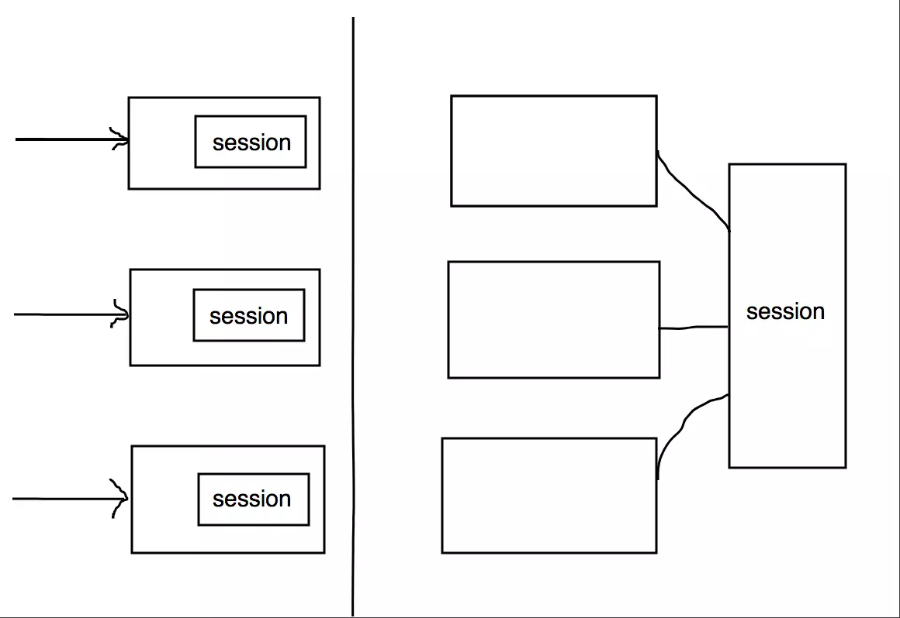

# cookie 和 session浅析
HTTP是无状态协议，通过引入cookie和session体系机制来维护状态信息。即用户第一次访问服务器的时候，服务器响应报头通常会出现一个Set-Cookie响应头，
在本地设置一个cookie（需要浏览器支持cookie功能），下次请求是会带着这个cookie过去，cookie存有sessionId这样的信息。

## cookie
cookie是服务器向浏览器发送的少量信息，以K-V的形式存在。
### cookie机制原理
浏览器请求服务器时，如果服务器需要记录用户状态，就会使用response给浏览器设置一个cookie。当浏览器再次请求服务器时，浏览器会把请求的网址连同该cookie一同
发送给服务器。服务器通过检查该cookie获取用户状态。
### cookie属性
* name：cookie的名字，一旦创建，名字不可更改
* value：cookie的值
* comment：cookie的说明，在浏览器上会显示
* domain：该cookie所属的域名。如果设置为“.baidu.com”，则所有以“baidu.com”结尾的域名都可以访问该Cookie；第一个字符必须为“.”
* path：访问该cookie的路径，如path=/app/，则只有contextPath为“/app”的程序可以访问该Cookie
* Max-Age/expires：cookie的超时时间，Max-Age的单位秒，expires是设置一个具体时间
* secure：该cookie是否仅被安全协议传输，如HTTPS等
* isHttpOnly：该属性用来限制非HTTP协议对客户端cookie进行访问，唯一的方式是使用AJAX从服务器请求cookie，这样能防止XSS攻击
### Cookie同源与跨域
浏览器有同源策略，
> URL由协议、域名、端口和路径组成，如果两个URL的协议、域名和端口相同，则表示它们同源。浏览器的同源策略，限制了来自不同源的document或脚本，
对当前document读取或设置某些属性。

对于cookie来说，cookie的同源只关注域名，是忽略协议和端口的，所以一般情况，https://localhost:80/和http://localhost:8080/的cookie是共享的。

cookie是不可跨越的，在没有经过任何处理情况下，二级域名相同也是不行的：wenku.baidu.com和baike.baidu.com。

## session
与cookie不同，session是在服务端保存。
### session机制原理
当浏览器请求创建session时，服务器会先检查这个请求里是否包含sessionId。

sessionId的值一般是一个既不会重复，又不容易仿造的字符串，这个sessionId会被放在响应中返回给客户端保存，大多用cookie保存session。
### session的有效期
单进程session一般存放在内存，而内存大小有限，因此需要一种过期的机制来防止session的堆积。
### 分布式session
在分布式系统中，需要考虑将session存放在一个独立的机器上，来达到各节点之间的session共享。

session独立部署的方式有很多，可以是一个独立的数据库服务，也可以是一个缓存服务(Redis)。