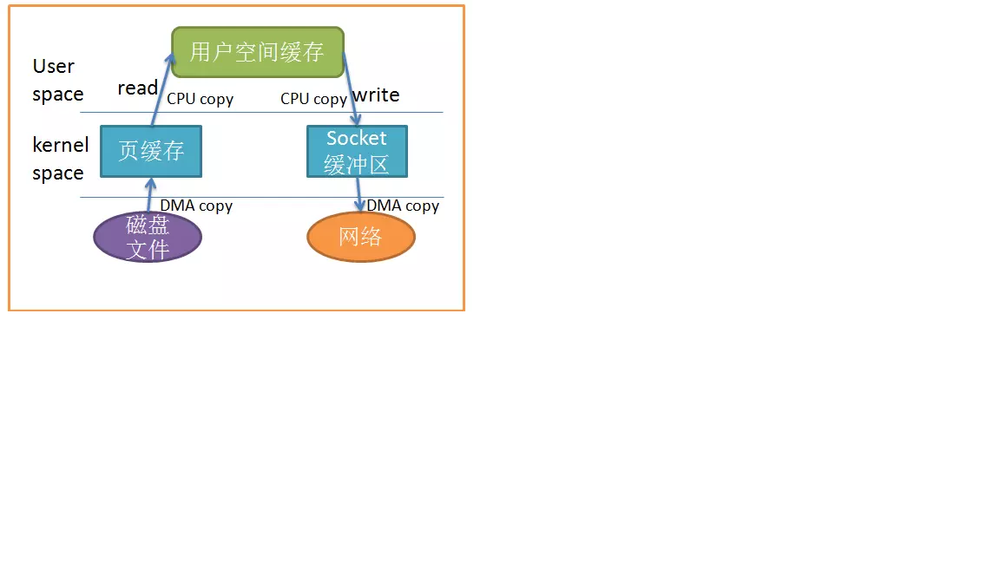
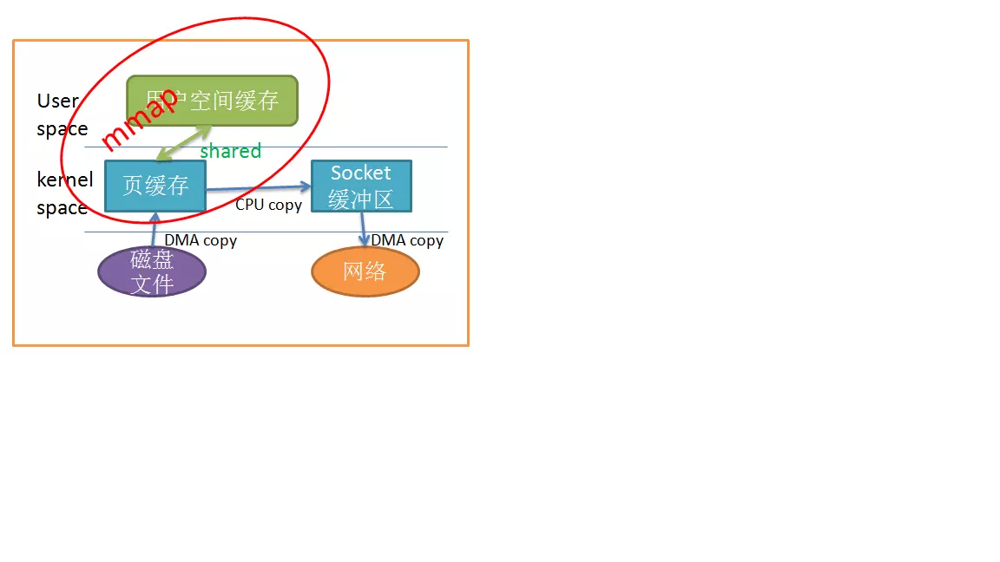
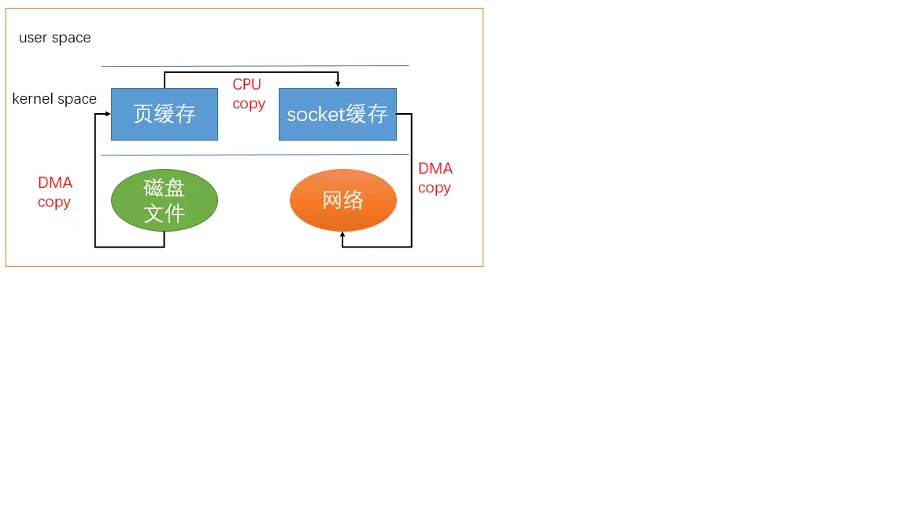
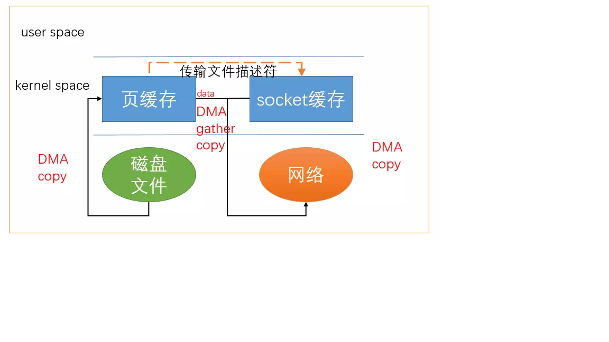

# 零拷贝技术
在学习Netty和消息中间件时经常看到零拷贝技术，在此做一个总结。
## 什么是零拷贝
web应用程序大多具备文件下载的功能，先要将文件从磁盘读出来，再通过网络发出去，由于Linux默认是缓冲I/O，我们通常会使用下列两个系统调用，
```
read(file, tmp_buf, len);
write(socket, tmp_buf, len);
```
看起来很简单，但是在这两个系统调用的背后，数据至少被复制的四次，并且还有多次用户态和内核态的切换。



由图可知，即使使用DMA来处理和硬件的通讯，CPU也需要处理两次数据拷贝。

然而在此过程中，我们并没有对数据进行修改，将数据来回拷贝无疑是一种浪费，而零拷贝主要就是为了解决这个问题。
## mmap
减少拷贝次数的一种方法是通过调用mmap()来代替read调用，
```
tmp_buf = mmap(file, len);
write(sockfd, tmp_buf, len);
```
应用程序调用mmap()，磁盘上的数据会通过DMA被拷贝到内核缓冲区，然后操作系统会将这块内核缓冲区与应用程序共享，这样就不需要将内核缓冲区的数据拷贝到用户空间，
这就是所谓的**内存映射**。然后应用程序调用write()，操作系统会直接将内核缓冲区的数据拷贝到socket缓冲区，这一切都发生在内核态，最后socket缓冲区再将数据发给网卡。



使用mmap调用少了一次数据的拷贝，当大量数据被传输时，会产生相当好的效果。

但是使用mmap有一个陷阱，当内存映射了一个文件时，然后调用write，而另一个进程截断相同的文件时。这个write调用会被总线错误信号SIGBUS中断，因为write访问了非法地址。
SIGBUS信号默认会杀死你的进程并产生一个coredump文件。通常有两种方法可以解决这个问题：
1. 为SIGBUS信号准备一个处理程序，处理程序中直接返回。这样做，write调用会返回在中断之前写入的字节数，并且将error设置为success。但是这个方法治标不治本，所以一般不建议使用。
2. 使用文件租借锁，我们为此文件向内核申请一个文件租借锁。当另一个进程试图截断这个文件时，操作系统会发送一个实时信号RT_SIGNAL_LEASE信号。表示内核正在破坏加在文件上的读写锁。
在程序访问非法地址并被SIGBUS中断之前，write调用会被中断。write调用会返回在中断之前写入的字节数，并且将error设置为success。

```
if(fcntl(diskfd, F_SETSIG, RT_SIGNAL_LEASE) == -1) {
    perror("kernel lease set signal");
    return -1;
}
/* l_type can be F_RDLCK F_WRLCK  加锁*/
/* l_type can be  F_UNLCK 解锁*/
if(fcntl(diskfd, F_SETLEASE, l_type)){
    perror("kernel lease set type");
    return -1;
}
```
我们应该在mmap文件之前加锁，并且在操作完文件后解锁。

## sendfile
在内核版本2.1中，引入了sendfile系统调用，以简化网络和两个本地文件之间的传输。sendfile的引入不仅减少了文件拷贝，还减少了用户态和内核态的切换。
```
sendfile(int out_fd, int in_fd, off_t *offset, size_t count);
```
sendfile调用在in_fd和out_fd两个文件描述符之间传送数据。out_fd必须指向一个socket，in_fd必须指向mmap文件，sendfile只能将数据从文件传递到套接字上，反之则不行。



如果另一个进程截断了我们用sendfile系统调用发送的文件会如何？

如果我们没有任何信号处理程序，sendfile调用只需返回被中断之前写入的字节数，并且将error设置为success。
如果我们之前申请了文件租借锁，sendfile的行为仍然和之前一样，我们还是会收到RT_SIGNAL_LEASE信号。

到目前为止，我们将拷贝次数减少至一次。就是页缓存到socket缓存的拷贝。那么能不能把这个拷贝也省略呢？

借助于硬件上的帮助，我们是可以办到的。之前我们是把页缓存的数据拷贝到socket缓存中，实际上，我们可以仅仅把缓冲区描述符传给socket缓冲区，再把长度传过去。
这样DMA直接将内核缓冲区的数据打包发送到网络就可以了。这对于用户程序没有任何更改。

总结一下，sendfile调用将利用DMA将数据从磁盘拷贝到内核缓冲区，然后将带有文件位置和长度信息的缓冲区描述符传给socket缓冲区，这一步不会将数据拷贝到socket缓冲区，
DMA会直接将内核缓冲区的数据发送给网络，避免了最后一次拷贝。

