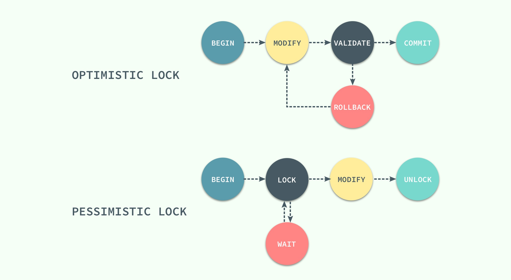
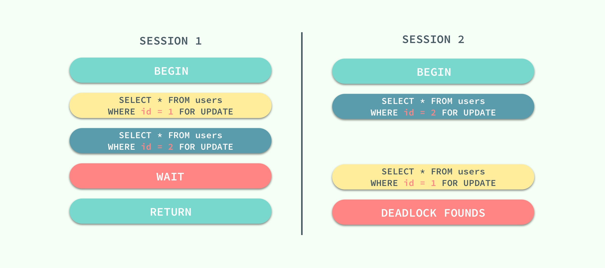

# Innodb 锁和事务
我们都知道锁的种类一般分为乐观锁和悲观锁两种，InnoDB 存储引擎中使用的就是悲观锁，而按照锁的粒度划分，也可以分成行锁和表锁。

## 并发控制机制
乐观锁和悲观锁其实都是并发控制的机制，同时它们在原理上就有着本质的差别
* 乐观锁是一种思想，它其实并不是一种真正的锁。它会先尝试对资源进行修改，在写回时判断资源是否进行了改变，
如果没有发生改变就会写回，否则就会进行重试，在整个的执行过程中其实都没有对数据库进行加锁；
* 悲观锁就是一种真正的锁了，它会在获取资源前对资源进行加锁，确保同一时刻只有有限的线程能够访问该资源，
其他想要尝试获取资源的操作都会进入等待状态，直到该线程完成了对资源的操作并且释放了锁后，其他线程才能重新操作资源；

虽然乐观锁和悲观锁在本质上并不是同一种东西，一个是一种思想，另一个是一种真正的锁，但是它们都是一种并发控制机制。


乐观锁不会存在死锁的问题，但是由于更新后验证，所以当 **冲突频率** 和 **重试成本** 较高时更推荐使用悲观锁，
而需要非常高的 **响应速度** 并且 **并发量** 非常大的时候使用乐观锁就能较好的解决问题，在这时使用悲观锁就可能出现严重的性能问题。

## 锁的种类
对数据的操作其实只有两种，也就是读和写，而数据库在实现锁时，也会对这两种操作使用不同的锁。

InnoDB 实现了标准的行级锁，也就是共享锁（Shared Lock）和互斥锁（Exclusive Lock）；共享锁和互斥锁的作用其实非常好理解：
* 共享锁（读锁）：允许事务对一条行数据进行读取
* 互斥锁（写锁）：允许事务对一条行数据进行删除或更新

而它们的名字也暗示着各自的另外一个特性，共享锁之间是兼容的，而互斥锁与其他任意锁都不兼容。


稍微对它们的使用进行思考就能想明白它们为什么要这么设计，因为共享锁代表了读操作、互斥锁代表了写操作，
所以我们可以在数据库中并行读，但是只能串行写，只有这样才能保证不会发生线程竞争，实现线程安全。

## 锁的粒度
无论是共享锁还是互斥锁其实都只是对某一个数据行进行加锁，InnoDB 支持多种粒度的锁，也就是行锁和表锁。
为了支持多粒度锁定，InnoDB 存储引擎引入了意向锁（Intention Lock），意向锁就是一种表级锁。

与上一节中提到的两种锁的种类相似的是，意向锁也分为两种：
* 意向共享锁：事务想要获得表中某些记录的共享锁，需要在表上先加意向共享锁
* 意向互斥锁：事务想要获得表中某些记录的互斥锁，需要在表上先加意向互斥锁


意向锁其实不会阻塞全表扫描之外的任何请求，它们的主要目的是为了表示 **是否有人请求锁定表中的某一行数据**。
> 有的人可能会对意向锁的目的并不是完全的理解，我们在这里可以举一个例子：如果没有意向锁，当已经有人使用行锁对表中的某一行进行修改时，
如果另外一个请求要对全表进行修改，那么就需要对所有的行是否被锁定进行扫描，在这种情况下，效率是非常低的；
不过，在引入意向锁之后，当有人使用行锁对表中的某一行进行修改之前，会先为表添加意向互斥锁（IX），再为行记录添加互斥锁（X），
在这时如果有人尝试对全表进行修改就不需要判断表中的每一行数据是否被加锁了，只需要通过等待意向互斥锁被释放就可以了。

## 锁的算法
这一小节将介绍锁是如何添加到对应的数据行上的，我们会分别介绍三种锁的算法：Record Lock、Gap Lock 和 Next-Key Lock。
### Record Lock
记录锁（Record Lock）是加到索引记录上的锁，假设我们存在下面的一张表 users：
```
CREATE TABLE users(
    id INT NOT NULL AUTO_INCREMENT,
    last_name VARCHAR(255) NOT NULL,
    first_name VARCHAR(255),
    age INT,
    PRIMARY KEY(id),
    KEY(last_name),
    KEY(age)
);
```
如果我们使用 id 或者 last_name 作为 SQL 中 WHERE 语句的过滤条件，那么 InnoDB 就可以通过索引建立的 B+ 树找到行记录并添加索引，
但是如果使用 first_name 作为过滤条件时，由于 InnoDB 不知道待修改的记录具体存放的位置，也无法对将要修改哪条记录提前做出判断就会锁定整个表。

### Gap Lock
间隙锁（Gap Lock）是对索引记录中的一段连续区域的锁；当使用类似 SELECT * FROM users WHERE id BETWEEN 10 AND 20 FOR UPDATE; 的 SQL 语句时，
就会阻止其他事务向表中插入 id = 15 的记录，因为整个范围都被间隙锁锁定了。
> 间隙锁是存储引擎对于性能和并发做出的权衡，并且只用于某些事务隔离级别。

虽然间隙锁中也分为共享锁和互斥锁，不过它们之间并不是互斥的，也就是不同的事务可以同时持有一段相同范围的共享锁和互斥锁，它唯一阻止的就是 **其他事务向这个范围中添加新的记录**。

### Next-Key Lock
Next-Key 锁相比前两者就稍微有一些复杂，它是记录锁和间隙锁的结合，在 users 表中有以下记录：
```
+------|-------------|--------------|-------+
|   id | last_name   | first_name   |   age |
|------|-------------|--------------|-------|
|    4 | stark       | tony         |    21 |
|    1 | tom         | hiddleston   |    30 |
|    3 | morgan      | freeman      |    40 |
|    5 | jeff        | dean         |    50 |
|    2 | donald      | trump        |    80 |
+------|-------------|--------------|-------+
```
如果使用 Next-Key 锁，那么 Next-Key 锁就可以在需要的时候锁定以下的范围：
```
(-∞, 21]
(21, 30]
(30, 40]
(40, 50]
(50, 80]
(80, ∞)
```
> 既然叫 Next-Key 锁，锁定的应该是当前值和后面的范围，但是实际上却不是，Next-Key 锁锁定的是当前值和前面的范围。

当我们更新一条记录，比如 SELECT * FROM users WHERE age = 30 FOR UPDATE;，InnoDB 不仅会在范围 (21, 30] 上加 Next-Key 锁，
还会在这条记录后面的范围 (30, 40] 加间隙锁，所以插入 (21, 40] 范围内的记录都会被锁定。

Next-Key 锁的作用其实是为了解决幻读的问题。

关于 Next-Key 锁，可以阅读这一篇：[https://www.cnblogs.com/zhoujinyi/p/3435982.html](https://www.cnblogs.com/zhoujinyi/p/3435982.html)
### 死锁的发生
既然 InnoDB 中实现的锁是悲观的，那么不同事务之间就可能会互相等待对方释放锁造成死锁，最终导致事务发生错误；想要在 MySQL 中制造死锁的问题其实非常容易


两个会话都持有一个锁，并且尝试获取对方的锁时就会发生死锁，不过 MySQL 也能在发生死锁时及时发现问题，并保证其中的一个事务能够正常工作，这对我们来说也是一个好消息。

## 事务与隔离级别
事务包括原子性在内的 ACID 四大特性：原子性（Atomicity）、一致性（Consistency）、隔离性（Isolation）和持久性（Durability）
这里要介绍的就是事务的四种隔离级别。
### 几种隔离级别
事务的隔离性是数据库处理数据的几大基础之一，而隔离级别其实就是提供给用户用于在性能和可靠性做出选择和权衡的配置项。

ISO 和 ANIS SQL 标准制定了四种事务隔离级别，而 InnoDB 遵循了 SQL:1992 标准中的四种隔离级别：READ UNCOMMITED、READ COMMITED、REPEATABLE READ 和 SERIALIZABLE；
每个事务的隔离级别其实都比上一级多解决了一个问题：
* READ UNCOMMITED: 使用查询语句不会加锁，可能会读到未提交的行（脏读/Dirty Read）
* READ COMMITED: 只对记录加记录锁，而不会在记录之间加间隙锁，所以允许新的记录插入到被锁定记录的附近，
所以再多次使用查询语句时，可能得到不同的结果（不可重复读/Non-Repeatable Read）
* REPEATABLE READ: 多次读取同一范围的数据会返回第一次查询的快照，不会返回不同的数据行，但是可能发生幻读（Phantom Read）
* SERIALIZABLE: InnoDB 隐式地将全部的查询语句加上共享锁，解决了幻读的问题

MySQL 中默认的事务隔离级别就是 REPEATABLE READ，但是它通过 Next-Key 锁也能够在某种程度上解决幻读的问题。


接下来，我们将数据库中创建如下的表并通过个例子来展示在不同的事务隔离级别之下，会发生什么样的问题
```
CREATE TABLE test(
    id INT NOT NULL,
    UNIQUE(id)
);
```
### 脏读
> 在一个事务中，读取了其他事务未提交的数据。

当事务的隔离级别为 READ UNCOMMITED 时，我们在 SESSION 2 中插入的未提交数据在 SESSION 1 中是可以访问的。


### 不可重复读
> 在一个事务中，同一行记录被访问了两次却得到了不同的结果。

当事务的隔离级别为 READ COMMITED 时，虽然解决了脏读的问题，但是如果在 SESSION 1 先查询了一行数据，在这之后 SESSION 2 中修改了同一行数据并且提交了修改，
在这时，如果 SESSION 1 中再次使用相同的查询语句，就会发现两次查询的结果不一样。


不可重复读的原因就是，在 READ COMMITED 的隔离级别下，存储引擎不会在查询记录时添加行锁，锁定 id = 3 这条记录。
### 幻读
> 在一个事务中，同一个范围内的记录被读取时，其他事务向这个范围添加了新的记录。

重新开启了两个会话 SESSION 1 和 SESSION 2，在 SESSION 1 中我们查询全表的信息，没有得到任何记录；在 SESSION 2 中向表中插入一条数据并提交；
由于 REPEATABLE READ 的原因，再次查询全表的数据时，我们获得到的仍然是空集，但是在向表中插入同样的数据却出现了错误。


这种现象在数据库中就被称作幻读，虽然我们使用查询语句得到了一个空的集合，但是插入数据时却得到了错误，好像之前的查询是幻觉一样。

在标准的事务隔离级别中，幻读是由更高的隔离级别 SERIALIZABLE 解决的，但是它也可以通过 MySQL 提供的 Next-Key 锁解决：


REPEATABLE READ 和 READ UNCOMMITED 其实是矛盾的，如果保证了前者就看不到已经提交的事务，如果保证了后者，就会导致两次查询的结果不同。
MySQL 为我们提供了一种折中的方式，能够在 REPEATABLE READ 模式下加锁访问已经提交的数据，其本身并不能解决幻读的问题，而是通过前面提到的 Next-Key 锁来解决。