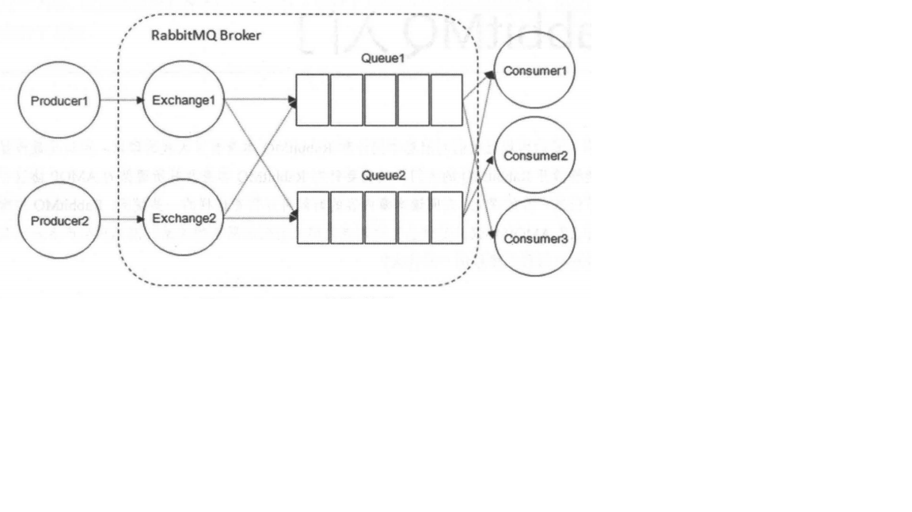
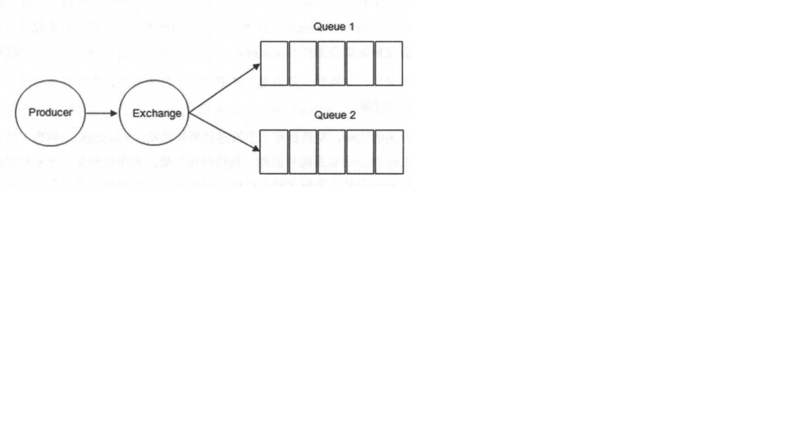
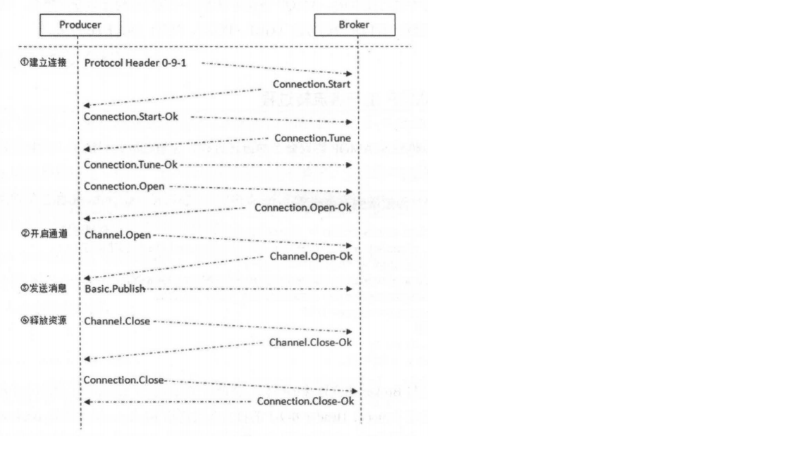
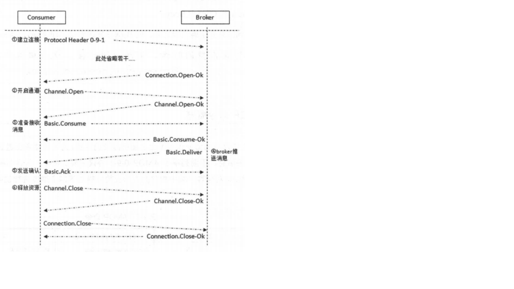

# RabbitMQ相关概念介绍
RabbitMQ整体上是一个生产者与消费者模型，主要负责接收、存储和转发消息。可以把消息传递的过程想象成：
当你将一个包裹送到邮局，邮局会暂存并最终将邮件通过邮递员送到收件人的手上，RabbitMQ就好比由邮局、邮箱和邮递员
组成的一个系统。从计算机术语层面来说，RabbitMQ模型更像是一种交换机模型。

RabbitMQ的整体架构如图，


## 生产者和消费者
Producer：生产者，就是投递消息的一方。

生产者创建消息，然后发布到RabbitMQ中。消息一般包含2部分：消息体和标签(label)。消息体也可以称之为payload，在实际应用中，消息体一般是一个带有业务逻辑结构的数据，比如一个JSON字符串。
当然可以进一步对这个消息体进行序列化操作。消息的标签用来表述这条消息，比如一个交换机的名称和一个路由键。生产者把消息交由RabbitMQ，RabbitMQ之后会根据标签把消息发送给感兴趣的消费者(Consumer)。

Consumer：消费者，就是接收消息的一方。

消费者连接到RabbitMQ服务器，并订阅到队列上。当消费者消费一条消息时，只是消费消息的消息体(payload)。在路由的过程中，消息的标签会丢弃，存入到队列中的消息只有消息体，消费者也只会消费消息体，
也就不知道消息的生产者是谁，当然也不需要知道。

Broker：消息中间件的服务节点。

对于RabbitMQ来说，一个RabbitMQ Broker可以简单地看作一个RabbitMQ服务节点，或者RabbitMQ服务实例。大多数情况也可以将一个RabbitMQ Broker看作一台RabbitMQ服务器。

下图展示了生产者将消息存入RabbitMQ Broker，以及消费者从Broker中消费数据的整个流程。

首先生产者将业务方数据进行可能的包装，之后封装成消息，发送(AMQP协议里这个动作对应的命令为Basic.Publish)到Broker中。
消费者订阅并接收消息(AMQP协议里这个动作对应的命令为Basic.Consume或Basic.Get)，经过可能的解包处理得到原始的数据，之后再进行业务处理逻辑。
这个业务处理逻辑并不一定需要和接收消息的逻辑使用同一个线程。消费者进程可以使用另一个线程去接收消息，存入到内存中，比如使用Java的BlockingQueue。
业务逻辑处理使用另一个线程从内存中读取数据，这样可以将应用进一步解耦，提高整个应用的处理效率。


## 队列
Queue：队列，是RabbitMQ的内部对象，用于存储消息。

RabbitMQ中消息只能存储在队列中，这一点和Kafka相反。Kafka将消息存储在topic这个逻辑层面，而相对应的队列逻辑只是topic实际存储文件中的位移标识。
RabbitMQ的生产者生产消息并最终投递到队列中，消费者可以从队列中获取消息并消费。

多个消费者可以订阅同一个队列，这时队列中的消息会被平均分摊(Round-Robin,即轮询)给多个消费者处理，而不是每个消费者都收到所有的消息并处理。

RabbitMQ不支持队列层面的广播消费，如果需要广播消费，需要在其上进行二次转发，处理逻辑也变得极为复杂，同时也不建议这么做。


## 交换器、路由键、绑定
Exchange：交换器。生产者将消息发送到Exchange，由交换器将消息路由到一个或多个队列中。如果路由不到，或许会返回给生产者，或许直接丢弃。
Exchange的具体示意图如下

RabbitMQ中交换器有四种类型，不同的类型有不同的路由策略，这在下面介绍。

RoutingKey：路由键。生产者将消息发送给交换器的时候，一般会指定一个RoutingKey，用来指定这个消息的路由规则，而这个RoutingKey需要与交换器类型和绑定键(BindingKey)联合使用才能最终生效。

在交换器类型和绑定键(BindingKey)固定的情况下，生产者可以在发送消息给交换器时，通过指定RoutingKey来决定消息流向哪里。

Binding：绑定。RabbitMQ中通过绑定将交换器和队列关联起来，在绑定的时候一般会指定一个绑定键(RoutingKey)。这样RabbitMQ就知道如何正确地将消息路由到队列了，


生产者将消息发送给交换器时，需要一个RoutingKey，当BindingKey和RoutingKey想匹配的时候，消息会被路由到相应的队列。在绑定多个队列到同一个交换器的时候，这些绑定运行使用相同的BindingKey。
BindingKey并不是所有的情况下都生效，它依赖于交换器类型，比如fanout类型的交换器就会无视BindingKey，而是将消息路由到所有绑定到该交换器的队列。

## 交换器类型
RabbitMQ常用的交换器类型有fanout、direct、topic和headers这四种。AMQP协议里还提到另外两种：System和自定义。
* fanout：它会把所有发送到该交换器的消息路由到所有与该交换器绑定的队列中。
* direct：direct类型的交换器路由规则非常简单，它会把消息路由到那些BindingKey和RoutingKey完全匹配的队列中。
  
  如下图，交换器的类型为direct，如果我们发送一条消息，并在发送消息的时候设置路由键为"warning"，则消息会路由到Queue1和Queue2，对应的实例代码如下
  ```
  channel.basicPublish(EXCHANGE_NAME, "warning", MessageProperties.PERSISTENT_TEXT_PLAIN,
                  message.getBytes());
  ```  
  
  如果在发送消息的时候设置路由键为"info"或者"debug"，消息只会路由到Queue。如果以其他的路由键发送消息，则消息不会路由到这两个队列中。
* topic：前面讲到direct类型的交换器路由规则是完全匹配BindingKey和RoutingKey，但是这种严格的匹配方式在很多情况下不能满足实际业务的需求。
topic类型的交换器在匹配规则上进行了扩展，它与direct类型的交换器相似，也是将消息路由到BindingKey和RoutingKey相匹配的队列中，但这里的匹配规则有些不同：
    1. RoutingKey为一个点号"."分隔的字符串(被点号"."分隔开的每一段独立的字符串称为一个单词)，如com.rabbitmq.client、java.util.concurrent、com.hidden.client。
    2. BindingKey和RoutingKey一样也是点号"."分隔的字符串。
    3. BindingKey中可以存在两种特殊字符串"\*"和"#"，用于做模糊匹配，其中"\*"用于匹配一个单词，"#"用于匹配多规格单词(可以是零个)。
* headers：headers类型的交换器不依赖于路由键的匹配规则来路由消息，而是根据发送的消息内容中的headers属性进行匹配。在绑定队列和交换器时制定一组键值对，当发送消息到交换器时，
RabbitMQ会获取到该消息的headers，对比其中的键值对是否完全匹配队列和交换器绑定时指定的键值对，如果完全匹配则消息路由到该队列，否则不会路由到该队列。headers类型的交换器性能会很差，而且也不实用，基本上不会看到它的存在。

## RabbitMQ运转流程
再来回顾整个消息队列的使用过程，在最初的状态下，生产者发送消息的时候：
1. 生产者连接到RabbitMQ Broker，建立一个连接(Connection)，开启一个信道(Channel)。
2. 生产者声明一个交换器，并设置相关属性，比如交换器类型、是否持久化等等
3. 生产者声明一个队列并设置相关属性，比如是否排他、是否持久化、是否自动删除等等。
4. 生产者通过BindingKey将交换器和队列绑定起来。
5. 生产者发送消息至RabbitMQ Broker，其中包含路由键、交换器等信息。
6. 相应的交换器根据接收的RoutingKey查找相匹配的队列。
7. 如果找到，则将从生产者发送过来的消息存入相应的队列中。
8. 如果没找到，则根据生产者配置的属性选择丢弃还是回退给生产者。
9. 关闭信道。
10. 关闭连接


消费者接收消息的过程：
1. 消费者连接到RabbitMQ Broker，建立一个连接(Connection)，开启一个信道(Channel)。
2. 消费者向RabbitMQ Broker请求消费相应队列中的消息，可能会设置相应的回调函数，以及做一些准备工作。
3. 等待RabbitMQ Broker回应并投递相应队列中的消息，消费者接收消息。
4. 消费者确认(ack)接收到的消息。
5. RabbitMQ从队列中删除已确认的消息。
6. 关闭信道。
7. 关闭连接。

我们又引入两个新的概念：Connection和Channel。我们知道无论时生产者还是消费者，都需要和RabbitMQ Broker建立TCP连接，也就是Connection。
一旦TCP连接被建立起来，客户端紧接着可以创建一个AMQP信道(Channel)，每个信道都会被指派一个唯一的ID。信道是建立在Connection上面的虚拟连接，
RabbitMQ处理每条AMQP指令都是通过信道完成的。


我们完全可以直接使用Connection就能完成信道的工作，为什么还要引入信道呢?试想这样一个场景，一个应用程序中有很多个线程需要从RabbitMQ中消费消息，或者生产消息，
那么必然需要建立很多个Connection，也就是许多个TCP连接。然而对于操作系统而言，建立和销毁TCP连接是非常昂贵的开销，如果遇到使用高峰，性能瓶颈也随之显现。RabbitMQ采用
类似NIO(Non-blocking I/O)的做法，选择TCP连接复用，不仅可以减少性能开销，同时也便于管理。

每个线程持有一个Channel，所以Channel服用了Connection的TCP连接。同时RabbitMQ可以确保每个线程的私密性，就像拥有独立的连接一样。
当每个信道的流量不是很大时，复用单一的Connection可以在产生性能瓶颈的情况下有效地节省TCP连接资源。但是当信道本身的流量很大时，
这时候多个信道复用一个Connection就会产生性能瓶颈，进而使整体的流量被限制了。此时就需要开辟多个Connection，将这些信道均摊到这些 Connection中。

信道在AMQP中是一个很重要的概念，大多数操作都是在信道这个层面展开的。


## AMQP协议介绍
从前面的内容可以了解到RabbitMQ是遵从AMQP协议的，换句话说，RabbitMQ就是AMQP协议的Erlang的实现。AMQP的模型架构
和RabbitMQ的模型架构是一样的，生产者将消息发送给交换器，交换器和队列绑定。当生产者发送消息时所携带的RoutingKey与绑定时的BindingKey相匹配时，
消息即被存入相应的队列之中。消费者可以订阅相应的队列来获取消息。

AMQP协议本身包括三层：
* Module Layer：位于协议最高层，主要定义了一些供客户端调用的命令，客户端可以利用这些命令实现自己的业务逻辑。
例如，客户端可以使用Queue.Declare命令声明一个队列或者使用Basic.Consume订阅消费一个队列中的消息。
* Session Layer：位于中间层，主要负责将客户端的命令发送给服务器，再将服务端的应答返回给客户端，
主要为客户端与服务器之间的通信提供可靠性同步机制和错误处理。
* Transport Layer：位于最底层，主要传输二进制数据流，提供帧的处理、信道复用、错误检测和数据表示等。

AMQP说到底还是一个通信协议，通信协议都会涉及报文交互，从low-level举例来说，AMQP本身是应用层的协议，其填充于TCP协议层的数据部分。
而从high-level来说，AMQP是通过协议命令进行交互的。AMQP协议可以看作一系列结构化命令的集合，这里的命令代表一种操作，
类似于HTTP中的方法(GET、POST、PUT、DELETE等)。

1. AMQP生产者协议流转
   
   为了形象说明AMQP协议命令的流转过程，这里截取生产者关键代码
   ```
   Connection connection = factory.newConnection(); // 创建连接
   Channel channel = connection.createChannel(); // 创建通道
   // 发送一条持久化的消息: hello world!
   String message = "hello world!";
   channel.basicPublish(EXCHANGE_NAME, ROUTING_KEY, MessageProperties.PERSISTENT_TEXT_PLAIN,
           message.getBytes());

   // 关闭资源
   channel.close();
   connection.close();
   ```
   当客户端与Broker建立连接时，会调用factory.newConnection方法，这个方法会进一步封装成Protocol Header 0-9-1 的报文头发给Broker，以此通知Broker本次交互采用的是
   AMQP 0-9-1协议，紧接着Broker返回Connection.Start来建立连接，在连接过程中涉及Connection.Start/.Start-Ok、Connection.Tune/.Tune-Ok、Connection.Open/.Open-OK这6个命令的交互。
   
   当客户端调用connection.createChannel方法准备开启信道时，其包装Channel.Open命令发送给Broker，等待Channel.Open-Ok命令。
   
   当客户端发送消息的时候，需要调用channel.basicPublish方法，对应的AMQP命令是Basic.Publish，注意这个命令和前面涉及的命令略有不同，这个命令还包含了Content Header和Content Body。
   Content Header里面包含的是消息头的属性，例如，投递模式、优先级等，而Content Body包含消息体本身。
   
   当客户端发送完消息需要关闭资源时，涉及Channel.Close/.Close-Ok与Channel.Close/.Close-Ok的命令交互。
   详细过程如图，
   

2. AMQP消费者协议流转

   继续来看消费者的流转过程
   ```
   Connection connection = factory.newConnection(addresses); // 创建连接
   final Channel channel = connection.createChannel(); // 创建通道
   channel.basicQos(64); // 设置客户端最多接收未被 ack 的消息的个数

   Consumer consumer = new DefaultConsumer(channel) {
   ...

   channel.basicConsume(QUEUE_NAME, consumer);
   // 等待回调函数执行完毕之后,关闭资源
   TimeUnit.SECONDS.sleep(5);
   channel.close();
   connection.close();
   ```
   详细过程如图，
   
   
   消费者客户端同样需要与Broker建立连接，与生产者客户端一样，协议交互同样涉及Connection.Start/.Start-Ok、 Connection.Tune/.Tune-Ok和Connection.Open/.Open-Ok等。
   
   紧接着也少不了在Connection之上建立Channel，和生产者客户端一样，协议涉及Channel.Open/Open-Ok。
   
   如果在消费之前调用了channel.basicQos(int prefetchCount)的方法来设置消费者客户端最大能"保持"的未确认的消息数，那么协议流转会涉及Basic.Qos/.Qos-Ok这两个AMQP命令。
   
   在真正消费之前，消费者客户端需要向Broker发送Basic.Consume命令(即调用channel.basicConsume方法)将Channel置为接收模式，之后Broker回执Basic.Consume-Ok以告诉消费者客户端准备好消费消息。
   紧接着Broker向消费者客户端推送(Push)消息，即Basic.Deliver命令，有意思的是这个和Basic.Publish命令一样会携带Content Header和Content Body。
   
   消费者接收到消息并正确消费之后，向Broker发送确认，即Basic.Ack命令。
   
   在消费者停止消费的时候，主动关闭连接，这点和生产者一样，涉及Channel.Close/.Close-Ok和Connection.Close/.Close-Ok。
   
   AMQP 0-9-1 协议中的命令远远不止上面所涉及的这些。
