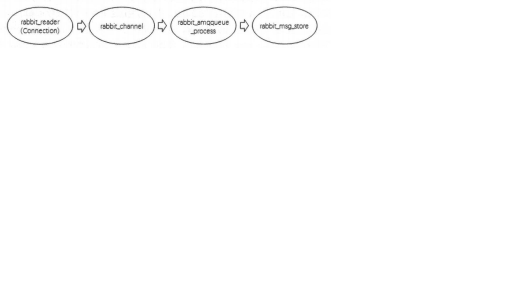
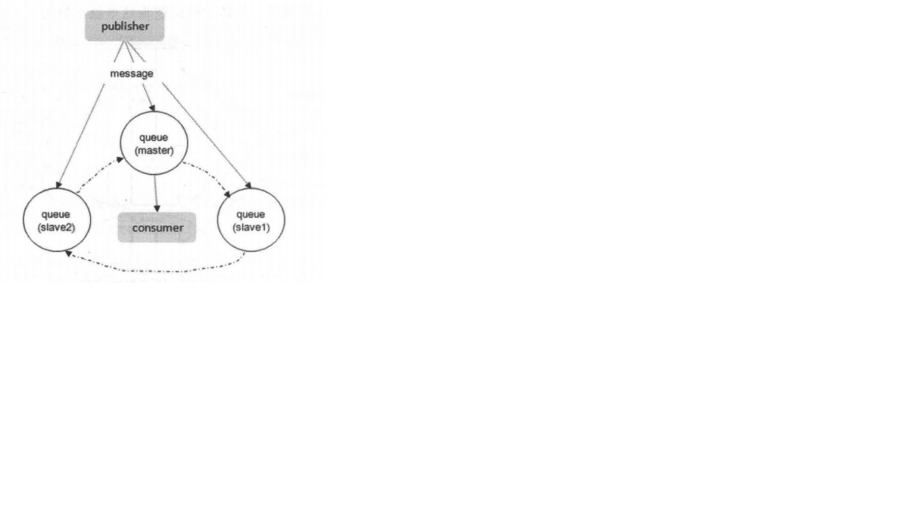

# RabbiMQ高阶
## 存储机制
不管是持久化的消息还是非持久化的消息都可以被写入到磁盘。持久化的消息在到达队列时就被写入到磁盘，并且如果可以，持久化的消息也会在内存中保存一份备份，这样可以提高
一定的性能，当内存吃紧的时候会从内存中清除。非持久化的消息一般只保存在内存中，在内存吃紧的时候会被换入到磁盘中，以节省内存空间。这两种类型的消息的落盘处理都在RabbitMQ的"持久层"中完成。

持久层是一个逻辑上的概念，实际上包括队列索引(rabbit_queue_index)和消息存储(rabbit_msg_store)。rabbit_queue_index负责维护队列中落盘消息的信息，包括消息的存储地点、是否已被交付给消费者、是否已被消费者ack等。
每个队列都有与之对应的一个rabbit_queue_index。rabbit_msg_store以键值对的形式存储消息，它被所有队列共享，在每个节点中有且只有一个。从技术层面来说，rabbit_msg_store具体还可以分为msg_store_persistent和msg_store_transient,
msg_store_persistent负责持久化消息的持久化，重启后消息不会丢失； msg_store_transient负责非持久消息的持久化，重启后消息回丢失。

消息(包括消息体、属性和 headers)可以直接存储在rabbit_queue_index中，也可以保存在rabbit_msg_store中。最佳的配备是较小的消息存储在rabbit_queue_index中而较大的消息存储在rabbit_msg_store中。
这个消息大小的界定可以通过queue_index_embed_msgs_below来配置，默认大小为4096，单位为B。注意这里的消息大小是指消息体、属性及headers整体的大小。当一个消息小于设定的大小闹值时就可以存储在rabbit_queue_index中，这样可以得到性能上的优化。

rabbit_queue_index中以顺序(文件名从0开始累加)的段文件来进行存储，后缀为".idx"，每个段文件中包含固定的SEGMENT_ENTRY_COUNT条记录，
SEGMENT_ENTRY_COUNT默认值为16384。每个rabbit_queue_index从磁盘中读取消息的时候至少要在内存中维护一个段文件，所以设置queue_index_embed_msgs_below值的时候要格外谨慎，一点点增大也可能会引起内存爆炸式的增长。

经过rabbit_msg_store处理的所有消息都会以追加的方式写入到文件中，当一个文件的大小超过指定的限制(file_size_limit)后，关闭这个文件再创建一个新的文件以供新的消息写入。
文件名(文件后缀是".rdq")从0开始进行累加，因此文件名最小的文件也是最老的文件。在进行消息的存储时，RabbitMQ会在ETS(Erlang Term Storage)表中记录消息在文件中的位置映射(Index)和文件的相关信息(FileSummary)。

在读取消息的时候，先根据消息的ID(msg_id)找到对应存储的文件，如果文件存在并且未被锁住，则直接打开文件，从指定位置读取消息的内容。如果文件不存在或者被锁住了，则发送请求由rabbit_msg_store进行处理。

消息的删除只是从ETS表删除指定消息的相关信息，同时更新消息对应的存储文件的相关信息。执行消息删除操作时，井不立即对在文件中的消息进行删除，也就是说消息依然在文件中，仅仅是标记为垃圾数据而己。
当一个文件中都是垃圾数据时可以将这个文件删除。当检测到前后两个文件中的有效数据可以合并在一个文件中，井且所有的垃圾数据的大小和所有文件(至少有3个文件存在的情况下)的数据大小的比值超过设置的阑值GARBAGE_FRACTION(默认值为0.5)时才会触发垃圾回收将两个文件合井。

1. 队列的结构

   通常队列由rabbit_amqqueue_process和backing_queue这两部分组成，rabbit_amqqueue_process负责协议相关的消息处理，即接收生产者发布的消息、向消费者交付消息(包括生产端的confirm和消费端的ack)等。
   backing_queue是消息存储的具体形式和引擎，并向rabbit_amqqueue_process提供相关的接口以供调用。
   
   如果消息投递的目的队列是空的，并且有消费者订阅了这个队列，那么该消息会直接发送给消费者，不会经过队列这一步。而当消息无法直接投递给消费者时，需要暂时将消息存入队列，
   以便重新投递。消息存入队列后，不是固定不变的，它会随着系统的负载在队列中不断地流动，消息的状态会不断发生变化。RabbitMQ中的队列消息可能会处于以下4种状态。
   * alpha:消息内容(包括消息体、属性和headers)和消息索引都存储在内存中。
   * beta:消息内容保存在磁盘中，消息索引保存在内存中。
   * gamma:消息内容保存在磁盘中，消息索引在磁盘和内存中都有。
   * delta:消息内容和索引都在磁盘中。
   
   对于持久化的消息，消息内容和消息索引都必须先保存在磁盘上，才会处于上述状态中的一种。而gamma状态的消息是只有持久化的消息才会有的状态。
   
   RabbitMQ在运行时会根据统计的消息传送速度定期计算一个当前内存中能够保存的最大消息数量(target_ram_count)，如果alpha状态的消息数量大于此值时，就会引起消息的
   状态转换，多余的消息可能会转换到beta状态、gamma状态或者delta状态。区分这4种状态的主要作用是满足不同的内存和CPU需求。alpha状态最耗内存，但很少消耗CPU。
   delta状态基本不消耗内存，但是需要消耗更多的CPU和磁盘I/0操作。delta状态需要执行两次I/O操作才能读取到消息，一次是读消息索引(从rabbit_queue_index中)，一次是读消息
   内容(从rabbit_msg_store中)；beta和gamma状态都只需要一次I/O操作就可以读取到消息(从rabbit_msg_store中)。
   
   对于普通的没有设置优先级和镜像的队列来说，backing_queue的默认实现是rabbit_variable_queue，其内部通过5个子队列Q1、Q2、Delta、Q3和Q4来体现消息
   的各个状态。整个队列包括rabbit_amqqueue_process和backing_queue的各个子队列。其中Q1、Q4只包含alpha状态的消息，Q2和Q3包含beta和gamma状态的消息，
   Delta只包含delta状态的消息。一般情况下，消息按照Q1→Q2→Delta→Q3→Q4，这样的顺序步骤进行流动，但并不是每一条消息都一定会经历所有的状态，这个取决于当前系统的负载状况。
   从Q1至Q4基本经历内存到磁盘，再由磁盘到内存这样的一个过程，如此可以在队列负载很高的情况下，能够通过将一部分消息由磁盘保存来节省内存空间，而在负载降低的时候，这部分消息又渐渐回到内存被消费者获取，使得整个队列具有很好的弹性。
   
   通常在负载正常时，如果消息被消费的速度不小于接收新消息的速度，对于不需要保证可靠不丢失的消息来说，极有可能只会处于alpha状态。对于durable属性设置为true的消息，
   它一定会进入gamma状态，并且在开启publisher confirm机制时，只有到了gamma状态时才会确认该消息己被接收，若消息消费速度足够快、内存也充足，这些消息也不会继续走到下一个状态。
   
   在系统负载较高时，己接收到的消息若不能很快被消费掉，这些消息就会进入到很深的队列中去，这样会增加处理每个消息的平均开销。因为要花更多的时间和资源处理"堆积"的消
   息，如此用来处理新流入的消息的能力就会降低，使得后流入的消息又被积压到很深的队列中继续增大处理每个消息的平均开销，继而情况变得越来越恶化，使得系统的处理能力大大降低。
   应对这一问题一般有3种措施:
   * 增加prefetch_count的值，即一次发送多条消息给消费者，加快消息被消费的速度
   * 采用multiple ack，降低处理ack带来的开销
   * 流量控制
   
2. 惰性队列

   RabbitMQ从3.6.0版本开始引入了惰性队列(Lazy Queue)的概念。惰性队列会尽可能地将消息存入磁盘中，而在消费者消费到相应的消息时才会被加载到内存中，它的一个重要的设计目标是能够支持更长的队列，即支持更多的消息存储。
   当消费者由于各种各样的原因(比如消费者下线、岩机，或者由于维护而关闭等)致使长时间内不能消费消息而造成堆积时，惰性队列就很有必要了。
   
   默认情况下，当生产者将消息发送到RabbitMQ的时候，队列中的消息会尽可能地存储在内存之中，这样可以更加快速地将消息发送给消费者。即使是持久化的消息，在被写入磁盘的同时也会在内存中驻留一份备份。
   当RabbitMQ需要释放内存的时候，会将内存中的消息换页至磁盘中，这个操作会耗费较长的时间，也会阻塞队列的操作，进而无法接收新的消息。
   
   惰性队列会将接收到的消息直接存入文件系统中，而不管是持久化的或者是非持久化的，这样可以减少了内存的消耗，但是会增加I/O的使用，如果消息是持久化的，那么这样的I/O
   操作不可避免，惰性队列和持久化的消息可谓是"最佳拍档"。注意如果惰性队列中存储的是非持久化的消息，内存的使用率会一直很稳定，但是重启之后消息一样会丢失。
   
   队列具备两种模式: default和lazy。默认的为default模式，在3.6.0之前的版本无须做任何变更。lazy模式即为惰性队列的模式，可以通过调用channel.queueDeclare方
   法的时候在参数中设置，也可以通过Policy的方式设置，如果一个队列同时使用这两种方式设置，那么Policy的方式具备更高的优先级。如果要通过声明的方式改变己有队列的模式，那么只能先删除队列，然后再重新声明一个新的。
   
   在队列声明的时候可以通过x-queue-mode参数来设置队列的模式，取值为default和lazy。
   ```
   Map<String, Object> args = new HashMap<String, Object>();
   args.put("x-queue-mode", "lazy");
   channel.queueDeclare("myqueue", false, false, false, args);
   ```
   对应的Policy设置方式为:
   ```
   rabbitmqctl set_policy Lazy "^myqueue$ " '{"queue-mode":" lazy"}' --apply-to queues
   ```
   惰性队列和普通队列相比，只有很小的内存开销。这里很难对每种情况给出一个具体的数值，但是我们可以类比一下:发送1千万条消息，每条消息的大小为1KB，并且此时没有任何
   的消费者，那么普通队列会消耗1.2GB的内存，而惰性队列只消耗1.5MB的内存。
   
   据官方测试数据显示，对于普通队列，如果要发送1千万条消息，需要耗费801秒，平均发送速度约为13000条/秒。如果使用惰性队列，那么发送同样多的消息时，耗时是421秒，平均发送速度约为24000条/秒。
   出现性能偏差的原因是普通队列会由于内存不足而不得不将消息换页至磁盘。如果有消费者消费时，惰性队列会耗费将近40MB的空间来发送消息，对于一个消费者的情况，平均的消费速度约为14000条/秒。
   
   如果要将普通队列转变为惰性队列，那么我们需要忍受同样的性能损耗，首先需要将缓存中的消息换页至磁盘中，然后才能接收新的消息。反之，当将一个惰性队列转变为普通队列的
   时候，和恢复一个队列执行同样的操作，会将磁盘中的消息批量地导入到内存中。
   
## 内存及磁盘警告
当内存使用超过配置的阈值或者磁盘剩余空间低于配置的阈值时，RabbitMQ都会暂时阻塞客户端的连接并停止接收从客户端发来的消息，以此避免服务崩溃。与此同时，客户端与服务端的心跳检测也会失效。

被阻塞的Connection的状态要么是blocking，要么是blocked。前者对应于并不试图发送消息的Connection，比如消费者关联的Connection，这种状态下的Connection可以继续运行。
而后者对应于一直有消息发送的Connection，这种状态下的Connection会被停止发送消息。注意在一个集群中，如果一个Broker节点的内存或者磁盘受限，都会引起整个集群中所有的Connection被阻塞。

理想的情况是当发生阻塞时可以在阻止生产者的同时而又不影响消费者的运行。但是在AMQP协议中，一个信道(Channel)上可以同时承载生产者和消费者，同一个Connection中也
可以同时承载若干个生产者的信道和消费者的信道，这样就会使阻塞逻辑错乱，虽然大多数情况下并不会发生任何问题，但还是建议生产和消费的逻辑可以分摊到独立的Connection之上而不发生任何交集。

1. 内存警告

   RabbitMQ服务器会在启动或者执行rabbitmqctl set_vm_memory_high_watermark fraction命令时计算系统内存的大小。默认情况下vm_memory_high_watermark的值为0.4，即内存阑值为0.4，
   表示当RabbitMQ使用的内存超过40%时，就会产生内存告警井阻塞所有生产者的连接。一旦告警被解除(有消息被消费或者从内存转储到磁盘等情况的发生)，一切都会恢复正常。
   
   默认情况下将RabbitMQ所使用内存的阔值设置为40%，这并不意味着此时RabbitMQ不能使用超过40%的内存，这仅仅只是限制了RabbitMQ的消息生产者。在最坏的情况下，Erlang的垃圾回收机制会导致两倍的内存消耗，也就是80%的使用占比。
   内存阔值可以通过rabbitmq.config配置文件来配置，下面示例中设置了默认的内存阈值为0.4:
   ```
   {vm_memory_high_watermark, 0.4}
   ```
   与此配置对应的rabbitmqctl系列的命令为:
   ```
   rabbitmqctl set_vm_memory_high_watermark {fraction}
   ```
   fraction对应上面配置中的0.4，表示占用内存的百分比，取值为大于等于0的浮点数。设置对应的百分比值之后，RabbitMQ中会打印服务日志。
   
   在某个broker节点触及内存并阻塞生产者之前，它会尝试将队列中的消息换页到磁盘以释放内存空间。持久化和非持久化的消息都会转储到磁盘上，其中持久化的消息本身就在磁盘中有一份副本，这里会将持久化的消息从内存中清楚掉。
   
   默认情况下，在内存到达内存阈值的50%时会进行换页动作。也就是说，在默认的内存阈值为0.4的情况下，当内存超过0.4 x 0.5=0.2时会进行换页动作。可以通过在配置文件中配置
   vm_memory_high_watermark_paging_ratio项来修改此值。下面示例中将换页比率从默认的0.5修改为0.75:
   ```
   {vm_memory_high_watermark_paging_ratio, 0.75}
   ```
   可以将vm_memory_high_watermark_paging_ratio值设置为大于1的浮点数，这种配置相当于禁用了换页功能。
   
2. 磁盘警告

   当剩余磁盘空间低于确定的闽值时，RabbitMQ同样会阻塞生产者，这样可以避免因非持久化的消息持续换页而耗尽磁盘空间导致服务崩溃。默认情况下，磁盘阑值为50MB，这意味着当磁盘剩余空间低于50MB时会阻塞生产者井停止内存中消息的换页动作。
   这个阑值的设置可以减小但不能完全消除因磁盘耗尽而导致崩渍的可能性，比如在两次磁盘空间检测期间内，磁盘空间从大于50MB被耗尽到0MB。一个相对谨慎的做法是将磁盘阔值设置为与操作系统所显示的内存大小一致。
   
   在Broker节点启动的时候会默认开启磁盘检测的进程，对于不识别的操作系统而言，磁盘检测功能会失效。
   
   RabbitMQ会定期检测磁盘剩余空间，检测的频率与上一次执行检测到的磁盘剩余空间大小有关。正常情况下，每10秒执行一次检测，随着磁盘剩余空间与磁盘阑值的接近，检测频率会有所增加。当要到达磁盘阑值时，检测频率为每秒10次，这样有可能会增加系统的负载。
   
   可以通过在配置文件中配置disk_free_limit项来设置磁盘阔值，默认为50MB:
   ```
   {disk_free_limit, 50000000}
   ```
   这里也可以使用单位设置，单位的选择可以参照内存阑值的设置(KB，KiB，MB，MiB，GB，GiB)。还可以参考机器内存的大小为磁盘阑值设置一个相对的比值。
   正常情况下，建议disk_free_limit.mem_relative的取值为1.0和2.0之间。
   
## 流控
RabbitMQ可以对内存和磁盘使用量设置阔值，当达到阑值后，生产者将被阻塞(block)，直到对应项恢复正常。除了这两个阔值，从2.8.0版本开始，RabbitMQ还引入了流控(Flow Control)机制来确保稳定性。
流控机制是用来避免消息的发送速率过快而导致服务器难以支撑的情形。内存和磁盘警告相当于全局的流控(Global Flow Control)，一旦触发会阻塞集群中所有的Connection，而本节的流控是针对于单个Connection的，
可以称之为Per-Connection Flow Control或者Internal Flow Control。

1. 流控的原理

   Erlang进程之间并不共享内存(binary类型的除外)，而是通过消息传递来通信，每个进程都有自己的进程邮箱(mailbox)。默认情况下，Erlang并没有对进程邮箱的大小进行限制，
   所以当有大量消息持续发往某个进程时，会导致该进程邮箱过大，最终内存溢出并崩溃。在RabbitMQ中，如果生产者持续高速发送，而消费者消费速度较低时，如果没有流控，很快就会使内部进程邮箱的大小达到内存阀值。
   
   RabbitMQ使用了一种基于信用证算法(credit-based algorithm)的流控机制来限制发送消息的速率以解决前面所提出的问题。它通过监控各个进程的进程邮箱，当某个进程负载过高而来
   不及处理消息时，这个进程的进程邮箱就会开始堆积消息。当堆积到一定量时，就会阻塞而不接收上游的新消息。从而慢'匮地，上游进程的进程邮箱也会开始堆积消息。当堆积到一定量时也会阻塞而停止接收上游的消息，最后就会使负责网络数据包接收的进程阻塞而暂停接收新的数据。
   
   一个连接(Connection)触发流控时会处于"flow"的状态，也就意味着这个Connection的状态每秒在blocked和unblocked之间来回切换数次，这样可以将消息发送的速率控制在服务器能够支撑的范围之内。
   
   流控机制不只是作用于Connection，同样作用于信道(Channel)和队列。从Connection到Channel，再到队列，最后是消息持久化存储形成一个完整的流控链。
   对于处于整个流控链中的任意进程，只要该进程阻塞，上游的进程必定全部被阻塞。也就是说，如果某个进程达到性能瓶颈，必然会导致上游所有的进程被阻塞。所以我们可以利用流控机制的这个特点找出瓶颈之所在。
   
   其中的各个进程如下所述。
   * rabbit_reader: Connection的处理进程，负责接收、解析AMQP协议数据包等
   * rabbit channel: Channel的处理进程，负责处理AMQP协议的各种方法、进行路由解析等
   * rabbit_amqqueue_process: 队列的处理进程，负责实现队列的所有逻辑
   * rabbit_msg_store: 负责实现消息的持久化
   
   当某个Connection处于flow状态，但这个Connection中没有一个Channel处于flow状态时，这就意味这个Connection中有一个或者多个Channel出现了性能瓶颈。某些Channel进
   程的运作(比如处理路由逻辑)会使得服务器CPU的负载过高从而导致了此种情形。尤其是在发送大量较小的非持久化消息时，此种情形最易显现。
   
   当某个Connection处于flow状态，并且这个Connection中也有若干个Channel处于flow状态，但没有任何一个对应的队列处于flow状态时，这就意味着有一个或者多个队列出现了
   性能瓶颈。这可能是由于将消息存入队列的过程中引起服务器CPU负载过高，或者是将队列中的消息存入磁盘的过程中引起服务器I/O负载过高而引起的此种情形。尤其是在发送大量较小的持久化消息时，此种情形最易显现。
   
   当某个Connection处于flow状态，同时这个Connection中也有若干个Channel处于flow状态，井且也有若干个对应的队列处于flow状态时，这就意味着在消息持久化时出现了性能瓶颈。
   在将队列中的消息存入磁盘的过程中引起服务器I/O负载过高而引起的此种情形。尤其是在发送大量较大的持久化消息时，此种情形最易显现。
   
## 镜像队列
如果RabbitMQ集群中只有一个Broker节点，那么该节点的失效将导致整体服务的临时性不可用，并且也可能会导致消息的丢失。以将所有消息都设置为持久化，并且对应队列的durable属性也设置为true，
但是这样仍然无法避免由于缓存导致的问题：因为消息在发送之后和被写入磁盘井执行刷盘动作之间存在一个短暂却会产生问题的时间窗。通过publisher confirm机制能够确保客户端知道哪些消息己经存入磁盘，
尽管如此，一般不希望遇到因单点故障导致的服务不可用。

如果RabbitMQ集群是由多个Broker节点组成的，那么从服务的整体可用性上来讲，该集群对于单点故障是有弹性的，但是同时也需要注意：尽管交换器和绑定关系能够在单点故障问
题上幸免于难，但是队列和其上的存储的消息却不行，这是因为队列进程及其内容仅仅维持在单个节点之上，所以一个节点的失效表现为其对应的队列不可用。

引入镜像队列(Mirror Queue)的机制，可以将队列镜像到集群中的其他Broker节点之上，如果集群中的一个节点失效了，队列能自动地切换到镜像中的另一个节点上以保证服务的可用
性。在通常的用法中，针对每一个配置镜像的队列(以下简称镜像队列)都包含一个主节点(master)和若干个从节点(slave)，

slave会准确地按照master执行命令的顺序进行动作，故slave与master上维护的状态应该是相同的。如果master由于某种原因失效，那么"资历最老"的slave会被提升为新的master。
根据slave加入的时间排序，时间最长的slave即为"资历最老"。发送到镜像队列的所有消息会被同时发往master和所有的slave上，如果此时master挂掉了，消息还会在slave上，这样slave提升为master的时候消息也不会丢失。
除发送消息(Basic.Publish)外的所有动作都只会向master发送，然后再由master将命令执行的结果广播给各个slave。

如果消费者与slave建立连接井进行订阅消费，其实质上都是从master上获取消息，只不过看似是从slave上消费而己。比如消费者与slave建立了TCP连接之后执行一个Basic.Get
的操作，那么首先是由slave将Basic.Get请求发往master，再由master准备好数据返回给slave，最后由slave投递给消费者。读者可能会有疑问，大多的读写压力都落到了master上，
那么这样是否负载会做不到有效的均衡?或者说是否可以像MySQL一样能够实现master写而slave读呢?注意这里的master和slave是针对队列而言的，而队列可以均匀地散落在集群的各
个Broker节点中以达到负载均衡的目的，因为真正的负载还是针对实际的物理机器而言的，而不是内存中驻留的队列进程。

**注意：** RabbitMQ的镜像队列同时支持publisher confirm和事务两种机制。在事务机制中，只有当前事务在全部镜像中执行之后，客户端才会收到Tx.Commit-Ok的消息。同样的，在publisher confirm机制中，生产者进行当前消息确认的前提是该消息被全部进行所接收了。

不同于普通的非镜像队列，镜像队列的backing_queue比较特殊，其实现井非是rabbit_variable_queue，它内部包裹了普通backing_queue进行本地消息消息持久化处理，在此基础上增加了将消息和ack复制到所有镜像的功能。

所有对rabbit_mirror_queue_master的操作都会通过组播GM(Guaranteed Multicast)的方式同步到各个slave中。GM负责消息的广播，rabbit_mirror_queue_slave负责回
调处理，而master上的回调处理是由coordinator负责完成的。如前所述，除了Basic.Publish，所有的操作都是通过master来完成的，master对消息进行处理的同时将消
息的处理通过GM广播给所有的slave，slave的GM收到消息后，通过回调交由rabbit_mirror_queue_slave进行实际的处理。

GM模块实现的是一种可靠的组播通信协议，该协议能够保证组播消息的原子性，即保证组中活着的节点要么都收到消息要么都收不到，它的实现大致为:将所有的节点形成一个循环链表，
每个节点都会监控位于自己左右两边的节点，当有节点新增时，相邻的节点保证当前广播的消息会复制到新的节点上；当有节点失效时，相邻的节点会接管以保证本次广播的消息会复制到所有的节点。
在master和slave上的这些GM形成一个组(gm_group)，这个组的信息会记录在Mnesia中。不同的镜像队列形成不同的组。操作命令从master对应的GM发出后，
顺着链表传送到所有的节点。由于所有节点组成了一个循环链表，master对应的GM最终会收到自己发送的操作命令，这个时候master就知道该操作命令都同步到了所有的slave上。

每当一个节点加入或者重新加入(例如从网络分区中恢复过来)镜像队列，之前保存的队列内容会被清空。当slave挂掉之后，除了与slave相连的客户端连接全部断开，没有其他影响。当master挂掉之后，会有以下连锁反应:
* 与master连接的客户端连接全部断开
* 选举最老的slave作为新的master，因为最老的slave与旧的master之间的同步状态应该是最好的。如果此时所有slave处于未同步状态，则未同步的消息会丢失。
* 新的master重新入队所有unack的消息，因为新的slave无法区分这些unack的消息是否己经到达客户端 ，或者是ack信息丢失在老的master链路上，再或者是丢失在老的master组
  播ack消息到所有slave的链路上，所以出于消息可靠性的考虑，重新入队所有unack的消息，不过此时客户端可能会有重复消息。
* 如果客户端连接着slave，并且Basic.Consume消费时指定了x-cancel-on-ha-failover参数，那么断开之时客户端会收到一个Consumer Cancellation Notification的通知，
  消费者客户端中会回调Consumer接口的handleCancel方法。如果未指定x-cancel-on-ha-failover参数，那么消费者将无法感知master岩机。

镜像队列的配置主要是通过添加相应的Policy来完成的，
```
rabbitmqctl set_policy [-p vhost] [--priority priority] [--apply-to apply-to] {name} {pattern} {definition} 
```
对于镜像队列的配置来说，definition中需要包含3个部分: ha-mode、ha-params和ha-sync-mode。
* ha-mode: 指明镜像队列的模式，有效值为all、exactly、nodes，默认为all。all表示在集群中所有的节点上进行镜像；exactly表示在指定个数的节点上进行镜像，
节点个数由ha-params指定；nodes表示在指定节点上进行镜像，节点名称通过ha-params指定，节点的名称通常类似于rabbit@hostname，可以通过rabbitmqctl cluster_status命令查看到。
* ha-params: 不同的ha-mode配置中需要用到的参数。
* ha-sync-mode: 队列中消息的同步方式，有效值为automatic和manual。

举个例子，对队列名称以"queue_"开头的所有队列进行镜像，并在集群的两个节点上完成镜像，Policy的设置命令为:
```
rabbitmqctl set_policy --priority 0 --apply-to queues mirror_queue "^queue_" '{"ha-mode":"exactly" , "ha-params": 2, "ha-sync-mode": "automatic"}',
```
ha-mode参数对排他(exclusive)队列并不生效，因为排他队列是连接独占的，当连接断开时队列会自动删除，所以实际上这个参数对排他队列没有任何意义。

将新节点加入己存在的镜像队列时，默认情况下ha-sync-mode取值为manual。镜像队列中的消息不会主动同步到新的slave中，除非显式调用同步命令。当调用同步命令后，队列开始阻塞，无法对其进行其他操作，直到同步完成。
当ha-sync-mode设置为automatic时，新加入的slave会默认同步己知的镜像队列。由于同步过程的限制，所以不建议对生产环境中正在使用的队列进行操作。
使用rabbitmqctl list_queues {name} slave_pids synchronised_slave_pids 命令可以查看哪些slaves已经完成同步。通过手动方式同步一个队列的命令为rabbitmqctl sync_queue {name}，
同样也可以取消某个队列的同步操作: rabbitmqctl cancel sync queue {name}。

当所有slave都出现未同步状态，并且ha-promote-on-shutdown设置为when-synced(默认)时，如果master因为主动原因停掉，比如通过rabbitrnqctl stop命令或者优雅关闭操作系统，
那么slave不会接管master，也就是此时镜像队列不可用：但是如果master因为被动原因停掉，比如Erlang虚拟机或者操作系统崩溃，那么slave会接管master。这个配置项隐含的
价值取向是保证消息可靠不丢失，同时放弃了可用性。如果ha-promote-on-shutdown设置为always，那么不论master因为何种原因停止，slave都会接管master，优先保证可用性，不过消息可能会丢失。

镜像队列中最后一个停止的节点会是master，启动顺序必须是master先启动。如果slave先启动，它会有30秒的等待时间，等待master的启动，然后加入到集群中。如果30秒内master
没有启动，slave会自动停止。当所有节点因故(断电等)同时离线时，每个节点都认为自己不是最后一个停止的节点，要恢复镜像队列，可以尝试在30秒内启动所有节点。