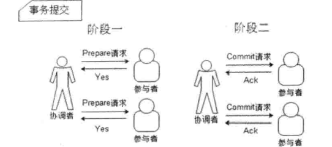
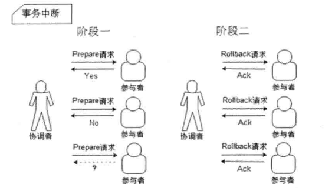

# 2PC和3PC
在分布式系统中，每一个节点虽然都能明确知道自己在进行事务操作过程中的结果是成功还是失败，但却无法直接获取到其它节点的操作结果。
因此，当一个事务操作需要跨越多个分布式节点时，为了保证事务的ACID，就需要引入一个“协调者”的组件来统一调度所有分布式节点的执行逻辑，
这些被调度的分布式节点被称为“参与者”。协调者负责调度参与者的行为，并最终决定这些参与者是否要真正提交事务。由此，衍生出二阶段和三阶段提交协议。
## 2PC
2PC是Two-Phase Commit的缩写，即二阶段提交。目前，绝大多数关系型数据库都是采用二阶段提交协议来完成分布式事务处理的，利用该协议可以方便地完成
所有分布式参与者的协调，统一决定事务的提交与回滚，从而能够有效保证分布式数据一致性。

顾名思义，二阶段提交协议是将事务的提交过程分成了两个阶段来进行处理，其执行流程如下：
### 阶段一：提交事务请求
1. 事务询问
   
   协调者向所有的参与者发送事务内容，询问是否可以执行事务操作，并开始等待各参与者的响应。
2. 执行事务

   各参与者执行事务操作，并将Undo和Redo信息记入事务日志
3. 各参与者向协调者反馈事务询问的响应

   如果参与者成功执行了事务操作，那么就反馈Yes响应，表示事务可以执行；否则就反馈No响应，表示事务不可用执行。

由于上面讲述的内容在形式上近似是协调者组织参与者对一次事务操作的投票表态过程，因此二阶段提交协议的阶段一也被称为投票阶段，
即各参与者投票表明是否要继续执行接下去的事务提交操作。
### 阶段二：执行事务请求
在阶段二，协调者会根据各参与者的反馈情况来决定最终是否可以进行事务提交操作，正常情况下，包含以下两种可能。
#### 执行事务提交
假如协调者从所有的参与者获得的反馈都是Yes响应，那么就会执行事务提交。
1. 发送提交请求
   
   协调者向所有参与者发送Commit请求。
2. 事务提交
   
   参与者接收到Commit请求后，会正式执行事务提交操作，并在完成提交之后释放在整个事务执行期间占用的事务资源。
3. 反馈事务提交结果
   
   参与者在完成事务提交之后，向协调者发送Ack消息。
4. 完成事务

   协调者接收到所有参与者反馈的Ack消息后，完成事务。
   

#### 中断事务
假如任何一个参与者向协调者反馈了No响应，或者在等待超时之后，协调者尚无法接收到所有参与者的反馈响应，那么就会中断事务。
1. 发送回滚请求
   
   协调者向所有参与者发送Rollback请求。
2. 事务回滚
   
   参与者接收到Rollback请求后，会利用其在阶段一中记录的Undo信息来执行事务回滚操作，并在完成回滚之后释放在整个事务执行期间占用的事务资源。
3. 反馈事务回滚结果
   
   参与者在完成事务回滚之后，向协调者发送Ack消息
4. 中断事务
   
   协调者接收到所有参与者反馈的Ack消息后，完成事务中断。
   

### 优缺点
* 优点：原理简单，实现方便
* 缺点：同步阻塞、单点问题、脑裂、过于保守
#### 同步阻塞
二阶段提交协议存在的最明显的问题就是同步阻塞，这会极大限制分布式系统的性能。在二阶段提交的执行过程中，所有参与到该事务操作的逻辑都处于阻塞状态，
也就是说，各个参与者在等待其它参与者响应的过程中，将无法进行其它任何操作。
#### 单点问题
协调者的角色在整个二阶段提交协议中起到非常重要的作用。一旦协调者出现问题，那么整个二阶段提交流程将无法运转，更为严重的是，如果协调者在阶段二出现问题，
那么其它参与者将会一直处于锁定事务资源的状态中，而无法继续完成事务操作。
#### 数据不一致
在执行事务提交时，当协调者向所有的参与者发送Commit请求之后，发生了局部网络异常或者是协调者在尚未发送完Commit请求之前自身发生了崩溃，导致最终只有
部分参与者收到了Commit请求，而其它没有收到Commit请求的参与者则无法进行执行事务提交，于是这个分布式系统就出现了数据不一致。
#### 过于保守
如果在协调者指示参与者进行事务提交询问的过程中，参与者出现故障而导致协调者始终无法获取到所有参与者的响应，这时协调者只能依靠自身的超时机制来判断
是否需要中断事务，这样的策略显得过于保守。换句话说，二阶段提交协议没有设计较为完善的容错机制，任意一个节点的失败都会导致整个事务的失败。

## 3PC
3PC是Three-Phase Commit的缩写，即三阶段提交，是2PC的改进版，其将二阶段提交协议的“提交事务请求”过程一分为二，形成了也canCommit、preCommit和
doCommit三个阶段组成的事务处理协议

### 阶段一：can commit
1. 事务询问
    
   协调者向所有参与者发送一个包含事务内容的canCommit请求，询问是否可以执行事务提交操作，并开始等待各参与者的响应。
2. 各参与者向协调者反馈事务询问的响应

   参与者在接收到来自协调者的canCommit请求后，正常情况下，如果其自身认为可以顺利执行事务，那么会反馈Yes响应，并进入预备状态，否则反馈No响应。
### 阶段二：pre commit
在阶段二，协调者会根据各参与者的反馈情况来决定是否可以进行事务的preCommit操作，正常情况下，包含两种情况
#### 执行事务预提交  
假如协调者从所有的参与者获得的反馈都是Yes响应，那么就会执行事务预提交。
1. 发送预提交请求。

   协调者向所有参与者发送preCommit请求，并进入prepare阶段
2. 事务预提交。
   
   参与者接收到preCommit请求后，会执行事务操作，并将Undo和Redo信息记入事务日志
3. 各参与者向协调者反馈事务执行的响应。

   如果参与者成功执行了事务操作，那么就会反馈给协调者Ack响应，同时等待最终的指令：提交（commit）或中止（abort）。
#### 中断事务
假如任何一个参与者向协调者反馈了No响应，或者在等待超时之后，协调者尚无法接收到所有参与者的反馈响应，那么就会中断事务。
1. 发送中断请求。

   协调者向所有参与者节点发出abort请求
2. 中断事务。
   
   无论是收到来自协调者的abort请求，或者是在等待协调者请求过程中出现超时，参与者都会中断事务。
### 阶段三：do commit
该阶段将进行真正的事务提交，会存在以下两种可能的情况
#### 执行提交
1. 发送提交请求。
   
   进入这一阶段，假设协调者处于正常工作状态，并且它接收到了来自所有参与者的Ack响应，
   那么它将从“预提交”状态转换到“提交”状态，并向所有的参与者发送doCommit请求
2. 事务提交。
   
   参与者在接收到doCommit请求后，会正式执行事务提交操作，并在完成提交之后释放在整个事务执行期间占用的事务资源。
3. 反馈事务提交结果。

   参与者在完成事务提交之后，向协调者发送Ack消息。
4. 完成事务。
   
   协调者接收到所有参与者反馈的Ack消息后，完成事务。
#### 中断事务
进入这一阶段，假设协调者处于正常工作状态，并且任何一个参与者向协调者反馈了No响应，或者在等待超时之后，
协调者尚无法接收到所有参与者的反馈响应，那么就会中断事务。
1. 发送中断请求。
   
   协调者向所有参与者发送abort请求。
2. 事务回滚。

   参与者接收到abort请求后，会利用其在阶段二中记录的Undo信息来执行事务回滚操作，并在完成回滚之后释放在整个事务执行期间占用的事务资源。
3. 反馈事务回滚结果。
          
   参与者在完成事务回滚之后，向协调者发送Ack消息
4. 中断事务
          
   协调者接收到所有参与者反馈的Ack消息后，完成事务中断。
   
值得注意的是，一旦进入阶段三，可能会存在两种故障。
* 协调者出现问题
* 协调者和参与者之间的网络出现故障

无论是那种情况，最终都会导致参与者无法及时接收到来自协调者的doCommit或者abort请求，针对这种异常情况，参与者都会在等待超时之后，继续进行事务提交。

### 优缺点
* 优点：降低了参与者的阻塞范围，并且能够在出现单点故障后继续达成一致。
* 缺点：在参与者接收到preCommit后，如果网络出现分区，此时协调者和参与者无法进行正常的网络通信，在这种情况下，参与者依然会进行事务的提交，这必然出现数据不一致。