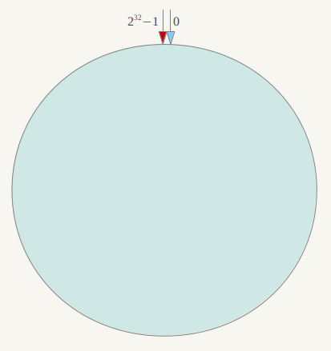

# 一致性hash算法
> 一致性哈希（Consistent Hashing），是一种特殊的哈希算法。在使用一致哈希算法后，哈希表槽位数（大小）的改变平均只需要对K/n 个关键字重新映射，
其中 K是关键字的数量，n是槽位数量。然而在传统的哈希表中，添加或删除一个槽位的几乎需要对所有关键字进行重新映射。

考虑到分布式系统中每个节点都有可能失效，并且新的节点可能动态的增加进来，如何保证当系统的节点数目变化时还能够对外提供良好的服务，这是值得思考的。

一致性hash算法（Consistent Hashing）最早在1997年由麻省理工学院提出。
简单来说，一致性hash将整个hash值空间组织成一个虚拟圆环，比如某个哈希函数值空间为0——2^32-1，整个哈希虚拟圆环如下

整个空间按顺时针方向组织，0和2^32-1重合。

然后将某个节点通过hash算法，具体可以选择服务器的ip或主机名作为key进行哈希，这样每个节点都可以确定在圆环上的位置。

接下来使用如下算法：将数据key使用相同的hash函数计算出哈希值，并确定其在圆环上的位置，从该位置沿顺时针，遇到的第一个节点就是应该定位到的节点。

如上图：数据A会被定为到 node A上，B被定为到 node B上，C被定为到 node C上，D被定为到 node D上。

继续分析一致性hash算法的容错性和扩展性。

现在假设 node C不幸挂了，可以看到数据A、B、D不受影响，只是数据C会被重新定位到 node D。
一般的，在一致性哈希算法中，如果一台服务器不可用，则受影响的数据仅仅是此服务器到其环空间中前一台服务器（即沿着逆时针方向行走遇到的第一台服务器）之间数据，其它不会受到影响。

现在假设要增加 node X，

此时数据A、B、D不受影响，只是数据C会被重新定位到 node X。一般的，在一致性哈希算法中，如果增加一台服务器，则受影响的数据仅仅是新服务器到其环空间中前一台服务器（即沿着逆时针方向行走遇到的第一台服务器）之间数据，其它数据也不会受到影响。

所以，一致性hash算法对于节点的增加和删除都只需要定位一小部分数据，具有较好的容错性和扩展性。

另外，一致性hash算法在服务节点太少时，可能导致服务节点在整个环形空间分布不均匀，容易造成数据倾斜的问题。

此时必然导致大量数据定位在 node A上，只有少量数据定位在 node B上。为了解决这个问题，一致性hash算法引入了虚拟节点，即对每一个服务节点计算多个hash，
定位到多个位置，每个位置都放置一个服务节点，称为虚拟节点。具体做法可以在服务器ip或主机名的后面增加编号来实现。例如上面的情况，可以为每台服务器计算三个虚拟节点，
于是可以分别计算 “node A#1”、“node A#2”、“node A#3”、“node B#1”、“node B#2”、“node B#3”的哈希值，于是形成六个虚拟节点：

而数据定位算法无需改变，只是多了一步虚拟节点到实际节点的映射，例如定位到“node A#1”、“node A#2”、“node A#3”三个虚拟节点的数据均定位到 node A上。这样就解决了服务节点少时数据倾斜的问题。