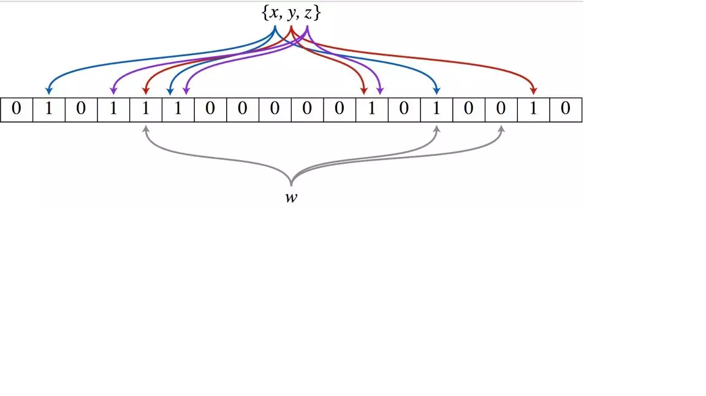

# 布隆过滤器
## 面试题目
一个网站有 100 亿 url 存在一个黑名单中，每条 url 平均 64 字节。这个黑名单要怎么存？
若此时随便输入一个 url，你如何快速判断该 url 是否在这个黑名单中？
## 题目分析
不考虑细节的话，其实就是一个简单的查找问题。而对于查找问题，使用散列表往往是一种比较高效的方案。但是对于这个题目不能使用散列表。

100 亿是一个很大的数量级，这里每条 url 平均 64 字节，全部存储的话需要 640G 的内存空间。又因为使用了散列表这种数据结构，而散列表是会出现散列冲突的。
为了让散列表维持较小的装载因子，避免出现过多的散列冲突，需要使用链表法来处理，这里就要存储链表指针。因此最后的内存空间可能超过 1000G 了。
## 位图(BitMap)
这个时候就需要拓展一下思路了。首先考虑一个类似又简单的问题，现在有一个非常庞大的数据，
比如有 1 千万个整数，并且整数的范围在 1 到 1 亿之间。那么如何快速查找某个整数是否在这 1 千万个整数中呢？

需要判断该数是否存在，也就是说这个数只有两种状态：存在（ true ）或者不存在（false）。

可以使用一个存储了状态的布尔（true or false）类型数组，数组的大小是 1 亿。然后将这  1 千万个整数作为数组下标，将对应的数组值置为 true，
比如，整数 233 对应下标为 233 的数组值设置为 true，也就是 array[233] = true。

这种算法就是位图法，就是用每一位存放状态，适用于大规模数据，但数据状态又不是很多的情况。

另外位图法有一个优点就是空间不随集合元素个数增加而增加，只跟最大元素有关。

但是如果查找的元素数量少但最大元素很大，那么消耗的空间就会很大，这也是位图法的一个不容忽视的缺点：空间复杂度随集合内最大元素增大而线性增大。

因此，出于性能和内存占用的考虑，在这里使用布隆过滤器才是最好的解决方案：布隆过滤器是对位图的一种改进。
## 布隆过滤器
布隆过滤器（英语：Bloom Filter）是 1970 年由 Burton Bloom 提出的。

它可以用来判断一个元素是否在一个集合中。它的优势是只需要占用很小的内存空间以及有着高效的查询效率。

它的本质是一个位数组，数组的每一个元素都只占用一个 bit，并且每个元素只能是 0 或者 1。

一开始，布隆过滤器的位数组所有位都初始化为 0。比如，数组长度为 m ，那么将长度为 m 个位数组的所有的位都初始化为 0。数组中每一位都是一个二进制位。

布隆过滤器除了一个位数组还有 k 个哈希函数。当一个元素加入布隆过滤器时，会进行如下操作
1. 使用 k 个哈希函数对元素值进行 k 次计算，得到 k 个哈希值
2. 根据得到的哈希值，在位数组中对应下标置为 1

举个例子，假设布隆过滤器有 3 个哈希函数：f1, f2, f3 和一个位数组 arr。现在要把 2333 插入布隆过滤器中：
1. 对值进行三次哈希计算，得到三个值 n1, n2, n3
2. 把位数组中三个元素 arr[n1], arr[n2], arr[3] 都置为 1

现在要判断某个元素在不在布隆过滤器中，对元素进行三次哈希计算，得到值之后判断位数组中相应的每个值是不是都为 1，如果都为 1，那么说明这个元素在布隆过滤器中。
否则，说明该元素不再布隆过滤器中。

很明显，数组的容量即使再大，也是有限的。那么随着元素的增加，插入的元素就会越多，位数组中被置为 1 的位置因此也越多，这就会造成一种情况：
当一个不在布隆过滤器中的元素，经过同样规则的哈希计算之后，得到的值在位数组中查询，有可能这些位置因为之前其它元素的操作先被置为 1 了。

这就是布隆过滤器的一个缺陷：存在误判。而且很明显，插入元素越大，误判率越大。

但是如果判断一个元素不在布隆过滤器中，那么该元素就一定不再。
* 布隆过滤器说某个元素在，可能会被误判
* 布隆过滤器说某个元素不在，那么一定不在

## 补救办法
布隆过滤器存在一定的误识别率。常见的补救办法是在建立白名单，存储那些可能被误判的元素。 

## 使用场景
布隆过滤器的最大的用处就是，能够迅速判断一个元素是否在一个集合中。因此它有如下三个典型应用:
1. 网页爬虫对 URL 的去重，避免爬取相同的 URL 地址
2. 进行垃圾邮件过滤：反垃圾邮件，从数十亿个垃圾邮件列表中判断某邮箱是否垃圾邮箱（同理，垃圾短信）
3. 有的黑客为了让服务宕机，他们会构建大量不存在于缓存中的 key 向服务器发起请求，在数据量足够大的情况下，频繁的数据库查询可能导致 DB 挂掉。布隆过滤器很好的解决了缓存击穿的问题。